# [analyze data](#toc0_)

**Table of contents**    
- [analyze data](#toc1_)    
  - [short dataset](#toc1_1_)    
  - [condensed data](#toc1_2_)    
  - [interactive](#toc1_3_)    
  - [analysis showcase 📈](#toc1_4_)    

<!-- vscode-jupyter-toc-config
	numbering=false
	anchor=true
	flat=false
	minLevel=1
	maxLevel=6
	/vscode-jupyter-toc-config -->
<!-- THIS CELL WILL BE REPLACED ON TOC UPDATE. DO NOT WRITE YOUR TEXT IN THIS CELL -->

    🐍 3.12.2 | 📦 pygwalker: 0.4.9.13 | 📦 pandas: 2.2.3 | 📦 numpy: 1.26.4 | 📦 duckdb: 1.2.0 | 📦 pandas-plots: 0.12.14 | 📦 connection_helper: 0.8.13

## [condensed data](#toc0_)
- defined columns have been transformed

    🔵 *** df: condensed ***
    🟣 shape: (195, 70) columns: ['Participant ID' '[01.01] CTCAE' '[01.02] Datum_AE'
     '[01.03] Sportassoziation' '[02.01] Datum_Aufnahme' '[02.02] Art'
     '[02.03] Auslöser' '[02.04] Körperteil' '[03.01.01] Schmerzen_Intensität'
     '[03.01.02] Schmerzen_Dauer' '[03.01] Schmerzen_Folge'
     '[03.02.01] Krankenhaus_Intensität ' '[03.02.02] Krankenhaus_Dauer'
     '[03.02] Krankenhaus_Folge' '[03.03.01] Med_Weiterbehandlung_Intensität'
     '[03.03.02] Med_Weiterbehandlung_Dauer'
     '[03.03] Med_Weiterbehandlung_Folge'
     '[03.04.01] Therapieprotokoll_Intensität'
     '[03.04.02] Therapieprotokoll_Dauer' '[03.04] Therapieprotokoll_Folge'
     '[03.05.01] Lebensnotwendige_Intenvention_Intensität'
     '[03.05.02] Folgen - Wie oft wurde die lebensnotwendige Intervention wiederholt?'
     '[03.05] Lebensnotwendige_Intenvention_Folge'
     '[03.06.01] Pflege_Intensität' '[03.06.02] Pflege_Dauer'
     '[03.06] Pflege_Folge' '[03.07.01] Medikamente_Dauer'
     '[03.07.02] Medikamente_Intensität' '[03.07] Medikamente_Folge'
     '[03.08.01] Angst_Intensität' '[03.08.02] Angst_Dauer'
     '[03.08] Angst_Folge' '[03.09.01] Strukturanpassung_Intensität'
     '[03.09.02] Strukturanpassung_Dauer' '[03.09] Strukturanpassung_Folge'
     '[03.10.01] Freigabe_OK' '[03.10.02] Freigabe_Wer'
     '[03.10] Freigabe_Folge' '[03.11.01] PECH_Intensität'
     '[03.11.02] PECH_Folge' '[03.11] PECH_Folge'
     '[03.12.01] Observierung_Intensität' '[03.12.02] Observierung_Dauer'
     '[03.12] Observierung_Folge' '[03.13.01] Ende_vs_Pause'
     '[03.13.02] Pause_Intensität' '[03.13] Stoppung_Folge'
     '[03.14.01] Anpassung_Intensität' '[03.14.02] Anpassung_Dauer'
     '[03.15.01] Trost_Intensität' '[03.15.02] Trost_Dauer'
     '[03.15] Trost_Folge' '[03.16] Tod_Folge' '[03.17.01] ADL_Intensität'
     '[03.17.02] ADL_Dauer' '[03.17] ADL_Einschränkungen'
     '[03.18] Freitext_Folgen' '[05.01] Therapiephase' '[05.02] Gruppengröße'
     '[05.03] Alter' '[05.04] Online' '[05.05] Testung' '[05.06] Setting'
     '[05.07] Motorik' '[05.08] Hälfte' '[05.09] Trainingszustand '
     '[06.01] Freitext_Auslöser' '[07.01] Standort'
     '[07.04] Freitext_Medikaments' '[07.07] Freitext_Observieren'] 
    🟣 duplicates: 0
    🟣 uniques: [{Participant ID: 195 01.01 CTCAE: 4 01.02 Datum_AE: 2 01.03 Sportassoziation: 2 02.01 
    Datum_Aufnahme: 142 02.02 Art: 34 02.03 Auslöser: 25 02.04 Körperteil: 21 03.01.01 
    Schmerzen_Intensität: 9 03.01.02 Schmerzen_Dauer: 3 03.01 Schmerzen_Folge: 2 03.02.01 
    Krankenhaus_Intensität : 1 03.02.02 Krankenhaus_Dauer: 2 03.02 Krankenhaus_Folge: 
    3 03.03.01 Med_Weiterbehandlung_Intensität: 23 03.03.02 Med_Weiterbehandlung_Dauer: 
    4 03.03 Med_Weiterbehandlung_Folge: 3 03.04.01 Therapieprotokoll_Intensität: 
    1 03.04.02 Therapieprotokoll_Dauer: 1 03.04 Therapieprotokoll_Folge: 1 03.05.01 
    Lebensnotwendige_Intenvention_Intensität: 1 03.05.02 Folgen - Wie oft wurde die 
    lebensnotwendige Intervention wiederholt?: 1 03.05 Lebensnotwendige_Intenvention_Folge: 
    1 03.06.01 Pflege_Intensität: 4 03.06.02 Pflege_Dauer: 3 03.06 Pflege_Folge: 2 03.07.01 
    Medikamente_Dauer: 3 03.07.02 Medikamente_Intensität: 3 03.07 Medikamente_Folge: 
    3 03.08.01 Angst_Intensität: 11 03.08.02 Angst_Dauer: 3 03.08 Angst_Folge: 2 03.09.01 
    Strukturanpassung_Intensität: 4 03.09.02 Strukturanpassung_Dauer: 2 03.09 Strukturanpassung_Folge: 
    2 03.10.01 Freigabe_OK: 5 03.10.02 Freigabe_Wer: 2 03.10 Freigabe_Folge: 2 03.11.01 
    PECH_Intensität: 7 03.11.02 PECH_Folge: 4 03.11 PECH_Folge: 2 03.12.01 Observierung_Intensität: 
    5 03.12.02 Observierung_Dauer: 3 03.12 Observierung_Folge: 3 03.13.01 Ende_vs_Pause: 
    2 03.13.02 Pause_Intensität: 3 03.13 Stoppung_Folge: 2 03.14.01 Anpassung_Intensität: 
    11 03.14.02 Anpassung_Dauer: 3 03.15.01 Trost_Intensität: 2 03.15.02 Trost_Dauer: 
    3 03.15 Trost_Folge: 2 03.16 Tod_Folge: 2 03.17.01 ADL_Intensität: 3 03.17.02 ADL_Dauer: 
    3 03.17 ADL_Einschränkungen: 3 03.18 Freitext_Folgen: 9 05.01 Therapiephase: 3 05.02 
    Gruppengröße: 4 05.03 Alter: 5 05.04 Online: 2 05.05 Testung: 2 05.06 Setting: 6 05.07 
    Motorik: 18 05.08 Hälfte: 2 05.09 Trainingszustand : 7 06.01 Freitext_Auslöser: 191 
    07.01 Standort: 9 07.04 Freitext_Medikaments: 1 07.07 Freitext_Observieren: 1}]
    🟣 missings: [{Participant ID: 0 01.01 CTCAE: 0 01.02 Datum_AE: 0 01.03 Sportassoziation: 1 02.01 
    Datum_Aufnahme: 0 02.02 Art: 0 02.03 Auslöser: 0 02.04 Körperteil: 0 03.01.01 Schmerzen_Intensität: 
    123 03.01.02 Schmerzen_Dauer: 123 03.01 Schmerzen_Folge: 0 03.02.01 Krankenhaus_Intensität 
    : 193 03.02.02 Krankenhaus_Dauer: 193 03.02 Krankenhaus_Folge: 0 03.03.01 Med_Weiterbehandlung_Intensität: 
    0 03.03.02 Med_Weiterbehandlung_Dauer: 0 03.03 Med_Weiterbehandlung_Folge: 0 
    03.04.01 Therapieprotokoll_Intensität: 0 03.04.02 Therapieprotokoll_Dauer: 
    0 03.04 Therapieprotokoll_Folge: 0 03.05.01 Lebensnotwendige_Intenvention_Intensität: 
    0 03.05.02 Folgen - Wie oft wurde die lebensnotwendige Intervention wiederholt?: 
    0 03.05 Lebensnotwendige_Intenvention_Folge: 2 03.06.01 Pflege_Intensität: 0 
    03.06.02 Pflege_Dauer: 191 03.06 Pflege_Folge: 0 03.07.01 Medikamente_Dauer: 0 
    03.07.02 Medikamente_Intensität: 190 03.07 Medikamente_Folge: 6 03.08.01 Angst_Intensität: 
    0 03.08.02 Angst_Dauer: 133 03.08 Angst_Folge: 1 03.09.01 Strukturanpassung_Intensität: 
    184 03.09.02 Strukturanpassung_Dauer: 184 03.09 Strukturanpassung_Folge: 1 03.10.01 
    Freigabe_OK: 138 03.10.02 Freigabe_Wer: 138 03.10 Freigabe_Folge: 1 03.11.01 PECH_Intensität: 
    0 03.11.02 PECH_Folge: 176 03.11 PECH_Folge: 1 03.12.01 Observierung_Intensität: 
    0 03.12.02 Observierung_Dauer: 189 03.12 Observierung_Folge: 0 03.13.01 Ende_vs_Pause: 
    20 03.13.02 Pause_Intensität: 120 03.13 Stoppung_Folge: 0 03.14.01 Anpassung_Intensität: 
    0 03.14.02 Anpassung_Dauer: 150 03.15.01 Trost_Intensität: 187 03.15.02 Trost_Dauer: 
    176 03.15 Trost_Folge: 0 03.16 Tod_Folge: 0 03.17.01 ADL_Intensität: 0 03.17.02 ADL_Dauer: 
    189 03.17 ADL_Einschränkungen: 3 03.18 Freitext_Folgen: 186 05.01 Therapiephase: 
    0 05.02 Gruppengröße: 4 05.03 Alter: 45 05.04 Online: 1 05.05 Testung: 1 05.06 Setting: 
    16 05.07 Motorik: 0 05.08 Hälfte: 47 05.09 Trainingszustand : 0 06.01 Freitext_Auslöser: 
    4 07.01 Standort: 1 07.04 Freitext_Medikaments: 0 07.07 Freitext_Observieren: 194}]
    --- column uniques (all)
    🟠 index [0, 1, 2,]
    🟠 Participant ID(195|int64) [3, 4, 5,]
    🟠 [01.01] CTCAE(4|object) ['1', '2', '3',]
    🟠 [01.02] Datum_AE(2|object) ['Das AE ist neu aufgetreten.', 'Das AE war vor dem Sport bereits vorhanden und hat sich verstärkt.',]
    🟠 [01.03] Sportassoziation(3|object) ['<NA>', 'No', 'Yes',]
    🟠 [02.01] Datum_Aufnahme(142|object) ['2021-01-11', '2021-01-12', '2021-01-18',]
    🟠 [02.02] Art(34|object) ['Enuresis', 'Hustenanfall', 'Hustenanfall|Psychische Stressreaktion',]
    🟠 [02.03] Auslöser(25|object) ['Koordinationsprobleme', 'Med. Therapie', 'Med. Therapie|Stoßen, Rempeln',]
    🟠 [02.04] Körperteil(21|object) ['-', 'Bauch', 'Bauch|Darm',]
    🟠 [03.01.01] Schmerzen_Intensität(9|float64) [1.0, 2.0, 3.0,]
    🟠 [03.01.02] Schmerzen_Dauer(4|object) ['<NA>', 'Schmerzen am gleichen Tag', 'Schmerzen bis zum Folgetag',]
    🟠 [03.01] Schmerzen_Folge(2|object) ['Ja', 'Nein',]
    🟠 [03.02.01] Krankenhaus_Intensität (2|object) ['<NA>', 'Innerhalb der ersten 30 Minuten',]
    🟠 [03.02.02] Krankenhaus_Dauer(3|object) ['<NA>', 'mind. 1  Tag', 'mind. 3 Tage',]
    🟠 [03.02] Krankenhaus_Folge(3|object) ['No', 'Yes', 'weiß nicht',]
    🟠 [03.03.01] Med_Weiterbehandlung_Intensität(23|object) ['-', 'Manuelle Untersuchung', 'Manuelle Untersuchung|Desinfektion',]
    🟠 [03.03.02] Med_Weiterbehandlung_Dauer(4|object) ['-', 'Innerhalb der ersten 24 Stunden', 'Innerhalb der ersten Woche',]
    🟠 [03.03] Med_Weiterbehandlung_Folge(3|object) ['No', 'Yes', 'weiß nicht',]
    🟠 [03.04.01] Therapieprotokoll_Intensität(1|object) ['-',]
    🟠 [03.04.02] Therapieprotokoll_Dauer(1|object) ['nan',]
    🟠 [03.04] Therapieprotokoll_Folge(1|object) ['No',]
    🟠 [03.05.01] Lebensnotwendige_Intenvention_Intensität(1|object) ['-',]
    🟠 [03.05.02] Folgen - Wie oft wurde die lebensnotwendige Intervention wiederholt?(1|object) ['nan',]
    🟠 [03.05] Lebensnotwendige_Intenvention_Folge(2|object) ['<NA>', 'No',]
    🟠 [03.06.01] Pflege_Intensität(4|object) ['-', 'Körperhygiene (bspw.  Unterstützung beim Waschen, Zähneputzen und Ankleiden', 
    'Mobilität (bspw. Unterstützung beim An- und Ausziehen und bei der Fortbewegung (Rollstuhl etc.|Psychosoziale Unterstützung (Emotionale Unterstützung und Verhaltensinterventionen',]
    🟠 [03.06.02] Pflege_Dauer(4|object) ['<NA>', 'max. 3 Stunden', 'über 1 Woche',]
    🟠 [03.06] Pflege_Folge(2|object) ['No', 'Yes',]
    🟠 [03.07.01] Medikamente_Dauer(3|object) ['-', 'Analgetika (Schmerzmittel', 'Analgetika (Schmerzmittel|Antikoagulanzien (blutgerinnungshemmende Mittel',]
    🟠 [03.07.02] Medikamente_Intensität(4|object) ['<NA>', 'länger als 4 Tage', 'max. 3 Tage',]
    🟠 [03.07] Medikamente_Folge(4|object) ['<NA>', 'No', 'Yes',]
    🟠 [03.08.01] Angst_Intensität(11|object) ['-', 'bei dem Betroffenen selbst', 'bei dem Betroffenen selbst|bei den Eltern des Betroffenen',]
    🟠 [03.08.02] Angst_Dauer(4|object) ['<NA>', 'bis zum Ende der Woche', 'bis zum Ende des Monates',]
    🟠 [03.08] Angst_Folge(3|object) ['<NA>', 'Ja', 'Nein',]
    🟠 [03.09.01] Strukturanpassung_Intensität(5|object) ['<NA>', 'Einarbeitungsstruktur', 'Erhöhte Achtsamkeit',]
    🟠 [03.09.02] Strukturanpassung_Dauer(3|object) ['<NA>', 'bis zum Ende des Monates', 'für immer',]
    🟠 [03.09] Strukturanpassung_Folge(3|object) ['<NA>', 'Ja', 'Nein',]
    🟠 [03.10.01] Freigabe_OK(6|object) ['<NA>', 'Eltern', 'Medizin',]
    🟠 [03.10.02] Freigabe_Wer(3|object) ['<NA>', 'Ja', 'Nein',]
    🟠 [03.10] Freigabe_Folge(3|object) ['<NA>', 'No', 'Yes',]
    🟠 [03.11.01] PECH_Intensität(7|object) ['-', 'Eis', 'Eis|Hochlagern',]
    🟠 [03.11.02] PECH_Folge(5|object) ['<NA>', 'max. 24 Stunden', 'max. 3 Stunden',]
    🟠 [03.11] PECH_Folge(3|object) ['<NA>', 'Ja', 'Nein',]
    🟠 [03.12.01] Observierung_Intensität(5|object) ['-', 'Beobachtung spezifischer Symptome (bspw.  neurologische Beobachtungen', 
    'Dokumentation (sorgfältige  Beobachtungen des Gesundheitszustandes|Beobachtung spezifischer Symptome (bspw.  neurologische Beobachtungen',]
    🟠 [03.12.02] Observierung_Dauer(4|object) ['<NA>', 'max. 24 Stunden', 'max. 7 Tage',]
    🟠 [03.12] Observierung_Folge(3|object) ['Ja', 'Nein', 'Weiß nicht',]
    🟠 [03.13.01] Ende_vs_Pause(3|object) ['<NA>', 'Abbruch', 'Pause',]
    🟠 [03.13.02] Pause_Intensität(4|object) ['<NA>', 'max. 1min', 'max. 5min',]
    🟠 [03.13] Stoppung_Folge(2|object) ['No', 'Yes',]
    🟠 [03.14.01] Anpassung_Intensität(11|object) ['-', 'Intensität', 'Kommunikationsstrategie',]
    🟠 [03.14.02] Anpassung_Dauer(4|object) ['<NA>', 'ab jetzt für alle bewegungseinheiten mit allen Patient*innen', 
    'für die gesamte Therapiephase',]
    🟠 [03.15.01] Trost_Intensität(3|object) ['<NA>', 'ja', 'nein',]
    🟠 [03.15.02] Trost_Dauer(4|object) ['<NA>', 'länger als 10min', 'max, 10min',]
    🟠 [03.15] Trost_Folge(2|object) ['No', 'Yes',]
    🟠 [03.16] Tod_Folge(2|object) ['No', 'Yes',]
    🟠 [03.17.01] ADL_Intensität(3|object) ['-', 'Liegezeit erhöhte sich', 'Teilnahme an Programmen wie Kunsttherapie etc. war nicht möglich|Liegezeit erhöhte sich',]
    🟠 [03.17.02] ADL_Dauer(4|object) ['<NA>', 'mindestens 24 Stundne', 'mindestens 3 Tage',]
    🟠 [03.17] ADL_Einschränkungen(4|object) ['<NA>', 'Ja', 'Nein',]
    🟠 [03.18] Freitext_Folgen(10|object) ['<NA>', 'Absprache, das Pat. ab jetzt immer gleich bescheid gibt, wenn ein Unwohlsein aufkommt und wird sich nach der Therapie vorsichtiger bewegen', 
    'Aufklärungsarbeit bei dem Kind, das der Fall nichts mit dem Sport zu tun hatte; hat dann später auch wieder normal am Sport teilgenommen',]
    🟠 [05.01] Therapiephase(3|object) ['Akuttherapie', 'Dauertherapie', 'Nachsorge',]
    🟠 [05.02] Gruppengröße(5|object) ['<NA>', 'Einzel', 'Gruppe 2 bis 5 TN',]
    🟠 [05.03] Alter(6|object) ['02 bis 5 Jahre', '06 bis 9 Jahre', '10 bis 14 Jahre',]
    🟠 [05.04] Online(3|object) ['<NA>', 'No', 'Yes',]
    🟠 [05.05] Testung(3|object) ['<NA>', 'No', 'Yes',]
    🟠 [05.06] Setting(7|object) ['<NA>', 'Draußen', 'Klinikflur',]
    🟠 [05.07] Motorik(18|object) ['-', 'Ausdauer', 'Ausdauer|Beweglichkeit',]
    🟠 [05.08] Hälfte(3|object) ['1. Hälfte', '2. Hälfte', '<NA>',]
    🟠 [05.09] Trainingszustand (7|object) ['-', '1 Gut', '2 Durchschnittlich',]
    🟠 [06.01] Freitext_Auslöser(192|object) ['2. Einheit am Tag (Hanteltraining) und anschließendes plötzliches Übergeben; zum Schluss gab es eine Rotationsübung (Sitzend an der Bettkante und Oberkörper von rechts nach links bewegend) und daraufhin passierte es ', 
    '5 min leichtes Fahrradfahren, bei anschließenden Ballspiel kam es zu starken Kopfschmerzen (Kopfschmerz Leitsymptom des Patienten in der Therapie)', 
    '8 min leichtes Fahrradfahren, Kräftigung Oberkörper mit Hanteln - Schwindel  ',]
    🟠 [07.01] Standort(10|object) ['<NA>', 'Essen', 'Frankfurt',]
    🟠 [07.04] Freitext_Medikaments(1|object) ['nan',]
    🟠 [07.07] Freitext_Observieren(2|object) ['<NA>', 'Ja, von einem Elternteil (Facharzt)',]
    --- column stats (numeric)
    Participant ID -> min: 3 | lower: 3 | q25: 55.5 | median: 108.0 | mean: 106.856 | q75: 157.5 | upper: 208 | max: 208 | std: 59.675 | cv: 0.558 | sum: 20_837 | skew: -0.046 | kurto: -1.167
    [03.01.01] Schmerzen_Intensität -> min: 1.0 | lower: 1.0 | q25: 2.0 | median: 4.0 | mean: 4.181 | q75: 6.0 | upper: 9.0 | max: 9.0 | std: 2.125 | cv: 0.508 | sum: 301.0 | skew: 0.338 | kurto: -1.076

    

    

    

    

    

    

## [interactive](#toc0_)

    Box(children=(HTML(value='\n
\n    <hea…

## [analysis showcase 📈](#toc0_)

    
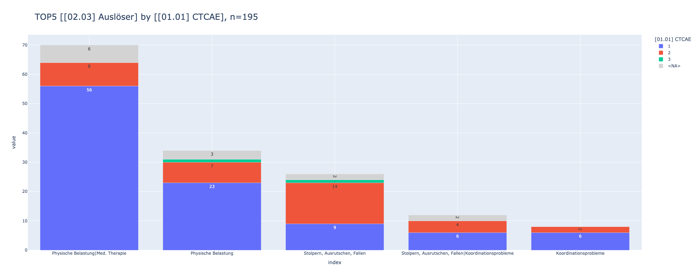
    

## descriptive stats

    ['[01.01] CTCAE',
     '[01.02] Datum_AE',
     '[01.03] Sportassoziation',
     '[02.02] Art',
     '[02.03] Auslöser',
     '[02.04] Körperteil',
     '[03.02] Krankenhaus_Folge',
     '[03.03] Med_Weiterbehandlung_Folge',
     '[03.04] Therapieprotokoll_Folge',
     '[03.06] Pflege_Folge',
     '[03.07] Medikamente_Folge',
     '[03.08] Angst_Folge',
     '[03.09] Strukturanpassung_Folge',
     '[03.10.01] Freigabe_OK',
     '[03.10] Freigabe_Folge',
     '[03.11.02] PECH_Folge',
     '[03.11] PECH_Folge',
     '[03.12] Observierung_Folge',
     '[03.13.01] Ende_vs_Pause',
     '[03.13.02] Pause_Intensität',
     '[03.13] Stoppung_Folge',
     '[03.14.01] Anpassung_Intensität',
     '[03.14.02] Anpassung_Dauer',
     '[03.15] Trost_Folge',
     '[03.17] ADL_Einschränkungen',
     '[05.01] Therapiephase',
     '[05.02] Gruppengröße',
     '[05.03] Alter',
     '[05.04] Online',
     '[05.05] Testung',
     '[05.06] Setting',
     '[05.07] Motorik',
     '[05.08] Hälfte',
     '[05.09] Trainingszustand ']

    ┌───────────────┬───────┬────────┐
    │ [01.01] CTCAE │  cnt  │  pct   │
    │    varchar    │ int64 │ double │
    ├───────────────┼───────┼────────┤
    │ 1             │   132 │   0.68 │
    │ 2             │    43 │   0.22 │
    │ <NA>          │    17 │   0.09 │
    │ 3             │     3 │   0.02 │
    └───────────────┴───────┴────────┘
    
    ┌────────────────────────────────────────────────────────────────────┬───────┬────────┐
    │                          [01.02] Datum_AE                          │  cnt  │  pct   │
    │                              varchar                               │ int64 │ double │
    ├────────────────────────────────────────────────────────────────────┼───────┼────────┤
    │ Das AE ist neu aufgetreten.                                        │   158 │   0.81 │
    │ Das AE war vor dem Sport bereits vorhanden und hat sich verstärkt. │    37 │   0.19 │
    └────────────────────────────────────────────────────────────────────┴───────┴────────┘
    
    ┌──────────────────────────┬───────┬────────┐
    │ [01.03] Sportassoziation │  cnt  │  pct   │
    │         varchar          │ int64 │ double │
    ├──────────────────────────┼───────┼────────┤
    │ Yes                      │   167 │   0.86 │
    │ No                       │    27 │   0.14 │
    └──────────────────────────┴───────┴────────┘
    
    ┌───────────────────────────────┬───────┬────────┐
    │          [02.02] Art          │  cnt  │  pct   │
    │            varchar            │ int64 │ double │
    ├───────────────────────────────┼───────┼────────┤
    │ Schmerzen                     │   104 │   0.53 │
    │ Übelkeit/ Erbrechen           │    39 │    0.2 │
    │ Kreislaufprobleme             │    34 │   0.17 │
    │ Weichteil- / Gewebeverletzung │    22 │   0.11 │
    │ Oberflächliche Verletzungen   │    17 │   0.09 │
    │ Psychische Stressreaktion     │     7 │   0.04 │
    │ Muskelkater                   │     6 │   0.03 │
    │ Juckreiz                      │     4 │   0.02 │
    │ Hustenanfall                  │     4 │   0.02 │
    │ Starke Erschöpfung            │     4 │   0.02 │
    │ Stuhlgang                     │     3 │   0.02 │
    │ Muskelkrämpfe                 │     3 │   0.02 │
    │ Knochenverletzungen           │     2 │   0.01 │
    │ Enuresis                      │     2 │   0.01 │
    │ Nasenbluten                   │     2 │   0.01 │
    ├───────────────────────────────┴───────┴────────┤
    │ 15 rows                              3 columns │
    └────────────────────────────────────────────────┘
    
    ┌───────────────────────────────┬───────┬────────┐
    │       [02.03] Auslöser        │  cnt  │  pct   │
    │            varchar            │ int64 │ double │
    ├───────────────────────────────┼───────┼────────┤
    │ Physische Belastung           │   121 │   0.62 │
    │ Med. Therapie                 │    86 │   0.44 │
    │ Stolpern, Ausrutschen, Fallen │    45 │   0.23 │
    │ Koordinationsprobleme         │    25 │   0.13 │
    │ Psychische Belastung          │    13 │   0.07 │
    │ Stoßen, Rempeln               │    10 │   0.05 │
    │ Umgebungsbedingungen          │     8 │   0.04 │
    │ Weitere                       │     1 │   0.01 │
    └───────────────────────────────┴───────┴────────┘
    
    ┌─────────────────────┬───────┬────────┐
    │ [02.04] Körperteil  │  cnt  │  pct   │
    │       varchar       │ int64 │ double │
    ├─────────────────────┼───────┼────────┤
    │ Internistisch       │    72 │   0.37 │
    │ untere Extremitäten │    44 │   0.23 │
    │ Kopf                │    24 │   0.12 │
    │ obere Extremitäten  │    13 │   0.07 │
    │ Bauch               │    13 │   0.07 │
    │ Rücken              │     9 │   0.05 │
    │ Ganzkörper          │     9 │   0.05 │
    │ Gesäß               │     8 │   0.04 │
    │ Brust               │     5 │   0.03 │
    │ Darm                │     4 │   0.02 │
    │ Steiß               │     2 │   0.01 │
    │ -                   │     1 │   0.01 │
    │ Intimbereich        │     1 │   0.01 │
    ├─────────────────────┴───────┴────────┤
    │ 13 rows                    3 columns │
    └──────────────────────────────────────┘
    
    ┌───────────────────────────┬───────┬────────┐
    │ [03.02] Krankenhaus_Folge │  cnt  │  pct   │
    │          varchar          │ int64 │ double │
    ├───────────────────────────┼───────┼────────┤
    │ No                        │   192 │   0.98 │
    │ Yes                       │     2 │   0.01 │
    │ weiß nicht                │     1 │   0.01 │
    └───────────────────────────┴───────┴────────┘
    
    ┌────────────────────────────────────┬───────┬────────┐
    │ [03.03] Med_Weiterbehandlung_Folge │  cnt  │  pct   │
    │              varchar               │ int64 │ double │
    ├────────────────────────────────────┼───────┼────────┤
    │ No                                 │   142 │   0.73 │
    │ Yes                                │    50 │   0.26 │
    │ weiß nicht                         │     3 │   0.02 │
    └────────────────────────────────────┴───────┴────────┘
    
    ┌─────────────────────────────────┬───────┬────────┐
    │ [03.04] Therapieprotokoll_Folge │  cnt  │  pct   │
    │             varchar             │ int64 │ double │
    ├─────────────────────────────────┼───────┼────────┤
    │ No                              │   195 │    1.0 │
    └─────────────────────────────────┴───────┴────────┘
    
    ┌──────────────────────┬───────┬────────┐
    │ [03.06] Pflege_Folge │  cnt  │  pct   │
    │       varchar        │ int64 │ double │
    ├──────────────────────┼───────┼────────┤
    │ No                   │   191 │   0.98 │
    │ Yes                  │     4 │   0.02 │
    └──────────────────────┴───────┴────────┘
    
    ┌───────────────────────────┬───────┬────────┐
    │ [03.07] Medikamente_Folge │  cnt  │  pct   │
    │          varchar          │ int64 │ double │
    ├───────────────────────────┼───────┼────────┤
    │ No                        │   149 │   0.76 │
    │ weiß nicht                │    35 │   0.18 │
    │ Yes                       │     5 │   0.03 │
    └───────────────────────────┴───────┴────────┘
    
    ┌─────────────────────┬───────┬────────┐
    │ [03.08] Angst_Folge │  cnt  │  pct   │
    │       varchar       │ int64 │ double │
    ├─────────────────────┼───────┼────────┤
    │ Nein                │   132 │   0.68 │
    │ Ja                  │    62 │   0.32 │
    └─────────────────────┴───────┴────────┘
    
    ┌─────────────────────────────────┬───────┬────────┐
    │ [03.09] Strukturanpassung_Folge │  cnt  │  pct   │
    │             varchar             │ int64 │ double │
    ├─────────────────────────────────┼───────┼────────┤
    │ Nein                            │   183 │   0.94 │
    │ Ja                              │    11 │   0.06 │
    └─────────────────────────────────┴───────┴────────┘
    
    ┌────────────────────────┬───────┬────────┐
    │ [03.10.01] Freigabe_OK │  cnt  │  pct   │
    │        varchar         │ int64 │ double │
    ├────────────────────────┼───────┼────────┤
    │ Medizin                │    29 │   0.15 │
    │ Pflege                 │    22 │   0.11 │
    │ Physiotherapie         │     3 │   0.02 │
    │ Eltern                 │     2 │   0.01 │
    │ Psychosozialer Dienst  │     1 │   0.01 │
    └────────────────────────┴───────┴────────┘
    
    ┌────────────────────────┬───────┬────────┐
    │ [03.10] Freigabe_Folge │  cnt  │  pct   │
    │        varchar         │ int64 │ double │
    ├────────────────────────┼───────┼────────┤
    │ No                     │   137 │    0.7 │
    │ Yes                    │    57 │   0.29 │
    └────────────────────────┴───────┴────────┘
    
    ┌───────────────────────┬───────┬────────┐
    │ [03.11.02] PECH_Folge │  cnt  │  pct   │
    │        varchar        │ int64 │ double │
    ├───────────────────────┼───────┼────────┤
    │ max. 3 Stunden        │     9 │   0.05 │
    │ max. 24 Stunden       │     6 │   0.03 │
    │ über 7 Tage           │     3 │   0.02 │
    │ max. 7 Tage           │     1 │   0.01 │
    └───────────────────────┴───────┴────────┘
    
    ┌────────────────────┬───────┬────────┐
    │ [03.11] PECH_Folge │  cnt  │  pct   │
    │      varchar       │ int64 │ double │
    ├────────────────────┼───────┼────────┤
    │ Nein               │   175 │    0.9 │
    │ Ja                 │    19 │    0.1 │
    └────────────────────┴───────┴────────┘
    
    ┌────────────────────────────┬───────┬────────┐
    │ [03.12] Observierung_Folge │  cnt  │  pct   │
    │          varchar           │ int64 │ double │
    ├────────────────────────────┼───────┼────────┤
    │ Nein                       │   188 │   0.96 │
    │ Ja                         │     6 │   0.03 │
    │ Weiß nicht                 │     1 │   0.01 │
    └────────────────────────────┴───────┴────────┘
    
    ┌──────────────────────────┬───────┬────────┐
    │ [03.13.01] Ende_vs_Pause │  cnt  │  pct   │
    │         varchar          │ int64 │ double │
    ├──────────────────────────┼───────┼────────┤
    │ Abbruch                  │   100 │   0.51 │
    │ Pause                    │    75 │   0.38 │
    └──────────────────────────┴───────┴────────┘
    
    ┌─────────────────────────────┬───────┬────────┐
    │ [03.13.02] Pause_Intensität │  cnt  │  pct   │
    │           varchar           │ int64 │ double │
    ├─────────────────────────────┼───────┼────────┤
    │ max. 5min                   │    44 │   0.23 │
    │ min. 10min                  │    24 │   0.12 │
    │ max. 1min                   │     7 │   0.04 │
    └─────────────────────────────┴───────┴────────┘
    
    ┌────────────────────────┬───────┬────────┐
    │ [03.13] Stoppung_Folge │  cnt  │  pct   │
    │        varchar         │ int64 │ double │
    ├────────────────────────┼───────┼────────┤
    │ Yes                    │   175 │    0.9 │
    │ No                     │    20 │    0.1 │
    └────────────────────────┴───────┴────────┘
    
    ┌─────────────────────────────────┬───────┬────────┐
    │ [03.14.01] Anpassung_Intensität │  cnt  │  pct   │
    │             varchar             │ int64 │ double │
    ├─────────────────────────────────┼───────┼────────┤
    │ -                               │   150 │   0.77 │
    │ Übungsauswahl                   │    32 │   0.16 │
    │ Intensität                      │    21 │   0.11 │
    │ Material                        │     5 │   0.03 │
    │ Kommunikationsstrategie         │     4 │   0.02 │
    │ Räumlichkeit                    │     3 │   0.02 │
    └─────────────────────────────────┴───────┴────────┘
    
    ┌──────────────────────────────────────────────────────────────┬───────┬────────┐
    │                  [03.14.02] Anpassung_Dauer                  │  cnt  │  pct   │
    │                           varchar                            │ int64 │ double │
    ├──────────────────────────────────────────────────────────────┼───────┼────────┤
    │ nur für diese Einheit                                        │    33 │   0.17 │
    │ für die gesamte Therapiephase                                │     8 │   0.04 │
    │ ab jetzt für alle bewegungseinheiten mit allen Patient*innen │     4 │   0.02 │
    └──────────────────────────────────────────────────────────────┴───────┴────────┘
    
    ┌─────────────────────┬───────┬────────┐
    │ [03.15] Trost_Folge │  cnt  │  pct   │
    │       varchar       │ int64 │ double │
    ├─────────────────────┼───────┼────────┤
    │ No                  │   105 │   0.54 │
    │ Yes                 │    90 │   0.46 │
    └─────────────────────┴───────┴────────┘
    
    ┌─────────────────────────────┬───────┬────────┐
    │ [03.17] ADL_Einschränkungen │  cnt  │  pct   │
    │           varchar           │ int64 │ double │
    ├─────────────────────────────┼───────┼────────┤
    │ Nein                        │   184 │   0.94 │
    │ Ja                          │     6 │   0.03 │
    │ Weiß nicht                  │     2 │   0.01 │
    └─────────────────────────────┴───────┴────────┘
    
    ┌───────────────────────┬───────┬────────┐
    │ [05.01] Therapiephase │  cnt  │  pct   │
    │        varchar        │ int64 │ double │
    ├───────────────────────┼───────┼────────┤
    │ Akuttherapie          │   162 │   0.83 │
    │ Nachsorge             │    26 │   0.13 │
    │ Dauertherapie         │     7 │   0.04 │
    └───────────────────────┴───────┴────────┘
    
    ┌──────────────────────┬───────┬────────┐
    │ [05.02] Gruppengröße │  cnt  │  pct   │
    │       varchar        │ int64 │ double │
    ├──────────────────────┼───────┼────────┤
    │ Einzel               │   175 │    0.9 │
    │ Gruppe 5 bis 10 TN   │     8 │   0.04 │
    │ Gruppe über 10 TN    │     6 │   0.03 │
    │ Gruppe 2 bis 5 TN    │     2 │   0.01 │
    └──────────────────────┴───────┴────────┘
    
    ┌─────────────────┬───────┬────────┐
    │  [05.03] Alter  │  cnt  │  pct   │
    │     varchar     │ int64 │ double │
    ├─────────────────┼───────┼────────┤
    │ 06 bis 9 Jahre  │    50 │   0.26 │
    │ 10 bis 14 Jahre │    42 │   0.22 │
    │ 15 bis 18 Jahre │    26 │   0.13 │
    │ 02 bis 5 Jahre  │    24 │   0.12 │
    │ 18+ Jahre       │     8 │   0.04 │
    └─────────────────┴───────┴────────┘
    
    ┌────────────────┬───────┬────────┐
    │ [05.04] Online │  cnt  │  pct   │
    │    varchar     │ int64 │ double │
    ├────────────────┼───────┼────────┤
    │ No             │   186 │   0.95 │
    │ Yes            │     8 │   0.04 │
    └────────────────┴───────┴────────┘
    
    ┌─────────────────┬───────┬────────┐
    │ [05.05] Testung │  cnt  │  pct   │
    │     varchar     │ int64 │ double │
    ├─────────────────┼───────┼────────┤
    │ No              │   189 │   0.97 │
    │ Yes             │     5 │   0.03 │
    └─────────────────┴───────┴────────┘
    
    ┌───────────────────────────────────┬───────┬────────┐
    │          [05.06] Setting          │  cnt  │  pct   │
    │              varchar              │ int64 │ double │
    ├───────────────────────────────────┼───────┼────────┤
    │ Turnhalle / Sportraum / Kraftraum │    70 │   0.36 │
    │ Pat.-Zimmer                       │    46 │   0.24 │
    │ Klinikflur                        │    43 │   0.22 │
    │ Draußen                           │    12 │   0.06 │
    │ Zuhause                           │     7 │   0.04 │
    │ Weiteres                          │     1 │   0.01 │
    └───────────────────────────────────┴───────┴────────┘
    
    ┌────────────────────┬───────┬────────┐
    │  [05.07] Motorik   │  cnt  │  pct   │
    │      varchar       │ int64 │ double │
    ├────────────────────┼───────┼────────┤
    │ Koordination       │    91 │   0.47 │
    │ Ausdauer           │    53 │   0.27 │
    │ Kraft              │    48 │   0.25 │
    │ Beweglichkeit      │    26 │   0.13 │
    │ Ganzkörpertraining │    25 │   0.13 │
    │ -                  │    13 │   0.07 │
    │ Schnelligkeit      │    11 │   0.06 │
    │ Entspannung        │     2 │   0.01 │
    └────────────────────┴───────┴────────┘
    
    ┌────────────────┬───────┬────────┐
    │ [05.08] Hälfte │  cnt  │  pct   │
    │    varchar     │ int64 │ double │
    ├────────────────┼───────┼────────┤
    │ 2. Hälfte      │    85 │   0.44 │
    │ 1. Hälfte      │    63 │   0.32 │
    └────────────────┴───────┴────────┘
    
    ┌───────────────────────────┬───────┬────────┐
    │ [05.09] Trainingszustand  │  cnt  │  pct   │
    │          varchar          │ int64 │ double │
    ├───────────────────────────┼───────┼────────┤
    │ 3 Mäßig                   │    83 │   0.43 │
    │ -                         │    53 │   0.27 │
    │ 2 Durchschnittlich        │    38 │   0.19 │
    │ 1 Gut                     │    17 │   0.09 │
    │ 5 Anmerkung               │     9 │   0.05 │
    │ 4 Weiß nicht              │     3 │   0.02 │
    └───────────────────────────┴───────┴────────┘
    

    [01.02] Datum_AE

    
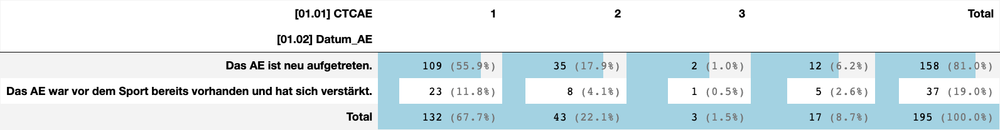
    

    [01.03] Sportassoziation

    
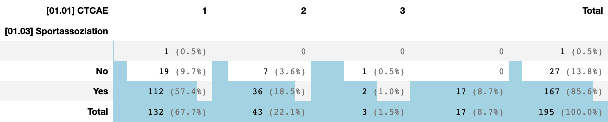
    

    [02.02] Art

    
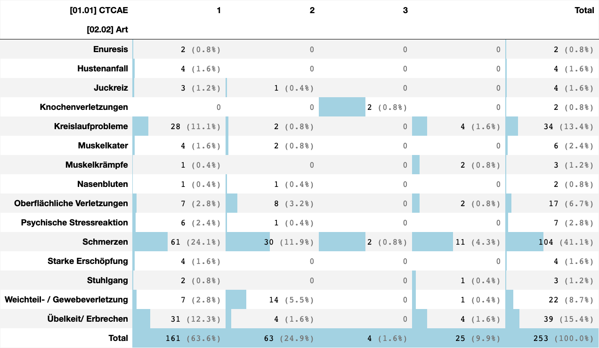
    

    [02.03] Auslöser

    
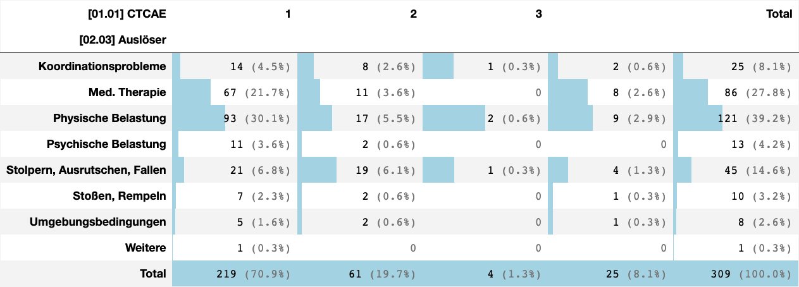
    

    [02.04] Körperteil

    
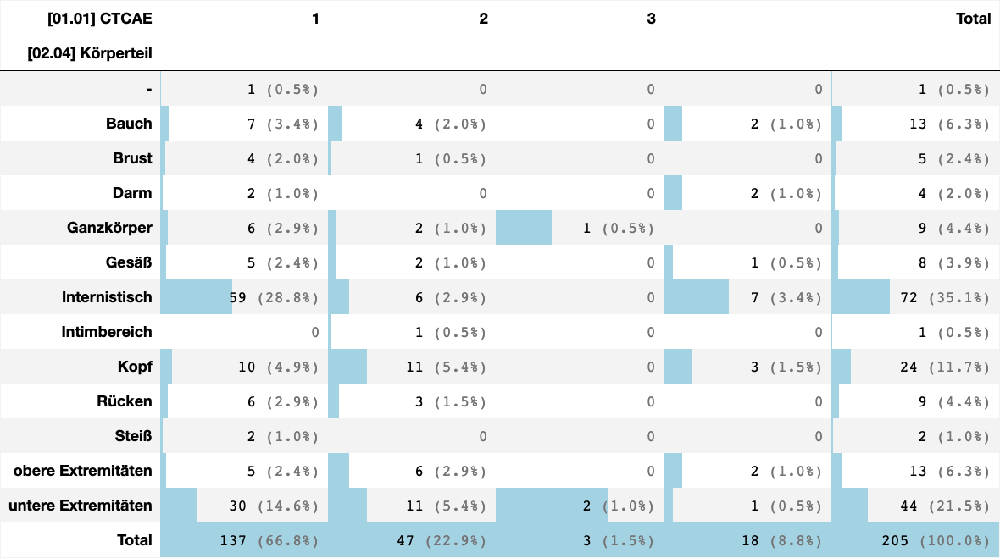
    

    [03.02] Krankenhaus_Folge

    
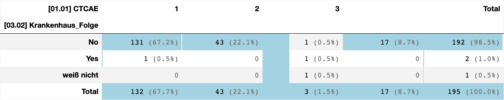
    

    [03.03] Med_Weiterbehandlung_Folge

    
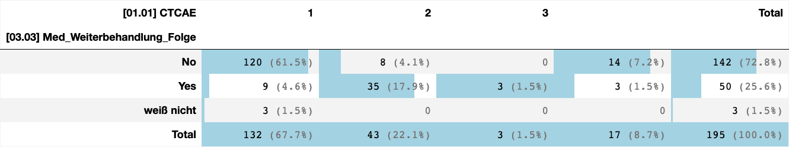
    

    [03.04] Therapieprotokoll_Folge

    
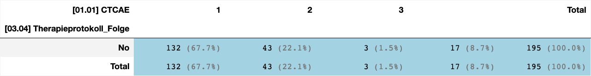
    

    [03.06] Pflege_Folge

    

    

    [03.07] Medikamente_Folge

    
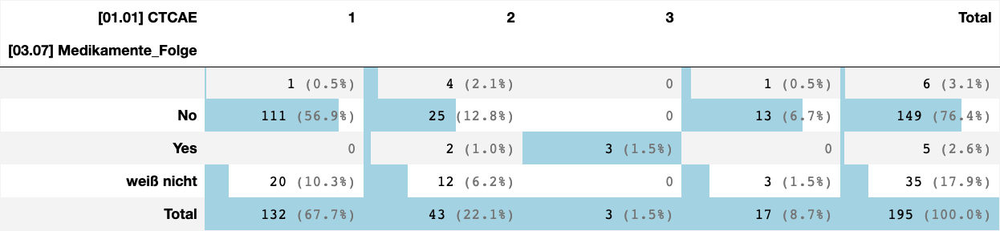
    

    [03.08] Angst_Folge

    
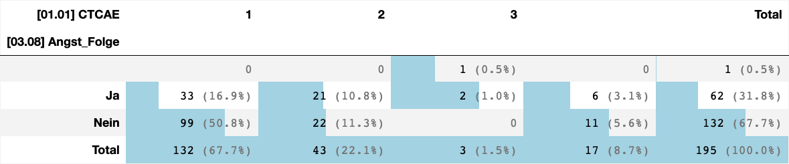
    

    [03.09] Strukturanpassung_Folge

    
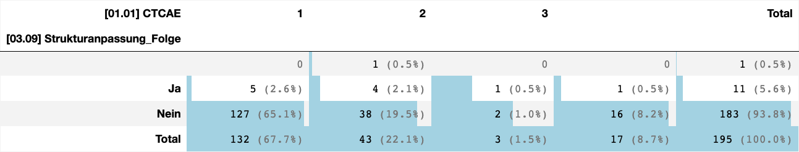
    

    [03.10.01] Freigabe_OK

    

    

    [03.10] Freigabe_Folge

    
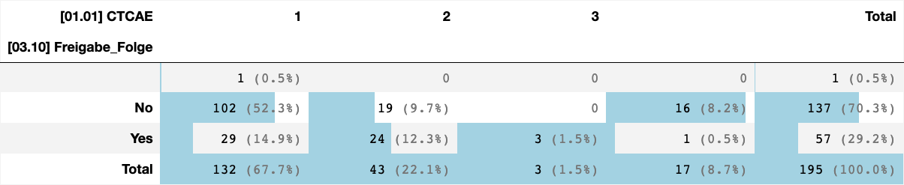
    

    [03.11.02] PECH_Folge

    

    

    [03.11] PECH_Folge

    
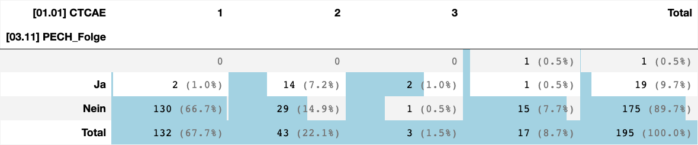
    

    [03.12] Observierung_Folge

    
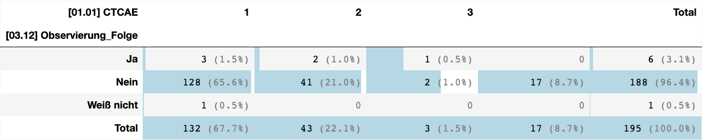
    

    [03.13.01] Ende_vs_Pause

    
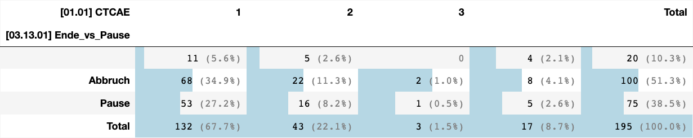
    

    [03.13.02] Pause_Intensität

    
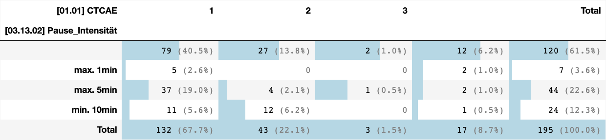
    

    [03.13] Stoppung_Folge

    
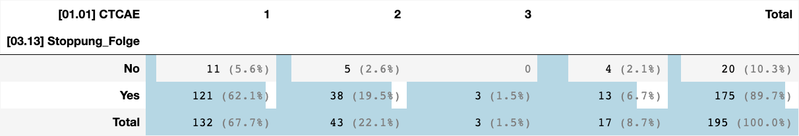
    

    [03.14.01] Anpassung_Intensität

    
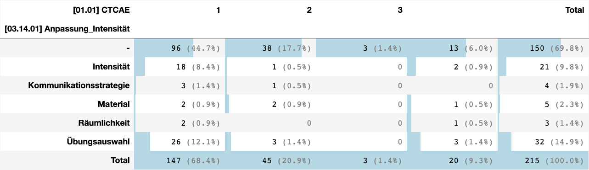
    

    [03.14.02] Anpassung_Dauer

    
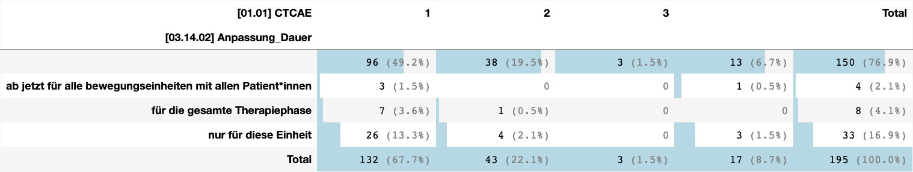
    

    [03.15] Trost_Folge

    
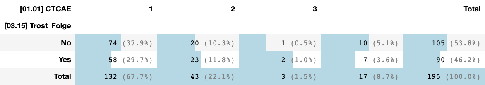
    

    [03.17] ADL_Einschränkungen

    
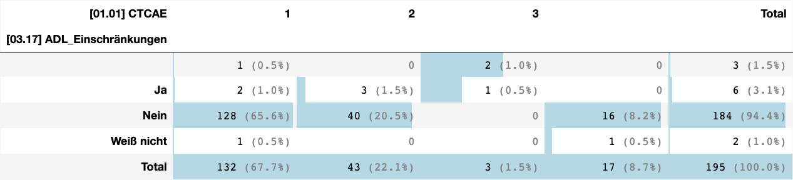
    

    [05.01] Therapiephase

    
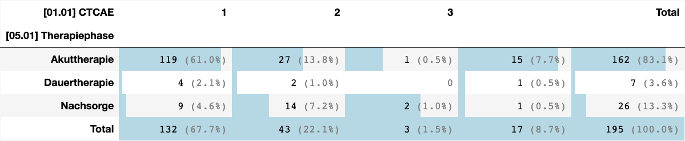
    

    [05.02] Gruppengröße

    
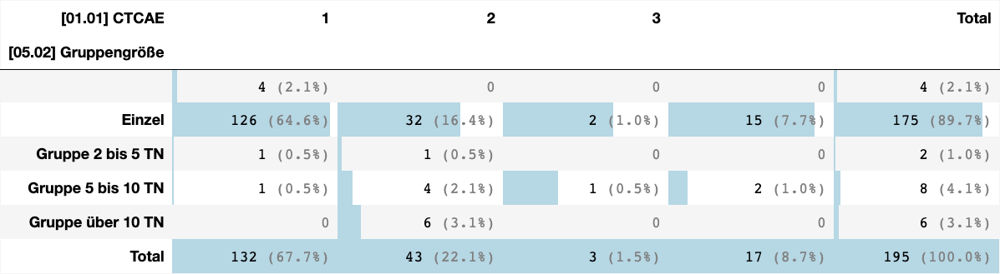
    

    [05.03] Alter

    
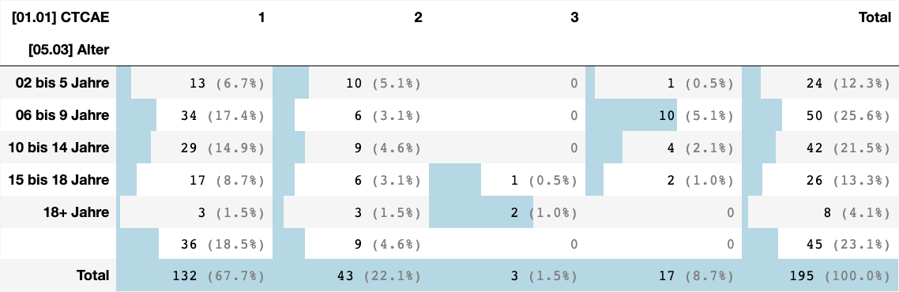
    

    [05.04] Online

    
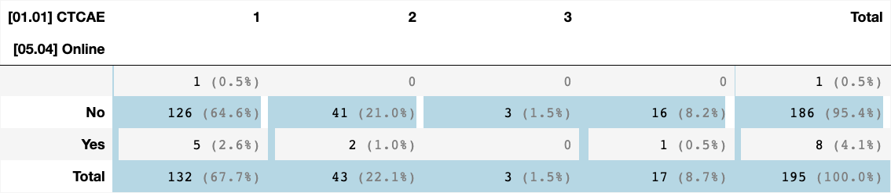
    

    [05.05] Testung

    
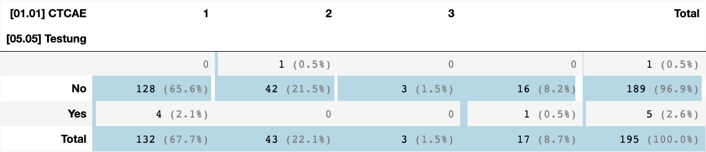
    

    [05.06] Setting

    
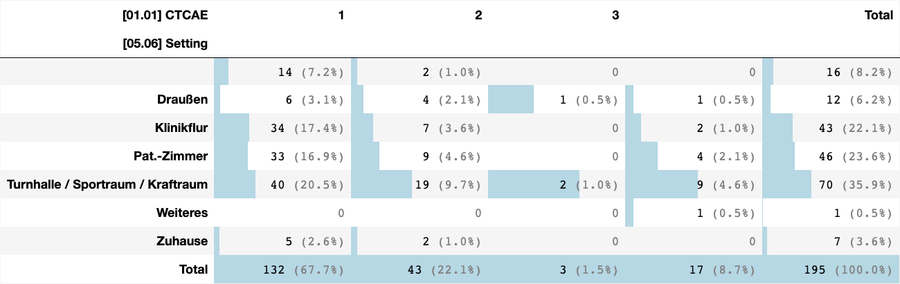
    

    [05.07] Motorik

    
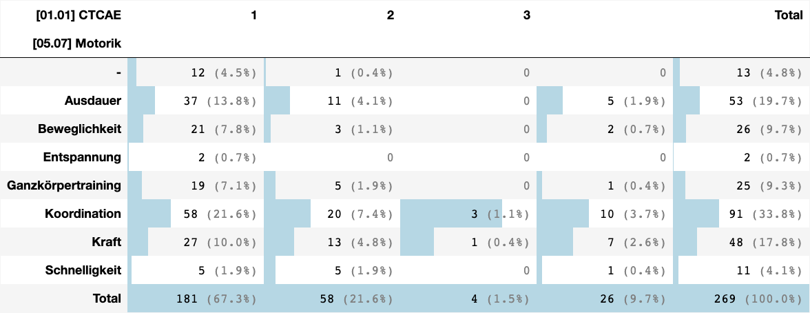
    

    [05.08] Hälfte

    
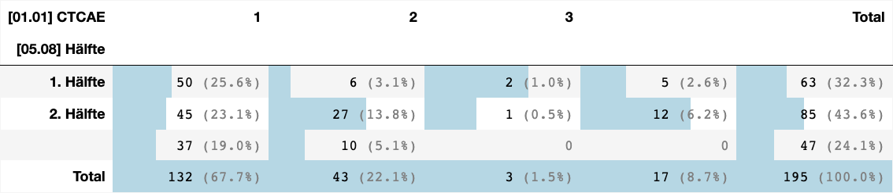
    

    [05.09] Trainingszustand 

    
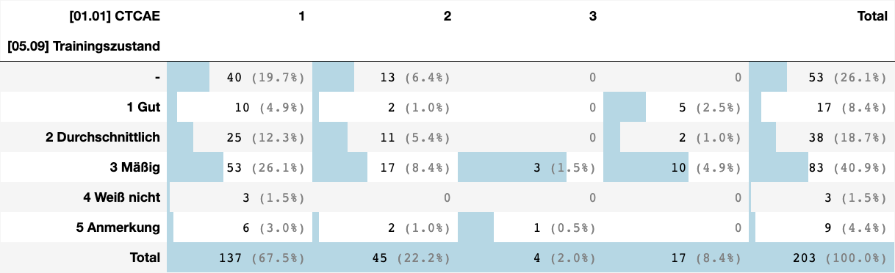
    

