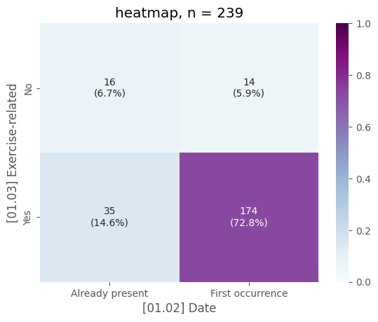

# [analyze data](#toc0_)

**Table of contents**    
- [analyze data](#toc1_)    
  - [condensed data](#toc1_1_)    
  - [🕹️ interactive](#toc1_2_)    
  - [descriptive stats](#toc1_3_)    
    - [full data](#toc1_3_1_)    
    - [only `Exercise-related`](#toc1_3_2_)    
  - [slides](#toc1_4_)    
    - [slide 1](#toc1_4_1_)    
    - [slide 2](#toc1_4_2_)    
    - [slide 3](#toc1_4_3_)    
    - [slide 4](#toc1_4_4_)    
    - [slide 5](#toc1_4_5_)    
    - [slide 6](#toc1_4_6_)    
    - [slide 7](#toc1_4_7_)    
    - [slide 8](#toc1_4_8_)    
    - [slide 9](#toc1_4_9_)    
    - [slide 10](#toc1_4_10_)    
    - [bonus - ci](#toc1_4_11_)    
  - [2025-03-18](#toc1_5_)    
  - [chi-square](#toc1_6_)    
  - [export data](#toc1_7_)    
  - [2025-05-26 diagrams](#toc1_8_)    
  - [2025-07-29 kombinationen](#toc1_9_)    

<!-- vscode-jupyter-toc-config
	numbering=false
	anchor=true
	flat=false
	minLevel=1
	maxLevel=6
	/vscode-jupyter-toc-config -->
<!-- THIS CELL WILL BE REPLACED ON TOC UPDATE. DO NOT WRITE YOUR TEXT IN THIS CELL -->

    🐍 3.12.9 | 📦 pygwalker: 0.4.9.15 | 📦 pandas: 2.3.1 | 📦 numpy: 1.26.4 | 📦 duckdb: 1.3.2 | 📦 pandas-plots: 0.15.13 | 📦 connection-helper: 0.12.1

## [condensed data](#toc0_)
- defined columns have been transformed

    🔵 *** df: condensed ***  
    🟣 shape: (243, 38) columns: ['[01.01] CTCAE' '[01.02] Date' '[01.03] Exercise-related'
     '[02.01] CreatedOn' '[02.02] Type' '[02.03] Trigger'
     '[02.04] Affected body parts' '[03.01] Pain'
     '[03.02] With hospitalization' '[03.03] Medical follow-up treatment'
     '[03.04] With delayed therapy protocol'
     '[03.05] Life-saving intervention' '[03.06] Increased care needs'
     '[03.07] With medication administration' '[03.08.01] Affected person'
     '[03.08] Occurrence of fear and uncertainty'
     '[03.09] Structural adjustment' '[03.10.01] Approver'
     '[03.10.02] OK to proceed'
     '[03.10] Assessment of the situation by expertise'
     '[03.11] Application RICE rule (Rest, Ice, Compression, Elevation)'
     '[03.12] With observation' '[03.13.01] Stop or Break' '[03.13] Stop'
     '[03.14.01] Adaptations intensity' '[03.14.02] Adaptations duration'
     '[03.14] Adaptations' '[03.16] Death' '[05.01] Therapy phase'
     '[05.02] Group size' '[05.03] Age' '[05.04] Online'
     '[05.05] As part of testing' '[05.06] Setting' '[05.07] Main motor skill'
     '[05.08] Time point' '[05.09] Training condition'
     '[06.01] Trigger Freetext']  
    🟣 duplicates: 0  
    🟣 uniques: [{01.01 CTCAE: 4 01.02 Date: 2 01.03 Exercise-related: 2 02.01 CreatedOn: 173 02.02  
    Type: 35 02.03 Trigger: 30 02.04 Affected body parts: 23 03.01 Pain: 2 03.02 With hospitalization:  
    3 03.03 Medical follow-up treatment: 3 03.04 With delayed therapy protocol: 1 03.05  
    Life-saving intervention: 1 03.06 Increased care needs: 2 03.07 With medication administration:  
    3 03.08.01 Affected person: 11 03.08 Occurrence of fear and uncertainty: 2 03.09 Structural  
    adjustment: 3 03.10.01 Approver: 7 03.10.02 OK to proceed: 1 03.10 Assessment of the  
    situation by expertise: 1 03.11 Application RICE rule (Rest Ice Compression Elevation):  
    2 03.12 With observation: 3 03.13.01 Stop or Break: 3 03.13 Stop: 2 03.14.01 Adaptations  
    intensity: 12 03.14.02 Adaptations duration: 4 03.14 Adaptations: 1 03.16 Death:  
    1 05.01 Therapy phase: 4 05.02 Group size: 4 05.03 Age: 5 05.04 Online: 2 05.05 As part  
    of testing: 2 05.06 Setting: 6 05.07 Main motor skill: 18 05.08 Time point: 3 05.09 Training  
    condition: 5 06.01 Trigger Freetext: 239}]  
    🟣 missings: [{01.01 CTCAE: 3 01.02 Date: 0 01.03 Exercise-related: 1 02.01 CreatedOn: 0 02.02 Type:  
    0 02.03 Trigger: 0 02.04 Affected body parts: 1 03.01 Pain: 0 03.02 With hospitalization:  
    0 03.03 Medical follow-up treatment: 0 03.04 With delayed therapy protocol: 1 03.05  
    Life-saving intervention: 1 03.06 Increased care needs: 0 03.07 With medication administration:  
    6 03.08.01 Affected person: 165 03.08 Occurrence of fear and uncertainty: 2 03.09 Structural  
    adjustment: 1 03.10.01 Approver: 0 03.10.02 OK to proceed: 0 03.10 Assessment of the  
    situation by expertise: 0 03.11 Application RICE rule (Rest Ice Compression Elevation):  
    1 03.12 With observation: 0 03.13.01 Stop or Break: 25 03.13 Stop: 0 03.14.01 Adaptations  
    intensity: 191 03.14.02 Adaptations duration: 191 03.14 Adaptations: 0 03.16 Death:  
    0 05.01 Therapy phase: 0 05.02 Group size: 4 05.03 Age: 45 05.04 Online: 1 05.05 As part  
    of testing: 1 05.06 Setting: 16 05.07 Main motor skill: 13 05.08 Time point: 48 05.09  
    Training condition: 54 06.01 Trigger Freetext: 4}]  
    --- column uniques (all)  
    🟠 index [0, 1, 2, 3, 4,]  
    🟠 [01.01] CTCAE(5|object)   ['1', '2', '3', '4', '<NA>',]  
    🟠 [01.02] Date(2|object)   ['Already present', 'First occurrence',]  
    🟠 [01.03] Exercise-related(3|object)   ['<NA>', 'No', 'Yes',]  
    🟠 [02.01] CreatedOn(173|object)   ['2021-01-11', '2021-01-12', '2021-01-18', '2021-02-01', '2021-02-19',]  
    🟠 [02.02] Type(35|object)   ['Bone injuries', 'Circulatory problems', 'Circulatory problems|Muscle cramps',  
    'Circulatory problems|Psychological stress reaction', 'Circulatory problems|Severe exhaustion',]  
    🟠 [02.03] Trigger(30|object)   ['Coordination problems', 'Coordination problems|Kollision', 'Environmental conditions',  
    'Environmental conditions|Kollision', 'Kollision',]  
    🟠 [02.04] Affected body parts(24|object)   ['<NA>', 'Abdomen', 'Abdomen|Coccyx', 'Abdomen|Intestine', 'Back',]  
    🟠 [03.01] Pain(2|object)   ['Ja', 'Nein',]  
    🟠 [03.02] With hospitalization(3|object)   ['No', 'Weiß nicht', 'Yes',]  
    🟠 [03.03] Medical follow-up treatment(3|object)   ['No', 'Weiß nicht', 'Yes',]  
    🟠 [03.04] With delayed therapy protocol(2|object)   ['<NA>', 'No',]  
    🟠 [03.05] Life-saving intervention(2|object)   ['<NA>', 'No',]  
    🟠 [03.06] Increased care needs(2|object)   ['No', 'Yes',]  
    🟠 [03.07] With medication administration(4|object)   ['<NA>', 'No', 'Weiß nicht', 'Yes',]  
    🟠 [03.08.01] Affected person(12|object)   ['<NA>', 'For affected individuals', 'For affected individuals|BeIn the treatment team',  
    'For affected individuals|BeIn the treatment team|For the excercise experts',  
    'For affected individuals|BeIn the treatment team|Mit der Ablehnung weiterer sporttherapheutischer Angebote',]  
    🟠 [03.08] Occurrence of fear and uncertainty(3|object)   ['<NA>', 'Ja', 'Nein',]  
    🟠 [03.09] Structural adjustment(4|object)   ['<NA>', 'Ja', 'Nein', 'Weiß nicht',]  
    🟠 [03.10.01] Approver(7|object)   ['-', 'Eltern', 'Medizin', 'Medizin|Psychosozialer Dienst', 'Pflege',]  
    🟠 [03.10.02] OK to proceed(1|object)   ['-',]  
    🟠 [03.10] Assessment of the situation by expertise(1|object)   ['nan',]  
    🟠 [03.11] Application RICE rule (Rest, Ice, Compression, Elevation)(3|object)   ['<NA>', 'Ja', 'Nein',]  
    🟠 [03.12] With observation(3|object)   ['Ja', 'Nein', 'U',]  
    🟠 [03.13.01] Stop or Break(4|object)   ['<NA>', 'Break', 'Cessation', 'Einheit war sowieso vorbei',]  
    🟠 [03.13] Stop(2|object)   ['No', 'Yes',]  
    🟠 [03.14.01] Adaptations intensity(13|object)   ['<NA>', 'Communication strategy', 'Equipment', 'Equipment|Communication strategy',  
    'Exercise selection',]  
    🟠 [03.14.02] Adaptations duration(5|object)   ['<NA>', 'Ab jetzt für alle Bewegungseinheiten mit allen Patient*innen',  
    'Für die gesamte Therapiephase', 'Für die nächsten Einheiten (da das AE rückwirkend auftrat',  
    'Nur für diese Einheit',]  
    🟠 [03.14] Adaptations(1|object)   ['-',]  
    🟠 [03.16] Death(1|object)   ['No',]  
    🟠 [05.01] Therapy phase(4|object)   ['Acute therapy', 'Aftercare', 'Long-term therapy', 'Weiß nicht',]  
    🟠 [05.02] Group size(5|object)   ['<NA>', 'Group 2-5', 'Group 5 to 10', 'Group over 10', 'Individual',]  
    🟠 [05.03] Age(6|object)   ['02 to 05 years', '06 to 09 years', '10 to 14 years', '15 to 18 years', '18+ years',]  
    🟠 [05.04] Online(3|object)   ['<NA>', 'No', 'Yes',]  
    🟠 [05.05] As part of testing(3|object)   ['<NA>', 'No', 'Yes',]  
    🟠 [05.06] Setting(7|object)   ['<NA>', 'At home (via telemedicine)', 'Gym', 'Hospital corridor', 'Outside',]  
    🟠 [05.07] Main motor skill(19|object)   ['<NA>', 'Coordination', 'Coordination|Speed', 'Coordination|Strength', 'Endurance',]  
    🟠 [05.08] Time point(4|object)   ['1. Time point', '2. Time point', '<NA>', 'Nach Abschluß der Therapie',]  
    🟠 [05.09] Training condition(6|object)   ['<NA>', 'Average', 'Average|Moderate', 'Good', 'Moderate',]  
    🟠 [06.01] Trigger Freetext(240|object)   [' -	Niedrigintensive, kraftorientierte Trainingseinheit UEx (Einzeltraining im Stationszimmer)  -	Kind entwickelt Bauchkrämpfe (Schmerzskala 5-6) nach ca. 15min, möchte sich daraufhin lieber wieder hinlegen; Stundenabbruch aber sonst keine direkten Konsequenzen  -	Beschwerden wurden zuvor nicht angegeben, sind also im Verlauf der Einheit neu aufgetreten, aber fraglich, ob durch Sport induziert - kein konkreter Auslöser ersichtlich  -	Kind hatte später am Tag einen Krampfanfall, vermutlich durch therapiebedingte Hirnvolumenminderung ohne Zusammenhang mit Sport  ',  
    '15-Jähriger pat mit Keimzelltumor: 10min radergometer, anschließend Ringefangen- und Werfen; dann Schwindel und Kreislaufbeschwerden',  
    '2. Einheit am Tag (Hanteltraining) und anschließendes plötzliches Übergeben; zum Schluss gab es eine Rotationsübung (Sitzend an der Bettkante und Oberkörper von rechts nach links bewegend) und daraufhin passierte es ',  
    '5 min leichtes Fahrradfahren, bei anschließenden Ballspiel kam es zu starken Kopfschmerzen (Kopfschmerz Leitsymptom des Patienten in der Therapie)',  
    '8 min leichtes Fahrradfahren, Kräftigung Oberkörper mit Hanteln - Schwindel  ',]  
    --- column stats (numeric)  

<table border="1" class="dataframe">
  <thead>
    <tr style="text-align: right;">
      <th></th>
      <th>[01.01] CTCAE</th>
      <th>[01.02] Date</th>
      <th>[01.03] Exercise-related</th>
      <th>[02.01] CreatedOn</th>
      <th>[02.02] Type</th>
      <th>[02.03] Trigger</th>
      <th>[02.04] Affected body parts</th>
      <th>[03.01] Pain</th>
      <th>[03.02] With hospitalization</th>
      <th>[03.03] Medical follow-up treatment</th>
      <th>...</th>
      <th>[05.01] Therapy phase</th>
      <th>[05.02] Group size</th>
      <th>[05.03] Age</th>
      <th>[05.04] Online</th>
      <th>[05.05] As part of testing</th>
      <th>[05.06] Setting</th>
      <th>[05.07] Main motor skill</th>
      <th>[05.08] Time point</th>
      <th>[05.09] Training condition</th>
      <th>[06.01] Trigger Freetext</th>
    </tr>
  </thead>
  <tbody>
    <tr>
      <th>0</th>
      <td>2</td>
      <td>Already present</td>
      <td>No</td>
      <td>2022-10-01</td>
      <td>Übelkeit / Erbrechen</td>
      <td>Physical strain|Medical therapy</td>
      <td>Innere Medizin</td>
      <td>Nein</td>
      <td>No</td>
      <td>No</td>
      <td>...</td>
      <td>Acute therapy</td>
      <td>Individual</td>
      <td>10 to 14 years</td>
      <td>No</td>
      <td>No</td>
      <td>Hospital corridor</td>
      <td>Coordination</td>
      <td>2. Time point</td>
      <td>Average</td>
      <td>Beim moderaten Tischtennisspielen wurde der Pa...</td>
    </tr>
    <tr>
      <th>1</th>
      <td>1</td>
      <td>First occurrence</td>
      <td>Yes</td>
      <td>2022-10-01</td>
      <td>Pain</td>
      <td>Coordination problems</td>
      <td>Back|Buttocks</td>
      <td>Ja</td>
      <td>No</td>
      <td>No</td>
      <td>...</td>
      <td>Acute therapy</td>
      <td>Individual</td>
      <td>06 to 09 years</td>
      <td>No</td>
      <td>No</td>
      <td>Hospital corridor</td>
      <td>Coordination</td>
      <td>1. Time point</td>
      <td>Good</td>
      <td>Luftballonspiel im Stehen; Kind hat sich gestr...</td>
    </tr>
    <tr>
      <th>2</th>
      <td>2</td>
      <td>Already present</td>
      <td>No</td>
      <td>2022-11-01</td>
      <td>Circulatory problems</td>
      <td>Medical therapy</td>
      <td>Innere Medizin</td>
      <td>Nein</td>
      <td>No</td>
      <td>Yes</td>
      <td>...</td>
      <td>Acute therapy</td>
      <td>Individual</td>
      <td>10 to 14 years</td>
      <td>No</td>
      <td>No</td>
      <td>Patients room</td>
      <td>Coordination</td>
      <td>2. Time point</td>
      <td>Moderate</td>
      <td>Beim leichter Mobilisation und Aktivierung hat...</td>
    </tr>
  </tbody>
</table>

3 rows × 38 columns

    

    

    

    

## [🕹️ interactive](#toc0_)

## [descriptive stats](#toc0_)

    ['[01.01] CTCAE',
     '[01.02] Date',
     '[01.03] Exercise-related',
     '[02.02] Type',
     '[02.03] Trigger',
     '[02.04] Affected body parts',
     '[03.02] With hospitalization',
     '[03.03] Medical follow-up treatment',
     '[03.04] With delayed therapy protocol',
     '[03.06] Increased care needs',
     '[03.07] With medication administration',
     '[03.08] Occurrence of fear and uncertainty',
     '[03.08.01] Affected person',
     '[03.09] Structural adjustment',
     '[03.10] Assessment of the situation by expertise',
     '[03.10.01] Approver',
     '[03.11] Application RICE rule (Rest, Ice, Compression, Elevation)',
     '[03.12] With observation',
     '[03.13] Stop',
     '[03.13.01] Stop or Break',
     '[03.14] Adaptations',
     '[03.14.01] Adaptations intensity',
     '[03.14.02] Adaptations duration',
     '[05.01] Therapy phase',
     '[05.02] Group size',
     '[05.03] Age',
     '[05.04] Online',
     '[05.05] As part of testing',
     '[05.06] Setting',
     '[05.07] Main motor skill',
     '[05.08] Time point',
     '[05.09] Training condition']

### [full data](#toc0_)

<table id="T_4557f">
  <thead>
    <tr>
      <th class="index_name level0" >[01.01] CTCAE</th>
      <th id="T_4557f_level0_col0" class="col_heading level0 col0" >1</th>
      <th id="T_4557f_level0_col1" class="col_heading level0 col1" >2</th>
      <th id="T_4557f_level0_col2" class="col_heading level0 col2" >3</th>
      <th id="T_4557f_level0_col3" class="col_heading level0 col3" >4</th>
      <th id="T_4557f_level0_col4" class="col_heading level0 col4" >Total</th>
    </tr>
    <tr>
      <th class="index_name level0" >[01.02] Date</th>
      <th class="blank col0" >&nbsp;</th>
      <th class="blank col1" >&nbsp;</th>
      <th class="blank col2" >&nbsp;</th>
      <th class="blank col3" >&nbsp;</th>
      <th class="blank col4" >&nbsp;</th>
    </tr>
  </thead>
  <tbody>
    <tr>
      <th id="T_4557f_level0_row0" class="row_heading level0 row0" >Already present</th>
      <td id="T_4557f_row0_col0" class="data row0 col0" >42 (17.5%) </td>
      <td id="T_4557f_row0_col1" class="data row0 col1" >8 (3.3%) </td>
      <td id="T_4557f_row0_col2" class="data row0 col2" >1 (0.4%) </td>
      <td id="T_4557f_row0_col3" class="data row0 col3" >0 </td>
      <td id="T_4557f_row0_col4" class="data row0 col4" >51 (21.2%) </td>
    </tr>
    <tr>
      <th id="T_4557f_level0_row1" class="row_heading level0 row1" >First occurrence</th>
      <td id="T_4557f_row1_col0" class="data row1 col0" >142 (59.2%) </td>
      <td id="T_4557f_row1_col1" class="data row1 col1" >44 (18.3%) </td>
      <td id="T_4557f_row1_col2" class="data row1 col2" >2 (0.8%) </td>
      <td id="T_4557f_row1_col3" class="data row1 col3" >1 (0.4%) </td>
      <td id="T_4557f_row1_col4" class="data row1 col4" >189 (78.8%) </td>
    </tr>
    <tr>
      <th id="T_4557f_level0_row2" class="row_heading level0 row2" >Total</th>
      <td id="T_4557f_row2_col0" class="data row2 col0" >184 (76.7%) </td>
      <td id="T_4557f_row2_col1" class="data row2 col1" >52 (21.7%) </td>
      <td id="T_4557f_row2_col2" class="data row2 col2" >3 (1.2%) </td>
      <td id="T_4557f_row2_col3" class="data row2 col3" >1 (0.4%) </td>
      <td id="T_4557f_row2_col4" class="data row2 col4" >240 (100.0%) </td>
    </tr>
  </tbody>
</table>

<table id="T_197b6">
  <thead>
    <tr>
      <th class="index_name level0" >[01.01] CTCAE</th>
      <th id="T_197b6_level0_col0" class="col_heading level0 col0" >1</th>
      <th id="T_197b6_level0_col1" class="col_heading level0 col1" >2</th>
      <th id="T_197b6_level0_col2" class="col_heading level0 col2" >3</th>
      <th id="T_197b6_level0_col3" class="col_heading level0 col3" >4</th>
      <th id="T_197b6_level0_col4" class="col_heading level0 col4" >Total</th>
    </tr>
    <tr>
      <th class="index_name level0" >[01.03] Exercise-related</th>
      <th class="blank col0" >&nbsp;</th>
      <th class="blank col1" >&nbsp;</th>
      <th class="blank col2" >&nbsp;</th>
      <th class="blank col3" >&nbsp;</th>
      <th class="blank col4" >&nbsp;</th>
    </tr>
  </thead>
  <tbody>
    <tr>
      <th id="T_197b6_level0_row0" class="row_heading level0 row0" >No</th>
      <td id="T_197b6_row0_col0" class="data row0 col0" >22 (9.2%) </td>
      <td id="T_197b6_row0_col1" class="data row0 col1" >7 (2.9%) </td>
      <td id="T_197b6_row0_col2" class="data row0 col2" >1 (0.4%) </td>
      <td id="T_197b6_row0_col3" class="data row0 col3" >0 </td>
      <td id="T_197b6_row0_col4" class="data row0 col4" >30 (12.6%) </td>
    </tr>
    <tr>
      <th id="T_197b6_level0_row1" class="row_heading level0 row1" >Yes</th>
      <td id="T_197b6_row1_col0" class="data row1 col0" >161 (67.4%) </td>
      <td id="T_197b6_row1_col1" class="data row1 col1" >45 (18.8%) </td>
      <td id="T_197b6_row1_col2" class="data row1 col2" >2 (0.8%) </td>
      <td id="T_197b6_row1_col3" class="data row1 col3" >1 (0.4%) </td>
      <td id="T_197b6_row1_col4" class="data row1 col4" >209 (87.4%) </td>
    </tr>
    <tr>
      <th id="T_197b6_level0_row2" class="row_heading level0 row2" >Total</th>
      <td id="T_197b6_row2_col0" class="data row2 col0" >183 (76.6%) </td>
      <td id="T_197b6_row2_col1" class="data row2 col1" >52 (21.8%) </td>
      <td id="T_197b6_row2_col2" class="data row2 col2" >3 (1.3%) </td>
      <td id="T_197b6_row2_col3" class="data row2 col3" >1 (0.4%) </td>
      <td id="T_197b6_row2_col4" class="data row2 col4" >239 (100.0%) </td>
    </tr>
  </tbody>
</table>

<table id="T_c2707">
  <thead>
    <tr>
      <th class="index_name level0" >[01.01] CTCAE</th>
      <th id="T_c2707_level0_col0" class="col_heading level0 col0" >1</th>
      <th id="T_c2707_level0_col1" class="col_heading level0 col1" >2</th>
      <th id="T_c2707_level0_col2" class="col_heading level0 col2" >3</th>
      <th id="T_c2707_level0_col3" class="col_heading level0 col3" >4</th>
      <th id="T_c2707_level0_col4" class="col_heading level0 col4" >Total</th>
    </tr>
    <tr>
      <th class="index_name level0" >[02.02] Type</th>
      <th class="blank col0" >&nbsp;</th>
      <th class="blank col1" >&nbsp;</th>
      <th class="blank col2" >&nbsp;</th>
      <th class="blank col3" >&nbsp;</th>
      <th class="blank col4" >&nbsp;</th>
    </tr>
  </thead>
  <tbody>
    <tr>
      <th id="T_c2707_level0_row0" class="row_heading level0 row0" >Bone injuries</th>
      <td id="T_c2707_row0_col0" class="data row0 col0" >0 </td>
      <td id="T_c2707_row0_col1" class="data row0 col1" >0 </td>
      <td id="T_c2707_row0_col2" class="data row0 col2" >2 (0.7%) </td>
      <td id="T_c2707_row0_col3" class="data row0 col3" >0 </td>
      <td id="T_c2707_row0_col4" class="data row0 col4" >2 (0.7%) </td>
    </tr>
    <tr>
      <th id="T_c2707_level0_row1" class="row_heading level0 row1" >Circulatory problems</th>
      <td id="T_c2707_row1_col0" class="data row1 col0" >37 (12.1%) </td>
      <td id="T_c2707_row1_col1" class="data row1 col1" >2 (0.7%) </td>
      <td id="T_c2707_row1_col2" class="data row1 col2" >0 </td>
      <td id="T_c2707_row1_col3" class="data row1 col3" >0 </td>
      <td id="T_c2707_row1_col4" class="data row1 col4" >39 (12.7%) </td>
    </tr>
    <tr>
      <th id="T_c2707_level0_row2" class="row_heading level0 row2" >Coughing fit</th>
      <td id="T_c2707_row2_col0" class="data row2 col0" >5 (1.6%) </td>
      <td id="T_c2707_row2_col1" class="data row2 col1" >0 </td>
      <td id="T_c2707_row2_col2" class="data row2 col2" >0 </td>
      <td id="T_c2707_row2_col3" class="data row2 col3" >0 </td>
      <td id="T_c2707_row2_col4" class="data row2 col4" >5 (1.6%) </td>
    </tr>
    <tr>
      <th id="T_c2707_level0_row3" class="row_heading level0 row3" >Enuresis</th>
      <td id="T_c2707_row3_col0" class="data row3 col0" >2 (0.7%) </td>
      <td id="T_c2707_row3_col1" class="data row3 col1" >0 </td>
      <td id="T_c2707_row3_col2" class="data row3 col2" >0 </td>
      <td id="T_c2707_row3_col3" class="data row3 col3" >0 </td>
      <td id="T_c2707_row3_col4" class="data row3 col4" >2 (0.7%) </td>
    </tr>
    <tr>
      <th id="T_c2707_level0_row4" class="row_heading level0 row4" >Itching</th>
      <td id="T_c2707_row4_col0" class="data row4 col0" >4 (1.3%) </td>
      <td id="T_c2707_row4_col1" class="data row4 col1" >1 (0.3%) </td>
      <td id="T_c2707_row4_col2" class="data row4 col2" >0 </td>
      <td id="T_c2707_row4_col3" class="data row4 col3" >0 </td>
      <td id="T_c2707_row4_col4" class="data row4 col4" >5 (1.6%) </td>
    </tr>
    <tr>
      <th id="T_c2707_level0_row5" class="row_heading level0 row5" >Muscle cramps</th>
      <td id="T_c2707_row5_col0" class="data row5 col0" >3 (1.0%) </td>
      <td id="T_c2707_row5_col1" class="data row5 col1" >0 </td>
      <td id="T_c2707_row5_col2" class="data row5 col2" >0 </td>
      <td id="T_c2707_row5_col3" class="data row5 col3" >0 </td>
      <td id="T_c2707_row5_col4" class="data row5 col4" >3 (1.0%) </td>
    </tr>
    <tr>
      <th id="T_c2707_level0_row6" class="row_heading level0 row6" >Muscle soreness</th>
      <td id="T_c2707_row6_col0" class="data row6 col0" >5 (1.6%) </td>
      <td id="T_c2707_row6_col1" class="data row6 col1" >2 (0.7%) </td>
      <td id="T_c2707_row6_col2" class="data row6 col2" >0 </td>
      <td id="T_c2707_row6_col3" class="data row6 col3" >0 </td>
      <td id="T_c2707_row6_col4" class="data row6 col4" >7 (2.3%) </td>
    </tr>
    <tr>
      <th id="T_c2707_level0_row7" class="row_heading level0 row7" >Nosebleed</th>
      <td id="T_c2707_row7_col0" class="data row7 col0" >2 (0.7%) </td>
      <td id="T_c2707_row7_col1" class="data row7 col1" >1 (0.3%) </td>
      <td id="T_c2707_row7_col2" class="data row7 col2" >0 </td>
      <td id="T_c2707_row7_col3" class="data row7 col3" >0 </td>
      <td id="T_c2707_row7_col4" class="data row7 col4" >3 (1.0%) </td>
    </tr>
    <tr>
      <th id="T_c2707_level0_row8" class="row_heading level0 row8" >Pain</th>
      <td id="T_c2707_row8_col0" class="data row8 col0" >88 (28.8%) </td>
      <td id="T_c2707_row8_col1" class="data row8 col1" >38 (12.4%) </td>
      <td id="T_c2707_row8_col2" class="data row8 col2" >2 (0.7%) </td>
      <td id="T_c2707_row8_col3" class="data row8 col3" >1 (0.3%) </td>
      <td id="T_c2707_row8_col4" class="data row8 col4" >129 (42.2%) </td>
    </tr>
    <tr>
      <th id="T_c2707_level0_row9" class="row_heading level0 row9" >Psychological stress reaction</th>
      <td id="T_c2707_row9_col0" class="data row9 col0" >10 (3.3%) </td>
      <td id="T_c2707_row9_col1" class="data row9 col1" >1 (0.3%) </td>
      <td id="T_c2707_row9_col2" class="data row9 col2" >0 </td>
      <td id="T_c2707_row9_col3" class="data row9 col3" >0 </td>
      <td id="T_c2707_row9_col4" class="data row9 col4" >11 (3.6%) </td>
    </tr>
    <tr>
      <th id="T_c2707_level0_row10" class="row_heading level0 row10" >Schmerzhafter Spontaneous painful bowel movement</th>
      <td id="T_c2707_row10_col0" class="data row10 col0" >4 (1.3%) </td>
      <td id="T_c2707_row10_col1" class="data row10 col1" >0 </td>
      <td id="T_c2707_row10_col2" class="data row10 col2" >0 </td>
      <td id="T_c2707_row10_col3" class="data row10 col3" >0 </td>
      <td id="T_c2707_row10_col4" class="data row10 col4" >4 (1.3%) </td>
    </tr>
    <tr>
      <th id="T_c2707_level0_row11" class="row_heading level0 row11" >Severe exhaustion</th>
      <td id="T_c2707_row11_col0" class="data row11 col0" >6 (2.0%) </td>
      <td id="T_c2707_row11_col1" class="data row11 col1" >0 </td>
      <td id="T_c2707_row11_col2" class="data row11 col2" >0 </td>
      <td id="T_c2707_row11_col3" class="data row11 col3" >0 </td>
      <td id="T_c2707_row11_col4" class="data row11 col4" >6 (2.0%) </td>
    </tr>
    <tr>
      <th id="T_c2707_level0_row12" class="row_heading level0 row12" >Superficial injuries</th>
      <td id="T_c2707_row12_col0" class="data row12 col0" >8 (2.6%) </td>
      <td id="T_c2707_row12_col1" class="data row12 col1" >9 (2.9%) </td>
      <td id="T_c2707_row12_col2" class="data row12 col2" >0 </td>
      <td id="T_c2707_row12_col3" class="data row12 col3" >0 </td>
      <td id="T_c2707_row12_col4" class="data row12 col4" >17 (5.6%) </td>
    </tr>
    <tr>
      <th id="T_c2707_level0_row13" class="row_heading level0 row13" >Weichteil-/Gewebeverletzung</th>
      <td id="T_c2707_row13_col0" class="data row13 col0" >7 (2.3%) </td>
      <td id="T_c2707_row13_col1" class="data row13 col1" >17 (5.6%) </td>
      <td id="T_c2707_row13_col2" class="data row13 col2" >0 </td>
      <td id="T_c2707_row13_col3" class="data row13 col3" >1 (0.3%) </td>
      <td id="T_c2707_row13_col4" class="data row13 col4" >25 (8.2%) </td>
    </tr>
    <tr>
      <th id="T_c2707_level0_row14" class="row_heading level0 row14" >Übelkeit / Erbrechen</th>
      <td id="T_c2707_row14_col0" class="data row14 col0" >44 (14.4%) </td>
      <td id="T_c2707_row14_col1" class="data row14 col1" >4 (1.3%) </td>
      <td id="T_c2707_row14_col2" class="data row14 col2" >0 </td>
      <td id="T_c2707_row14_col3" class="data row14 col3" >0 </td>
      <td id="T_c2707_row14_col4" class="data row14 col4" >48 (15.7%) </td>
    </tr>
    <tr>
      <th id="T_c2707_level0_row15" class="row_heading level0 row15" >Total</th>
      <td id="T_c2707_row15_col0" class="data row15 col0" >225 (73.5%) </td>
      <td id="T_c2707_row15_col1" class="data row15 col1" >75 (24.5%) </td>
      <td id="T_c2707_row15_col2" class="data row15 col2" >4 (1.3%) </td>
      <td id="T_c2707_row15_col3" class="data row15 col3" >2 (0.7%) </td>
      <td id="T_c2707_row15_col4" class="data row15 col4" >306 (100.0%) </td>
    </tr>
  </tbody>
</table>

<table id="T_608b7">
  <thead>
    <tr>
      <th class="index_name level0" >[01.01] CTCAE</th>
      <th id="T_608b7_level0_col0" class="col_heading level0 col0" >1</th>
      <th id="T_608b7_level0_col1" class="col_heading level0 col1" >2</th>
      <th id="T_608b7_level0_col2" class="col_heading level0 col2" >3</th>
      <th id="T_608b7_level0_col3" class="col_heading level0 col3" >4</th>
      <th id="T_608b7_level0_col4" class="col_heading level0 col4" >Total</th>
    </tr>
    <tr>
      <th class="index_name level0" >[02.03] Trigger</th>
      <th class="blank col0" >&nbsp;</th>
      <th class="blank col1" >&nbsp;</th>
      <th class="blank col2" >&nbsp;</th>
      <th class="blank col3" >&nbsp;</th>
      <th class="blank col4" >&nbsp;</th>
    </tr>
  </thead>
  <tbody>
    <tr>
      <th id="T_608b7_level0_row0" class="row_heading level0 row0" >Coordination problems</th>
      <td id="T_608b7_row0_col0" class="data row0 col0" >20 (5.2%) </td>
      <td id="T_608b7_row0_col1" class="data row0 col1" >10 (2.6%) </td>
      <td id="T_608b7_row0_col2" class="data row0 col2" >1 (0.3%) </td>
      <td id="T_608b7_row0_col3" class="data row0 col3" >1 (0.3%) </td>
      <td id="T_608b7_row0_col4" class="data row0 col4" >32 (8.3%) </td>
    </tr>
    <tr>
      <th id="T_608b7_level0_row1" class="row_heading level0 row1" >Environmental conditions</th>
      <td id="T_608b7_row1_col0" class="data row1 col0" >8 (2.1%) </td>
      <td id="T_608b7_row1_col1" class="data row1 col1" >2 (0.5%) </td>
      <td id="T_608b7_row1_col2" class="data row1 col2" >0 </td>
      <td id="T_608b7_row1_col3" class="data row1 col3" >0 </td>
      <td id="T_608b7_row1_col4" class="data row1 col4" >10 (2.6%) </td>
    </tr>
    <tr>
      <th id="T_608b7_level0_row2" class="row_heading level0 row2" >Kollision</th>
      <td id="T_608b7_row2_col0" class="data row2 col0" >9 (2.3%) </td>
      <td id="T_608b7_row2_col1" class="data row2 col1" >4 (1.0%) </td>
      <td id="T_608b7_row2_col2" class="data row2 col2" >0 </td>
      <td id="T_608b7_row2_col3" class="data row2 col3" >0 </td>
      <td id="T_608b7_row2_col4" class="data row2 col4" >13 (3.4%) </td>
    </tr>
    <tr>
      <th id="T_608b7_level0_row3" class="row_heading level0 row3" >Medical therapy</th>
      <td id="T_608b7_row3_col0" class="data row3 col0" >93 (24.2%) </td>
      <td id="T_608b7_row3_col1" class="data row3 col1" >11 (2.9%) </td>
      <td id="T_608b7_row3_col2" class="data row3 col2" >0 </td>
      <td id="T_608b7_row3_col3" class="data row3 col3" >0 </td>
      <td id="T_608b7_row3_col4" class="data row3 col4" >104 (27.0%) </td>
    </tr>
    <tr>
      <th id="T_608b7_level0_row4" class="row_heading level0 row4" >Other</th>
      <td id="T_608b7_row4_col0" class="data row4 col0" >2 (0.5%) </td>
      <td id="T_608b7_row4_col1" class="data row4 col1" >0 </td>
      <td id="T_608b7_row4_col2" class="data row4 col2" >0 </td>
      <td id="T_608b7_row4_col3" class="data row4 col3" >0 </td>
      <td id="T_608b7_row4_col4" class="data row4 col4" >2 (0.5%) </td>
    </tr>
    <tr>
      <th id="T_608b7_level0_row5" class="row_heading level0 row5" >Physical strain</th>
      <td id="T_608b7_row5_col0" class="data row5 col0" >127 (33.0%) </td>
      <td id="T_608b7_row5_col1" class="data row5 col1" >21 (5.5%) </td>
      <td id="T_608b7_row5_col2" class="data row5 col2" >2 (0.5%) </td>
      <td id="T_608b7_row5_col3" class="data row5 col3" >0 </td>
      <td id="T_608b7_row5_col4" class="data row5 col4" >150 (39.0%) </td>
    </tr>
    <tr>
      <th id="T_608b7_level0_row6" class="row_heading level0 row6" >Psychological strain</th>
      <td id="T_608b7_row6_col0" class="data row6 col0" >16 (4.2%) </td>
      <td id="T_608b7_row6_col1" class="data row6 col1" >3 (0.8%) </td>
      <td id="T_608b7_row6_col2" class="data row6 col2" >0 </td>
      <td id="T_608b7_row6_col3" class="data row6 col3" >0 </td>
      <td id="T_608b7_row6_col4" class="data row6 col4" >19 (4.9%) </td>
    </tr>
    <tr>
      <th id="T_608b7_level0_row7" class="row_heading level0 row7" >Sturzereignis</th>
      <td id="T_608b7_row7_col0" class="data row7 col0" >30 (7.8%) </td>
      <td id="T_608b7_row7_col1" class="data row7 col1" >23 (6.0%) </td>
      <td id="T_608b7_row7_col2" class="data row7 col2" >1 (0.3%) </td>
      <td id="T_608b7_row7_col3" class="data row7 col3" >1 (0.3%) </td>
      <td id="T_608b7_row7_col4" class="data row7 col4" >55 (14.3%) </td>
    </tr>
    <tr>
      <th id="T_608b7_level0_row8" class="row_heading level0 row8" >Total</th>
      <td id="T_608b7_row8_col0" class="data row8 col0" >305 (79.2%) </td>
      <td id="T_608b7_row8_col1" class="data row8 col1" >74 (19.2%) </td>
      <td id="T_608b7_row8_col2" class="data row8 col2" >4 (1.0%) </td>
      <td id="T_608b7_row8_col3" class="data row8 col3" >2 (0.5%) </td>
      <td id="T_608b7_row8_col4" class="data row8 col4" >385 (100.0%) </td>
    </tr>
  </tbody>
</table>

<table id="T_8abe6">
  <thead>
    <tr>
      <th class="index_name level0" >[01.01] CTCAE</th>
      <th id="T_8abe6_level0_col0" class="col_heading level0 col0" >1</th>
      <th id="T_8abe6_level0_col1" class="col_heading level0 col1" >2</th>
      <th id="T_8abe6_level0_col2" class="col_heading level0 col2" >3</th>
      <th id="T_8abe6_level0_col3" class="col_heading level0 col3" >4</th>
      <th id="T_8abe6_level0_col4" class="col_heading level0 col4" >Total</th>
    </tr>
    <tr>
      <th class="index_name level0" >[02.04] Affected body parts</th>
      <th class="blank col0" >&nbsp;</th>
      <th class="blank col1" >&nbsp;</th>
      <th class="blank col2" >&nbsp;</th>
      <th class="blank col3" >&nbsp;</th>
      <th class="blank col4" >&nbsp;</th>
    </tr>
  </thead>
  <tbody>
    <tr>
      <th id="T_8abe6_level0_row0" class="row_heading level0 row0" >Abdomen</th>
      <td id="T_8abe6_row0_col0" class="data row0 col0" >12 (4.7%) </td>
      <td id="T_8abe6_row0_col1" class="data row0 col1" >5 (2.0%) </td>
      <td id="T_8abe6_row0_col2" class="data row0 col2" >0 </td>
      <td id="T_8abe6_row0_col3" class="data row0 col3" >0 </td>
      <td id="T_8abe6_row0_col4" class="data row0 col4" >17 (6.7%) </td>
    </tr>
    <tr>
      <th id="T_8abe6_level0_row1" class="row_heading level0 row1" >Back</th>
      <td id="T_8abe6_row1_col0" class="data row1 col0" >9 (3.6%) </td>
      <td id="T_8abe6_row1_col1" class="data row1 col1" >4 (1.6%) </td>
      <td id="T_8abe6_row1_col2" class="data row1 col2" >0 </td>
      <td id="T_8abe6_row1_col3" class="data row1 col3" >0 </td>
      <td id="T_8abe6_row1_col4" class="data row1 col4" >13 (5.1%) </td>
    </tr>
    <tr>
      <th id="T_8abe6_level0_row2" class="row_heading level0 row2" >Buttocks</th>
      <td id="T_8abe6_row2_col0" class="data row2 col0" >9 (3.6%) </td>
      <td id="T_8abe6_row2_col1" class="data row2 col1" >2 (0.8%) </td>
      <td id="T_8abe6_row2_col2" class="data row2 col2" >0 </td>
      <td id="T_8abe6_row2_col3" class="data row2 col3" >0 </td>
      <td id="T_8abe6_row2_col4" class="data row2 col4" >11 (4.3%) </td>
    </tr>
    <tr>
      <th id="T_8abe6_level0_row3" class="row_heading level0 row3" >Chest</th>
      <td id="T_8abe6_row3_col0" class="data row3 col0" >4 (1.6%) </td>
      <td id="T_8abe6_row3_col1" class="data row3 col1" >1 (0.4%) </td>
      <td id="T_8abe6_row3_col2" class="data row3 col2" >0 </td>
      <td id="T_8abe6_row3_col3" class="data row3 col3" >0 </td>
      <td id="T_8abe6_row3_col4" class="data row3 col4" >5 (2.0%) </td>
    </tr>
    <tr>
      <th id="T_8abe6_level0_row4" class="row_heading level0 row4" >Coccyx</th>
      <td id="T_8abe6_row4_col0" class="data row4 col0" >3 (1.2%) </td>
      <td id="T_8abe6_row4_col1" class="data row4 col1" >0 </td>
      <td id="T_8abe6_row4_col2" class="data row4 col2" >0 </td>
      <td id="T_8abe6_row4_col3" class="data row4 col3" >0 </td>
      <td id="T_8abe6_row4_col4" class="data row4 col4" >3 (1.2%) </td>
    </tr>
    <tr>
      <th id="T_8abe6_level0_row5" class="row_heading level0 row5" >Full body</th>
      <td id="T_8abe6_row5_col0" class="data row5 col0" >6 (2.4%) </td>
      <td id="T_8abe6_row5_col1" class="data row5 col1" >2 (0.8%) </td>
      <td id="T_8abe6_row5_col2" class="data row5 col2" >1 (0.4%) </td>
      <td id="T_8abe6_row5_col3" class="data row5 col3" >0 </td>
      <td id="T_8abe6_row5_col4" class="data row5 col4" >9 (3.6%) </td>
    </tr>
    <tr>
      <th id="T_8abe6_level0_row6" class="row_heading level0 row6" >Hals</th>
      <td id="T_8abe6_row6_col0" class="data row6 col0" >0 </td>
      <td id="T_8abe6_row6_col1" class="data row6 col1" >0 </td>
      <td id="T_8abe6_row6_col2" class="data row6 col2" >0 </td>
      <td id="T_8abe6_row6_col3" class="data row6 col3" >1 (0.4%) </td>
      <td id="T_8abe6_row6_col4" class="data row6 col4" >1 (0.4%) </td>
    </tr>
    <tr>
      <th id="T_8abe6_level0_row7" class="row_heading level0 row7" >Head</th>
      <td id="T_8abe6_row7_col0" class="data row7 col0" >13 (5.1%) </td>
      <td id="T_8abe6_row7_col1" class="data row7 col1" >16 (6.3%) </td>
      <td id="T_8abe6_row7_col2" class="data row7 col2" >0 </td>
      <td id="T_8abe6_row7_col3" class="data row7 col3" >0 </td>
      <td id="T_8abe6_row7_col4" class="data row7 col4" >29 (11.5%) </td>
    </tr>
    <tr>
      <th id="T_8abe6_level0_row8" class="row_heading level0 row8" >Innere Medizin</th>
      <td id="T_8abe6_row8_col0" class="data row8 col0" >86 (34.0%) </td>
      <td id="T_8abe6_row8_col1" class="data row8 col1" >6 (2.4%) </td>
      <td id="T_8abe6_row8_col2" class="data row8 col2" >0 </td>
      <td id="T_8abe6_row8_col3" class="data row8 col3" >0 </td>
      <td id="T_8abe6_row8_col4" class="data row8 col4" >92 (36.4%) </td>
    </tr>
    <tr>
      <th id="T_8abe6_level0_row9" class="row_heading level0 row9" >Intestine</th>
      <td id="T_8abe6_row9_col0" class="data row9 col0" >5 (2.0%) </td>
      <td id="T_8abe6_row9_col1" class="data row9 col1" >0 </td>
      <td id="T_8abe6_row9_col2" class="data row9 col2" >0 </td>
      <td id="T_8abe6_row9_col3" class="data row9 col3" >0 </td>
      <td id="T_8abe6_row9_col4" class="data row9 col4" >5 (2.0%) </td>
    </tr>
    <tr>
      <th id="T_8abe6_level0_row10" class="row_heading level0 row10" >Intimate area</th>
      <td id="T_8abe6_row10_col0" class="data row10 col0" >0 </td>
      <td id="T_8abe6_row10_col1" class="data row10 col1" >1 (0.4%) </td>
      <td id="T_8abe6_row10_col2" class="data row10 col2" >0 </td>
      <td id="T_8abe6_row10_col3" class="data row10 col3" >0 </td>
      <td id="T_8abe6_row10_col4" class="data row10 col4" >1 (0.4%) </td>
    </tr>
    <tr>
      <th id="T_8abe6_level0_row11" class="row_heading level0 row11" >Lower extremities</th>
      <td id="T_8abe6_row11_col0" class="data row11 col0" >38 (15.0%) </td>
      <td id="T_8abe6_row11_col1" class="data row11 col1" >13 (5.1%) </td>
      <td id="T_8abe6_row11_col2" class="data row11 col2" >2 (0.8%) </td>
      <td id="T_8abe6_row11_col3" class="data row11 col3" >0 </td>
      <td id="T_8abe6_row11_col4" class="data row11 col4" >53 (20.9%) </td>
    </tr>
    <tr>
      <th id="T_8abe6_level0_row12" class="row_heading level0 row12" >Upper extremities</th>
      <td id="T_8abe6_row12_col0" class="data row12 col0" >7 (2.8%) </td>
      <td id="T_8abe6_row12_col1" class="data row12 col1" >7 (2.8%) </td>
      <td id="T_8abe6_row12_col2" class="data row12 col2" >0 </td>
      <td id="T_8abe6_row12_col3" class="data row12 col3" >0 </td>
      <td id="T_8abe6_row12_col4" class="data row12 col4" >14 (5.5%) </td>
    </tr>
    <tr>
      <th id="T_8abe6_level0_row13" class="row_heading level0 row13" >Total</th>
      <td id="T_8abe6_row13_col0" class="data row13 col0" >192 (75.9%) </td>
      <td id="T_8abe6_row13_col1" class="data row13 col1" >57 (22.5%) </td>
      <td id="T_8abe6_row13_col2" class="data row13 col2" >3 (1.2%) </td>
      <td id="T_8abe6_row13_col3" class="data row13 col3" >1 (0.4%) </td>
      <td id="T_8abe6_row13_col4" class="data row13 col4" >253 (100.0%) </td>
    </tr>
  </tbody>
</table>

<table id="T_a8254">
  <thead>
    <tr>
      <th class="index_name level0" >[01.01] CTCAE</th>
      <th id="T_a8254_level0_col0" class="col_heading level0 col0" >1</th>
      <th id="T_a8254_level0_col1" class="col_heading level0 col1" >2</th>
      <th id="T_a8254_level0_col2" class="col_heading level0 col2" >3</th>
      <th id="T_a8254_level0_col3" class="col_heading level0 col3" >4</th>
      <th id="T_a8254_level0_col4" class="col_heading level0 col4" >Total</th>
    </tr>
    <tr>
      <th class="index_name level0" >[03.02] With hospitalization</th>
      <th class="blank col0" >&nbsp;</th>
      <th class="blank col1" >&nbsp;</th>
      <th class="blank col2" >&nbsp;</th>
      <th class="blank col3" >&nbsp;</th>
      <th class="blank col4" >&nbsp;</th>
    </tr>
  </thead>
  <tbody>
    <tr>
      <th id="T_a8254_level0_row0" class="row_heading level0 row0" >No</th>
      <td id="T_a8254_row0_col0" class="data row0 col0" >183 (76.2%) </td>
      <td id="T_a8254_row0_col1" class="data row0 col1" >52 (21.7%) </td>
      <td id="T_a8254_row0_col2" class="data row0 col2" >1 (0.4%) </td>
      <td id="T_a8254_row0_col3" class="data row0 col3" >0 </td>
      <td id="T_a8254_row0_col4" class="data row0 col4" >236 (98.3%) </td>
    </tr>
    <tr>
      <th id="T_a8254_level0_row1" class="row_heading level0 row1" >Weiß nicht</th>
      <td id="T_a8254_row1_col0" class="data row1 col0" >0 </td>
      <td id="T_a8254_row1_col1" class="data row1 col1" >0 </td>
      <td id="T_a8254_row1_col2" class="data row1 col2" >1 (0.4%) </td>
      <td id="T_a8254_row1_col3" class="data row1 col3" >0 </td>
      <td id="T_a8254_row1_col4" class="data row1 col4" >1 (0.4%) </td>
    </tr>
    <tr>
      <th id="T_a8254_level0_row2" class="row_heading level0 row2" >Yes</th>
      <td id="T_a8254_row2_col0" class="data row2 col0" >1 (0.4%) </td>
      <td id="T_a8254_row2_col1" class="data row2 col1" >0 </td>
      <td id="T_a8254_row2_col2" class="data row2 col2" >1 (0.4%) </td>
      <td id="T_a8254_row2_col3" class="data row2 col3" >1 (0.4%) </td>
      <td id="T_a8254_row2_col4" class="data row2 col4" >3 (1.2%) </td>
    </tr>
    <tr>
      <th id="T_a8254_level0_row3" class="row_heading level0 row3" >Total</th>
      <td id="T_a8254_row3_col0" class="data row3 col0" >184 (76.7%) </td>
      <td id="T_a8254_row3_col1" class="data row3 col1" >52 (21.7%) </td>
      <td id="T_a8254_row3_col2" class="data row3 col2" >3 (1.2%) </td>
      <td id="T_a8254_row3_col3" class="data row3 col3" >1 (0.4%) </td>
      <td id="T_a8254_row3_col4" class="data row3 col4" >240 (100.0%) </td>
    </tr>
  </tbody>
</table>

<table id="T_dc82f">
  <thead>
    <tr>
      <th class="index_name level0" >[01.01] CTCAE</th>
      <th id="T_dc82f_level0_col0" class="col_heading level0 col0" >1</th>
      <th id="T_dc82f_level0_col1" class="col_heading level0 col1" >2</th>
      <th id="T_dc82f_level0_col2" class="col_heading level0 col2" >3</th>
      <th id="T_dc82f_level0_col3" class="col_heading level0 col3" >4</th>
      <th id="T_dc82f_level0_col4" class="col_heading level0 col4" >Total</th>
    </tr>
    <tr>
      <th class="index_name level0" >[03.03] Medical follow-up treatment</th>
      <th class="blank col0" >&nbsp;</th>
      <th class="blank col1" >&nbsp;</th>
      <th class="blank col2" >&nbsp;</th>
      <th class="blank col3" >&nbsp;</th>
      <th class="blank col4" >&nbsp;</th>
    </tr>
  </thead>
  <tbody>
    <tr>
      <th id="T_dc82f_level0_row0" class="row_heading level0 row0" >No</th>
      <td id="T_dc82f_row0_col0" class="data row0 col0" >171 (71.2%) </td>
      <td id="T_dc82f_row0_col1" class="data row0 col1" >10 (4.2%) </td>
      <td id="T_dc82f_row0_col2" class="data row0 col2" >0 </td>
      <td id="T_dc82f_row0_col3" class="data row0 col3" >0 </td>
      <td id="T_dc82f_row0_col4" class="data row0 col4" >181 (75.4%) </td>
    </tr>
    <tr>
      <th id="T_dc82f_level0_row1" class="row_heading level0 row1" >Weiß nicht</th>
      <td id="T_dc82f_row1_col0" class="data row1 col0" >4 (1.7%) </td>
      <td id="T_dc82f_row1_col1" class="data row1 col1" >0 </td>
      <td id="T_dc82f_row1_col2" class="data row1 col2" >0 </td>
      <td id="T_dc82f_row1_col3" class="data row1 col3" >0 </td>
      <td id="T_dc82f_row1_col4" class="data row1 col4" >4 (1.7%) </td>
    </tr>
    <tr>
      <th id="T_dc82f_level0_row2" class="row_heading level0 row2" >Yes</th>
      <td id="T_dc82f_row2_col0" class="data row2 col0" >9 (3.8%) </td>
      <td id="T_dc82f_row2_col1" class="data row2 col1" >42 (17.5%) </td>
      <td id="T_dc82f_row2_col2" class="data row2 col2" >3 (1.2%) </td>
      <td id="T_dc82f_row2_col3" class="data row2 col3" >1 (0.4%) </td>
      <td id="T_dc82f_row2_col4" class="data row2 col4" >55 (22.9%) </td>
    </tr>
    <tr>
      <th id="T_dc82f_level0_row3" class="row_heading level0 row3" >Total</th>
      <td id="T_dc82f_row3_col0" class="data row3 col0" >184 (76.7%) </td>
      <td id="T_dc82f_row3_col1" class="data row3 col1" >52 (21.7%) </td>
      <td id="T_dc82f_row3_col2" class="data row3 col2" >3 (1.2%) </td>
      <td id="T_dc82f_row3_col3" class="data row3 col3" >1 (0.4%) </td>
      <td id="T_dc82f_row3_col4" class="data row3 col4" >240 (100.0%) </td>
    </tr>
  </tbody>
</table>

<table id="T_227a9">
  <thead>
    <tr>
      <th class="index_name level0" >[01.01] CTCAE</th>
      <th id="T_227a9_level0_col0" class="col_heading level0 col0" >1</th>
      <th id="T_227a9_level0_col1" class="col_heading level0 col1" >2</th>
      <th id="T_227a9_level0_col2" class="col_heading level0 col2" >3</th>
      <th id="T_227a9_level0_col3" class="col_heading level0 col3" >4</th>
      <th id="T_227a9_level0_col4" class="col_heading level0 col4" >Total</th>
    </tr>
    <tr>
      <th class="index_name level0" >[03.04] With delayed therapy protocol</th>
      <th class="blank col0" >&nbsp;</th>
      <th class="blank col1" >&nbsp;</th>
      <th class="blank col2" >&nbsp;</th>
      <th class="blank col3" >&nbsp;</th>
      <th class="blank col4" >&nbsp;</th>
    </tr>
  </thead>
  <tbody>
    <tr>
      <th id="T_227a9_level0_row0" class="row_heading level0 row0" >No</th>
      <td id="T_227a9_row0_col0" class="data row0 col0" >183 (76.6%) </td>
      <td id="T_227a9_row0_col1" class="data row0 col1" >52 (21.8%) </td>
      <td id="T_227a9_row0_col2" class="data row0 col2" >3 (1.3%) </td>
      <td id="T_227a9_row0_col3" class="data row0 col3" >1 (0.4%) </td>
      <td id="T_227a9_row0_col4" class="data row0 col4" >239 (100.0%) </td>
    </tr>
    <tr>
      <th id="T_227a9_level0_row1" class="row_heading level0 row1" >Total</th>
      <td id="T_227a9_row1_col0" class="data row1 col0" >183 (76.6%) </td>
      <td id="T_227a9_row1_col1" class="data row1 col1" >52 (21.8%) </td>
      <td id="T_227a9_row1_col2" class="data row1 col2" >3 (1.3%) </td>
      <td id="T_227a9_row1_col3" class="data row1 col3" >1 (0.4%) </td>
      <td id="T_227a9_row1_col4" class="data row1 col4" >239 (100.0%) </td>
    </tr>
  </tbody>
</table>

<table id="T_e2d33">
  <thead>
    <tr>
      <th class="index_name level0" >[01.01] CTCAE</th>
      <th id="T_e2d33_level0_col0" class="col_heading level0 col0" >1</th>
      <th id="T_e2d33_level0_col1" class="col_heading level0 col1" >2</th>
      <th id="T_e2d33_level0_col2" class="col_heading level0 col2" >3</th>
      <th id="T_e2d33_level0_col3" class="col_heading level0 col3" >4</th>
      <th id="T_e2d33_level0_col4" class="col_heading level0 col4" >Total</th>
    </tr>
    <tr>
      <th class="index_name level0" >[03.06] Increased care needs</th>
      <th class="blank col0" >&nbsp;</th>
      <th class="blank col1" >&nbsp;</th>
      <th class="blank col2" >&nbsp;</th>
      <th class="blank col3" >&nbsp;</th>
      <th class="blank col4" >&nbsp;</th>
    </tr>
  </thead>
  <tbody>
    <tr>
      <th id="T_e2d33_level0_row0" class="row_heading level0 row0" >No</th>
      <td id="T_e2d33_row0_col0" class="data row0 col0" >183 (76.2%) </td>
      <td id="T_e2d33_row0_col1" class="data row0 col1" >52 (21.7%) </td>
      <td id="T_e2d33_row0_col2" class="data row0 col2" >0 </td>
      <td id="T_e2d33_row0_col3" class="data row0 col3" >1 (0.4%) </td>
      <td id="T_e2d33_row0_col4" class="data row0 col4" >236 (98.3%) </td>
    </tr>
    <tr>
      <th id="T_e2d33_level0_row1" class="row_heading level0 row1" >Yes</th>
      <td id="T_e2d33_row1_col0" class="data row1 col0" >1 (0.4%) </td>
      <td id="T_e2d33_row1_col1" class="data row1 col1" >0 </td>
      <td id="T_e2d33_row1_col2" class="data row1 col2" >3 (1.2%) </td>
      <td id="T_e2d33_row1_col3" class="data row1 col3" >0 </td>
      <td id="T_e2d33_row1_col4" class="data row1 col4" >4 (1.7%) </td>
    </tr>
    <tr>
      <th id="T_e2d33_level0_row2" class="row_heading level0 row2" >Total</th>
      <td id="T_e2d33_row2_col0" class="data row2 col0" >184 (76.7%) </td>
      <td id="T_e2d33_row2_col1" class="data row2 col1" >52 (21.7%) </td>
      <td id="T_e2d33_row2_col2" class="data row2 col2" >3 (1.2%) </td>
      <td id="T_e2d33_row2_col3" class="data row2 col3" >1 (0.4%) </td>
      <td id="T_e2d33_row2_col4" class="data row2 col4" >240 (100.0%) </td>
    </tr>
  </tbody>
</table>

<table id="T_6c1eb">
  <thead>
    <tr>
      <th class="index_name level0" >[01.01] CTCAE</th>
      <th id="T_6c1eb_level0_col0" class="col_heading level0 col0" >1</th>
      <th id="T_6c1eb_level0_col1" class="col_heading level0 col1" >2</th>
      <th id="T_6c1eb_level0_col2" class="col_heading level0 col2" >3</th>
      <th id="T_6c1eb_level0_col3" class="col_heading level0 col3" >4</th>
      <th id="T_6c1eb_level0_col4" class="col_heading level0 col4" >Total</th>
    </tr>
    <tr>
      <th class="index_name level0" >[03.07] With medication administration</th>
      <th class="blank col0" >&nbsp;</th>
      <th class="blank col1" >&nbsp;</th>
      <th class="blank col2" >&nbsp;</th>
      <th class="blank col3" >&nbsp;</th>
      <th class="blank col4" >&nbsp;</th>
    </tr>
  </thead>
  <tbody>
    <tr>
      <th id="T_6c1eb_level0_row0" class="row_heading level0 row0" >No</th>
      <td id="T_6c1eb_row0_col0" class="data row0 col0" >158 (67.5%) </td>
      <td id="T_6c1eb_row0_col1" class="data row0 col1" >32 (13.7%) </td>
      <td id="T_6c1eb_row0_col2" class="data row0 col2" >0 </td>
      <td id="T_6c1eb_row0_col3" class="data row0 col3" >0 </td>
      <td id="T_6c1eb_row0_col4" class="data row0 col4" >190 (81.2%) </td>
    </tr>
    <tr>
      <th id="T_6c1eb_level0_row1" class="row_heading level0 row1" >Weiß nicht</th>
      <td id="T_6c1eb_row1_col0" class="data row1 col0" >25 (10.7%) </td>
      <td id="T_6c1eb_row1_col1" class="data row1 col1" >12 (5.1%) </td>
      <td id="T_6c1eb_row1_col2" class="data row1 col2" >0 </td>
      <td id="T_6c1eb_row1_col3" class="data row1 col3" >0 </td>
      <td id="T_6c1eb_row1_col4" class="data row1 col4" >37 (15.8%) </td>
    </tr>
    <tr>
      <th id="T_6c1eb_level0_row2" class="row_heading level0 row2" >Yes</th>
      <td id="T_6c1eb_row2_col0" class="data row2 col0" >0 </td>
      <td id="T_6c1eb_row2_col1" class="data row2 col1" >3 (1.3%) </td>
      <td id="T_6c1eb_row2_col2" class="data row2 col2" >3 (1.3%) </td>
      <td id="T_6c1eb_row2_col3" class="data row2 col3" >1 (0.4%) </td>
      <td id="T_6c1eb_row2_col4" class="data row2 col4" >7 (3.0%) </td>
    </tr>
    <tr>
      <th id="T_6c1eb_level0_row3" class="row_heading level0 row3" >Total</th>
      <td id="T_6c1eb_row3_col0" class="data row3 col0" >183 (78.2%) </td>
      <td id="T_6c1eb_row3_col1" class="data row3 col1" >47 (20.1%) </td>
      <td id="T_6c1eb_row3_col2" class="data row3 col2" >3 (1.3%) </td>
      <td id="T_6c1eb_row3_col3" class="data row3 col3" >1 (0.4%) </td>
      <td id="T_6c1eb_row3_col4" class="data row3 col4" >234 (100.0%) </td>
    </tr>
  </tbody>
</table>

<table id="T_e6651">
  <thead>
    <tr>
      <th class="index_name level0" >[01.01] CTCAE</th>
      <th id="T_e6651_level0_col0" class="col_heading level0 col0" >1</th>
      <th id="T_e6651_level0_col1" class="col_heading level0 col1" >2</th>
      <th id="T_e6651_level0_col2" class="col_heading level0 col2" >3</th>
      <th id="T_e6651_level0_col3" class="col_heading level0 col3" >4</th>
      <th id="T_e6651_level0_col4" class="col_heading level0 col4" >Total</th>
    </tr>
    <tr>
      <th class="index_name level0" >[03.08] Occurrence of fear and uncertainty</th>
      <th class="blank col0" >&nbsp;</th>
      <th class="blank col1" >&nbsp;</th>
      <th class="blank col2" >&nbsp;</th>
      <th class="blank col3" >&nbsp;</th>
      <th class="blank col4" >&nbsp;</th>
    </tr>
  </thead>
  <tbody>
    <tr>
      <th id="T_e6651_level0_row0" class="row_heading level0 row0" >Ja</th>
      <td id="T_e6651_row0_col0" class="data row0 col0" >50 (21.0%) </td>
      <td id="T_e6651_row0_col1" class="data row0 col1" >25 (10.5%) </td>
      <td id="T_e6651_row0_col2" class="data row0 col2" >2 (0.8%) </td>
      <td id="T_e6651_row0_col3" class="data row0 col3" >1 (0.4%) </td>
      <td id="T_e6651_row0_col4" class="data row0 col4" >78 (32.8%) </td>
    </tr>
    <tr>
      <th id="T_e6651_level0_row1" class="row_heading level0 row1" >Nein</th>
      <td id="T_e6651_row1_col0" class="data row1 col0" >133 (55.9%) </td>
      <td id="T_e6651_row1_col1" class="data row1 col1" >27 (11.3%) </td>
      <td id="T_e6651_row1_col2" class="data row1 col2" >0 </td>
      <td id="T_e6651_row1_col3" class="data row1 col3" >0 </td>
      <td id="T_e6651_row1_col4" class="data row1 col4" >160 (67.2%) </td>
    </tr>
    <tr>
      <th id="T_e6651_level0_row2" class="row_heading level0 row2" >Total</th>
      <td id="T_e6651_row2_col0" class="data row2 col0" >183 (76.9%) </td>
      <td id="T_e6651_row2_col1" class="data row2 col1" >52 (21.8%) </td>
      <td id="T_e6651_row2_col2" class="data row2 col2" >2 (0.8%) </td>
      <td id="T_e6651_row2_col3" class="data row2 col3" >1 (0.4%) </td>
      <td id="T_e6651_row2_col4" class="data row2 col4" >238 (100.0%) </td>
    </tr>
  </tbody>
</table>

<table id="T_834db">
  <thead>
    <tr>
      <th class="index_name level0" >[01.01] CTCAE</th>
      <th id="T_834db_level0_col0" class="col_heading level0 col0" >1</th>
      <th id="T_834db_level0_col1" class="col_heading level0 col1" >2</th>
      <th id="T_834db_level0_col2" class="col_heading level0 col2" >3</th>
      <th id="T_834db_level0_col3" class="col_heading level0 col3" >4</th>
      <th id="T_834db_level0_col4" class="col_heading level0 col4" >Total</th>
    </tr>
    <tr>
      <th class="index_name level0" >[03.08.01] Affected person</th>
      <th class="blank col0" >&nbsp;</th>
      <th class="blank col1" >&nbsp;</th>
      <th class="blank col2" >&nbsp;</th>
      <th class="blank col3" >&nbsp;</th>
      <th class="blank col4" >&nbsp;</th>
    </tr>
  </thead>
  <tbody>
    <tr>
      <th id="T_834db_level0_row0" class="row_heading level0 row0" >BeIn the treatment team</th>
      <td id="T_834db_row0_col0" class="data row0 col0" >9 (7.5%) </td>
      <td id="T_834db_row0_col1" class="data row0 col1" >2 (1.7%) </td>
      <td id="T_834db_row0_col2" class="data row0 col2" >2 (1.7%) </td>
      <td id="T_834db_row0_col3" class="data row0 col3" >1 (0.8%) </td>
      <td id="T_834db_row0_col4" class="data row0 col4" >14 (11.7%) </td>
    </tr>
    <tr>
      <th id="T_834db_level0_row1" class="row_heading level0 row1" >For affected individuals</th>
      <td id="T_834db_row1_col0" class="data row1 col0" >46 (38.3%) </td>
      <td id="T_834db_row1_col1" class="data row1 col1" >22 (18.3%) </td>
      <td id="T_834db_row1_col2" class="data row1 col2" >2 (1.7%) </td>
      <td id="T_834db_row1_col3" class="data row1 col3" >1 (0.8%) </td>
      <td id="T_834db_row1_col4" class="data row1 col4" >71 (59.2%) </td>
    </tr>
    <tr>
      <th id="T_834db_level0_row2" class="row_heading level0 row2" >For parents des Betroffenen</th>
      <td id="T_834db_row2_col0" class="data row2 col0" >4 (3.3%) </td>
      <td id="T_834db_row2_col1" class="data row2 col1" >4 (3.3%) </td>
      <td id="T_834db_row2_col2" class="data row2 col2" >1 (0.8%) </td>
      <td id="T_834db_row2_col3" class="data row2 col3" >1 (0.8%) </td>
      <td id="T_834db_row2_col4" class="data row2 col4" >10 (8.3%) </td>
    </tr>
    <tr>
      <th id="T_834db_level0_row3" class="row_heading level0 row3" >For the excercise experts</th>
      <td id="T_834db_row3_col0" class="data row3 col0" >9 (7.5%) </td>
      <td id="T_834db_row3_col1" class="data row3 col1" >6 (5.0%) </td>
      <td id="T_834db_row3_col2" class="data row3 col2" >1 (0.8%) </td>
      <td id="T_834db_row3_col3" class="data row3 col3" >1 (0.8%) </td>
      <td id="T_834db_row3_col4" class="data row3 col4" >17 (14.2%) </td>
    </tr>
    <tr>
      <th id="T_834db_level0_row4" class="row_heading level0 row4" >Mit der Ablehnung weiterer sporttherapheutischer Angebote</th>
      <td id="T_834db_row4_col0" class="data row4 col0" >5 (4.2%) </td>
      <td id="T_834db_row4_col1" class="data row4 col1" >3 (2.5%) </td>
      <td id="T_834db_row4_col2" class="data row4 col2" >0 </td>
      <td id="T_834db_row4_col3" class="data row4 col3" >0 </td>
      <td id="T_834db_row4_col4" class="data row4 col4" >8 (6.7%) </td>
    </tr>
    <tr>
      <th id="T_834db_level0_row5" class="row_heading level0 row5" >Total</th>
      <td id="T_834db_row5_col0" class="data row5 col0" >73 (60.8%) </td>
      <td id="T_834db_row5_col1" class="data row5 col1" >37 (30.8%) </td>
      <td id="T_834db_row5_col2" class="data row5 col2" >6 (5.0%) </td>
      <td id="T_834db_row5_col3" class="data row5 col3" >4 (3.3%) </td>
      <td id="T_834db_row5_col4" class="data row5 col4" >120 (100.0%) </td>
    </tr>
  </tbody>
</table>

<table id="T_cc5fb">
  <thead>
    <tr>
      <th class="index_name level0" >[01.01] CTCAE</th>
      <th id="T_cc5fb_level0_col0" class="col_heading level0 col0" >1</th>
      <th id="T_cc5fb_level0_col1" class="col_heading level0 col1" >2</th>
      <th id="T_cc5fb_level0_col2" class="col_heading level0 col2" >3</th>
      <th id="T_cc5fb_level0_col3" class="col_heading level0 col3" >4</th>
      <th id="T_cc5fb_level0_col4" class="col_heading level0 col4" >Total</th>
    </tr>
    <tr>
      <th class="index_name level0" >[03.09] Structural adjustment</th>
      <th class="blank col0" >&nbsp;</th>
      <th class="blank col1" >&nbsp;</th>
      <th class="blank col2" >&nbsp;</th>
      <th class="blank col3" >&nbsp;</th>
      <th class="blank col4" >&nbsp;</th>
    </tr>
  </thead>
  <tbody>
    <tr>
      <th id="T_cc5fb_level0_row0" class="row_heading level0 row0" >Ja</th>
      <td id="T_cc5fb_row0_col0" class="data row0 col0" >10 (4.2%) </td>
      <td id="T_cc5fb_row0_col1" class="data row0 col1" >6 (2.5%) </td>
      <td id="T_cc5fb_row0_col2" class="data row0 col2" >1 (0.4%) </td>
      <td id="T_cc5fb_row0_col3" class="data row0 col3" >0 </td>
      <td id="T_cc5fb_row0_col4" class="data row0 col4" >17 (7.1%) </td>
    </tr>
    <tr>
      <th id="T_cc5fb_level0_row1" class="row_heading level0 row1" >Nein</th>
      <td id="T_cc5fb_row1_col0" class="data row1 col0" >174 (72.8%) </td>
      <td id="T_cc5fb_row1_col1" class="data row1 col1" >45 (18.8%) </td>
      <td id="T_cc5fb_row1_col2" class="data row1 col2" >2 (0.8%) </td>
      <td id="T_cc5fb_row1_col3" class="data row1 col3" >0 </td>
      <td id="T_cc5fb_row1_col4" class="data row1 col4" >221 (92.5%) </td>
    </tr>
    <tr>
      <th id="T_cc5fb_level0_row2" class="row_heading level0 row2" >Weiß nicht</th>
      <td id="T_cc5fb_row2_col0" class="data row2 col0" >0 </td>
      <td id="T_cc5fb_row2_col1" class="data row2 col1" >0 </td>
      <td id="T_cc5fb_row2_col2" class="data row2 col2" >0 </td>
      <td id="T_cc5fb_row2_col3" class="data row2 col3" >1 (0.4%) </td>
      <td id="T_cc5fb_row2_col4" class="data row2 col4" >1 (0.4%) </td>
    </tr>
    <tr>
      <th id="T_cc5fb_level0_row3" class="row_heading level0 row3" >Total</th>
      <td id="T_cc5fb_row3_col0" class="data row3 col0" >184 (77.0%) </td>
      <td id="T_cc5fb_row3_col1" class="data row3 col1" >51 (21.3%) </td>
      <td id="T_cc5fb_row3_col2" class="data row3 col2" >3 (1.3%) </td>
      <td id="T_cc5fb_row3_col3" class="data row3 col3" >1 (0.4%) </td>
      <td id="T_cc5fb_row3_col4" class="data row3 col4" >239 (100.0%) </td>
    </tr>
  </tbody>
</table>

<table id="T_630a0">
  <thead>
    <tr>
      <th class="index_name level0" >[01.01] CTCAE</th>
      <th id="T_630a0_level0_col0" class="col_heading level0 col0" >1</th>
      <th id="T_630a0_level0_col1" class="col_heading level0 col1" >2</th>
      <th id="T_630a0_level0_col2" class="col_heading level0 col2" >3</th>
      <th id="T_630a0_level0_col3" class="col_heading level0 col3" >4</th>
      <th id="T_630a0_level0_col4" class="col_heading level0 col4" >Total</th>
    </tr>
    <tr>
      <th class="index_name level0" >[03.10.01] Approver</th>
      <th class="blank col0" >&nbsp;</th>
      <th class="blank col1" >&nbsp;</th>
      <th class="blank col2" >&nbsp;</th>
      <th class="blank col3" >&nbsp;</th>
      <th class="blank col4" >&nbsp;</th>
    </tr>
  </thead>
  <tbody>
    <tr>
      <th id="T_630a0_level0_row0" class="row_heading level0 row0" >-</th>
      <td id="T_630a0_row0_col0" class="data row0 col0" >148 (61.4%) </td>
      <td id="T_630a0_row0_col1" class="data row0 col1" >23 (9.5%) </td>
      <td id="T_630a0_row0_col2" class="data row0 col2" >0 </td>
      <td id="T_630a0_row0_col3" class="data row0 col3" >0 </td>
      <td id="T_630a0_row0_col4" class="data row0 col4" >171 (71.0%) </td>
    </tr>
    <tr>
      <th id="T_630a0_level0_row1" class="row_heading level0 row1" >Eltern</th>
      <td id="T_630a0_row1_col0" class="data row1 col0" >3 (1.2%) </td>
      <td id="T_630a0_row1_col1" class="data row1 col1" >0 </td>
      <td id="T_630a0_row1_col2" class="data row1 col2" >0 </td>
      <td id="T_630a0_row1_col3" class="data row1 col3" >0 </td>
      <td id="T_630a0_row1_col4" class="data row1 col4" >3 (1.2%) </td>
    </tr>
    <tr>
      <th id="T_630a0_level0_row2" class="row_heading level0 row2" >Medizin</th>
      <td id="T_630a0_row2_col0" class="data row2 col0" >12 (5.0%) </td>
      <td id="T_630a0_row2_col1" class="data row2 col1" >20 (8.3%) </td>
      <td id="T_630a0_row2_col2" class="data row2 col2" >3 (1.2%) </td>
      <td id="T_630a0_row2_col3" class="data row2 col3" >1 (0.4%) </td>
      <td id="T_630a0_row2_col4" class="data row2 col4" >36 (14.9%) </td>
    </tr>
    <tr>
      <th id="T_630a0_level0_row3" class="row_heading level0 row3" >Pflege</th>
      <td id="T_630a0_row3_col0" class="data row3 col0" >17 (7.1%) </td>
      <td id="T_630a0_row3_col1" class="data row3 col1" >7 (2.9%) </td>
      <td id="T_630a0_row3_col2" class="data row3 col2" >0 </td>
      <td id="T_630a0_row3_col3" class="data row3 col3" >0 </td>
      <td id="T_630a0_row3_col4" class="data row3 col4" >24 (10.0%) </td>
    </tr>
    <tr>
      <th id="T_630a0_level0_row4" class="row_heading level0 row4" >Physiotherapie</th>
      <td id="T_630a0_row4_col0" class="data row4 col0" >1 (0.4%) </td>
      <td id="T_630a0_row4_col1" class="data row4 col1" >2 (0.8%) </td>
      <td id="T_630a0_row4_col2" class="data row4 col2" >0 </td>
      <td id="T_630a0_row4_col3" class="data row4 col3" >0 </td>
      <td id="T_630a0_row4_col4" class="data row4 col4" >3 (1.2%) </td>
    </tr>
    <tr>
      <th id="T_630a0_level0_row5" class="row_heading level0 row5" >Psychosozialer Dienst</th>
      <td id="T_630a0_row5_col0" class="data row5 col0" >3 (1.2%) </td>
      <td id="T_630a0_row5_col1" class="data row5 col1" >1 (0.4%) </td>
      <td id="T_630a0_row5_col2" class="data row5 col2" >0 </td>
      <td id="T_630a0_row5_col3" class="data row5 col3" >0 </td>
      <td id="T_630a0_row5_col4" class="data row5 col4" >4 (1.7%) </td>
    </tr>
    <tr>
      <th id="T_630a0_level0_row6" class="row_heading level0 row6" >Total</th>
      <td id="T_630a0_row6_col0" class="data row6 col0" >184 (76.3%) </td>
      <td id="T_630a0_row6_col1" class="data row6 col1" >53 (22.0%) </td>
      <td id="T_630a0_row6_col2" class="data row6 col2" >3 (1.2%) </td>
      <td id="T_630a0_row6_col3" class="data row6 col3" >1 (0.4%) </td>
      <td id="T_630a0_row6_col4" class="data row6 col4" >241 (100.0%) </td>
    </tr>
  </tbody>
</table>

<table id="T_ec384">
  <thead>
    <tr>
      <th class="index_name level0" >[01.01] CTCAE</th>
      <th id="T_ec384_level0_col0" class="col_heading level0 col0" >1</th>
      <th id="T_ec384_level0_col1" class="col_heading level0 col1" >2</th>
      <th id="T_ec384_level0_col2" class="col_heading level0 col2" >3</th>
      <th id="T_ec384_level0_col3" class="col_heading level0 col3" >4</th>
      <th id="T_ec384_level0_col4" class="col_heading level0 col4" >Total</th>
    </tr>
    <tr>
      <th class="index_name level0" >[03.11] Application RICE rule (Rest, Ice, Compression, Elevation)</th>
      <th class="blank col0" >&nbsp;</th>
      <th class="blank col1" >&nbsp;</th>
      <th class="blank col2" >&nbsp;</th>
      <th class="blank col3" >&nbsp;</th>
      <th class="blank col4" >&nbsp;</th>
    </tr>
  </thead>
  <tbody>
    <tr>
      <th id="T_ec384_level0_row0" class="row_heading level0 row0" >Ja</th>
      <td id="T_ec384_row0_col0" class="data row0 col0" >2 (0.8%) </td>
      <td id="T_ec384_row0_col1" class="data row0 col1" >18 (7.5%) </td>
      <td id="T_ec384_row0_col2" class="data row0 col2" >2 (0.8%) </td>
      <td id="T_ec384_row0_col3" class="data row0 col3" >0 </td>
      <td id="T_ec384_row0_col4" class="data row0 col4" >22 (9.2%) </td>
    </tr>
    <tr>
      <th id="T_ec384_level0_row1" class="row_heading level0 row1" >Nein</th>
      <td id="T_ec384_row1_col0" class="data row1 col0" >181 (75.7%) </td>
      <td id="T_ec384_row1_col1" class="data row1 col1" >34 (14.2%) </td>
      <td id="T_ec384_row1_col2" class="data row1 col2" >1 (0.4%) </td>
      <td id="T_ec384_row1_col3" class="data row1 col3" >1 (0.4%) </td>
      <td id="T_ec384_row1_col4" class="data row1 col4" >217 (90.8%) </td>
    </tr>
    <tr>
      <th id="T_ec384_level0_row2" class="row_heading level0 row2" >Total</th>
      <td id="T_ec384_row2_col0" class="data row2 col0" >183 (76.6%) </td>
      <td id="T_ec384_row2_col1" class="data row2 col1" >52 (21.8%) </td>
      <td id="T_ec384_row2_col2" class="data row2 col2" >3 (1.3%) </td>
      <td id="T_ec384_row2_col3" class="data row2 col3" >1 (0.4%) </td>
      <td id="T_ec384_row2_col4" class="data row2 col4" >239 (100.0%) </td>
    </tr>
  </tbody>
</table>

<table id="T_2bc00">
  <thead>
    <tr>
      <th class="index_name level0" >[01.01] CTCAE</th>
      <th id="T_2bc00_level0_col0" class="col_heading level0 col0" >1</th>
      <th id="T_2bc00_level0_col1" class="col_heading level0 col1" >2</th>
      <th id="T_2bc00_level0_col2" class="col_heading level0 col2" >3</th>
      <th id="T_2bc00_level0_col3" class="col_heading level0 col3" >4</th>
      <th id="T_2bc00_level0_col4" class="col_heading level0 col4" >Total</th>
    </tr>
    <tr>
      <th class="index_name level0" >[03.12] With observation</th>
      <th class="blank col0" >&nbsp;</th>
      <th class="blank col1" >&nbsp;</th>
      <th class="blank col2" >&nbsp;</th>
      <th class="blank col3" >&nbsp;</th>
      <th class="blank col4" >&nbsp;</th>
    </tr>
  </thead>
  <tbody>
    <tr>
      <th id="T_2bc00_level0_row0" class="row_heading level0 row0" >Ja</th>
      <td id="T_2bc00_row0_col0" class="data row0 col0" >3 (1.2%) </td>
      <td id="T_2bc00_row0_col1" class="data row0 col1" >2 (0.8%) </td>
      <td id="T_2bc00_row0_col2" class="data row0 col2" >1 (0.4%) </td>
      <td id="T_2bc00_row0_col3" class="data row0 col3" >0 </td>
      <td id="T_2bc00_row0_col4" class="data row0 col4" >6 (2.5%) </td>
    </tr>
    <tr>
      <th id="T_2bc00_level0_row1" class="row_heading level0 row1" >Nein</th>
      <td id="T_2bc00_row1_col0" class="data row1 col0" >180 (75.0%) </td>
      <td id="T_2bc00_row1_col1" class="data row1 col1" >50 (20.8%) </td>
      <td id="T_2bc00_row1_col2" class="data row1 col2" >2 (0.8%) </td>
      <td id="T_2bc00_row1_col3" class="data row1 col3" >1 (0.4%) </td>
      <td id="T_2bc00_row1_col4" class="data row1 col4" >233 (97.1%) </td>
    </tr>
    <tr>
      <th id="T_2bc00_level0_row2" class="row_heading level0 row2" >U</th>
      <td id="T_2bc00_row2_col0" class="data row2 col0" >1 (0.4%) </td>
      <td id="T_2bc00_row2_col1" class="data row2 col1" >0 </td>
      <td id="T_2bc00_row2_col2" class="data row2 col2" >0 </td>
      <td id="T_2bc00_row2_col3" class="data row2 col3" >0 </td>
      <td id="T_2bc00_row2_col4" class="data row2 col4" >1 (0.4%) </td>
    </tr>
    <tr>
      <th id="T_2bc00_level0_row3" class="row_heading level0 row3" >Total</th>
      <td id="T_2bc00_row3_col0" class="data row3 col0" >184 (76.7%) </td>
      <td id="T_2bc00_row3_col1" class="data row3 col1" >52 (21.7%) </td>
      <td id="T_2bc00_row3_col2" class="data row3 col2" >3 (1.2%) </td>
      <td id="T_2bc00_row3_col3" class="data row3 col3" >1 (0.4%) </td>
      <td id="T_2bc00_row3_col4" class="data row3 col4" >240 (100.0%) </td>
    </tr>
  </tbody>
</table>

<table id="T_7ce9c">
  <thead>
    <tr>
      <th class="index_name level0" >[01.01] CTCAE</th>
      <th id="T_7ce9c_level0_col0" class="col_heading level0 col0" >1</th>
      <th id="T_7ce9c_level0_col1" class="col_heading level0 col1" >2</th>
      <th id="T_7ce9c_level0_col2" class="col_heading level0 col2" >3</th>
      <th id="T_7ce9c_level0_col3" class="col_heading level0 col3" >4</th>
      <th id="T_7ce9c_level0_col4" class="col_heading level0 col4" >Total</th>
    </tr>
    <tr>
      <th class="index_name level0" >[03.13] Stop</th>
      <th class="blank col0" >&nbsp;</th>
      <th class="blank col1" >&nbsp;</th>
      <th class="blank col2" >&nbsp;</th>
      <th class="blank col3" >&nbsp;</th>
      <th class="blank col4" >&nbsp;</th>
    </tr>
  </thead>
  <tbody>
    <tr>
      <th id="T_7ce9c_level0_row0" class="row_heading level0 row0" >No</th>
      <td id="T_7ce9c_row0_col0" class="data row0 col0" >16 (6.7%) </td>
      <td id="T_7ce9c_row0_col1" class="data row0 col1" >7 (2.9%) </td>
      <td id="T_7ce9c_row0_col2" class="data row0 col2" >0 </td>
      <td id="T_7ce9c_row0_col3" class="data row0 col3" >1 (0.4%) </td>
      <td id="T_7ce9c_row0_col4" class="data row0 col4" >24 (10.0%) </td>
    </tr>
    <tr>
      <th id="T_7ce9c_level0_row1" class="row_heading level0 row1" >Yes</th>
      <td id="T_7ce9c_row1_col0" class="data row1 col0" >168 (70.0%) </td>
      <td id="T_7ce9c_row1_col1" class="data row1 col1" >45 (18.8%) </td>
      <td id="T_7ce9c_row1_col2" class="data row1 col2" >3 (1.2%) </td>
      <td id="T_7ce9c_row1_col3" class="data row1 col3" >0 </td>
      <td id="T_7ce9c_row1_col4" class="data row1 col4" >216 (90.0%) </td>
    </tr>
    <tr>
      <th id="T_7ce9c_level0_row2" class="row_heading level0 row2" >Total</th>
      <td id="T_7ce9c_row2_col0" class="data row2 col0" >184 (76.7%) </td>
      <td id="T_7ce9c_row2_col1" class="data row2 col1" >52 (21.7%) </td>
      <td id="T_7ce9c_row2_col2" class="data row2 col2" >3 (1.2%) </td>
      <td id="T_7ce9c_row2_col3" class="data row2 col3" >1 (0.4%) </td>
      <td id="T_7ce9c_row2_col4" class="data row2 col4" >240 (100.0%) </td>
    </tr>
  </tbody>
</table>

<table id="T_55a6f">
  <thead>
    <tr>
      <th class="index_name level0" >[01.01] CTCAE</th>
      <th id="T_55a6f_level0_col0" class="col_heading level0 col0" >1</th>
      <th id="T_55a6f_level0_col1" class="col_heading level0 col1" >2</th>
      <th id="T_55a6f_level0_col2" class="col_heading level0 col2" >3</th>
      <th id="T_55a6f_level0_col3" class="col_heading level0 col3" >Total</th>
    </tr>
    <tr>
      <th class="index_name level0" >[03.13.01] Stop or Break</th>
      <th class="blank col0" >&nbsp;</th>
      <th class="blank col1" >&nbsp;</th>
      <th class="blank col2" >&nbsp;</th>
      <th class="blank col3" >&nbsp;</th>
    </tr>
  </thead>
  <tbody>
    <tr>
      <th id="T_55a6f_level0_row0" class="row_heading level0 row0" >Break</th>
      <td id="T_55a6f_row0_col0" class="data row0 col0" >70 (32.4%) </td>
      <td id="T_55a6f_row0_col1" class="data row0 col1" >18 (8.3%) </td>
      <td id="T_55a6f_row0_col2" class="data row0 col2" >1 (0.5%) </td>
      <td id="T_55a6f_row0_col3" class="data row0 col3" >89 (41.2%) </td>
    </tr>
    <tr>
      <th id="T_55a6f_level0_row1" class="row_heading level0 row1" >Cessation</th>
      <td id="T_55a6f_row1_col0" class="data row1 col0" >98 (45.4%) </td>
      <td id="T_55a6f_row1_col1" class="data row1 col1" >26 (12.0%) </td>
      <td id="T_55a6f_row1_col2" class="data row1 col2" >2 (0.9%) </td>
      <td id="T_55a6f_row1_col3" class="data row1 col3" >126 (58.3%) </td>
    </tr>
    <tr>
      <th id="T_55a6f_level0_row2" class="row_heading level0 row2" >Einheit war sowieso vorbei</th>
      <td id="T_55a6f_row2_col0" class="data row2 col0" >0 </td>
      <td id="T_55a6f_row2_col1" class="data row2 col1" >1 (0.5%) </td>
      <td id="T_55a6f_row2_col2" class="data row2 col2" >0 </td>
      <td id="T_55a6f_row2_col3" class="data row2 col3" >1 (0.5%) </td>
    </tr>
    <tr>
      <th id="T_55a6f_level0_row3" class="row_heading level0 row3" >Total</th>
      <td id="T_55a6f_row3_col0" class="data row3 col0" >168 (77.8%) </td>
      <td id="T_55a6f_row3_col1" class="data row3 col1" >45 (20.8%) </td>
      <td id="T_55a6f_row3_col2" class="data row3 col2" >3 (1.4%) </td>
      <td id="T_55a6f_row3_col3" class="data row3 col3" >216 (100.0%) </td>
    </tr>
  </tbody>
</table>

<table id="T_2147c">
  <thead>
    <tr>
      <th class="index_name level0" >[01.01] CTCAE</th>
      <th id="T_2147c_level0_col0" class="col_heading level0 col0" >1</th>
      <th id="T_2147c_level0_col1" class="col_heading level0 col1" >2</th>
      <th id="T_2147c_level0_col2" class="col_heading level0 col2" >3</th>
      <th id="T_2147c_level0_col3" class="col_heading level0 col3" >4</th>
      <th id="T_2147c_level0_col4" class="col_heading level0 col4" >Total</th>
    </tr>
    <tr>
      <th class="index_name level0" >[03.14] Adaptations</th>
      <th class="blank col0" >&nbsp;</th>
      <th class="blank col1" >&nbsp;</th>
      <th class="blank col2" >&nbsp;</th>
      <th class="blank col3" >&nbsp;</th>
      <th class="blank col4" >&nbsp;</th>
    </tr>
  </thead>
  <tbody>
    <tr>
      <th id="T_2147c_level0_row0" class="row_heading level0 row0" >-</th>
      <td id="T_2147c_row0_col0" class="data row0 col0" >184 (76.7%) </td>
      <td id="T_2147c_row0_col1" class="data row0 col1" >52 (21.7%) </td>
      <td id="T_2147c_row0_col2" class="data row0 col2" >3 (1.2%) </td>
      <td id="T_2147c_row0_col3" class="data row0 col3" >1 (0.4%) </td>
      <td id="T_2147c_row0_col4" class="data row0 col4" >240 (100.0%) </td>
    </tr>
    <tr>
      <th id="T_2147c_level0_row1" class="row_heading level0 row1" >Total</th>
      <td id="T_2147c_row1_col0" class="data row1 col0" >184 (76.7%) </td>
      <td id="T_2147c_row1_col1" class="data row1 col1" >52 (21.7%) </td>
      <td id="T_2147c_row1_col2" class="data row1 col2" >3 (1.2%) </td>
      <td id="T_2147c_row1_col3" class="data row1 col3" >1 (0.4%) </td>
      <td id="T_2147c_row1_col4" class="data row1 col4" >240 (100.0%) </td>
    </tr>
  </tbody>
</table>

<table id="T_2d138">
  <thead>
    <tr>
      <th class="index_name level0" >[01.01] CTCAE</th>
      <th id="T_2d138_level0_col0" class="col_heading level0 col0" >1</th>
      <th id="T_2d138_level0_col1" class="col_heading level0 col1" >2</th>
      <th id="T_2d138_level0_col2" class="col_heading level0 col2" >Total</th>
    </tr>
    <tr>
      <th class="index_name level0" >[03.14.01] Adaptations intensity</th>
      <th class="blank col0" >&nbsp;</th>
      <th class="blank col1" >&nbsp;</th>
      <th class="blank col2" >&nbsp;</th>
    </tr>
  </thead>
  <tbody>
    <tr>
      <th id="T_2d138_level0_row0" class="row_heading level0 row0" >Communication strategy</th>
      <td id="T_2d138_row0_col0" class="data row0 col0" >5 (6.3%) </td>
      <td id="T_2d138_row0_col1" class="data row0 col1" >1 (1.3%) </td>
      <td id="T_2d138_row0_col2" class="data row0 col2" >6 (7.6%) </td>
    </tr>
    <tr>
      <th id="T_2d138_level0_row1" class="row_heading level0 row1" >Equipment</th>
      <td id="T_2d138_row1_col0" class="data row1 col0" >4 (5.1%) </td>
      <td id="T_2d138_row1_col1" class="data row1 col1" >2 (2.5%) </td>
      <td id="T_2d138_row1_col2" class="data row1 col2" >6 (7.6%) </td>
    </tr>
    <tr>
      <th id="T_2d138_level0_row2" class="row_heading level0 row2" >Exercise selection</th>
      <td id="T_2d138_row2_col0" class="data row2 col0" >34 (43.0%) </td>
      <td id="T_2d138_row2_col1" class="data row2 col1" >3 (3.8%) </td>
      <td id="T_2d138_row2_col2" class="data row2 col2" >37 (46.8%) </td>
    </tr>
    <tr>
      <th id="T_2d138_level0_row3" class="row_heading level0 row3" >Intensity</th>
      <td id="T_2d138_row3_col0" class="data row3 col0" >24 (30.4%) </td>
      <td id="T_2d138_row3_col1" class="data row3 col1" >1 (1.3%) </td>
      <td id="T_2d138_row3_col2" class="data row3 col2" >25 (31.6%) </td>
    </tr>
    <tr>
      <th id="T_2d138_level0_row4" class="row_heading level0 row4" >Motivationsstrategie</th>
      <td id="T_2d138_row4_col0" class="data row4 col0" >1 (1.3%) </td>
      <td id="T_2d138_row4_col1" class="data row4 col1" >0 </td>
      <td id="T_2d138_row4_col2" class="data row4 col2" >1 (1.3%) </td>
    </tr>
    <tr>
      <th id="T_2d138_level0_row5" class="row_heading level0 row5" >Setting</th>
      <td id="T_2d138_row5_col0" class="data row5 col0" >3 (3.8%) </td>
      <td id="T_2d138_row5_col1" class="data row5 col1" >0 </td>
      <td id="T_2d138_row5_col2" class="data row5 col2" >3 (3.8%) </td>
    </tr>
    <tr>
      <th id="T_2d138_level0_row6" class="row_heading level0 row6" >Weiteres</th>
      <td id="T_2d138_row6_col0" class="data row6 col0" >0 </td>
      <td id="T_2d138_row6_col1" class="data row6 col1" >1 (1.3%) </td>
      <td id="T_2d138_row6_col2" class="data row6 col2" >1 (1.3%) </td>
    </tr>
    <tr>
      <th id="T_2d138_level0_row7" class="row_heading level0 row7" >Total</th>
      <td id="T_2d138_row7_col0" class="data row7 col0" >71 (89.9%) </td>
      <td id="T_2d138_row7_col1" class="data row7 col1" >8 (10.1%) </td>
      <td id="T_2d138_row7_col2" class="data row7 col2" >79 (100.0%) </td>
    </tr>
  </tbody>
</table>

<table id="T_51bbb">
  <thead>
    <tr>
      <th class="index_name level0" >[01.01] CTCAE</th>
      <th id="T_51bbb_level0_col0" class="col_heading level0 col0" >1</th>
      <th id="T_51bbb_level0_col1" class="col_heading level0 col1" >2</th>
      <th id="T_51bbb_level0_col2" class="col_heading level0 col2" >Total</th>
    </tr>
    <tr>
      <th class="index_name level0" >[03.14.02] Adaptations duration</th>
      <th class="blank col0" >&nbsp;</th>
      <th class="blank col1" >&nbsp;</th>
      <th class="blank col2" >&nbsp;</th>
    </tr>
  </thead>
  <tbody>
    <tr>
      <th id="T_51bbb_level0_row0" class="row_heading level0 row0" >Ab jetzt für alle Bewegungseinheiten mit allen Patient*innen</th>
      <td id="T_51bbb_row0_col0" class="data row0 col0" >6 (11.5%) </td>
      <td id="T_51bbb_row0_col1" class="data row0 col1" >0 </td>
      <td id="T_51bbb_row0_col2" class="data row0 col2" >6 (11.5%) </td>
    </tr>
    <tr>
      <th id="T_51bbb_level0_row1" class="row_heading level0 row1" >Für die gesamte Therapiephase</th>
      <td id="T_51bbb_row1_col0" class="data row1 col0" >8 (15.4%) </td>
      <td id="T_51bbb_row1_col1" class="data row1 col1" >1 (1.9%) </td>
      <td id="T_51bbb_row1_col2" class="data row1 col2" >9 (17.3%) </td>
    </tr>
    <tr>
      <th id="T_51bbb_level0_row2" class="row_heading level0 row2" >Für die nächsten Einheiten (da das AE rückwirkend auftrat</th>
      <td id="T_51bbb_row2_col0" class="data row2 col0" >0 </td>
      <td id="T_51bbb_row2_col1" class="data row2 col1" >1 (1.9%) </td>
      <td id="T_51bbb_row2_col2" class="data row2 col2" >1 (1.9%) </td>
    </tr>
    <tr>
      <th id="T_51bbb_level0_row3" class="row_heading level0 row3" >Nur für diese Einheit</th>
      <td id="T_51bbb_row3_col0" class="data row3 col0" >32 (61.5%) </td>
      <td id="T_51bbb_row3_col1" class="data row3 col1" >4 (7.7%) </td>
      <td id="T_51bbb_row3_col2" class="data row3 col2" >36 (69.2%) </td>
    </tr>
    <tr>
      <th id="T_51bbb_level0_row4" class="row_heading level0 row4" >Total</th>
      <td id="T_51bbb_row4_col0" class="data row4 col0" >46 (88.5%) </td>
      <td id="T_51bbb_row4_col1" class="data row4 col1" >6 (11.5%) </td>
      <td id="T_51bbb_row4_col2" class="data row4 col2" >52 (100.0%) </td>
    </tr>
  </tbody>
</table>

<table id="T_a86d1">
  <thead>
    <tr>
      <th class="index_name level0" >[01.01] CTCAE</th>
      <th id="T_a86d1_level0_col0" class="col_heading level0 col0" >1</th>
      <th id="T_a86d1_level0_col1" class="col_heading level0 col1" >2</th>
      <th id="T_a86d1_level0_col2" class="col_heading level0 col2" >3</th>
      <th id="T_a86d1_level0_col3" class="col_heading level0 col3" >4</th>
      <th id="T_a86d1_level0_col4" class="col_heading level0 col4" >Total</th>
    </tr>
    <tr>
      <th class="index_name level0" >[05.01] Therapy phase</th>
      <th class="blank col0" >&nbsp;</th>
      <th class="blank col1" >&nbsp;</th>
      <th class="blank col2" >&nbsp;</th>
      <th class="blank col3" >&nbsp;</th>
      <th class="blank col4" >&nbsp;</th>
    </tr>
  </thead>
  <tbody>
    <tr>
      <th id="T_a86d1_level0_row0" class="row_heading level0 row0" >Acute therapy</th>
      <td id="T_a86d1_row0_col0" class="data row0 col0" >166 (69.2%) </td>
      <td id="T_a86d1_row0_col1" class="data row0 col1" >34 (14.2%) </td>
      <td id="T_a86d1_row0_col2" class="data row0 col2" >1 (0.4%) </td>
      <td id="T_a86d1_row0_col3" class="data row0 col3" >0 </td>
      <td id="T_a86d1_row0_col4" class="data row0 col4" >201 (83.8%) </td>
    </tr>
    <tr>
      <th id="T_a86d1_level0_row1" class="row_heading level0 row1" >Aftercare</th>
      <td id="T_a86d1_row1_col0" class="data row1 col0" >11 (4.6%) </td>
      <td id="T_a86d1_row1_col1" class="data row1 col1" >16 (6.7%) </td>
      <td id="T_a86d1_row1_col2" class="data row1 col2" >2 (0.8%) </td>
      <td id="T_a86d1_row1_col3" class="data row1 col3" >1 (0.4%) </td>
      <td id="T_a86d1_row1_col4" class="data row1 col4" >30 (12.5%) </td>
    </tr>
    <tr>
      <th id="T_a86d1_level0_row2" class="row_heading level0 row2" >Long-term therapy</th>
      <td id="T_a86d1_row2_col0" class="data row2 col0" >6 (2.5%) </td>
      <td id="T_a86d1_row2_col1" class="data row2 col1" >2 (0.8%) </td>
      <td id="T_a86d1_row2_col2" class="data row2 col2" >0 </td>
      <td id="T_a86d1_row2_col3" class="data row2 col3" >0 </td>
      <td id="T_a86d1_row2_col4" class="data row2 col4" >8 (3.3%) </td>
    </tr>
    <tr>
      <th id="T_a86d1_level0_row3" class="row_heading level0 row3" >Weiß nicht</th>
      <td id="T_a86d1_row3_col0" class="data row3 col0" >1 (0.4%) </td>
      <td id="T_a86d1_row3_col1" class="data row3 col1" >0 </td>
      <td id="T_a86d1_row3_col2" class="data row3 col2" >0 </td>
      <td id="T_a86d1_row3_col3" class="data row3 col3" >0 </td>
      <td id="T_a86d1_row3_col4" class="data row3 col4" >1 (0.4%) </td>
    </tr>
    <tr>
      <th id="T_a86d1_level0_row4" class="row_heading level0 row4" >Total</th>
      <td id="T_a86d1_row4_col0" class="data row4 col0" >184 (76.7%) </td>
      <td id="T_a86d1_row4_col1" class="data row4 col1" >52 (21.7%) </td>
      <td id="T_a86d1_row4_col2" class="data row4 col2" >3 (1.2%) </td>
      <td id="T_a86d1_row4_col3" class="data row4 col3" >1 (0.4%) </td>
      <td id="T_a86d1_row4_col4" class="data row4 col4" >240 (100.0%) </td>
    </tr>
  </tbody>
</table>

<table id="T_88a1d">
  <thead>
    <tr>
      <th class="index_name level0" >[01.01] CTCAE</th>
      <th id="T_88a1d_level0_col0" class="col_heading level0 col0" >1</th>
      <th id="T_88a1d_level0_col1" class="col_heading level0 col1" >2</th>
      <th id="T_88a1d_level0_col2" class="col_heading level0 col2" >3</th>
      <th id="T_88a1d_level0_col3" class="col_heading level0 col3" >4</th>
      <th id="T_88a1d_level0_col4" class="col_heading level0 col4" >Total</th>
    </tr>
    <tr>
      <th class="index_name level0" >[05.02] Group size</th>
      <th class="blank col0" >&nbsp;</th>
      <th class="blank col1" >&nbsp;</th>
      <th class="blank col2" >&nbsp;</th>
      <th class="blank col3" >&nbsp;</th>
      <th class="blank col4" >&nbsp;</th>
    </tr>
  </thead>
  <tbody>
    <tr>
      <th id="T_88a1d_level0_row0" class="row_heading level0 row0" >Group 2-5</th>
      <td id="T_88a1d_row0_col0" class="data row0 col0" >4 (1.7%) </td>
      <td id="T_88a1d_row0_col1" class="data row0 col1" >2 (0.8%) </td>
      <td id="T_88a1d_row0_col2" class="data row0 col2" >0 </td>
      <td id="T_88a1d_row0_col3" class="data row0 col3" >0 </td>
      <td id="T_88a1d_row0_col4" class="data row0 col4" >6 (2.5%) </td>
    </tr>
    <tr>
      <th id="T_88a1d_level0_row1" class="row_heading level0 row1" >Group 5 to 10</th>
      <td id="T_88a1d_row1_col0" class="data row1 col0" >2 (0.8%) </td>
      <td id="T_88a1d_row1_col1" class="data row1 col1" >6 (2.5%) </td>
      <td id="T_88a1d_row1_col2" class="data row1 col2" >1 (0.4%) </td>
      <td id="T_88a1d_row1_col3" class="data row1 col3" >0 </td>
      <td id="T_88a1d_row1_col4" class="data row1 col4" >9 (3.8%) </td>
    </tr>
    <tr>
      <th id="T_88a1d_level0_row2" class="row_heading level0 row2" >Group over 10</th>
      <td id="T_88a1d_row2_col0" class="data row2 col0" >0 </td>
      <td id="T_88a1d_row2_col1" class="data row2 col1" >6 (2.5%) </td>
      <td id="T_88a1d_row2_col2" class="data row2 col2" >0 </td>
      <td id="T_88a1d_row2_col3" class="data row2 col3" >0 </td>
      <td id="T_88a1d_row2_col4" class="data row2 col4" >6 (2.5%) </td>
    </tr>
    <tr>
      <th id="T_88a1d_level0_row3" class="row_heading level0 row3" >Individual</th>
      <td id="T_88a1d_row3_col0" class="data row3 col0" >174 (73.7%) </td>
      <td id="T_88a1d_row3_col1" class="data row3 col1" >38 (16.1%) </td>
      <td id="T_88a1d_row3_col2" class="data row3 col2" >2 (0.8%) </td>
      <td id="T_88a1d_row3_col3" class="data row3 col3" >1 (0.4%) </td>
      <td id="T_88a1d_row3_col4" class="data row3 col4" >215 (91.1%) </td>
    </tr>
    <tr>
      <th id="T_88a1d_level0_row4" class="row_heading level0 row4" >Total</th>
      <td id="T_88a1d_row4_col0" class="data row4 col0" >180 (76.3%) </td>
      <td id="T_88a1d_row4_col1" class="data row4 col1" >52 (22.0%) </td>
      <td id="T_88a1d_row4_col2" class="data row4 col2" >3 (1.3%) </td>
      <td id="T_88a1d_row4_col3" class="data row4 col3" >1 (0.4%) </td>
      <td id="T_88a1d_row4_col4" class="data row4 col4" >236 (100.0%) </td>
    </tr>
  </tbody>
</table>

<table id="T_e3665">
  <thead>
    <tr>
      <th class="index_name level0" >[01.01] CTCAE</th>
      <th id="T_e3665_level0_col0" class="col_heading level0 col0" >1</th>
      <th id="T_e3665_level0_col1" class="col_heading level0 col1" >2</th>
      <th id="T_e3665_level0_col2" class="col_heading level0 col2" >3</th>
      <th id="T_e3665_level0_col3" class="col_heading level0 col3" >4</th>
      <th id="T_e3665_level0_col4" class="col_heading level0 col4" >Total</th>
    </tr>
    <tr>
      <th class="index_name level0" >[05.03] Age</th>
      <th class="blank col0" >&nbsp;</th>
      <th class="blank col1" >&nbsp;</th>
      <th class="blank col2" >&nbsp;</th>
      <th class="blank col3" >&nbsp;</th>
      <th class="blank col4" >&nbsp;</th>
    </tr>
  </thead>
  <tbody>
    <tr>
      <th id="T_e3665_level0_row0" class="row_heading level0 row0" >02 to 05 years</th>
      <td id="T_e3665_row0_col0" class="data row0 col0" >17 (8.7%) </td>
      <td id="T_e3665_row0_col1" class="data row0 col1" >12 (6.2%) </td>
      <td id="T_e3665_row0_col2" class="data row0 col2" >0 </td>
      <td id="T_e3665_row0_col3" class="data row0 col3" >0 </td>
      <td id="T_e3665_row0_col4" class="data row0 col4" >29 (14.9%) </td>
    </tr>
    <tr>
      <th id="T_e3665_level0_row1" class="row_heading level0 row1" >06 to 09 years</th>
      <td id="T_e3665_row1_col0" class="data row1 col0" >56 (28.7%) </td>
      <td id="T_e3665_row1_col1" class="data row1 col1" >11 (5.6%) </td>
      <td id="T_e3665_row1_col2" class="data row1 col2" >0 </td>
      <td id="T_e3665_row1_col3" class="data row1 col3" >0 </td>
      <td id="T_e3665_row1_col4" class="data row1 col4" >67 (34.4%) </td>
    </tr>
    <tr>
      <th id="T_e3665_level0_row2" class="row_heading level0 row2" >10 to 14 years</th>
      <td id="T_e3665_row2_col0" class="data row2 col0" >46 (23.6%) </td>
      <td id="T_e3665_row2_col1" class="data row2 col1" >11 (5.6%) </td>
      <td id="T_e3665_row2_col2" class="data row2 col2" >0 </td>
      <td id="T_e3665_row2_col3" class="data row2 col3" >0 </td>
      <td id="T_e3665_row2_col4" class="data row2 col4" >57 (29.2%) </td>
    </tr>
    <tr>
      <th id="T_e3665_level0_row3" class="row_heading level0 row3" >15 to 18 years</th>
      <td id="T_e3665_row3_col0" class="data row3 col0" >25 (12.8%) </td>
      <td id="T_e3665_row3_col1" class="data row3 col1" >6 (3.1%) </td>
      <td id="T_e3665_row3_col2" class="data row3 col2" >1 (0.5%) </td>
      <td id="T_e3665_row3_col3" class="data row3 col3" >0 </td>
      <td id="T_e3665_row3_col4" class="data row3 col4" >32 (16.4%) </td>
    </tr>
    <tr>
      <th id="T_e3665_level0_row4" class="row_heading level0 row4" >18+ years</th>
      <td id="T_e3665_row4_col0" class="data row4 col0" >4 (2.1%) </td>
      <td id="T_e3665_row4_col1" class="data row4 col1" >3 (1.5%) </td>
      <td id="T_e3665_row4_col2" class="data row4 col2" >2 (1.0%) </td>
      <td id="T_e3665_row4_col3" class="data row4 col3" >1 (0.5%) </td>
      <td id="T_e3665_row4_col4" class="data row4 col4" >10 (5.1%) </td>
    </tr>
    <tr>
      <th id="T_e3665_level0_row5" class="row_heading level0 row5" >Total</th>
      <td id="T_e3665_row5_col0" class="data row5 col0" >148 (75.9%) </td>
      <td id="T_e3665_row5_col1" class="data row5 col1" >43 (22.1%) </td>
      <td id="T_e3665_row5_col2" class="data row5 col2" >3 (1.5%) </td>
      <td id="T_e3665_row5_col3" class="data row5 col3" >1 (0.5%) </td>
      <td id="T_e3665_row5_col4" class="data row5 col4" >195 (100.0%) </td>
    </tr>
  </tbody>
</table>

<table id="T_cd253">
  <thead>
    <tr>
      <th class="index_name level0" >[01.01] CTCAE</th>
      <th id="T_cd253_level0_col0" class="col_heading level0 col0" >1</th>
      <th id="T_cd253_level0_col1" class="col_heading level0 col1" >2</th>
      <th id="T_cd253_level0_col2" class="col_heading level0 col2" >3</th>
      <th id="T_cd253_level0_col3" class="col_heading level0 col3" >4</th>
      <th id="T_cd253_level0_col4" class="col_heading level0 col4" >Total</th>
    </tr>
    <tr>
      <th class="index_name level0" >[05.04] Online</th>
      <th class="blank col0" >&nbsp;</th>
      <th class="blank col1" >&nbsp;</th>
      <th class="blank col2" >&nbsp;</th>
      <th class="blank col3" >&nbsp;</th>
      <th class="blank col4" >&nbsp;</th>
    </tr>
  </thead>
  <tbody>
    <tr>
      <th id="T_cd253_level0_row0" class="row_heading level0 row0" >No</th>
      <td id="T_cd253_row0_col0" class="data row0 col0" >177 (74.1%) </td>
      <td id="T_cd253_row0_col1" class="data row0 col1" >50 (20.9%) </td>
      <td id="T_cd253_row0_col2" class="data row0 col2" >3 (1.3%) </td>
      <td id="T_cd253_row0_col3" class="data row0 col3" >1 (0.4%) </td>
      <td id="T_cd253_row0_col4" class="data row0 col4" >231 (96.7%) </td>
    </tr>
    <tr>
      <th id="T_cd253_level0_row1" class="row_heading level0 row1" >Yes</th>
      <td id="T_cd253_row1_col0" class="data row1 col0" >6 (2.5%) </td>
      <td id="T_cd253_row1_col1" class="data row1 col1" >2 (0.8%) </td>
      <td id="T_cd253_row1_col2" class="data row1 col2" >0 </td>
      <td id="T_cd253_row1_col3" class="data row1 col3" >0 </td>
      <td id="T_cd253_row1_col4" class="data row1 col4" >8 (3.3%) </td>
    </tr>
    <tr>
      <th id="T_cd253_level0_row2" class="row_heading level0 row2" >Total</th>
      <td id="T_cd253_row2_col0" class="data row2 col0" >183 (76.6%) </td>
      <td id="T_cd253_row2_col1" class="data row2 col1" >52 (21.8%) </td>
      <td id="T_cd253_row2_col2" class="data row2 col2" >3 (1.3%) </td>
      <td id="T_cd253_row2_col3" class="data row2 col3" >1 (0.4%) </td>
      <td id="T_cd253_row2_col4" class="data row2 col4" >239 (100.0%) </td>
    </tr>
  </tbody>
</table>

<table id="T_4d9a7">
  <thead>
    <tr>
      <th class="index_name level0" >[01.01] CTCAE</th>
      <th id="T_4d9a7_level0_col0" class="col_heading level0 col0" >1</th>
      <th id="T_4d9a7_level0_col1" class="col_heading level0 col1" >2</th>
      <th id="T_4d9a7_level0_col2" class="col_heading level0 col2" >3</th>
      <th id="T_4d9a7_level0_col3" class="col_heading level0 col3" >4</th>
      <th id="T_4d9a7_level0_col4" class="col_heading level0 col4" >Total</th>
    </tr>
    <tr>
      <th class="index_name level0" >[05.05] As part of testing</th>
      <th class="blank col0" >&nbsp;</th>
      <th class="blank col1" >&nbsp;</th>
      <th class="blank col2" >&nbsp;</th>
      <th class="blank col3" >&nbsp;</th>
      <th class="blank col4" >&nbsp;</th>
    </tr>
  </thead>
  <tbody>
    <tr>
      <th id="T_4d9a7_level0_row0" class="row_heading level0 row0" >No</th>
      <td id="T_4d9a7_row0_col0" class="data row0 col0" >179 (74.9%) </td>
      <td id="T_4d9a7_row0_col1" class="data row0 col1" >51 (21.3%) </td>
      <td id="T_4d9a7_row0_col2" class="data row0 col2" >3 (1.3%) </td>
      <td id="T_4d9a7_row0_col3" class="data row0 col3" >1 (0.4%) </td>
      <td id="T_4d9a7_row0_col4" class="data row0 col4" >234 (97.9%) </td>
    </tr>
    <tr>
      <th id="T_4d9a7_level0_row1" class="row_heading level0 row1" >Yes</th>
      <td id="T_4d9a7_row1_col0" class="data row1 col0" >5 (2.1%) </td>
      <td id="T_4d9a7_row1_col1" class="data row1 col1" >0 </td>
      <td id="T_4d9a7_row1_col2" class="data row1 col2" >0 </td>
      <td id="T_4d9a7_row1_col3" class="data row1 col3" >0 </td>
      <td id="T_4d9a7_row1_col4" class="data row1 col4" >5 (2.1%) </td>
    </tr>
    <tr>
      <th id="T_4d9a7_level0_row2" class="row_heading level0 row2" >Total</th>
      <td id="T_4d9a7_row2_col0" class="data row2 col0" >184 (77.0%) </td>
      <td id="T_4d9a7_row2_col1" class="data row2 col1" >51 (21.3%) </td>
      <td id="T_4d9a7_row2_col2" class="data row2 col2" >3 (1.3%) </td>
      <td id="T_4d9a7_row2_col3" class="data row2 col3" >1 (0.4%) </td>
      <td id="T_4d9a7_row2_col4" class="data row2 col4" >239 (100.0%) </td>
    </tr>
  </tbody>
</table>

<table id="T_59c0a">
  <thead>
    <tr>
      <th class="index_name level0" >[01.01] CTCAE</th>
      <th id="T_59c0a_level0_col0" class="col_heading level0 col0" >1</th>
      <th id="T_59c0a_level0_col1" class="col_heading level0 col1" >2</th>
      <th id="T_59c0a_level0_col2" class="col_heading level0 col2" >3</th>
      <th id="T_59c0a_level0_col3" class="col_heading level0 col3" >4</th>
      <th id="T_59c0a_level0_col4" class="col_heading level0 col4" >Total</th>
    </tr>
    <tr>
      <th class="index_name level0" >[05.06] Setting</th>
      <th class="blank col0" >&nbsp;</th>
      <th class="blank col1" >&nbsp;</th>
      <th class="blank col2" >&nbsp;</th>
      <th class="blank col3" >&nbsp;</th>
      <th class="blank col4" >&nbsp;</th>
    </tr>
  </thead>
  <tbody>
    <tr>
      <th id="T_59c0a_level0_row0" class="row_heading level0 row0" >At home (via telemedicine)</th>
      <td id="T_59c0a_row0_col0" class="data row0 col0" >5 (2.2%) </td>
      <td id="T_59c0a_row0_col1" class="data row0 col1" >2 (0.9%) </td>
      <td id="T_59c0a_row0_col2" class="data row0 col2" >0 </td>
      <td id="T_59c0a_row0_col3" class="data row0 col3" >0 </td>
      <td id="T_59c0a_row0_col4" class="data row0 col4" >7 (3.1%) </td>
    </tr>
    <tr>
      <th id="T_59c0a_level0_row1" class="row_heading level0 row1" >Gym</th>
      <td id="T_59c0a_row1_col0" class="data row1 col0" >64 (28.6%) </td>
      <td id="T_59c0a_row1_col1" class="data row1 col1" >24 (10.7%) </td>
      <td id="T_59c0a_row1_col2" class="data row1 col2" >2 (0.9%) </td>
      <td id="T_59c0a_row1_col3" class="data row1 col3" >0 </td>
      <td id="T_59c0a_row1_col4" class="data row1 col4" >90 (40.2%) </td>
    </tr>
    <tr>
      <th id="T_59c0a_level0_row2" class="row_heading level0 row2" >Hospital corridor</th>
      <td id="T_59c0a_row2_col0" class="data row2 col0" >43 (19.2%) </td>
      <td id="T_59c0a_row2_col1" class="data row2 col1" >9 (4.0%) </td>
      <td id="T_59c0a_row2_col2" class="data row2 col2" >0 </td>
      <td id="T_59c0a_row2_col3" class="data row2 col3" >0 </td>
      <td id="T_59c0a_row2_col4" class="data row2 col4" >52 (23.2%) </td>
    </tr>
    <tr>
      <th id="T_59c0a_level0_row3" class="row_heading level0 row3" >Outside</th>
      <td id="T_59c0a_row3_col0" class="data row3 col0" >7 (3.1%) </td>
      <td id="T_59c0a_row3_col1" class="data row3 col1" >6 (2.7%) </td>
      <td id="T_59c0a_row3_col2" class="data row3 col2" >1 (0.4%) </td>
      <td id="T_59c0a_row3_col3" class="data row3 col3" >1 (0.4%) </td>
      <td id="T_59c0a_row3_col4" class="data row3 col4" >15 (6.7%) </td>
    </tr>
    <tr>
      <th id="T_59c0a_level0_row4" class="row_heading level0 row4" >Patients room</th>
      <td id="T_59c0a_row4_col0" class="data row4 col0" >50 (22.3%) </td>
      <td id="T_59c0a_row4_col1" class="data row4 col1" >9 (4.0%) </td>
      <td id="T_59c0a_row4_col2" class="data row4 col2" >0 </td>
      <td id="T_59c0a_row4_col3" class="data row4 col3" >0 </td>
      <td id="T_59c0a_row4_col4" class="data row4 col4" >59 (26.3%) </td>
    </tr>
    <tr>
      <th id="T_59c0a_level0_row5" class="row_heading level0 row5" >Weiteres</th>
      <td id="T_59c0a_row5_col0" class="data row5 col0" >1 (0.4%) </td>
      <td id="T_59c0a_row5_col1" class="data row5 col1" >0 </td>
      <td id="T_59c0a_row5_col2" class="data row5 col2" >0 </td>
      <td id="T_59c0a_row5_col3" class="data row5 col3" >0 </td>
      <td id="T_59c0a_row5_col4" class="data row5 col4" >1 (0.4%) </td>
    </tr>
    <tr>
      <th id="T_59c0a_level0_row6" class="row_heading level0 row6" >Total</th>
      <td id="T_59c0a_row6_col0" class="data row6 col0" >170 (75.9%) </td>
      <td id="T_59c0a_row6_col1" class="data row6 col1" >50 (22.3%) </td>
      <td id="T_59c0a_row6_col2" class="data row6 col2" >3 (1.3%) </td>
      <td id="T_59c0a_row6_col3" class="data row6 col3" >1 (0.4%) </td>
      <td id="T_59c0a_row6_col4" class="data row6 col4" >224 (100.0%) </td>
    </tr>
  </tbody>
</table>

<table id="T_88334">
  <thead>
    <tr>
      <th class="index_name level0" >[01.01] CTCAE</th>
      <th id="T_88334_level0_col0" class="col_heading level0 col0" >1</th>
      <th id="T_88334_level0_col1" class="col_heading level0 col1" >2</th>
      <th id="T_88334_level0_col2" class="col_heading level0 col2" >3</th>
      <th id="T_88334_level0_col3" class="col_heading level0 col3" >4</th>
      <th id="T_88334_level0_col4" class="col_heading level0 col4" >Total</th>
    </tr>
    <tr>
      <th class="index_name level0" >[05.07] Main motor skill</th>
      <th class="blank col0" >&nbsp;</th>
      <th class="blank col1" >&nbsp;</th>
      <th class="blank col2" >&nbsp;</th>
      <th class="blank col3" >&nbsp;</th>
      <th class="blank col4" >&nbsp;</th>
    </tr>
  </thead>
  <tbody>
    <tr>
      <th id="T_88334_level0_row0" class="row_heading level0 row0" >Coordination</th>
      <td id="T_88334_row0_col0" class="data row0 col0" >87 (28.0%) </td>
      <td id="T_88334_row0_col1" class="data row0 col1" >24 (7.7%) </td>
      <td id="T_88334_row0_col2" class="data row0 col2" >3 (1.0%) </td>
      <td id="T_88334_row0_col3" class="data row0 col3" >1 (0.3%) </td>
      <td id="T_88334_row0_col4" class="data row0 col4" >115 (37.0%) </td>
    </tr>
    <tr>
      <th id="T_88334_level0_row1" class="row_heading level0 row1" >Endurance</th>
      <td id="T_88334_row1_col0" class="data row1 col0" >52 (16.7%) </td>
      <td id="T_88334_row1_col1" class="data row1 col1" >14 (4.5%) </td>
      <td id="T_88334_row1_col2" class="data row1 col2" >0 </td>
      <td id="T_88334_row1_col3" class="data row1 col3" >0 </td>
      <td id="T_88334_row1_col4" class="data row1 col4" >66 (21.2%) </td>
    </tr>
    <tr>
      <th id="T_88334_level0_row2" class="row_heading level0 row2" >Flexibility</th>
      <td id="T_88334_row2_col0" class="data row2 col0" >23 (7.4%) </td>
      <td id="T_88334_row2_col1" class="data row2 col1" >3 (1.0%) </td>
      <td id="T_88334_row2_col2" class="data row2 col2" >0 </td>
      <td id="T_88334_row2_col3" class="data row2 col3" >0 </td>
      <td id="T_88334_row2_col4" class="data row2 col4" >26 (8.4%) </td>
    </tr>
    <tr>
      <th id="T_88334_level0_row3" class="row_heading level0 row3" >Full body</th>
      <td id="T_88334_row3_col0" class="data row3 col0" >28 (9.0%) </td>
      <td id="T_88334_row3_col1" class="data row3 col1" >8 (2.6%) </td>
      <td id="T_88334_row3_col2" class="data row3 col2" >0 </td>
      <td id="T_88334_row3_col3" class="data row3 col3" >0 </td>
      <td id="T_88334_row3_col4" class="data row3 col4" >36 (11.6%) </td>
    </tr>
    <tr>
      <th id="T_88334_level0_row4" class="row_heading level0 row4" >Relaxation</th>
      <td id="T_88334_row4_col0" class="data row4 col0" >4 (1.3%) </td>
      <td id="T_88334_row4_col1" class="data row4 col1" >0 </td>
      <td id="T_88334_row4_col2" class="data row4 col2" >0 </td>
      <td id="T_88334_row4_col3" class="data row4 col3" >0 </td>
      <td id="T_88334_row4_col4" class="data row4 col4" >4 (1.3%) </td>
    </tr>
    <tr>
      <th id="T_88334_level0_row5" class="row_heading level0 row5" >Speed</th>
      <td id="T_88334_row5_col0" class="data row5 col0" >6 (1.9%) </td>
      <td id="T_88334_row5_col1" class="data row5 col1" >5 (1.6%) </td>
      <td id="T_88334_row5_col2" class="data row5 col2" >0 </td>
      <td id="T_88334_row5_col3" class="data row5 col3" >0 </td>
      <td id="T_88334_row5_col4" class="data row5 col4" >11 (3.5%) </td>
    </tr>
    <tr>
      <th id="T_88334_level0_row6" class="row_heading level0 row6" >Strength</th>
      <td id="T_88334_row6_col0" class="data row6 col0" >38 (12.2%) </td>
      <td id="T_88334_row6_col1" class="data row6 col1" >14 (4.5%) </td>
      <td id="T_88334_row6_col2" class="data row6 col2" >1 (0.3%) </td>
      <td id="T_88334_row6_col3" class="data row6 col3" >0 </td>
      <td id="T_88334_row6_col4" class="data row6 col4" >53 (17.0%) </td>
    </tr>
    <tr>
      <th id="T_88334_level0_row7" class="row_heading level0 row7" >Total</th>
      <td id="T_88334_row7_col0" class="data row7 col0" >238 (76.5%) </td>
      <td id="T_88334_row7_col1" class="data row7 col1" >68 (21.9%) </td>
      <td id="T_88334_row7_col2" class="data row7 col2" >4 (1.3%) </td>
      <td id="T_88334_row7_col3" class="data row7 col3" >1 (0.3%) </td>
      <td id="T_88334_row7_col4" class="data row7 col4" >311 (100.0%) </td>
    </tr>
  </tbody>
</table>

<table id="T_15821">
  <thead>
    <tr>
      <th class="index_name level0" >[01.01] CTCAE</th>
      <th id="T_15821_level0_col0" class="col_heading level0 col0" >1</th>
      <th id="T_15821_level0_col1" class="col_heading level0 col1" >2</th>
      <th id="T_15821_level0_col2" class="col_heading level0 col2" >3</th>
      <th id="T_15821_level0_col3" class="col_heading level0 col3" >4</th>
      <th id="T_15821_level0_col4" class="col_heading level0 col4" >Total</th>
    </tr>
    <tr>
      <th class="index_name level0" >[05.08] Time point</th>
      <th class="blank col0" >&nbsp;</th>
      <th class="blank col1" >&nbsp;</th>
      <th class="blank col2" >&nbsp;</th>
      <th class="blank col3" >&nbsp;</th>
      <th class="blank col4" >&nbsp;</th>
    </tr>
  </thead>
  <tbody>
    <tr>
      <th id="T_15821_level0_row0" class="row_heading level0 row0" >1. Time point</th>
      <td id="T_15821_row0_col0" class="data row0 col0" >69 (35.9%) </td>
      <td id="T_15821_row0_col1" class="data row0 col1" >7 (3.6%) </td>
      <td id="T_15821_row0_col2" class="data row0 col2" >2 (1.0%) </td>
      <td id="T_15821_row0_col3" class="data row0 col3" >0 </td>
      <td id="T_15821_row0_col4" class="data row0 col4" >78 (40.6%) </td>
    </tr>
    <tr>
      <th id="T_15821_level0_row1" class="row_heading level0 row1" >2. Time point</th>
      <td id="T_15821_row1_col0" class="data row1 col0" >77 (40.1%) </td>
      <td id="T_15821_row1_col1" class="data row1 col1" >34 (17.7%) </td>
      <td id="T_15821_row1_col2" class="data row1 col2" >1 (0.5%) </td>
      <td id="T_15821_row1_col3" class="data row1 col3" >1 (0.5%) </td>
      <td id="T_15821_row1_col4" class="data row1 col4" >113 (58.9%) </td>
    </tr>
    <tr>
      <th id="T_15821_level0_row2" class="row_heading level0 row2" >Nach Abschluß der Therapie</th>
      <td id="T_15821_row2_col0" class="data row2 col0" >0 </td>
      <td id="T_15821_row2_col1" class="data row2 col1" >1 (0.5%) </td>
      <td id="T_15821_row2_col2" class="data row2 col2" >0 </td>
      <td id="T_15821_row2_col3" class="data row2 col3" >0 </td>
      <td id="T_15821_row2_col4" class="data row2 col4" >1 (0.5%) </td>
    </tr>
    <tr>
      <th id="T_15821_level0_row3" class="row_heading level0 row3" >Total</th>
      <td id="T_15821_row3_col0" class="data row3 col0" >146 (76.0%) </td>
      <td id="T_15821_row3_col1" class="data row3 col1" >42 (21.9%) </td>
      <td id="T_15821_row3_col2" class="data row3 col2" >3 (1.6%) </td>
      <td id="T_15821_row3_col3" class="data row3 col3" >1 (0.5%) </td>
      <td id="T_15821_row3_col4" class="data row3 col4" >192 (100.0%) </td>
    </tr>
  </tbody>
</table>

<table id="T_df009">
  <thead>
    <tr>
      <th class="index_name level0" >[01.01] CTCAE</th>
      <th id="T_df009_level0_col0" class="col_heading level0 col0" >1</th>
      <th id="T_df009_level0_col1" class="col_heading level0 col1" >2</th>
      <th id="T_df009_level0_col2" class="col_heading level0 col2" >3</th>
      <th id="T_df009_level0_col3" class="col_heading level0 col3" >4</th>
      <th id="T_df009_level0_col4" class="col_heading level0 col4" >Total</th>
    </tr>
    <tr>
      <th class="index_name level0" >[05.09] Training condition</th>
      <th class="blank col0" >&nbsp;</th>
      <th class="blank col1" >&nbsp;</th>
      <th class="blank col2" >&nbsp;</th>
      <th class="blank col3" >&nbsp;</th>
      <th class="blank col4" >&nbsp;</th>
    </tr>
  </thead>
  <tbody>
    <tr>
      <th id="T_df009_level0_row0" class="row_heading level0 row0" >Average</th>
      <td id="T_df009_row0_col0" class="data row0 col0" >40 (21.3%) </td>
      <td id="T_df009_row0_col1" class="data row0 col1" >12 (6.4%) </td>
      <td id="T_df009_row0_col2" class="data row0 col2" >0 </td>
      <td id="T_df009_row0_col3" class="data row0 col3" >1 (0.5%) </td>
      <td id="T_df009_row0_col4" class="data row0 col4" >53 (28.2%) </td>
    </tr>
    <tr>
      <th id="T_df009_level0_row1" class="row_heading level0 row1" >Good</th>
      <td id="T_df009_row1_col0" class="data row1 col0" >23 (12.2%) </td>
      <td id="T_df009_row1_col1" class="data row1 col1" >6 (3.2%) </td>
      <td id="T_df009_row1_col2" class="data row1 col2" >0 </td>
      <td id="T_df009_row1_col3" class="data row1 col3" >0 </td>
      <td id="T_df009_row1_col4" class="data row1 col4" >29 (15.4%) </td>
    </tr>
    <tr>
      <th id="T_df009_level0_row2" class="row_heading level0 row2" >Moderate</th>
      <td id="T_df009_row2_col0" class="data row2 col0" >79 (42.0%) </td>
      <td id="T_df009_row2_col1" class="data row2 col1" >21 (11.2%) </td>
      <td id="T_df009_row2_col2" class="data row2 col2" >3 (1.6%) </td>
      <td id="T_df009_row2_col3" class="data row2 col3" >0 </td>
      <td id="T_df009_row2_col4" class="data row2 col4" >103 (54.8%) </td>
    </tr>
    <tr>
      <th id="T_df009_level0_row3" class="row_heading level0 row3" >Weiß nicht</th>
      <td id="T_df009_row3_col0" class="data row3 col0" >3 (1.6%) </td>
      <td id="T_df009_row3_col1" class="data row3 col1" >0 </td>
      <td id="T_df009_row3_col2" class="data row3 col2" >0 </td>
      <td id="T_df009_row3_col3" class="data row3 col3" >0 </td>
      <td id="T_df009_row3_col4" class="data row3 col4" >3 (1.6%) </td>
    </tr>
    <tr>
      <th id="T_df009_level0_row4" class="row_heading level0 row4" >Total</th>
      <td id="T_df009_row4_col0" class="data row4 col0" >145 (77.1%) </td>
      <td id="T_df009_row4_col1" class="data row4 col1" >39 (20.7%) </td>
      <td id="T_df009_row4_col2" class="data row4 col2" >3 (1.6%) </td>
      <td id="T_df009_row4_col3" class="data row4 col3" >1 (0.5%) </td>
      <td id="T_df009_row4_col4" class="data row4 col4" >188 (100.0%) </td>
    </tr>
  </tbody>
</table>

### [only `Exercise-related`](#toc0_)

<table id="T_32090">
  <thead>
    <tr>
      <th class="index_name level0" >[01.01] CTCAE</th>
      <th id="T_32090_level0_col0" class="col_heading level0 col0" >1</th>
      <th id="T_32090_level0_col1" class="col_heading level0 col1" >2</th>
      <th id="T_32090_level0_col2" class="col_heading level0 col2" >3</th>
      <th id="T_32090_level0_col3" class="col_heading level0 col3" >4</th>
      <th id="T_32090_level0_col4" class="col_heading level0 col4" >Total</th>
    </tr>
    <tr>
      <th class="index_name level0" >[01.02] Date</th>
      <th class="blank col0" >&nbsp;</th>
      <th class="blank col1" >&nbsp;</th>
      <th class="blank col2" >&nbsp;</th>
      <th class="blank col3" >&nbsp;</th>
      <th class="blank col4" >&nbsp;</th>
    </tr>
  </thead>
  <tbody>
    <tr>
      <th id="T_32090_level0_row0" class="row_heading level0 row0" >Already present</th>
      <td id="T_32090_row0_col0" class="data row0 col0" >33 (15.8%) </td>
      <td id="T_32090_row0_col1" class="data row0 col1" >2 (1.0%) </td>
      <td id="T_32090_row0_col2" class="data row0 col2" >0 </td>
      <td id="T_32090_row0_col3" class="data row0 col3" >0 </td>
      <td id="T_32090_row0_col4" class="data row0 col4" >35 (16.7%) </td>
    </tr>
    <tr>
      <th id="T_32090_level0_row1" class="row_heading level0 row1" >First occurrence</th>
      <td id="T_32090_row1_col0" class="data row1 col0" >128 (61.2%) </td>
      <td id="T_32090_row1_col1" class="data row1 col1" >43 (20.6%) </td>
      <td id="T_32090_row1_col2" class="data row1 col2" >2 (1.0%) </td>
      <td id="T_32090_row1_col3" class="data row1 col3" >1 (0.5%) </td>
      <td id="T_32090_row1_col4" class="data row1 col4" >174 (83.3%) </td>
    </tr>
    <tr>
      <th id="T_32090_level0_row2" class="row_heading level0 row2" >Total</th>
      <td id="T_32090_row2_col0" class="data row2 col0" >161 (77.0%) </td>
      <td id="T_32090_row2_col1" class="data row2 col1" >45 (21.5%) </td>
      <td id="T_32090_row2_col2" class="data row2 col2" >2 (1.0%) </td>
      <td id="T_32090_row2_col3" class="data row2 col3" >1 (0.5%) </td>
      <td id="T_32090_row2_col4" class="data row2 col4" >209 (100.0%) </td>
    </tr>
  </tbody>
</table>

<table id="T_d13e3">
  <thead>
    <tr>
      <th class="index_name level0" >[01.01] CTCAE</th>
      <th id="T_d13e3_level0_col0" class="col_heading level0 col0" >1</th>
      <th id="T_d13e3_level0_col1" class="col_heading level0 col1" >2</th>
      <th id="T_d13e3_level0_col2" class="col_heading level0 col2" >3</th>
      <th id="T_d13e3_level0_col3" class="col_heading level0 col3" >4</th>
      <th id="T_d13e3_level0_col4" class="col_heading level0 col4" >Total</th>
    </tr>
    <tr>
      <th class="index_name level0" >[01.03] Exercise-related</th>
      <th class="blank col0" >&nbsp;</th>
      <th class="blank col1" >&nbsp;</th>
      <th class="blank col2" >&nbsp;</th>
      <th class="blank col3" >&nbsp;</th>
      <th class="blank col4" >&nbsp;</th>
    </tr>
  </thead>
  <tbody>
    <tr>
      <th id="T_d13e3_level0_row0" class="row_heading level0 row0" >Yes</th>
      <td id="T_d13e3_row0_col0" class="data row0 col0" >161 (77.0%) </td>
      <td id="T_d13e3_row0_col1" class="data row0 col1" >45 (21.5%) </td>
      <td id="T_d13e3_row0_col2" class="data row0 col2" >2 (1.0%) </td>
      <td id="T_d13e3_row0_col3" class="data row0 col3" >1 (0.5%) </td>
      <td id="T_d13e3_row0_col4" class="data row0 col4" >209 (100.0%) </td>
    </tr>
    <tr>
      <th id="T_d13e3_level0_row1" class="row_heading level0 row1" >Total</th>
      <td id="T_d13e3_row1_col0" class="data row1 col0" >161 (77.0%) </td>
      <td id="T_d13e3_row1_col1" class="data row1 col1" >45 (21.5%) </td>
      <td id="T_d13e3_row1_col2" class="data row1 col2" >2 (1.0%) </td>
      <td id="T_d13e3_row1_col3" class="data row1 col3" >1 (0.5%) </td>
      <td id="T_d13e3_row1_col4" class="data row1 col4" >209 (100.0%) </td>
    </tr>
  </tbody>
</table>

<table id="T_9b475">
  <thead>
    <tr>
      <th class="index_name level0" >[01.01] CTCAE</th>
      <th id="T_9b475_level0_col0" class="col_heading level0 col0" >1</th>
      <th id="T_9b475_level0_col1" class="col_heading level0 col1" >2</th>
      <th id="T_9b475_level0_col2" class="col_heading level0 col2" >3</th>
      <th id="T_9b475_level0_col3" class="col_heading level0 col3" >4</th>
      <th id="T_9b475_level0_col4" class="col_heading level0 col4" >Total</th>
    </tr>
    <tr>
      <th class="index_name level0" >[02.02] Type</th>
      <th class="blank col0" >&nbsp;</th>
      <th class="blank col1" >&nbsp;</th>
      <th class="blank col2" >&nbsp;</th>
      <th class="blank col3" >&nbsp;</th>
      <th class="blank col4" >&nbsp;</th>
    </tr>
  </thead>
  <tbody>
    <tr>
      <th id="T_9b475_level0_row0" class="row_heading level0 row0" >Bone injuries</th>
      <td id="T_9b475_row0_col0" class="data row0 col0" >0 </td>
      <td id="T_9b475_row0_col1" class="data row0 col1" >0 </td>
      <td id="T_9b475_row0_col2" class="data row0 col2" >2 (0.7%) </td>
      <td id="T_9b475_row0_col3" class="data row0 col3" >0 </td>
      <td id="T_9b475_row0_col4" class="data row0 col4" >2 (0.7%) </td>
    </tr>
    <tr>
      <th id="T_9b475_level0_row1" class="row_heading level0 row1" >Circulatory problems</th>
      <td id="T_9b475_row1_col0" class="data row1 col0" >35 (13.0%) </td>
      <td id="T_9b475_row1_col1" class="data row1 col1" >1 (0.4%) </td>
      <td id="T_9b475_row1_col2" class="data row1 col2" >0 </td>
      <td id="T_9b475_row1_col3" class="data row1 col3" >0 </td>
      <td id="T_9b475_row1_col4" class="data row1 col4" >36 (13.4%) </td>
    </tr>
    <tr>
      <th id="T_9b475_level0_row2" class="row_heading level0 row2" >Coughing fit</th>
      <td id="T_9b475_row2_col0" class="data row2 col0" >4 (1.5%) </td>
      <td id="T_9b475_row2_col1" class="data row2 col1" >0 </td>
      <td id="T_9b475_row2_col2" class="data row2 col2" >0 </td>
      <td id="T_9b475_row2_col3" class="data row2 col3" >0 </td>
      <td id="T_9b475_row2_col4" class="data row2 col4" >4 (1.5%) </td>
    </tr>
    <tr>
      <th id="T_9b475_level0_row3" class="row_heading level0 row3" >Enuresis</th>
      <td id="T_9b475_row3_col0" class="data row3 col0" >2 (0.7%) </td>
      <td id="T_9b475_row3_col1" class="data row3 col1" >0 </td>
      <td id="T_9b475_row3_col2" class="data row3 col2" >0 </td>
      <td id="T_9b475_row3_col3" class="data row3 col3" >0 </td>
      <td id="T_9b475_row3_col4" class="data row3 col4" >2 (0.7%) </td>
    </tr>
    <tr>
      <th id="T_9b475_level0_row4" class="row_heading level0 row4" >Itching</th>
      <td id="T_9b475_row4_col0" class="data row4 col0" >4 (1.5%) </td>
      <td id="T_9b475_row4_col1" class="data row4 col1" >1 (0.4%) </td>
      <td id="T_9b475_row4_col2" class="data row4 col2" >0 </td>
      <td id="T_9b475_row4_col3" class="data row4 col3" >0 </td>
      <td id="T_9b475_row4_col4" class="data row4 col4" >5 (1.9%) </td>
    </tr>
    <tr>
      <th id="T_9b475_level0_row5" class="row_heading level0 row5" >Muscle cramps</th>
      <td id="T_9b475_row5_col0" class="data row5 col0" >3 (1.1%) </td>
      <td id="T_9b475_row5_col1" class="data row5 col1" >0 </td>
      <td id="T_9b475_row5_col2" class="data row5 col2" >0 </td>
      <td id="T_9b475_row5_col3" class="data row5 col3" >0 </td>
      <td id="T_9b475_row5_col4" class="data row5 col4" >3 (1.1%) </td>
    </tr>
    <tr>
      <th id="T_9b475_level0_row6" class="row_heading level0 row6" >Muscle soreness</th>
      <td id="T_9b475_row6_col0" class="data row6 col0" >5 (1.9%) </td>
      <td id="T_9b475_row6_col1" class="data row6 col1" >2 (0.7%) </td>
      <td id="T_9b475_row6_col2" class="data row6 col2" >0 </td>
      <td id="T_9b475_row6_col3" class="data row6 col3" >0 </td>
      <td id="T_9b475_row6_col4" class="data row6 col4" >7 (2.6%) </td>
    </tr>
    <tr>
      <th id="T_9b475_level0_row7" class="row_heading level0 row7" >Nosebleed</th>
      <td id="T_9b475_row7_col0" class="data row7 col0" >0 </td>
      <td id="T_9b475_row7_col1" class="data row7 col1" >1 (0.4%) </td>
      <td id="T_9b475_row7_col2" class="data row7 col2" >0 </td>
      <td id="T_9b475_row7_col3" class="data row7 col3" >0 </td>
      <td id="T_9b475_row7_col4" class="data row7 col4" >1 (0.4%) </td>
    </tr>
    <tr>
      <th id="T_9b475_level0_row8" class="row_heading level0 row8" >Pain</th>
      <td id="T_9b475_row8_col0" class="data row8 col0" >79 (29.4%) </td>
      <td id="T_9b475_row8_col1" class="data row8 col1" >34 (12.6%) </td>
      <td id="T_9b475_row8_col2" class="data row8 col2" >1 (0.4%) </td>
      <td id="T_9b475_row8_col3" class="data row8 col3" >1 (0.4%) </td>
      <td id="T_9b475_row8_col4" class="data row8 col4" >115 (42.8%) </td>
    </tr>
    <tr>
      <th id="T_9b475_level0_row9" class="row_heading level0 row9" >Psychological stress reaction</th>
      <td id="T_9b475_row9_col0" class="data row9 col0" >9 (3.3%) </td>
      <td id="T_9b475_row9_col1" class="data row9 col1" >0 </td>
      <td id="T_9b475_row9_col2" class="data row9 col2" >0 </td>
      <td id="T_9b475_row9_col3" class="data row9 col3" >0 </td>
      <td id="T_9b475_row9_col4" class="data row9 col4" >9 (3.3%) </td>
    </tr>
    <tr>
      <th id="T_9b475_level0_row10" class="row_heading level0 row10" >Schmerzhafter Spontaneous painful bowel movement</th>
      <td id="T_9b475_row10_col0" class="data row10 col0" >4 (1.5%) </td>
      <td id="T_9b475_row10_col1" class="data row10 col1" >0 </td>
      <td id="T_9b475_row10_col2" class="data row10 col2" >0 </td>
      <td id="T_9b475_row10_col3" class="data row10 col3" >0 </td>
      <td id="T_9b475_row10_col4" class="data row10 col4" >4 (1.5%) </td>
    </tr>
    <tr>
      <th id="T_9b475_level0_row11" class="row_heading level0 row11" >Severe exhaustion</th>
      <td id="T_9b475_row11_col0" class="data row11 col0" >5 (1.9%) </td>
      <td id="T_9b475_row11_col1" class="data row11 col1" >0 </td>
      <td id="T_9b475_row11_col2" class="data row11 col2" >0 </td>
      <td id="T_9b475_row11_col3" class="data row11 col3" >0 </td>
      <td id="T_9b475_row11_col4" class="data row11 col4" >5 (1.9%) </td>
    </tr>
    <tr>
      <th id="T_9b475_level0_row12" class="row_heading level0 row12" >Superficial injuries</th>
      <td id="T_9b475_row12_col0" class="data row12 col0" >8 (3.0%) </td>
      <td id="T_9b475_row12_col1" class="data row12 col1" >8 (3.0%) </td>
      <td id="T_9b475_row12_col2" class="data row12 col2" >0 </td>
      <td id="T_9b475_row12_col3" class="data row12 col3" >0 </td>
      <td id="T_9b475_row12_col4" class="data row12 col4" >16 (5.9%) </td>
    </tr>
    <tr>
      <th id="T_9b475_level0_row13" class="row_heading level0 row13" >Weichteil-/Gewebeverletzung</th>
      <td id="T_9b475_row13_col0" class="data row13 col0" >6 (2.2%) </td>
      <td id="T_9b475_row13_col1" class="data row13 col1" >16 (5.9%) </td>
      <td id="T_9b475_row13_col2" class="data row13 col2" >0 </td>
      <td id="T_9b475_row13_col3" class="data row13 col3" >1 (0.4%) </td>
      <td id="T_9b475_row13_col4" class="data row13 col4" >23 (8.6%) </td>
    </tr>
    <tr>
      <th id="T_9b475_level0_row14" class="row_heading level0 row14" >Übelkeit / Erbrechen</th>
      <td id="T_9b475_row14_col0" class="data row14 col0" >35 (13.0%) </td>
      <td id="T_9b475_row14_col1" class="data row14 col1" >2 (0.7%) </td>
      <td id="T_9b475_row14_col2" class="data row14 col2" >0 </td>
      <td id="T_9b475_row14_col3" class="data row14 col3" >0 </td>
      <td id="T_9b475_row14_col4" class="data row14 col4" >37 (13.8%) </td>
    </tr>
    <tr>
      <th id="T_9b475_level0_row15" class="row_heading level0 row15" >Total</th>
      <td id="T_9b475_row15_col0" class="data row15 col0" >199 (74.0%) </td>
      <td id="T_9b475_row15_col1" class="data row15 col1" >65 (24.2%) </td>
      <td id="T_9b475_row15_col2" class="data row15 col2" >3 (1.1%) </td>
      <td id="T_9b475_row15_col3" class="data row15 col3" >2 (0.7%) </td>
      <td id="T_9b475_row15_col4" class="data row15 col4" >269 (100.0%) </td>
    </tr>
  </tbody>
</table>

<table id="T_8ffa6">
  <thead>
    <tr>
      <th class="index_name level0" >[01.01] CTCAE</th>
      <th id="T_8ffa6_level0_col0" class="col_heading level0 col0" >1</th>
      <th id="T_8ffa6_level0_col1" class="col_heading level0 col1" >2</th>
      <th id="T_8ffa6_level0_col2" class="col_heading level0 col2" >3</th>
      <th id="T_8ffa6_level0_col3" class="col_heading level0 col3" >4</th>
      <th id="T_8ffa6_level0_col4" class="col_heading level0 col4" >Total</th>
    </tr>
    <tr>
      <th class="index_name level0" >[02.03] Trigger</th>
      <th class="blank col0" >&nbsp;</th>
      <th class="blank col1" >&nbsp;</th>
      <th class="blank col2" >&nbsp;</th>
      <th class="blank col3" >&nbsp;</th>
      <th class="blank col4" >&nbsp;</th>
    </tr>
  </thead>
  <tbody>
    <tr>
      <th id="T_8ffa6_level0_row0" class="row_heading level0 row0" >Coordination problems</th>
      <td id="T_8ffa6_row0_col0" class="data row0 col0" >20 (6.0%) </td>
      <td id="T_8ffa6_row0_col1" class="data row0 col1" >9 (2.7%) </td>
      <td id="T_8ffa6_row0_col2" class="data row0 col2" >1 (0.3%) </td>
      <td id="T_8ffa6_row0_col3" class="data row0 col3" >1 (0.3%) </td>
      <td id="T_8ffa6_row0_col4" class="data row0 col4" >31 (9.3%) </td>
    </tr>
    <tr>
      <th id="T_8ffa6_level0_row1" class="row_heading level0 row1" >Environmental conditions</th>
      <td id="T_8ffa6_row1_col0" class="data row1 col0" >8 (2.4%) </td>
      <td id="T_8ffa6_row1_col1" class="data row1 col1" >1 (0.3%) </td>
      <td id="T_8ffa6_row1_col2" class="data row1 col2" >0 </td>
      <td id="T_8ffa6_row1_col3" class="data row1 col3" >0 </td>
      <td id="T_8ffa6_row1_col4" class="data row1 col4" >9 (2.7%) </td>
    </tr>
    <tr>
      <th id="T_8ffa6_level0_row2" class="row_heading level0 row2" >Kollision</th>
      <td id="T_8ffa6_row2_col0" class="data row2 col0" >9 (2.7%) </td>
      <td id="T_8ffa6_row2_col1" class="data row2 col1" >3 (0.9%) </td>
      <td id="T_8ffa6_row2_col2" class="data row2 col2" >0 </td>
      <td id="T_8ffa6_row2_col3" class="data row2 col3" >0 </td>
      <td id="T_8ffa6_row2_col4" class="data row2 col4" >12 (3.6%) </td>
    </tr>
    <tr>
      <th id="T_8ffa6_level0_row3" class="row_heading level0 row3" >Medical therapy</th>
      <td id="T_8ffa6_row3_col0" class="data row3 col0" >73 (22.0%) </td>
      <td id="T_8ffa6_row3_col1" class="data row3 col1" >7 (2.1%) </td>
      <td id="T_8ffa6_row3_col2" class="data row3 col2" >0 </td>
      <td id="T_8ffa6_row3_col3" class="data row3 col3" >0 </td>
      <td id="T_8ffa6_row3_col4" class="data row3 col4" >80 (24.1%) </td>
    </tr>
    <tr>
      <th id="T_8ffa6_level0_row4" class="row_heading level0 row4" >Physical strain</th>
      <td id="T_8ffa6_row4_col0" class="data row4 col0" >113 (34.0%) </td>
      <td id="T_8ffa6_row4_col1" class="data row4 col1" >17 (5.1%) </td>
      <td id="T_8ffa6_row4_col2" class="data row4 col2" >1 (0.3%) </td>
      <td id="T_8ffa6_row4_col3" class="data row4 col3" >0 </td>
      <td id="T_8ffa6_row4_col4" class="data row4 col4" >131 (39.5%) </td>
    </tr>
    <tr>
      <th id="T_8ffa6_level0_row5" class="row_heading level0 row5" >Psychological strain</th>
      <td id="T_8ffa6_row5_col0" class="data row5 col0" >13 (3.9%) </td>
      <td id="T_8ffa6_row5_col1" class="data row5 col1" >2 (0.6%) </td>
      <td id="T_8ffa6_row5_col2" class="data row5 col2" >0 </td>
      <td id="T_8ffa6_row5_col3" class="data row5 col3" >0 </td>
      <td id="T_8ffa6_row5_col4" class="data row5 col4" >15 (4.5%) </td>
    </tr>
    <tr>
      <th id="T_8ffa6_level0_row6" class="row_heading level0 row6" >Sturzereignis</th>
      <td id="T_8ffa6_row6_col0" class="data row6 col0" >30 (9.0%) </td>
      <td id="T_8ffa6_row6_col1" class="data row6 col1" >22 (6.6%) </td>
      <td id="T_8ffa6_row6_col2" class="data row6 col2" >1 (0.3%) </td>
      <td id="T_8ffa6_row6_col3" class="data row6 col3" >1 (0.3%) </td>
      <td id="T_8ffa6_row6_col4" class="data row6 col4" >54 (16.3%) </td>
    </tr>
    <tr>
      <th id="T_8ffa6_level0_row7" class="row_heading level0 row7" >Total</th>
      <td id="T_8ffa6_row7_col0" class="data row7 col0" >266 (80.1%) </td>
      <td id="T_8ffa6_row7_col1" class="data row7 col1" >61 (18.4%) </td>
      <td id="T_8ffa6_row7_col2" class="data row7 col2" >3 (0.9%) </td>
      <td id="T_8ffa6_row7_col3" class="data row7 col3" >2 (0.6%) </td>
      <td id="T_8ffa6_row7_col4" class="data row7 col4" >332 (100.0%) </td>
    </tr>
  </tbody>
</table>

<table id="T_66d22">
  <thead>
    <tr>
      <th class="index_name level0" >[01.01] CTCAE</th>
      <th id="T_66d22_level0_col0" class="col_heading level0 col0" >1</th>
      <th id="T_66d22_level0_col1" class="col_heading level0 col1" >2</th>
      <th id="T_66d22_level0_col2" class="col_heading level0 col2" >3</th>
      <th id="T_66d22_level0_col3" class="col_heading level0 col3" >4</th>
      <th id="T_66d22_level0_col4" class="col_heading level0 col4" >Total</th>
    </tr>
    <tr>
      <th class="index_name level0" >[02.04] Affected body parts</th>
      <th class="blank col0" >&nbsp;</th>
      <th class="blank col1" >&nbsp;</th>
      <th class="blank col2" >&nbsp;</th>
      <th class="blank col3" >&nbsp;</th>
      <th class="blank col4" >&nbsp;</th>
    </tr>
  </thead>
  <tbody>
    <tr>
      <th id="T_66d22_level0_row0" class="row_heading level0 row0" >Abdomen</th>
      <td id="T_66d22_row0_col0" class="data row0 col0" >8 (3.6%) </td>
      <td id="T_66d22_row0_col1" class="data row0 col1" >4 (1.8%) </td>
      <td id="T_66d22_row0_col2" class="data row0 col2" >0 </td>
      <td id="T_66d22_row0_col3" class="data row0 col3" >0 </td>
      <td id="T_66d22_row0_col4" class="data row0 col4" >12 (5.5%) </td>
    </tr>
    <tr>
      <th id="T_66d22_level0_row1" class="row_heading level0 row1" >Back</th>
      <td id="T_66d22_row1_col0" class="data row1 col0" >9 (4.1%) </td>
      <td id="T_66d22_row1_col1" class="data row1 col1" >3 (1.4%) </td>
      <td id="T_66d22_row1_col2" class="data row1 col2" >0 </td>
      <td id="T_66d22_row1_col3" class="data row1 col3" >0 </td>
      <td id="T_66d22_row1_col4" class="data row1 col4" >12 (5.5%) </td>
    </tr>
    <tr>
      <th id="T_66d22_level0_row2" class="row_heading level0 row2" >Buttocks</th>
      <td id="T_66d22_row2_col0" class="data row2 col0" >9 (4.1%) </td>
      <td id="T_66d22_row2_col1" class="data row2 col1" >2 (0.9%) </td>
      <td id="T_66d22_row2_col2" class="data row2 col2" >0 </td>
      <td id="T_66d22_row2_col3" class="data row2 col3" >0 </td>
      <td id="T_66d22_row2_col4" class="data row2 col4" >11 (5.0%) </td>
    </tr>
    <tr>
      <th id="T_66d22_level0_row3" class="row_heading level0 row3" >Chest</th>
      <td id="T_66d22_row3_col0" class="data row3 col0" >4 (1.8%) </td>
      <td id="T_66d22_row3_col1" class="data row3 col1" >1 (0.5%) </td>
      <td id="T_66d22_row3_col2" class="data row3 col2" >0 </td>
      <td id="T_66d22_row3_col3" class="data row3 col3" >0 </td>
      <td id="T_66d22_row3_col4" class="data row3 col4" >5 (2.3%) </td>
    </tr>
    <tr>
      <th id="T_66d22_level0_row4" class="row_heading level0 row4" >Coccyx</th>
      <td id="T_66d22_row4_col0" class="data row4 col0" >2 (0.9%) </td>
      <td id="T_66d22_row4_col1" class="data row4 col1" >0 </td>
      <td id="T_66d22_row4_col2" class="data row4 col2" >0 </td>
      <td id="T_66d22_row4_col3" class="data row4 col3" >0 </td>
      <td id="T_66d22_row4_col4" class="data row4 col4" >2 (0.9%) </td>
    </tr>
    <tr>
      <th id="T_66d22_level0_row5" class="row_heading level0 row5" >Full body</th>
      <td id="T_66d22_row5_col0" class="data row5 col0" >5 (2.3%) </td>
      <td id="T_66d22_row5_col1" class="data row5 col1" >2 (0.9%) </td>
      <td id="T_66d22_row5_col2" class="data row5 col2" >0 </td>
      <td id="T_66d22_row5_col3" class="data row5 col3" >0 </td>
      <td id="T_66d22_row5_col4" class="data row5 col4" >7 (3.2%) </td>
    </tr>
    <tr>
      <th id="T_66d22_level0_row6" class="row_heading level0 row6" >Hals</th>
      <td id="T_66d22_row6_col0" class="data row6 col0" >0 </td>
      <td id="T_66d22_row6_col1" class="data row6 col1" >0 </td>
      <td id="T_66d22_row6_col2" class="data row6 col2" >0 </td>
      <td id="T_66d22_row6_col3" class="data row6 col3" >1 (0.5%) </td>
      <td id="T_66d22_row6_col4" class="data row6 col4" >1 (0.5%) </td>
    </tr>
    <tr>
      <th id="T_66d22_level0_row7" class="row_heading level0 row7" >Head</th>
      <td id="T_66d22_row7_col0" class="data row7 col0" >10 (4.5%) </td>
      <td id="T_66d22_row7_col1" class="data row7 col1" >15 (6.8%) </td>
      <td id="T_66d22_row7_col2" class="data row7 col2" >0 </td>
      <td id="T_66d22_row7_col3" class="data row7 col3" >0 </td>
      <td id="T_66d22_row7_col4" class="data row7 col4" >25 (11.4%) </td>
    </tr>
    <tr>
      <th id="T_66d22_level0_row8" class="row_heading level0 row8" >Innere Medizin</th>
      <td id="T_66d22_row8_col0" class="data row8 col0" >73 (33.2%) </td>
      <td id="T_66d22_row8_col1" class="data row8 col1" >3 (1.4%) </td>
      <td id="T_66d22_row8_col2" class="data row8 col2" >0 </td>
      <td id="T_66d22_row8_col3" class="data row8 col3" >0 </td>
      <td id="T_66d22_row8_col4" class="data row8 col4" >76 (34.5%) </td>
    </tr>
    <tr>
      <th id="T_66d22_level0_row9" class="row_heading level0 row9" >Intestine</th>
      <td id="T_66d22_row9_col0" class="data row9 col0" >5 (2.3%) </td>
      <td id="T_66d22_row9_col1" class="data row9 col1" >0 </td>
      <td id="T_66d22_row9_col2" class="data row9 col2" >0 </td>
      <td id="T_66d22_row9_col3" class="data row9 col3" >0 </td>
      <td id="T_66d22_row9_col4" class="data row9 col4" >5 (2.3%) </td>
    </tr>
    <tr>
      <th id="T_66d22_level0_row10" class="row_heading level0 row10" >Intimate area</th>
      <td id="T_66d22_row10_col0" class="data row10 col0" >0 </td>
      <td id="T_66d22_row10_col1" class="data row10 col1" >1 (0.5%) </td>
      <td id="T_66d22_row10_col2" class="data row10 col2" >0 </td>
      <td id="T_66d22_row10_col3" class="data row10 col3" >0 </td>
      <td id="T_66d22_row10_col4" class="data row10 col4" >1 (0.5%) </td>
    </tr>
    <tr>
      <th id="T_66d22_level0_row11" class="row_heading level0 row11" >Lower extremities</th>
      <td id="T_66d22_row11_col0" class="data row11 col0" >37 (16.8%) </td>
      <td id="T_66d22_row11_col1" class="data row11 col1" >12 (5.5%) </td>
      <td id="T_66d22_row11_col2" class="data row11 col2" >2 (0.9%) </td>
      <td id="T_66d22_row11_col3" class="data row11 col3" >0 </td>
      <td id="T_66d22_row11_col4" class="data row11 col4" >51 (23.2%) </td>
    </tr>
    <tr>
      <th id="T_66d22_level0_row12" class="row_heading level0 row12" >Upper extremities</th>
      <td id="T_66d22_row12_col0" class="data row12 col0" >5 (2.3%) </td>
      <td id="T_66d22_row12_col1" class="data row12 col1" >7 (3.2%) </td>
      <td id="T_66d22_row12_col2" class="data row12 col2" >0 </td>
      <td id="T_66d22_row12_col3" class="data row12 col3" >0 </td>
      <td id="T_66d22_row12_col4" class="data row12 col4" >12 (5.5%) </td>
    </tr>
    <tr>
      <th id="T_66d22_level0_row13" class="row_heading level0 row13" >Total</th>
      <td id="T_66d22_row13_col0" class="data row13 col0" >167 (75.9%) </td>
      <td id="T_66d22_row13_col1" class="data row13 col1" >50 (22.7%) </td>
      <td id="T_66d22_row13_col2" class="data row13 col2" >2 (0.9%) </td>
      <td id="T_66d22_row13_col3" class="data row13 col3" >1 (0.5%) </td>
      <td id="T_66d22_row13_col4" class="data row13 col4" >220 (100.0%) </td>
    </tr>
  </tbody>
</table>

<table id="T_e2b7f">
  <thead>
    <tr>
      <th class="index_name level0" >[01.01] CTCAE</th>
      <th id="T_e2b7f_level0_col0" class="col_heading level0 col0" >1</th>
      <th id="T_e2b7f_level0_col1" class="col_heading level0 col1" >2</th>
      <th id="T_e2b7f_level0_col2" class="col_heading level0 col2" >3</th>
      <th id="T_e2b7f_level0_col3" class="col_heading level0 col3" >4</th>
      <th id="T_e2b7f_level0_col4" class="col_heading level0 col4" >Total</th>
    </tr>
    <tr>
      <th class="index_name level0" >[03.02] With hospitalization</th>
      <th class="blank col0" >&nbsp;</th>
      <th class="blank col1" >&nbsp;</th>
      <th class="blank col2" >&nbsp;</th>
      <th class="blank col3" >&nbsp;</th>
      <th class="blank col4" >&nbsp;</th>
    </tr>
  </thead>
  <tbody>
    <tr>
      <th id="T_e2b7f_level0_row0" class="row_heading level0 row0" >No</th>
      <td id="T_e2b7f_row0_col0" class="data row0 col0" >161 (77.0%) </td>
      <td id="T_e2b7f_row0_col1" class="data row0 col1" >45 (21.5%) </td>
      <td id="T_e2b7f_row0_col2" class="data row0 col2" >0 </td>
      <td id="T_e2b7f_row0_col3" class="data row0 col3" >0 </td>
      <td id="T_e2b7f_row0_col4" class="data row0 col4" >206 (98.6%) </td>
    </tr>
    <tr>
      <th id="T_e2b7f_level0_row1" class="row_heading level0 row1" >Weiß nicht</th>
      <td id="T_e2b7f_row1_col0" class="data row1 col0" >0 </td>
      <td id="T_e2b7f_row1_col1" class="data row1 col1" >0 </td>
      <td id="T_e2b7f_row1_col2" class="data row1 col2" >1 (0.5%) </td>
      <td id="T_e2b7f_row1_col3" class="data row1 col3" >0 </td>
      <td id="T_e2b7f_row1_col4" class="data row1 col4" >1 (0.5%) </td>
    </tr>
    <tr>
      <th id="T_e2b7f_level0_row2" class="row_heading level0 row2" >Yes</th>
      <td id="T_e2b7f_row2_col0" class="data row2 col0" >0 </td>
      <td id="T_e2b7f_row2_col1" class="data row2 col1" >0 </td>
      <td id="T_e2b7f_row2_col2" class="data row2 col2" >1 (0.5%) </td>
      <td id="T_e2b7f_row2_col3" class="data row2 col3" >1 (0.5%) </td>
      <td id="T_e2b7f_row2_col4" class="data row2 col4" >2 (1.0%) </td>
    </tr>
    <tr>
      <th id="T_e2b7f_level0_row3" class="row_heading level0 row3" >Total</th>
      <td id="T_e2b7f_row3_col0" class="data row3 col0" >161 (77.0%) </td>
      <td id="T_e2b7f_row3_col1" class="data row3 col1" >45 (21.5%) </td>
      <td id="T_e2b7f_row3_col2" class="data row3 col2" >2 (1.0%) </td>
      <td id="T_e2b7f_row3_col3" class="data row3 col3" >1 (0.5%) </td>
      <td id="T_e2b7f_row3_col4" class="data row3 col4" >209 (100.0%) </td>
    </tr>
  </tbody>
</table>

<table id="T_1815c">
  <thead>
    <tr>
      <th class="index_name level0" >[01.01] CTCAE</th>
      <th id="T_1815c_level0_col0" class="col_heading level0 col0" >1</th>
      <th id="T_1815c_level0_col1" class="col_heading level0 col1" >2</th>
      <th id="T_1815c_level0_col2" class="col_heading level0 col2" >3</th>
      <th id="T_1815c_level0_col3" class="col_heading level0 col3" >4</th>
      <th id="T_1815c_level0_col4" class="col_heading level0 col4" >Total</th>
    </tr>
    <tr>
      <th class="index_name level0" >[03.03] Medical follow-up treatment</th>
      <th class="blank col0" >&nbsp;</th>
      <th class="blank col1" >&nbsp;</th>
      <th class="blank col2" >&nbsp;</th>
      <th class="blank col3" >&nbsp;</th>
      <th class="blank col4" >&nbsp;</th>
    </tr>
  </thead>
  <tbody>
    <tr>
      <th id="T_1815c_level0_row0" class="row_heading level0 row0" >No</th>
      <td id="T_1815c_row0_col0" class="data row0 col0" >153 (73.2%) </td>
      <td id="T_1815c_row0_col1" class="data row0 col1" >8 (3.8%) </td>
      <td id="T_1815c_row0_col2" class="data row0 col2" >0 </td>
      <td id="T_1815c_row0_col3" class="data row0 col3" >0 </td>
      <td id="T_1815c_row0_col4" class="data row0 col4" >161 (77.0%) </td>
    </tr>
    <tr>
      <th id="T_1815c_level0_row1" class="row_heading level0 row1" >Weiß nicht</th>
      <td id="T_1815c_row1_col0" class="data row1 col0" >1 (0.5%) </td>
      <td id="T_1815c_row1_col1" class="data row1 col1" >0 </td>
      <td id="T_1815c_row1_col2" class="data row1 col2" >0 </td>
      <td id="T_1815c_row1_col3" class="data row1 col3" >0 </td>
      <td id="T_1815c_row1_col4" class="data row1 col4" >1 (0.5%) </td>
    </tr>
    <tr>
      <th id="T_1815c_level0_row2" class="row_heading level0 row2" >Yes</th>
      <td id="T_1815c_row2_col0" class="data row2 col0" >7 (3.3%) </td>
      <td id="T_1815c_row2_col1" class="data row2 col1" >37 (17.7%) </td>
      <td id="T_1815c_row2_col2" class="data row2 col2" >2 (1.0%) </td>
      <td id="T_1815c_row2_col3" class="data row2 col3" >1 (0.5%) </td>
      <td id="T_1815c_row2_col4" class="data row2 col4" >47 (22.5%) </td>
    </tr>
    <tr>
      <th id="T_1815c_level0_row3" class="row_heading level0 row3" >Total</th>
      <td id="T_1815c_row3_col0" class="data row3 col0" >161 (77.0%) </td>
      <td id="T_1815c_row3_col1" class="data row3 col1" >45 (21.5%) </td>
      <td id="T_1815c_row3_col2" class="data row3 col2" >2 (1.0%) </td>
      <td id="T_1815c_row3_col3" class="data row3 col3" >1 (0.5%) </td>
      <td id="T_1815c_row3_col4" class="data row3 col4" >209 (100.0%) </td>
    </tr>
  </tbody>
</table>

<table id="T_b65b0">
  <thead>
    <tr>
      <th class="index_name level0" >[01.01] CTCAE</th>
      <th id="T_b65b0_level0_col0" class="col_heading level0 col0" >1</th>
      <th id="T_b65b0_level0_col1" class="col_heading level0 col1" >2</th>
      <th id="T_b65b0_level0_col2" class="col_heading level0 col2" >3</th>
      <th id="T_b65b0_level0_col3" class="col_heading level0 col3" >4</th>
      <th id="T_b65b0_level0_col4" class="col_heading level0 col4" >Total</th>
    </tr>
    <tr>
      <th class="index_name level0" >[03.04] With delayed therapy protocol</th>
      <th class="blank col0" >&nbsp;</th>
      <th class="blank col1" >&nbsp;</th>
      <th class="blank col2" >&nbsp;</th>
      <th class="blank col3" >&nbsp;</th>
      <th class="blank col4" >&nbsp;</th>
    </tr>
  </thead>
  <tbody>
    <tr>
      <th id="T_b65b0_level0_row0" class="row_heading level0 row0" >No</th>
      <td id="T_b65b0_row0_col0" class="data row0 col0" >160 (76.9%) </td>
      <td id="T_b65b0_row0_col1" class="data row0 col1" >45 (21.6%) </td>
      <td id="T_b65b0_row0_col2" class="data row0 col2" >2 (1.0%) </td>
      <td id="T_b65b0_row0_col3" class="data row0 col3" >1 (0.5%) </td>
      <td id="T_b65b0_row0_col4" class="data row0 col4" >208 (100.0%) </td>
    </tr>
    <tr>
      <th id="T_b65b0_level0_row1" class="row_heading level0 row1" >Total</th>
      <td id="T_b65b0_row1_col0" class="data row1 col0" >160 (76.9%) </td>
      <td id="T_b65b0_row1_col1" class="data row1 col1" >45 (21.6%) </td>
      <td id="T_b65b0_row1_col2" class="data row1 col2" >2 (1.0%) </td>
      <td id="T_b65b0_row1_col3" class="data row1 col3" >1 (0.5%) </td>
      <td id="T_b65b0_row1_col4" class="data row1 col4" >208 (100.0%) </td>
    </tr>
  </tbody>
</table>

<table id="T_d6093">
  <thead>
    <tr>
      <th class="index_name level0" >[01.01] CTCAE</th>
      <th id="T_d6093_level0_col0" class="col_heading level0 col0" >1</th>
      <th id="T_d6093_level0_col1" class="col_heading level0 col1" >2</th>
      <th id="T_d6093_level0_col2" class="col_heading level0 col2" >3</th>
      <th id="T_d6093_level0_col3" class="col_heading level0 col3" >4</th>
      <th id="T_d6093_level0_col4" class="col_heading level0 col4" >Total</th>
    </tr>
    <tr>
      <th class="index_name level0" >[03.06] Increased care needs</th>
      <th class="blank col0" >&nbsp;</th>
      <th class="blank col1" >&nbsp;</th>
      <th class="blank col2" >&nbsp;</th>
      <th class="blank col3" >&nbsp;</th>
      <th class="blank col4" >&nbsp;</th>
    </tr>
  </thead>
  <tbody>
    <tr>
      <th id="T_d6093_level0_row0" class="row_heading level0 row0" >No</th>
      <td id="T_d6093_row0_col0" class="data row0 col0" >160 (76.6%) </td>
      <td id="T_d6093_row0_col1" class="data row0 col1" >45 (21.5%) </td>
      <td id="T_d6093_row0_col2" class="data row0 col2" >0 </td>
      <td id="T_d6093_row0_col3" class="data row0 col3" >1 (0.5%) </td>
      <td id="T_d6093_row0_col4" class="data row0 col4" >206 (98.6%) </td>
    </tr>
    <tr>
      <th id="T_d6093_level0_row1" class="row_heading level0 row1" >Yes</th>
      <td id="T_d6093_row1_col0" class="data row1 col0" >1 (0.5%) </td>
      <td id="T_d6093_row1_col1" class="data row1 col1" >0 </td>
      <td id="T_d6093_row1_col2" class="data row1 col2" >2 (1.0%) </td>
      <td id="T_d6093_row1_col3" class="data row1 col3" >0 </td>
      <td id="T_d6093_row1_col4" class="data row1 col4" >3 (1.4%) </td>
    </tr>
    <tr>
      <th id="T_d6093_level0_row2" class="row_heading level0 row2" >Total</th>
      <td id="T_d6093_row2_col0" class="data row2 col0" >161 (77.0%) </td>
      <td id="T_d6093_row2_col1" class="data row2 col1" >45 (21.5%) </td>
      <td id="T_d6093_row2_col2" class="data row2 col2" >2 (1.0%) </td>
      <td id="T_d6093_row2_col3" class="data row2 col3" >1 (0.5%) </td>
      <td id="T_d6093_row2_col4" class="data row2 col4" >209 (100.0%) </td>
    </tr>
  </tbody>
</table>

<table id="T_84445">
  <thead>
    <tr>
      <th class="index_name level0" >[01.01] CTCAE</th>
      <th id="T_84445_level0_col0" class="col_heading level0 col0" >1</th>
      <th id="T_84445_level0_col1" class="col_heading level0 col1" >2</th>
      <th id="T_84445_level0_col2" class="col_heading level0 col2" >3</th>
      <th id="T_84445_level0_col3" class="col_heading level0 col3" >4</th>
      <th id="T_84445_level0_col4" class="col_heading level0 col4" >Total</th>
    </tr>
    <tr>
      <th class="index_name level0" >[03.07] With medication administration</th>
      <th class="blank col0" >&nbsp;</th>
      <th class="blank col1" >&nbsp;</th>
      <th class="blank col2" >&nbsp;</th>
      <th class="blank col3" >&nbsp;</th>
      <th class="blank col4" >&nbsp;</th>
    </tr>
  </thead>
  <tbody>
    <tr>
      <th id="T_84445_level0_row0" class="row_heading level0 row0" >No</th>
      <td id="T_84445_row0_col0" class="data row0 col0" >140 (68.3%) </td>
      <td id="T_84445_row0_col1" class="data row0 col1" >29 (14.1%) </td>
      <td id="T_84445_row0_col2" class="data row0 col2" >0 </td>
      <td id="T_84445_row0_col3" class="data row0 col3" >0 </td>
      <td id="T_84445_row0_col4" class="data row0 col4" >169 (82.4%) </td>
    </tr>
    <tr>
      <th id="T_84445_level0_row1" class="row_heading level0 row1" >Weiß nicht</th>
      <td id="T_84445_row1_col0" class="data row1 col0" >20 (9.8%) </td>
      <td id="T_84445_row1_col1" class="data row1 col1" >11 (5.4%) </td>
      <td id="T_84445_row1_col2" class="data row1 col2" >0 </td>
      <td id="T_84445_row1_col3" class="data row1 col3" >0 </td>
      <td id="T_84445_row1_col4" class="data row1 col4" >31 (15.1%) </td>
    </tr>
    <tr>
      <th id="T_84445_level0_row2" class="row_heading level0 row2" >Yes</th>
      <td id="T_84445_row2_col0" class="data row2 col0" >0 </td>
      <td id="T_84445_row2_col1" class="data row2 col1" >2 (1.0%) </td>
      <td id="T_84445_row2_col2" class="data row2 col2" >2 (1.0%) </td>
      <td id="T_84445_row2_col3" class="data row2 col3" >1 (0.5%) </td>
      <td id="T_84445_row2_col4" class="data row2 col4" >5 (2.4%) </td>
    </tr>
    <tr>
      <th id="T_84445_level0_row3" class="row_heading level0 row3" >Total</th>
      <td id="T_84445_row3_col0" class="data row3 col0" >160 (78.0%) </td>
      <td id="T_84445_row3_col1" class="data row3 col1" >42 (20.5%) </td>
      <td id="T_84445_row3_col2" class="data row3 col2" >2 (1.0%) </td>
      <td id="T_84445_row3_col3" class="data row3 col3" >1 (0.5%) </td>
      <td id="T_84445_row3_col4" class="data row3 col4" >205 (100.0%) </td>
    </tr>
  </tbody>
</table>

<table id="T_21e92">
  <thead>
    <tr>
      <th class="index_name level0" >[01.01] CTCAE</th>
      <th id="T_21e92_level0_col0" class="col_heading level0 col0" >1</th>
      <th id="T_21e92_level0_col1" class="col_heading level0 col1" >2</th>
      <th id="T_21e92_level0_col2" class="col_heading level0 col2" >3</th>
      <th id="T_21e92_level0_col3" class="col_heading level0 col3" >4</th>
      <th id="T_21e92_level0_col4" class="col_heading level0 col4" >Total</th>
    </tr>
    <tr>
      <th class="index_name level0" >[03.08] Occurrence of fear and uncertainty</th>
      <th class="blank col0" >&nbsp;</th>
      <th class="blank col1" >&nbsp;</th>
      <th class="blank col2" >&nbsp;</th>
      <th class="blank col3" >&nbsp;</th>
      <th class="blank col4" >&nbsp;</th>
    </tr>
  </thead>
  <tbody>
    <tr>
      <th id="T_21e92_level0_row0" class="row_heading level0 row0" >Ja</th>
      <td id="T_21e92_row0_col0" class="data row0 col0" >43 (20.7%) </td>
      <td id="T_21e92_row0_col1" class="data row0 col1" >18 (8.7%) </td>
      <td id="T_21e92_row0_col2" class="data row0 col2" >2 (1.0%) </td>
      <td id="T_21e92_row0_col3" class="data row0 col3" >1 (0.5%) </td>
      <td id="T_21e92_row0_col4" class="data row0 col4" >64 (30.8%) </td>
    </tr>
    <tr>
      <th id="T_21e92_level0_row1" class="row_heading level0 row1" >Nein</th>
      <td id="T_21e92_row1_col0" class="data row1 col0" >117 (56.2%) </td>
      <td id="T_21e92_row1_col1" class="data row1 col1" >27 (13.0%) </td>
      <td id="T_21e92_row1_col2" class="data row1 col2" >0 </td>
      <td id="T_21e92_row1_col3" class="data row1 col3" >0 </td>
      <td id="T_21e92_row1_col4" class="data row1 col4" >144 (69.2%) </td>
    </tr>
    <tr>
      <th id="T_21e92_level0_row2" class="row_heading level0 row2" >Total</th>
      <td id="T_21e92_row2_col0" class="data row2 col0" >160 (76.9%) </td>
      <td id="T_21e92_row2_col1" class="data row2 col1" >45 (21.6%) </td>
      <td id="T_21e92_row2_col2" class="data row2 col2" >2 (1.0%) </td>
      <td id="T_21e92_row2_col3" class="data row2 col3" >1 (0.5%) </td>
      <td id="T_21e92_row2_col4" class="data row2 col4" >208 (100.0%) </td>
    </tr>
  </tbody>
</table>

<table id="T_5fc44">
  <thead>
    <tr>
      <th class="index_name level0" >[01.01] CTCAE</th>
      <th id="T_5fc44_level0_col0" class="col_heading level0 col0" >1</th>
      <th id="T_5fc44_level0_col1" class="col_heading level0 col1" >2</th>
      <th id="T_5fc44_level0_col2" class="col_heading level0 col2" >3</th>
      <th id="T_5fc44_level0_col3" class="col_heading level0 col3" >4</th>
      <th id="T_5fc44_level0_col4" class="col_heading level0 col4" >Total</th>
    </tr>
    <tr>
      <th class="index_name level0" >[03.08.01] Affected person</th>
      <th class="blank col0" >&nbsp;</th>
      <th class="blank col1" >&nbsp;</th>
      <th class="blank col2" >&nbsp;</th>
      <th class="blank col3" >&nbsp;</th>
      <th class="blank col4" >&nbsp;</th>
    </tr>
  </thead>
  <tbody>
    <tr>
      <th id="T_5fc44_level0_row0" class="row_heading level0 row0" >BeIn the treatment team</th>
      <td id="T_5fc44_row0_col0" class="data row0 col0" >8 (7.8%) </td>
      <td id="T_5fc44_row0_col1" class="data row0 col1" >2 (2.0%) </td>
      <td id="T_5fc44_row0_col2" class="data row0 col2" >2 (2.0%) </td>
      <td id="T_5fc44_row0_col3" class="data row0 col3" >1 (1.0%) </td>
      <td id="T_5fc44_row0_col4" class="data row0 col4" >13 (12.7%) </td>
    </tr>
    <tr>
      <th id="T_5fc44_level0_row1" class="row_heading level0 row1" >For affected individuals</th>
      <td id="T_5fc44_row1_col0" class="data row1 col0" >40 (39.2%) </td>
      <td id="T_5fc44_row1_col1" class="data row1 col1" >16 (15.7%) </td>
      <td id="T_5fc44_row1_col2" class="data row1 col2" >2 (2.0%) </td>
      <td id="T_5fc44_row1_col3" class="data row1 col3" >1 (1.0%) </td>
      <td id="T_5fc44_row1_col4" class="data row1 col4" >59 (57.8%) </td>
    </tr>
    <tr>
      <th id="T_5fc44_level0_row2" class="row_heading level0 row2" >For parents des Betroffenen</th>
      <td id="T_5fc44_row2_col0" class="data row2 col0" >4 (3.9%) </td>
      <td id="T_5fc44_row2_col1" class="data row2 col1" >3 (2.9%) </td>
      <td id="T_5fc44_row2_col2" class="data row2 col2" >1 (1.0%) </td>
      <td id="T_5fc44_row2_col3" class="data row2 col3" >1 (1.0%) </td>
      <td id="T_5fc44_row2_col4" class="data row2 col4" >9 (8.8%) </td>
    </tr>
    <tr>
      <th id="T_5fc44_level0_row3" class="row_heading level0 row3" >For the excercise experts</th>
      <td id="T_5fc44_row3_col0" class="data row3 col0" >8 (7.8%) </td>
      <td id="T_5fc44_row3_col1" class="data row3 col1" >5 (4.9%) </td>
      <td id="T_5fc44_row3_col2" class="data row3 col2" >1 (1.0%) </td>
      <td id="T_5fc44_row3_col3" class="data row3 col3" >1 (1.0%) </td>
      <td id="T_5fc44_row3_col4" class="data row3 col4" >15 (14.7%) </td>
    </tr>
    <tr>
      <th id="T_5fc44_level0_row4" class="row_heading level0 row4" >Mit der Ablehnung weiterer sporttherapheutischer Angebote</th>
      <td id="T_5fc44_row4_col0" class="data row4 col0" >4 (3.9%) </td>
      <td id="T_5fc44_row4_col1" class="data row4 col1" >2 (2.0%) </td>
      <td id="T_5fc44_row4_col2" class="data row4 col2" >0 </td>
      <td id="T_5fc44_row4_col3" class="data row4 col3" >0 </td>
      <td id="T_5fc44_row4_col4" class="data row4 col4" >6 (5.9%) </td>
    </tr>
    <tr>
      <th id="T_5fc44_level0_row5" class="row_heading level0 row5" >Total</th>
      <td id="T_5fc44_row5_col0" class="data row5 col0" >64 (62.7%) </td>
      <td id="T_5fc44_row5_col1" class="data row5 col1" >28 (27.5%) </td>
      <td id="T_5fc44_row5_col2" class="data row5 col2" >6 (5.9%) </td>
      <td id="T_5fc44_row5_col3" class="data row5 col3" >4 (3.9%) </td>
      <td id="T_5fc44_row5_col4" class="data row5 col4" >102 (100.0%) </td>
    </tr>
  </tbody>
</table>

<table id="T_c6f21">
  <thead>
    <tr>
      <th class="index_name level0" >[01.01] CTCAE</th>
      <th id="T_c6f21_level0_col0" class="col_heading level0 col0" >1</th>
      <th id="T_c6f21_level0_col1" class="col_heading level0 col1" >2</th>
      <th id="T_c6f21_level0_col2" class="col_heading level0 col2" >3</th>
      <th id="T_c6f21_level0_col3" class="col_heading level0 col3" >4</th>
      <th id="T_c6f21_level0_col4" class="col_heading level0 col4" >Total</th>
    </tr>
    <tr>
      <th class="index_name level0" >[03.09] Structural adjustment</th>
      <th class="blank col0" >&nbsp;</th>
      <th class="blank col1" >&nbsp;</th>
      <th class="blank col2" >&nbsp;</th>
      <th class="blank col3" >&nbsp;</th>
      <th class="blank col4" >&nbsp;</th>
    </tr>
  </thead>
  <tbody>
    <tr>
      <th id="T_c6f21_level0_row0" class="row_heading level0 row0" >Ja</th>
      <td id="T_c6f21_row0_col0" class="data row0 col0" >9 (4.3%) </td>
      <td id="T_c6f21_row0_col1" class="data row0 col1" >6 (2.9%) </td>
      <td id="T_c6f21_row0_col2" class="data row0 col2" >1 (0.5%) </td>
      <td id="T_c6f21_row0_col3" class="data row0 col3" >0 </td>
      <td id="T_c6f21_row0_col4" class="data row0 col4" >16 (7.7%) </td>
    </tr>
    <tr>
      <th id="T_c6f21_level0_row1" class="row_heading level0 row1" >Nein</th>
      <td id="T_c6f21_row1_col0" class="data row1 col0" >152 (73.1%) </td>
      <td id="T_c6f21_row1_col1" class="data row1 col1" >38 (18.3%) </td>
      <td id="T_c6f21_row1_col2" class="data row1 col2" >1 (0.5%) </td>
      <td id="T_c6f21_row1_col3" class="data row1 col3" >0 </td>
      <td id="T_c6f21_row1_col4" class="data row1 col4" >191 (91.8%) </td>
    </tr>
    <tr>
      <th id="T_c6f21_level0_row2" class="row_heading level0 row2" >Weiß nicht</th>
      <td id="T_c6f21_row2_col0" class="data row2 col0" >0 </td>
      <td id="T_c6f21_row2_col1" class="data row2 col1" >0 </td>
      <td id="T_c6f21_row2_col2" class="data row2 col2" >0 </td>
      <td id="T_c6f21_row2_col3" class="data row2 col3" >1 (0.5%) </td>
      <td id="T_c6f21_row2_col4" class="data row2 col4" >1 (0.5%) </td>
    </tr>
    <tr>
      <th id="T_c6f21_level0_row3" class="row_heading level0 row3" >Total</th>
      <td id="T_c6f21_row3_col0" class="data row3 col0" >161 (77.4%) </td>
      <td id="T_c6f21_row3_col1" class="data row3 col1" >44 (21.2%) </td>
      <td id="T_c6f21_row3_col2" class="data row3 col2" >2 (1.0%) </td>
      <td id="T_c6f21_row3_col3" class="data row3 col3" >1 (0.5%) </td>
      <td id="T_c6f21_row3_col4" class="data row3 col4" >208 (100.0%) </td>
    </tr>
  </tbody>
</table>

<table id="T_dc940">
  <thead>
    <tr>
      <th class="index_name level0" >[01.01] CTCAE</th>
      <th id="T_dc940_level0_col0" class="col_heading level0 col0" >1</th>
      <th id="T_dc940_level0_col1" class="col_heading level0 col1" >2</th>
      <th id="T_dc940_level0_col2" class="col_heading level0 col2" >3</th>
      <th id="T_dc940_level0_col3" class="col_heading level0 col3" >4</th>
      <th id="T_dc940_level0_col4" class="col_heading level0 col4" >Total</th>
    </tr>
    <tr>
      <th class="index_name level0" >[03.10.01] Approver</th>
      <th class="blank col0" >&nbsp;</th>
      <th class="blank col1" >&nbsp;</th>
      <th class="blank col2" >&nbsp;</th>
      <th class="blank col3" >&nbsp;</th>
      <th class="blank col4" >&nbsp;</th>
    </tr>
  </thead>
  <tbody>
    <tr>
      <th id="T_dc940_level0_row0" class="row_heading level0 row0" >-</th>
      <td id="T_dc940_row0_col0" class="data row0 col0" >131 (62.4%) </td>
      <td id="T_dc940_row0_col1" class="data row0 col1" >20 (9.5%) </td>
      <td id="T_dc940_row0_col2" class="data row0 col2" >0 </td>
      <td id="T_dc940_row0_col3" class="data row0 col3" >0 </td>
      <td id="T_dc940_row0_col4" class="data row0 col4" >151 (71.9%) </td>
    </tr>
    <tr>
      <th id="T_dc940_level0_row1" class="row_heading level0 row1" >Eltern</th>
      <td id="T_dc940_row1_col0" class="data row1 col0" >2 (1.0%) </td>
      <td id="T_dc940_row1_col1" class="data row1 col1" >0 </td>
      <td id="T_dc940_row1_col2" class="data row1 col2" >0 </td>
      <td id="T_dc940_row1_col3" class="data row1 col3" >0 </td>
      <td id="T_dc940_row1_col4" class="data row1 col4" >2 (1.0%) </td>
    </tr>
    <tr>
      <th id="T_dc940_level0_row2" class="row_heading level0 row2" >Medizin</th>
      <td id="T_dc940_row2_col0" class="data row2 col0" >9 (4.3%) </td>
      <td id="T_dc940_row2_col1" class="data row2 col1" >18 (8.6%) </td>
      <td id="T_dc940_row2_col2" class="data row2 col2" >2 (1.0%) </td>
      <td id="T_dc940_row2_col3" class="data row2 col3" >1 (0.5%) </td>
      <td id="T_dc940_row2_col4" class="data row2 col4" >30 (14.3%) </td>
    </tr>
    <tr>
      <th id="T_dc940_level0_row3" class="row_heading level0 row3" >Pflege</th>
      <td id="T_dc940_row3_col0" class="data row3 col0" >16 (7.6%) </td>
      <td id="T_dc940_row3_col1" class="data row3 col1" >5 (2.4%) </td>
      <td id="T_dc940_row3_col2" class="data row3 col2" >0 </td>
      <td id="T_dc940_row3_col3" class="data row3 col3" >0 </td>
      <td id="T_dc940_row3_col4" class="data row3 col4" >21 (10.0%) </td>
    </tr>
    <tr>
      <th id="T_dc940_level0_row4" class="row_heading level0 row4" >Physiotherapie</th>
      <td id="T_dc940_row4_col0" class="data row4 col0" >1 (0.5%) </td>
      <td id="T_dc940_row4_col1" class="data row4 col1" >2 (1.0%) </td>
      <td id="T_dc940_row4_col2" class="data row4 col2" >0 </td>
      <td id="T_dc940_row4_col3" class="data row4 col3" >0 </td>
      <td id="T_dc940_row4_col4" class="data row4 col4" >3 (1.4%) </td>
    </tr>
    <tr>
      <th id="T_dc940_level0_row5" class="row_heading level0 row5" >Psychosozialer Dienst</th>
      <td id="T_dc940_row5_col0" class="data row5 col0" >2 (1.0%) </td>
      <td id="T_dc940_row5_col1" class="data row5 col1" >1 (0.5%) </td>
      <td id="T_dc940_row5_col2" class="data row5 col2" >0 </td>
      <td id="T_dc940_row5_col3" class="data row5 col3" >0 </td>
      <td id="T_dc940_row5_col4" class="data row5 col4" >3 (1.4%) </td>
    </tr>
    <tr>
      <th id="T_dc940_level0_row6" class="row_heading level0 row6" >Total</th>
      <td id="T_dc940_row6_col0" class="data row6 col0" >161 (76.7%) </td>
      <td id="T_dc940_row6_col1" class="data row6 col1" >46 (21.9%) </td>
      <td id="T_dc940_row6_col2" class="data row6 col2" >2 (1.0%) </td>
      <td id="T_dc940_row6_col3" class="data row6 col3" >1 (0.5%) </td>
      <td id="T_dc940_row6_col4" class="data row6 col4" >210 (100.0%) </td>
    </tr>
  </tbody>
</table>

<table id="T_5fe81">
  <thead>
    <tr>
      <th class="index_name level0" >[01.01] CTCAE</th>
      <th id="T_5fe81_level0_col0" class="col_heading level0 col0" >1</th>
      <th id="T_5fe81_level0_col1" class="col_heading level0 col1" >2</th>
      <th id="T_5fe81_level0_col2" class="col_heading level0 col2" >3</th>
      <th id="T_5fe81_level0_col3" class="col_heading level0 col3" >4</th>
      <th id="T_5fe81_level0_col4" class="col_heading level0 col4" >Total</th>
    </tr>
    <tr>
      <th class="index_name level0" >[03.11] Application RICE rule (Rest, Ice, Compression, Elevation)</th>
      <th class="blank col0" >&nbsp;</th>
      <th class="blank col1" >&nbsp;</th>
      <th class="blank col2" >&nbsp;</th>
      <th class="blank col3" >&nbsp;</th>
      <th class="blank col4" >&nbsp;</th>
    </tr>
  </thead>
  <tbody>
    <tr>
      <th id="T_5fe81_level0_row0" class="row_heading level0 row0" >Ja</th>
      <td id="T_5fe81_row0_col0" class="data row0 col0" >2 (1.0%) </td>
      <td id="T_5fe81_row0_col1" class="data row0 col1" >18 (8.7%) </td>
      <td id="T_5fe81_row0_col2" class="data row0 col2" >2 (1.0%) </td>
      <td id="T_5fe81_row0_col3" class="data row0 col3" >0 </td>
      <td id="T_5fe81_row0_col4" class="data row0 col4" >22 (10.6%) </td>
    </tr>
    <tr>
      <th id="T_5fe81_level0_row1" class="row_heading level0 row1" >Nein</th>
      <td id="T_5fe81_row1_col0" class="data row1 col0" >158 (76.0%) </td>
      <td id="T_5fe81_row1_col1" class="data row1 col1" >27 (13.0%) </td>
      <td id="T_5fe81_row1_col2" class="data row1 col2" >0 </td>
      <td id="T_5fe81_row1_col3" class="data row1 col3" >1 (0.5%) </td>
      <td id="T_5fe81_row1_col4" class="data row1 col4" >186 (89.4%) </td>
    </tr>
    <tr>
      <th id="T_5fe81_level0_row2" class="row_heading level0 row2" >Total</th>
      <td id="T_5fe81_row2_col0" class="data row2 col0" >160 (76.9%) </td>
      <td id="T_5fe81_row2_col1" class="data row2 col1" >45 (21.6%) </td>
      <td id="T_5fe81_row2_col2" class="data row2 col2" >2 (1.0%) </td>
      <td id="T_5fe81_row2_col3" class="data row2 col3" >1 (0.5%) </td>
      <td id="T_5fe81_row2_col4" class="data row2 col4" >208 (100.0%) </td>
    </tr>
  </tbody>
</table>

<table id="T_3040e">
  <thead>
    <tr>
      <th class="index_name level0" >[01.01] CTCAE</th>
      <th id="T_3040e_level0_col0" class="col_heading level0 col0" >1</th>
      <th id="T_3040e_level0_col1" class="col_heading level0 col1" >2</th>
      <th id="T_3040e_level0_col2" class="col_heading level0 col2" >3</th>
      <th id="T_3040e_level0_col3" class="col_heading level0 col3" >4</th>
      <th id="T_3040e_level0_col4" class="col_heading level0 col4" >Total</th>
    </tr>
    <tr>
      <th class="index_name level0" >[03.12] With observation</th>
      <th class="blank col0" >&nbsp;</th>
      <th class="blank col1" >&nbsp;</th>
      <th class="blank col2" >&nbsp;</th>
      <th class="blank col3" >&nbsp;</th>
      <th class="blank col4" >&nbsp;</th>
    </tr>
  </thead>
  <tbody>
    <tr>
      <th id="T_3040e_level0_row0" class="row_heading level0 row0" >Ja</th>
      <td id="T_3040e_row0_col0" class="data row0 col0" >2 (1.0%) </td>
      <td id="T_3040e_row0_col1" class="data row0 col1" >2 (1.0%) </td>
      <td id="T_3040e_row0_col2" class="data row0 col2" >1 (0.5%) </td>
      <td id="T_3040e_row0_col3" class="data row0 col3" >0 </td>
      <td id="T_3040e_row0_col4" class="data row0 col4" >5 (2.4%) </td>
    </tr>
    <tr>
      <th id="T_3040e_level0_row1" class="row_heading level0 row1" >Nein</th>
      <td id="T_3040e_row1_col0" class="data row1 col0" >158 (75.6%) </td>
      <td id="T_3040e_row1_col1" class="data row1 col1" >43 (20.6%) </td>
      <td id="T_3040e_row1_col2" class="data row1 col2" >1 (0.5%) </td>
      <td id="T_3040e_row1_col3" class="data row1 col3" >1 (0.5%) </td>
      <td id="T_3040e_row1_col4" class="data row1 col4" >203 (97.1%) </td>
    </tr>
    <tr>
      <th id="T_3040e_level0_row2" class="row_heading level0 row2" >U</th>
      <td id="T_3040e_row2_col0" class="data row2 col0" >1 (0.5%) </td>
      <td id="T_3040e_row2_col1" class="data row2 col1" >0 </td>
      <td id="T_3040e_row2_col2" class="data row2 col2" >0 </td>
      <td id="T_3040e_row2_col3" class="data row2 col3" >0 </td>
      <td id="T_3040e_row2_col4" class="data row2 col4" >1 (0.5%) </td>
    </tr>
    <tr>
      <th id="T_3040e_level0_row3" class="row_heading level0 row3" >Total</th>
      <td id="T_3040e_row3_col0" class="data row3 col0" >161 (77.0%) </td>
      <td id="T_3040e_row3_col1" class="data row3 col1" >45 (21.5%) </td>
      <td id="T_3040e_row3_col2" class="data row3 col2" >2 (1.0%) </td>
      <td id="T_3040e_row3_col3" class="data row3 col3" >1 (0.5%) </td>
      <td id="T_3040e_row3_col4" class="data row3 col4" >209 (100.0%) </td>
    </tr>
  </tbody>
</table>

<table id="T_347bb">
  <thead>
    <tr>
      <th class="index_name level0" >[01.01] CTCAE</th>
      <th id="T_347bb_level0_col0" class="col_heading level0 col0" >1</th>
      <th id="T_347bb_level0_col1" class="col_heading level0 col1" >2</th>
      <th id="T_347bb_level0_col2" class="col_heading level0 col2" >3</th>
      <th id="T_347bb_level0_col3" class="col_heading level0 col3" >4</th>
      <th id="T_347bb_level0_col4" class="col_heading level0 col4" >Total</th>
    </tr>
    <tr>
      <th class="index_name level0" >[03.13] Stop</th>
      <th class="blank col0" >&nbsp;</th>
      <th class="blank col1" >&nbsp;</th>
      <th class="blank col2" >&nbsp;</th>
      <th class="blank col3" >&nbsp;</th>
      <th class="blank col4" >&nbsp;</th>
    </tr>
  </thead>
  <tbody>
    <tr>
      <th id="T_347bb_level0_row0" class="row_heading level0 row0" >No</th>
      <td id="T_347bb_row0_col0" class="data row0 col0" >14 (6.7%) </td>
      <td id="T_347bb_row0_col1" class="data row0 col1" >6 (2.9%) </td>
      <td id="T_347bb_row0_col2" class="data row0 col2" >0 </td>
      <td id="T_347bb_row0_col3" class="data row0 col3" >1 (0.5%) </td>
      <td id="T_347bb_row0_col4" class="data row0 col4" >21 (10.0%) </td>
    </tr>
    <tr>
      <th id="T_347bb_level0_row1" class="row_heading level0 row1" >Yes</th>
      <td id="T_347bb_row1_col0" class="data row1 col0" >147 (70.3%) </td>
      <td id="T_347bb_row1_col1" class="data row1 col1" >39 (18.7%) </td>
      <td id="T_347bb_row1_col2" class="data row1 col2" >2 (1.0%) </td>
      <td id="T_347bb_row1_col3" class="data row1 col3" >0 </td>
      <td id="T_347bb_row1_col4" class="data row1 col4" >188 (90.0%) </td>
    </tr>
    <tr>
      <th id="T_347bb_level0_row2" class="row_heading level0 row2" >Total</th>
      <td id="T_347bb_row2_col0" class="data row2 col0" >161 (77.0%) </td>
      <td id="T_347bb_row2_col1" class="data row2 col1" >45 (21.5%) </td>
      <td id="T_347bb_row2_col2" class="data row2 col2" >2 (1.0%) </td>
      <td id="T_347bb_row2_col3" class="data row2 col3" >1 (0.5%) </td>
      <td id="T_347bb_row2_col4" class="data row2 col4" >209 (100.0%) </td>
    </tr>
  </tbody>
</table>

<table id="T_231ad">
  <thead>
    <tr>
      <th class="index_name level0" >[01.01] CTCAE</th>
      <th id="T_231ad_level0_col0" class="col_heading level0 col0" >1</th>
      <th id="T_231ad_level0_col1" class="col_heading level0 col1" >2</th>
      <th id="T_231ad_level0_col2" class="col_heading level0 col2" >3</th>
      <th id="T_231ad_level0_col3" class="col_heading level0 col3" >Total</th>
    </tr>
    <tr>
      <th class="index_name level0" >[03.13.01] Stop or Break</th>
      <th class="blank col0" >&nbsp;</th>
      <th class="blank col1" >&nbsp;</th>
      <th class="blank col2" >&nbsp;</th>
      <th class="blank col3" >&nbsp;</th>
    </tr>
  </thead>
  <tbody>
    <tr>
      <th id="T_231ad_level0_row0" class="row_heading level0 row0" >Break</th>
      <td id="T_231ad_row0_col0" class="data row0 col0" >66 (35.1%) </td>
      <td id="T_231ad_row0_col1" class="data row0 col1" >17 (9.0%) </td>
      <td id="T_231ad_row0_col2" class="data row0 col2" >0 </td>
      <td id="T_231ad_row0_col3" class="data row0 col3" >83 (44.1%) </td>
    </tr>
    <tr>
      <th id="T_231ad_level0_row1" class="row_heading level0 row1" >Cessation</th>
      <td id="T_231ad_row1_col0" class="data row1 col0" >81 (43.1%) </td>
      <td id="T_231ad_row1_col1" class="data row1 col1" >21 (11.2%) </td>
      <td id="T_231ad_row1_col2" class="data row1 col2" >2 (1.1%) </td>
      <td id="T_231ad_row1_col3" class="data row1 col3" >104 (55.3%) </td>
    </tr>
    <tr>
      <th id="T_231ad_level0_row2" class="row_heading level0 row2" >Einheit war sowieso vorbei</th>
      <td id="T_231ad_row2_col0" class="data row2 col0" >0 </td>
      <td id="T_231ad_row2_col1" class="data row2 col1" >1 (0.5%) </td>
      <td id="T_231ad_row2_col2" class="data row2 col2" >0 </td>
      <td id="T_231ad_row2_col3" class="data row2 col3" >1 (0.5%) </td>
    </tr>
    <tr>
      <th id="T_231ad_level0_row3" class="row_heading level0 row3" >Total</th>
      <td id="T_231ad_row3_col0" class="data row3 col0" >147 (78.2%) </td>
      <td id="T_231ad_row3_col1" class="data row3 col1" >39 (20.7%) </td>
      <td id="T_231ad_row3_col2" class="data row3 col2" >2 (1.1%) </td>
      <td id="T_231ad_row3_col3" class="data row3 col3" >188 (100.0%) </td>
    </tr>
  </tbody>
</table>

<table id="T_a74f4">
  <thead>
    <tr>
      <th class="index_name level0" >[01.01] CTCAE</th>
      <th id="T_a74f4_level0_col0" class="col_heading level0 col0" >1</th>
      <th id="T_a74f4_level0_col1" class="col_heading level0 col1" >2</th>
      <th id="T_a74f4_level0_col2" class="col_heading level0 col2" >3</th>
      <th id="T_a74f4_level0_col3" class="col_heading level0 col3" >4</th>
      <th id="T_a74f4_level0_col4" class="col_heading level0 col4" >Total</th>
    </tr>
    <tr>
      <th class="index_name level0" >[03.14] Adaptations</th>
      <th class="blank col0" >&nbsp;</th>
      <th class="blank col1" >&nbsp;</th>
      <th class="blank col2" >&nbsp;</th>
      <th class="blank col3" >&nbsp;</th>
      <th class="blank col4" >&nbsp;</th>
    </tr>
  </thead>
  <tbody>
    <tr>
      <th id="T_a74f4_level0_row0" class="row_heading level0 row0" >-</th>
      <td id="T_a74f4_row0_col0" class="data row0 col0" >161 (77.0%) </td>
      <td id="T_a74f4_row0_col1" class="data row0 col1" >45 (21.5%) </td>
      <td id="T_a74f4_row0_col2" class="data row0 col2" >2 (1.0%) </td>
      <td id="T_a74f4_row0_col3" class="data row0 col3" >1 (0.5%) </td>
      <td id="T_a74f4_row0_col4" class="data row0 col4" >209 (100.0%) </td>
    </tr>
    <tr>
      <th id="T_a74f4_level0_row1" class="row_heading level0 row1" >Total</th>
      <td id="T_a74f4_row1_col0" class="data row1 col0" >161 (77.0%) </td>
      <td id="T_a74f4_row1_col1" class="data row1 col1" >45 (21.5%) </td>
      <td id="T_a74f4_row1_col2" class="data row1 col2" >2 (1.0%) </td>
      <td id="T_a74f4_row1_col3" class="data row1 col3" >1 (0.5%) </td>
      <td id="T_a74f4_row1_col4" class="data row1 col4" >209 (100.0%) </td>
    </tr>
  </tbody>
</table>

<table id="T_fc345">
  <thead>
    <tr>
      <th class="index_name level0" >[01.01] CTCAE</th>
      <th id="T_fc345_level0_col0" class="col_heading level0 col0" >1</th>
      <th id="T_fc345_level0_col1" class="col_heading level0 col1" >2</th>
      <th id="T_fc345_level0_col2" class="col_heading level0 col2" >Total</th>
    </tr>
    <tr>
      <th class="index_name level0" >[03.14.01] Adaptations intensity</th>
      <th class="blank col0" >&nbsp;</th>
      <th class="blank col1" >&nbsp;</th>
      <th class="blank col2" >&nbsp;</th>
    </tr>
  </thead>
  <tbody>
    <tr>
      <th id="T_fc345_level0_row0" class="row_heading level0 row0" >Communication strategy</th>
      <td id="T_fc345_row0_col0" class="data row0 col0" >5 (6.4%) </td>
      <td id="T_fc345_row0_col1" class="data row0 col1" >1 (1.3%) </td>
      <td id="T_fc345_row0_col2" class="data row0 col2" >6 (7.7%) </td>
    </tr>
    <tr>
      <th id="T_fc345_level0_row1" class="row_heading level0 row1" >Equipment</th>
      <td id="T_fc345_row1_col0" class="data row1 col0" >4 (5.1%) </td>
      <td id="T_fc345_row1_col1" class="data row1 col1" >2 (2.6%) </td>
      <td id="T_fc345_row1_col2" class="data row1 col2" >6 (7.7%) </td>
    </tr>
    <tr>
      <th id="T_fc345_level0_row2" class="row_heading level0 row2" >Exercise selection</th>
      <td id="T_fc345_row2_col0" class="data row2 col0" >33 (42.3%) </td>
      <td id="T_fc345_row2_col1" class="data row2 col1" >3 (3.8%) </td>
      <td id="T_fc345_row2_col2" class="data row2 col2" >36 (46.2%) </td>
    </tr>
    <tr>
      <th id="T_fc345_level0_row3" class="row_heading level0 row3" >Intensity</th>
      <td id="T_fc345_row3_col0" class="data row3 col0" >24 (30.8%) </td>
      <td id="T_fc345_row3_col1" class="data row3 col1" >1 (1.3%) </td>
      <td id="T_fc345_row3_col2" class="data row3 col2" >25 (32.1%) </td>
    </tr>
    <tr>
      <th id="T_fc345_level0_row4" class="row_heading level0 row4" >Motivationsstrategie</th>
      <td id="T_fc345_row4_col0" class="data row4 col0" >1 (1.3%) </td>
      <td id="T_fc345_row4_col1" class="data row4 col1" >0 </td>
      <td id="T_fc345_row4_col2" class="data row4 col2" >1 (1.3%) </td>
    </tr>
    <tr>
      <th id="T_fc345_level0_row5" class="row_heading level0 row5" >Setting</th>
      <td id="T_fc345_row5_col0" class="data row5 col0" >3 (3.8%) </td>
      <td id="T_fc345_row5_col1" class="data row5 col1" >0 </td>
      <td id="T_fc345_row5_col2" class="data row5 col2" >3 (3.8%) </td>
    </tr>
    <tr>
      <th id="T_fc345_level0_row6" class="row_heading level0 row6" >Weiteres</th>
      <td id="T_fc345_row6_col0" class="data row6 col0" >0 </td>
      <td id="T_fc345_row6_col1" class="data row6 col1" >1 (1.3%) </td>
      <td id="T_fc345_row6_col2" class="data row6 col2" >1 (1.3%) </td>
    </tr>
    <tr>
      <th id="T_fc345_level0_row7" class="row_heading level0 row7" >Total</th>
      <td id="T_fc345_row7_col0" class="data row7 col0" >70 (89.7%) </td>
      <td id="T_fc345_row7_col1" class="data row7 col1" >8 (10.3%) </td>
      <td id="T_fc345_row7_col2" class="data row7 col2" >78 (100.0%) </td>
    </tr>
  </tbody>
</table>

<table id="T_3b289">
  <thead>
    <tr>
      <th class="index_name level0" >[01.01] CTCAE</th>
      <th id="T_3b289_level0_col0" class="col_heading level0 col0" >1</th>
      <th id="T_3b289_level0_col1" class="col_heading level0 col1" >2</th>
      <th id="T_3b289_level0_col2" class="col_heading level0 col2" >Total</th>
    </tr>
    <tr>
      <th class="index_name level0" >[03.14.02] Adaptations duration</th>
      <th class="blank col0" >&nbsp;</th>
      <th class="blank col1" >&nbsp;</th>
      <th class="blank col2" >&nbsp;</th>
    </tr>
  </thead>
  <tbody>
    <tr>
      <th id="T_3b289_level0_row0" class="row_heading level0 row0" >Ab jetzt für alle Bewegungseinheiten mit allen Patient*innen</th>
      <td id="T_3b289_row0_col0" class="data row0 col0" >6 (11.8%) </td>
      <td id="T_3b289_row0_col1" class="data row0 col1" >0 </td>
      <td id="T_3b289_row0_col2" class="data row0 col2" >6 (11.8%) </td>
    </tr>
    <tr>
      <th id="T_3b289_level0_row1" class="row_heading level0 row1" >Für die gesamte Therapiephase</th>
      <td id="T_3b289_row1_col0" class="data row1 col0" >8 (15.7%) </td>
      <td id="T_3b289_row1_col1" class="data row1 col1" >1 (2.0%) </td>
      <td id="T_3b289_row1_col2" class="data row1 col2" >9 (17.6%) </td>
    </tr>
    <tr>
      <th id="T_3b289_level0_row2" class="row_heading level0 row2" >Für die nächsten Einheiten (da das AE rückwirkend auftrat</th>
      <td id="T_3b289_row2_col0" class="data row2 col0" >0 </td>
      <td id="T_3b289_row2_col1" class="data row2 col1" >1 (2.0%) </td>
      <td id="T_3b289_row2_col2" class="data row2 col2" >1 (2.0%) </td>
    </tr>
    <tr>
      <th id="T_3b289_level0_row3" class="row_heading level0 row3" >Nur für diese Einheit</th>
      <td id="T_3b289_row3_col0" class="data row3 col0" >31 (60.8%) </td>
      <td id="T_3b289_row3_col1" class="data row3 col1" >4 (7.8%) </td>
      <td id="T_3b289_row3_col2" class="data row3 col2" >35 (68.6%) </td>
    </tr>
    <tr>
      <th id="T_3b289_level0_row4" class="row_heading level0 row4" >Total</th>
      <td id="T_3b289_row4_col0" class="data row4 col0" >45 (88.2%) </td>
      <td id="T_3b289_row4_col1" class="data row4 col1" >6 (11.8%) </td>
      <td id="T_3b289_row4_col2" class="data row4 col2" >51 (100.0%) </td>
    </tr>
  </tbody>
</table>

<table id="T_98df0">
  <thead>
    <tr>
      <th class="index_name level0" >[01.01] CTCAE</th>
      <th id="T_98df0_level0_col0" class="col_heading level0 col0" >1</th>
      <th id="T_98df0_level0_col1" class="col_heading level0 col1" >2</th>
      <th id="T_98df0_level0_col2" class="col_heading level0 col2" >3</th>
      <th id="T_98df0_level0_col3" class="col_heading level0 col3" >4</th>
      <th id="T_98df0_level0_col4" class="col_heading level0 col4" >Total</th>
    </tr>
    <tr>
      <th class="index_name level0" >[05.01] Therapy phase</th>
      <th class="blank col0" >&nbsp;</th>
      <th class="blank col1" >&nbsp;</th>
      <th class="blank col2" >&nbsp;</th>
      <th class="blank col3" >&nbsp;</th>
      <th class="blank col4" >&nbsp;</th>
    </tr>
  </thead>
  <tbody>
    <tr>
      <th id="T_98df0_level0_row0" class="row_heading level0 row0" >Acute therapy</th>
      <td id="T_98df0_row0_col0" class="data row0 col0" >144 (68.9%) </td>
      <td id="T_98df0_row0_col1" class="data row0 col1" >27 (12.9%) </td>
      <td id="T_98df0_row0_col2" class="data row0 col2" >0 </td>
      <td id="T_98df0_row0_col3" class="data row0 col3" >0 </td>
      <td id="T_98df0_row0_col4" class="data row0 col4" >171 (81.8%) </td>
    </tr>
    <tr>
      <th id="T_98df0_level0_row1" class="row_heading level0 row1" >Aftercare</th>
      <td id="T_98df0_row1_col0" class="data row1 col0" >10 (4.8%) </td>
      <td id="T_98df0_row1_col1" class="data row1 col1" >16 (7.7%) </td>
      <td id="T_98df0_row1_col2" class="data row1 col2" >2 (1.0%) </td>
      <td id="T_98df0_row1_col3" class="data row1 col3" >1 (0.5%) </td>
      <td id="T_98df0_row1_col4" class="data row1 col4" >29 (13.9%) </td>
    </tr>
    <tr>
      <th id="T_98df0_level0_row2" class="row_heading level0 row2" >Long-term therapy</th>
      <td id="T_98df0_row2_col0" class="data row2 col0" >6 (2.9%) </td>
      <td id="T_98df0_row2_col1" class="data row2 col1" >2 (1.0%) </td>
      <td id="T_98df0_row2_col2" class="data row2 col2" >0 </td>
      <td id="T_98df0_row2_col3" class="data row2 col3" >0 </td>
      <td id="T_98df0_row2_col4" class="data row2 col4" >8 (3.8%) </td>
    </tr>
    <tr>
      <th id="T_98df0_level0_row3" class="row_heading level0 row3" >Weiß nicht</th>
      <td id="T_98df0_row3_col0" class="data row3 col0" >1 (0.5%) </td>
      <td id="T_98df0_row3_col1" class="data row3 col1" >0 </td>
      <td id="T_98df0_row3_col2" class="data row3 col2" >0 </td>
      <td id="T_98df0_row3_col3" class="data row3 col3" >0 </td>
      <td id="T_98df0_row3_col4" class="data row3 col4" >1 (0.5%) </td>
    </tr>
    <tr>
      <th id="T_98df0_level0_row4" class="row_heading level0 row4" >Total</th>
      <td id="T_98df0_row4_col0" class="data row4 col0" >161 (77.0%) </td>
      <td id="T_98df0_row4_col1" class="data row4 col1" >45 (21.5%) </td>
      <td id="T_98df0_row4_col2" class="data row4 col2" >2 (1.0%) </td>
      <td id="T_98df0_row4_col3" class="data row4 col3" >1 (0.5%) </td>
      <td id="T_98df0_row4_col4" class="data row4 col4" >209 (100.0%) </td>
    </tr>
  </tbody>
</table>

<table id="T_c1bb8">
  <thead>
    <tr>
      <th class="index_name level0" >[01.01] CTCAE</th>
      <th id="T_c1bb8_level0_col0" class="col_heading level0 col0" >1</th>
      <th id="T_c1bb8_level0_col1" class="col_heading level0 col1" >2</th>
      <th id="T_c1bb8_level0_col2" class="col_heading level0 col2" >3</th>
      <th id="T_c1bb8_level0_col3" class="col_heading level0 col3" >4</th>
      <th id="T_c1bb8_level0_col4" class="col_heading level0 col4" >Total</th>
    </tr>
    <tr>
      <th class="index_name level0" >[05.02] Group size</th>
      <th class="blank col0" >&nbsp;</th>
      <th class="blank col1" >&nbsp;</th>
      <th class="blank col2" >&nbsp;</th>
      <th class="blank col3" >&nbsp;</th>
      <th class="blank col4" >&nbsp;</th>
    </tr>
  </thead>
  <tbody>
    <tr>
      <th id="T_c1bb8_level0_row0" class="row_heading level0 row0" >Group 2-5</th>
      <td id="T_c1bb8_row0_col0" class="data row0 col0" >4 (2.0%) </td>
      <td id="T_c1bb8_row0_col1" class="data row0 col1" >2 (1.0%) </td>
      <td id="T_c1bb8_row0_col2" class="data row0 col2" >0 </td>
      <td id="T_c1bb8_row0_col3" class="data row0 col3" >0 </td>
      <td id="T_c1bb8_row0_col4" class="data row0 col4" >6 (2.9%) </td>
    </tr>
    <tr>
      <th id="T_c1bb8_level0_row1" class="row_heading level0 row1" >Group 5 to 10</th>
      <td id="T_c1bb8_row1_col0" class="data row1 col0" >2 (1.0%) </td>
      <td id="T_c1bb8_row1_col1" class="data row1 col1" >6 (2.9%) </td>
      <td id="T_c1bb8_row1_col2" class="data row1 col2" >1 (0.5%) </td>
      <td id="T_c1bb8_row1_col3" class="data row1 col3" >0 </td>
      <td id="T_c1bb8_row1_col4" class="data row1 col4" >9 (4.4%) </td>
    </tr>
    <tr>
      <th id="T_c1bb8_level0_row2" class="row_heading level0 row2" >Group over 10</th>
      <td id="T_c1bb8_row2_col0" class="data row2 col0" >0 </td>
      <td id="T_c1bb8_row2_col1" class="data row2 col1" >6 (2.9%) </td>
      <td id="T_c1bb8_row2_col2" class="data row2 col2" >0 </td>
      <td id="T_c1bb8_row2_col3" class="data row2 col3" >0 </td>
      <td id="T_c1bb8_row2_col4" class="data row2 col4" >6 (2.9%) </td>
    </tr>
    <tr>
      <th id="T_c1bb8_level0_row3" class="row_heading level0 row3" >Individual</th>
      <td id="T_c1bb8_row3_col0" class="data row3 col0" >151 (73.7%) </td>
      <td id="T_c1bb8_row3_col1" class="data row3 col1" >31 (15.1%) </td>
      <td id="T_c1bb8_row3_col2" class="data row3 col2" >1 (0.5%) </td>
      <td id="T_c1bb8_row3_col3" class="data row3 col3" >1 (0.5%) </td>
      <td id="T_c1bb8_row3_col4" class="data row3 col4" >184 (89.8%) </td>
    </tr>
    <tr>
      <th id="T_c1bb8_level0_row4" class="row_heading level0 row4" >Total</th>
      <td id="T_c1bb8_row4_col0" class="data row4 col0" >157 (76.6%) </td>
      <td id="T_c1bb8_row4_col1" class="data row4 col1" >45 (22.0%) </td>
      <td id="T_c1bb8_row4_col2" class="data row4 col2" >2 (1.0%) </td>
      <td id="T_c1bb8_row4_col3" class="data row4 col3" >1 (0.5%) </td>
      <td id="T_c1bb8_row4_col4" class="data row4 col4" >205 (100.0%) </td>
    </tr>
  </tbody>
</table>

<table id="T_fe0e8">
  <thead>
    <tr>
      <th class="index_name level0" >[01.01] CTCAE</th>
      <th id="T_fe0e8_level0_col0" class="col_heading level0 col0" >1</th>
      <th id="T_fe0e8_level0_col1" class="col_heading level0 col1" >2</th>
      <th id="T_fe0e8_level0_col2" class="col_heading level0 col2" >3</th>
      <th id="T_fe0e8_level0_col3" class="col_heading level0 col3" >4</th>
      <th id="T_fe0e8_level0_col4" class="col_heading level0 col4" >Total</th>
    </tr>
    <tr>
      <th class="index_name level0" >[05.03] Age</th>
      <th class="blank col0" >&nbsp;</th>
      <th class="blank col1" >&nbsp;</th>
      <th class="blank col2" >&nbsp;</th>
      <th class="blank col3" >&nbsp;</th>
      <th class="blank col4" >&nbsp;</th>
    </tr>
  </thead>
  <tbody>
    <tr>
      <th id="T_fe0e8_level0_row0" class="row_heading level0 row0" >02 to 05 years</th>
      <td id="T_fe0e8_row0_col0" class="data row0 col0" >14 (8.4%) </td>
      <td id="T_fe0e8_row0_col1" class="data row0 col1" >8 (4.8%) </td>
      <td id="T_fe0e8_row0_col2" class="data row0 col2" >0 </td>
      <td id="T_fe0e8_row0_col3" class="data row0 col3" >0 </td>
      <td id="T_fe0e8_row0_col4" class="data row0 col4" >22 (13.2%) </td>
    </tr>
    <tr>
      <th id="T_fe0e8_level0_row1" class="row_heading level0 row1" >06 to 09 years</th>
      <td id="T_fe0e8_row1_col0" class="data row1 col0" >50 (29.9%) </td>
      <td id="T_fe0e8_row1_col1" class="data row1 col1" >11 (6.6%) </td>
      <td id="T_fe0e8_row1_col2" class="data row1 col2" >0 </td>
      <td id="T_fe0e8_row1_col3" class="data row1 col3" >0 </td>
      <td id="T_fe0e8_row1_col4" class="data row1 col4" >61 (36.5%) </td>
    </tr>
    <tr>
      <th id="T_fe0e8_level0_row2" class="row_heading level0 row2" >10 to 14 years</th>
      <td id="T_fe0e8_row2_col0" class="data row2 col0" >40 (24.0%) </td>
      <td id="T_fe0e8_row2_col1" class="data row2 col1" >8 (4.8%) </td>
      <td id="T_fe0e8_row2_col2" class="data row2 col2" >0 </td>
      <td id="T_fe0e8_row2_col3" class="data row2 col3" >0 </td>
      <td id="T_fe0e8_row2_col4" class="data row2 col4" >48 (28.7%) </td>
    </tr>
    <tr>
      <th id="T_fe0e8_level0_row3" class="row_heading level0 row3" >15 to 18 years</th>
      <td id="T_fe0e8_row3_col0" class="data row3 col0" >20 (12.0%) </td>
      <td id="T_fe0e8_row3_col1" class="data row3 col1" >6 (3.6%) </td>
      <td id="T_fe0e8_row3_col2" class="data row3 col2" >1 (0.6%) </td>
      <td id="T_fe0e8_row3_col3" class="data row3 col3" >0 </td>
      <td id="T_fe0e8_row3_col4" class="data row3 col4" >27 (16.2%) </td>
    </tr>
    <tr>
      <th id="T_fe0e8_level0_row4" class="row_heading level0 row4" >18+ years</th>
      <td id="T_fe0e8_row4_col0" class="data row4 col0" >4 (2.4%) </td>
      <td id="T_fe0e8_row4_col1" class="data row4 col1" >3 (1.8%) </td>
      <td id="T_fe0e8_row4_col2" class="data row4 col2" >1 (0.6%) </td>
      <td id="T_fe0e8_row4_col3" class="data row4 col3" >1 (0.6%) </td>
      <td id="T_fe0e8_row4_col4" class="data row4 col4" >9 (5.4%) </td>
    </tr>
    <tr>
      <th id="T_fe0e8_level0_row5" class="row_heading level0 row5" >Total</th>
      <td id="T_fe0e8_row5_col0" class="data row5 col0" >128 (76.6%) </td>
      <td id="T_fe0e8_row5_col1" class="data row5 col1" >36 (21.6%) </td>
      <td id="T_fe0e8_row5_col2" class="data row5 col2" >2 (1.2%) </td>
      <td id="T_fe0e8_row5_col3" class="data row5 col3" >1 (0.6%) </td>
      <td id="T_fe0e8_row5_col4" class="data row5 col4" >167 (100.0%) </td>
    </tr>
  </tbody>
</table>

<table id="T_d9256">
  <thead>
    <tr>
      <th class="index_name level0" >[01.01] CTCAE</th>
      <th id="T_d9256_level0_col0" class="col_heading level0 col0" >1</th>
      <th id="T_d9256_level0_col1" class="col_heading level0 col1" >2</th>
      <th id="T_d9256_level0_col2" class="col_heading level0 col2" >3</th>
      <th id="T_d9256_level0_col3" class="col_heading level0 col3" >4</th>
      <th id="T_d9256_level0_col4" class="col_heading level0 col4" >Total</th>
    </tr>
    <tr>
      <th class="index_name level0" >[05.04] Online</th>
      <th class="blank col0" >&nbsp;</th>
      <th class="blank col1" >&nbsp;</th>
      <th class="blank col2" >&nbsp;</th>
      <th class="blank col3" >&nbsp;</th>
      <th class="blank col4" >&nbsp;</th>
    </tr>
  </thead>
  <tbody>
    <tr>
      <th id="T_d9256_level0_row0" class="row_heading level0 row0" >No</th>
      <td id="T_d9256_row0_col0" class="data row0 col0" >154 (74.0%) </td>
      <td id="T_d9256_row0_col1" class="data row0 col1" >43 (20.7%) </td>
      <td id="T_d9256_row0_col2" class="data row0 col2" >2 (1.0%) </td>
      <td id="T_d9256_row0_col3" class="data row0 col3" >1 (0.5%) </td>
      <td id="T_d9256_row0_col4" class="data row0 col4" >200 (96.2%) </td>
    </tr>
    <tr>
      <th id="T_d9256_level0_row1" class="row_heading level0 row1" >Yes</th>
      <td id="T_d9256_row1_col0" class="data row1 col0" >6 (2.9%) </td>
      <td id="T_d9256_row1_col1" class="data row1 col1" >2 (1.0%) </td>
      <td id="T_d9256_row1_col2" class="data row1 col2" >0 </td>
      <td id="T_d9256_row1_col3" class="data row1 col3" >0 </td>
      <td id="T_d9256_row1_col4" class="data row1 col4" >8 (3.8%) </td>
    </tr>
    <tr>
      <th id="T_d9256_level0_row2" class="row_heading level0 row2" >Total</th>
      <td id="T_d9256_row2_col0" class="data row2 col0" >160 (76.9%) </td>
      <td id="T_d9256_row2_col1" class="data row2 col1" >45 (21.6%) </td>
      <td id="T_d9256_row2_col2" class="data row2 col2" >2 (1.0%) </td>
      <td id="T_d9256_row2_col3" class="data row2 col3" >1 (0.5%) </td>
      <td id="T_d9256_row2_col4" class="data row2 col4" >208 (100.0%) </td>
    </tr>
  </tbody>
</table>

<table id="T_e296e">
  <thead>
    <tr>
      <th class="index_name level0" >[01.01] CTCAE</th>
      <th id="T_e296e_level0_col0" class="col_heading level0 col0" >1</th>
      <th id="T_e296e_level0_col1" class="col_heading level0 col1" >2</th>
      <th id="T_e296e_level0_col2" class="col_heading level0 col2" >3</th>
      <th id="T_e296e_level0_col3" class="col_heading level0 col3" >4</th>
      <th id="T_e296e_level0_col4" class="col_heading level0 col4" >Total</th>
    </tr>
    <tr>
      <th class="index_name level0" >[05.05] As part of testing</th>
      <th class="blank col0" >&nbsp;</th>
      <th class="blank col1" >&nbsp;</th>
      <th class="blank col2" >&nbsp;</th>
      <th class="blank col3" >&nbsp;</th>
      <th class="blank col4" >&nbsp;</th>
    </tr>
  </thead>
  <tbody>
    <tr>
      <th id="T_e296e_level0_row0" class="row_heading level0 row0" >No</th>
      <td id="T_e296e_row0_col0" class="data row0 col0" >156 (74.6%) </td>
      <td id="T_e296e_row0_col1" class="data row0 col1" >45 (21.5%) </td>
      <td id="T_e296e_row0_col2" class="data row0 col2" >2 (1.0%) </td>
      <td id="T_e296e_row0_col3" class="data row0 col3" >1 (0.5%) </td>
      <td id="T_e296e_row0_col4" class="data row0 col4" >204 (97.6%) </td>
    </tr>
    <tr>
      <th id="T_e296e_level0_row1" class="row_heading level0 row1" >Yes</th>
      <td id="T_e296e_row1_col0" class="data row1 col0" >5 (2.4%) </td>
      <td id="T_e296e_row1_col1" class="data row1 col1" >0 </td>
      <td id="T_e296e_row1_col2" class="data row1 col2" >0 </td>
      <td id="T_e296e_row1_col3" class="data row1 col3" >0 </td>
      <td id="T_e296e_row1_col4" class="data row1 col4" >5 (2.4%) </td>
    </tr>
    <tr>
      <th id="T_e296e_level0_row2" class="row_heading level0 row2" >Total</th>
      <td id="T_e296e_row2_col0" class="data row2 col0" >161 (77.0%) </td>
      <td id="T_e296e_row2_col1" class="data row2 col1" >45 (21.5%) </td>
      <td id="T_e296e_row2_col2" class="data row2 col2" >2 (1.0%) </td>
      <td id="T_e296e_row2_col3" class="data row2 col3" >1 (0.5%) </td>
      <td id="T_e296e_row2_col4" class="data row2 col4" >209 (100.0%) </td>
    </tr>
  </tbody>
</table>

<table id="T_ea658">
  <thead>
    <tr>
      <th class="index_name level0" >[01.01] CTCAE</th>
      <th id="T_ea658_level0_col0" class="col_heading level0 col0" >1</th>
      <th id="T_ea658_level0_col1" class="col_heading level0 col1" >2</th>
      <th id="T_ea658_level0_col2" class="col_heading level0 col2" >3</th>
      <th id="T_ea658_level0_col3" class="col_heading level0 col3" >4</th>
      <th id="T_ea658_level0_col4" class="col_heading level0 col4" >Total</th>
    </tr>
    <tr>
      <th class="index_name level0" >[05.06] Setting</th>
      <th class="blank col0" >&nbsp;</th>
      <th class="blank col1" >&nbsp;</th>
      <th class="blank col2" >&nbsp;</th>
      <th class="blank col3" >&nbsp;</th>
      <th class="blank col4" >&nbsp;</th>
    </tr>
  </thead>
  <tbody>
    <tr>
      <th id="T_ea658_level0_row0" class="row_heading level0 row0" >At home (via telemedicine)</th>
      <td id="T_ea658_row0_col0" class="data row0 col0" >5 (2.6%) </td>
      <td id="T_ea658_row0_col1" class="data row0 col1" >2 (1.0%) </td>
      <td id="T_ea658_row0_col2" class="data row0 col2" >0 </td>
      <td id="T_ea658_row0_col3" class="data row0 col3" >0 </td>
      <td id="T_ea658_row0_col4" class="data row0 col4" >7 (3.6%) </td>
    </tr>
    <tr>
      <th id="T_ea658_level0_row1" class="row_heading level0 row1" >Gym</th>
      <td id="T_ea658_row1_col0" class="data row1 col0" >61 (31.3%) </td>
      <td id="T_ea658_row1_col1" class="data row1 col1" >23 (11.8%) </td>
      <td id="T_ea658_row1_col2" class="data row1 col2" >1 (0.5%) </td>
      <td id="T_ea658_row1_col3" class="data row1 col3" >0 </td>
      <td id="T_ea658_row1_col4" class="data row1 col4" >85 (43.6%) </td>
    </tr>
    <tr>
      <th id="T_ea658_level0_row2" class="row_heading level0 row2" >Hospital corridor</th>
      <td id="T_ea658_row2_col0" class="data row2 col0" >37 (19.0%) </td>
      <td id="T_ea658_row2_col1" class="data row2 col1" >5 (2.6%) </td>
      <td id="T_ea658_row2_col2" class="data row2 col2" >0 </td>
      <td id="T_ea658_row2_col3" class="data row2 col3" >0 </td>
      <td id="T_ea658_row2_col4" class="data row2 col4" >42 (21.5%) </td>
    </tr>
    <tr>
      <th id="T_ea658_level0_row3" class="row_heading level0 row3" >Outside</th>
      <td id="T_ea658_row3_col0" class="data row3 col0" >7 (3.6%) </td>
      <td id="T_ea658_row3_col1" class="data row3 col1" >6 (3.1%) </td>
      <td id="T_ea658_row3_col2" class="data row3 col2" >1 (0.5%) </td>
      <td id="T_ea658_row3_col3" class="data row3 col3" >1 (0.5%) </td>
      <td id="T_ea658_row3_col4" class="data row3 col4" >15 (7.7%) </td>
    </tr>
    <tr>
      <th id="T_ea658_level0_row4" class="row_heading level0 row4" >Patients room</th>
      <td id="T_ea658_row4_col0" class="data row4 col0" >38 (19.5%) </td>
      <td id="T_ea658_row4_col1" class="data row4 col1" >7 (3.6%) </td>
      <td id="T_ea658_row4_col2" class="data row4 col2" >0 </td>
      <td id="T_ea658_row4_col3" class="data row4 col3" >0 </td>
      <td id="T_ea658_row4_col4" class="data row4 col4" >45 (23.1%) </td>
    </tr>
    <tr>
      <th id="T_ea658_level0_row5" class="row_heading level0 row5" >Weiteres</th>
      <td id="T_ea658_row5_col0" class="data row5 col0" >1 (0.5%) </td>
      <td id="T_ea658_row5_col1" class="data row5 col1" >0 </td>
      <td id="T_ea658_row5_col2" class="data row5 col2" >0 </td>
      <td id="T_ea658_row5_col3" class="data row5 col3" >0 </td>
      <td id="T_ea658_row5_col4" class="data row5 col4" >1 (0.5%) </td>
    </tr>
    <tr>
      <th id="T_ea658_level0_row6" class="row_heading level0 row6" >Total</th>
      <td id="T_ea658_row6_col0" class="data row6 col0" >149 (76.4%) </td>
      <td id="T_ea658_row6_col1" class="data row6 col1" >43 (22.1%) </td>
      <td id="T_ea658_row6_col2" class="data row6 col2" >2 (1.0%) </td>
      <td id="T_ea658_row6_col3" class="data row6 col3" >1 (0.5%) </td>
      <td id="T_ea658_row6_col4" class="data row6 col4" >195 (100.0%) </td>
    </tr>
  </tbody>
</table>

<table id="T_2f126">
  <thead>
    <tr>
      <th class="index_name level0" >[01.01] CTCAE</th>
      <th id="T_2f126_level0_col0" class="col_heading level0 col0" >1</th>
      <th id="T_2f126_level0_col1" class="col_heading level0 col1" >2</th>
      <th id="T_2f126_level0_col2" class="col_heading level0 col2" >3</th>
      <th id="T_2f126_level0_col3" class="col_heading level0 col3" >4</th>
      <th id="T_2f126_level0_col4" class="col_heading level0 col4" >Total</th>
    </tr>
    <tr>
      <th class="index_name level0" >[05.07] Main motor skill</th>
      <th class="blank col0" >&nbsp;</th>
      <th class="blank col1" >&nbsp;</th>
      <th class="blank col2" >&nbsp;</th>
      <th class="blank col3" >&nbsp;</th>
      <th class="blank col4" >&nbsp;</th>
    </tr>
  </thead>
  <tbody>
    <tr>
      <th id="T_2f126_level0_row0" class="row_heading level0 row0" >Coordination</th>
      <td id="T_2f126_row0_col0" class="data row0 col0" >77 (28.2%) </td>
      <td id="T_2f126_row0_col1" class="data row0 col1" >21 (7.7%) </td>
      <td id="T_2f126_row0_col2" class="data row0 col2" >2 (0.7%) </td>
      <td id="T_2f126_row0_col3" class="data row0 col3" >1 (0.4%) </td>
      <td id="T_2f126_row0_col4" class="data row0 col4" >101 (37.0%) </td>
    </tr>
    <tr>
      <th id="T_2f126_level0_row1" class="row_heading level0 row1" >Endurance</th>
      <td id="T_2f126_row1_col0" class="data row1 col0" >45 (16.5%) </td>
      <td id="T_2f126_row1_col1" class="data row1 col1" >12 (4.4%) </td>
      <td id="T_2f126_row1_col2" class="data row1 col2" >0 </td>
      <td id="T_2f126_row1_col3" class="data row1 col3" >0 </td>
      <td id="T_2f126_row1_col4" class="data row1 col4" >57 (20.9%) </td>
    </tr>
    <tr>
      <th id="T_2f126_level0_row2" class="row_heading level0 row2" >Flexibility</th>
      <td id="T_2f126_row2_col0" class="data row2 col0" >15 (5.5%) </td>
      <td id="T_2f126_row2_col1" class="data row2 col1" >2 (0.7%) </td>
      <td id="T_2f126_row2_col2" class="data row2 col2" >0 </td>
      <td id="T_2f126_row2_col3" class="data row2 col3" >0 </td>
      <td id="T_2f126_row2_col4" class="data row2 col4" >17 (6.2%) </td>
    </tr>
    <tr>
      <th id="T_2f126_level0_row3" class="row_heading level0 row3" >Full body</th>
      <td id="T_2f126_row3_col0" class="data row3 col0" >27 (9.9%) </td>
      <td id="T_2f126_row3_col1" class="data row3 col1" >7 (2.6%) </td>
      <td id="T_2f126_row3_col2" class="data row3 col2" >0 </td>
      <td id="T_2f126_row3_col3" class="data row3 col3" >0 </td>
      <td id="T_2f126_row3_col4" class="data row3 col4" >34 (12.5%) </td>
    </tr>
    <tr>
      <th id="T_2f126_level0_row4" class="row_heading level0 row4" >Relaxation</th>
      <td id="T_2f126_row4_col0" class="data row4 col0" >4 (1.5%) </td>
      <td id="T_2f126_row4_col1" class="data row4 col1" >0 </td>
      <td id="T_2f126_row4_col2" class="data row4 col2" >0 </td>
      <td id="T_2f126_row4_col3" class="data row4 col3" >0 </td>
      <td id="T_2f126_row4_col4" class="data row4 col4" >4 (1.5%) </td>
    </tr>
    <tr>
      <th id="T_2f126_level0_row5" class="row_heading level0 row5" >Speed</th>
      <td id="T_2f126_row5_col0" class="data row5 col0" >6 (2.2%) </td>
      <td id="T_2f126_row5_col1" class="data row5 col1" >5 (1.8%) </td>
      <td id="T_2f126_row5_col2" class="data row5 col2" >0 </td>
      <td id="T_2f126_row5_col3" class="data row5 col3" >0 </td>
      <td id="T_2f126_row5_col4" class="data row5 col4" >11 (4.0%) </td>
    </tr>
    <tr>
      <th id="T_2f126_level0_row6" class="row_heading level0 row6" >Strength</th>
      <td id="T_2f126_row6_col0" class="data row6 col0" >36 (13.2%) </td>
      <td id="T_2f126_row6_col1" class="data row6 col1" >12 (4.4%) </td>
      <td id="T_2f126_row6_col2" class="data row6 col2" >1 (0.4%) </td>
      <td id="T_2f126_row6_col3" class="data row6 col3" >0 </td>
      <td id="T_2f126_row6_col4" class="data row6 col4" >49 (17.9%) </td>
    </tr>
    <tr>
      <th id="T_2f126_level0_row7" class="row_heading level0 row7" >Total</th>
      <td id="T_2f126_row7_col0" class="data row7 col0" >210 (76.9%) </td>
      <td id="T_2f126_row7_col1" class="data row7 col1" >59 (21.6%) </td>
      <td id="T_2f126_row7_col2" class="data row7 col2" >3 (1.1%) </td>
      <td id="T_2f126_row7_col3" class="data row7 col3" >1 (0.4%) </td>
      <td id="T_2f126_row7_col4" class="data row7 col4" >273 (100.0%) </td>
    </tr>
  </tbody>
</table>

<table id="T_36c37">
  <thead>
    <tr>
      <th class="index_name level0" >[01.01] CTCAE</th>
      <th id="T_36c37_level0_col0" class="col_heading level0 col0" >1</th>
      <th id="T_36c37_level0_col1" class="col_heading level0 col1" >2</th>
      <th id="T_36c37_level0_col2" class="col_heading level0 col2" >3</th>
      <th id="T_36c37_level0_col3" class="col_heading level0 col3" >4</th>
      <th id="T_36c37_level0_col4" class="col_heading level0 col4" >Total</th>
    </tr>
    <tr>
      <th class="index_name level0" >[05.08] Time point</th>
      <th class="blank col0" >&nbsp;</th>
      <th class="blank col1" >&nbsp;</th>
      <th class="blank col2" >&nbsp;</th>
      <th class="blank col3" >&nbsp;</th>
      <th class="blank col4" >&nbsp;</th>
    </tr>
  </thead>
  <tbody>
    <tr>
      <th id="T_36c37_level0_row0" class="row_heading level0 row0" >1. Time point</th>
      <td id="T_36c37_row0_col0" class="data row0 col0" >55 (33.7%) </td>
      <td id="T_36c37_row0_col1" class="data row0 col1" >5 (3.1%) </td>
      <td id="T_36c37_row0_col2" class="data row0 col2" >2 (1.2%) </td>
      <td id="T_36c37_row0_col3" class="data row0 col3" >0 </td>
      <td id="T_36c37_row0_col4" class="data row0 col4" >62 (38.0%) </td>
    </tr>
    <tr>
      <th id="T_36c37_level0_row1" class="row_heading level0 row1" >2. Time point</th>
      <td id="T_36c37_row1_col0" class="data row1 col0" >70 (42.9%) </td>
      <td id="T_36c37_row1_col1" class="data row1 col1" >29 (17.8%) </td>
      <td id="T_36c37_row1_col2" class="data row1 col2" >0 </td>
      <td id="T_36c37_row1_col3" class="data row1 col3" >1 (0.6%) </td>
      <td id="T_36c37_row1_col4" class="data row1 col4" >100 (61.3%) </td>
    </tr>
    <tr>
      <th id="T_36c37_level0_row2" class="row_heading level0 row2" >Nach Abschluß der Therapie</th>
      <td id="T_36c37_row2_col0" class="data row2 col0" >0 </td>
      <td id="T_36c37_row2_col1" class="data row2 col1" >1 (0.6%) </td>
      <td id="T_36c37_row2_col2" class="data row2 col2" >0 </td>
      <td id="T_36c37_row2_col3" class="data row2 col3" >0 </td>
      <td id="T_36c37_row2_col4" class="data row2 col4" >1 (0.6%) </td>
    </tr>
    <tr>
      <th id="T_36c37_level0_row3" class="row_heading level0 row3" >Total</th>
      <td id="T_36c37_row3_col0" class="data row3 col0" >125 (76.7%) </td>
      <td id="T_36c37_row3_col1" class="data row3 col1" >35 (21.5%) </td>
      <td id="T_36c37_row3_col2" class="data row3 col2" >2 (1.2%) </td>
      <td id="T_36c37_row3_col3" class="data row3 col3" >1 (0.6%) </td>
      <td id="T_36c37_row3_col4" class="data row3 col4" >163 (100.0%) </td>
    </tr>
  </tbody>
</table>

<table id="T_08bdd">
  <thead>
    <tr>
      <th class="index_name level0" >[01.01] CTCAE</th>
      <th id="T_08bdd_level0_col0" class="col_heading level0 col0" >1</th>
      <th id="T_08bdd_level0_col1" class="col_heading level0 col1" >2</th>
      <th id="T_08bdd_level0_col2" class="col_heading level0 col2" >3</th>
      <th id="T_08bdd_level0_col3" class="col_heading level0 col3" >4</th>
      <th id="T_08bdd_level0_col4" class="col_heading level0 col4" >Total</th>
    </tr>
    <tr>
      <th class="index_name level0" >[05.09] Training condition</th>
      <th class="blank col0" >&nbsp;</th>
      <th class="blank col1" >&nbsp;</th>
      <th class="blank col2" >&nbsp;</th>
      <th class="blank col3" >&nbsp;</th>
      <th class="blank col4" >&nbsp;</th>
    </tr>
  </thead>
  <tbody>
    <tr>
      <th id="T_08bdd_level0_row0" class="row_heading level0 row0" >Average</th>
      <td id="T_08bdd_row0_col0" class="data row0 col0" >37 (23.1%) </td>
      <td id="T_08bdd_row0_col1" class="data row0 col1" >10 (6.2%) </td>
      <td id="T_08bdd_row0_col2" class="data row0 col2" >0 </td>
      <td id="T_08bdd_row0_col3" class="data row0 col3" >1 (0.6%) </td>
      <td id="T_08bdd_row0_col4" class="data row0 col4" >48 (30.0%) </td>
    </tr>
    <tr>
      <th id="T_08bdd_level0_row1" class="row_heading level0 row1" >Good</th>
      <td id="T_08bdd_row1_col0" class="data row1 col0" >20 (12.5%) </td>
      <td id="T_08bdd_row1_col1" class="data row1 col1" >6 (3.8%) </td>
      <td id="T_08bdd_row1_col2" class="data row1 col2" >0 </td>
      <td id="T_08bdd_row1_col3" class="data row1 col3" >0 </td>
      <td id="T_08bdd_row1_col4" class="data row1 col4" >26 (16.2%) </td>
    </tr>
    <tr>
      <th id="T_08bdd_level0_row2" class="row_heading level0 row2" >Moderate</th>
      <td id="T_08bdd_row2_col0" class="data row2 col0" >66 (41.2%) </td>
      <td id="T_08bdd_row2_col1" class="data row2 col1" >16 (10.0%) </td>
      <td id="T_08bdd_row2_col2" class="data row2 col2" >2 (1.2%) </td>
      <td id="T_08bdd_row2_col3" class="data row2 col3" >0 </td>
      <td id="T_08bdd_row2_col4" class="data row2 col4" >84 (52.5%) </td>
    </tr>
    <tr>
      <th id="T_08bdd_level0_row3" class="row_heading level0 row3" >Weiß nicht</th>
      <td id="T_08bdd_row3_col0" class="data row3 col0" >2 (1.2%) </td>
      <td id="T_08bdd_row3_col1" class="data row3 col1" >0 </td>
      <td id="T_08bdd_row3_col2" class="data row3 col2" >0 </td>
      <td id="T_08bdd_row3_col3" class="data row3 col3" >0 </td>
      <td id="T_08bdd_row3_col4" class="data row3 col4" >2 (1.2%) </td>
    </tr>
    <tr>
      <th id="T_08bdd_level0_row4" class="row_heading level0 row4" >Total</th>
      <td id="T_08bdd_row4_col0" class="data row4 col0" >125 (78.1%) </td>
      <td id="T_08bdd_row4_col1" class="data row4 col1" >32 (20.0%) </td>
      <td id="T_08bdd_row4_col2" class="data row4 col2" >2 (1.2%) </td>
      <td id="T_08bdd_row4_col3" class="data row4 col3" >1 (0.6%) </td>
      <td id="T_08bdd_row4_col4" class="data row4 col4" >160 (100.0%) </td>
    </tr>
  </tbody>
</table>

## [slides](#toc0_)

### [slide 1](#toc0_)

    

    

<table id="T_66b18">
  <thead>
    <tr>
      <th class="index_name level0" >[02.02] Type</th>
      <th id="T_66b18_level0_col0" class="col_heading level0 col0" >Bone injuries</th>
      <th id="T_66b18_level0_col1" class="col_heading level0 col1" >Circulatory problems</th>
      <th id="T_66b18_level0_col2" class="col_heading level0 col2" >Coughing fit</th>
      <th id="T_66b18_level0_col3" class="col_heading level0 col3" >Enuresis</th>
      <th id="T_66b18_level0_col4" class="col_heading level0 col4" >Itching</th>
      <th id="T_66b18_level0_col5" class="col_heading level0 col5" >Muscle cramps</th>
      <th id="T_66b18_level0_col6" class="col_heading level0 col6" >Muscle soreness</th>
      <th id="T_66b18_level0_col7" class="col_heading level0 col7" >Nosebleed</th>
      <th id="T_66b18_level0_col8" class="col_heading level0 col8" >Pain</th>
      <th id="T_66b18_level0_col9" class="col_heading level0 col9" >Psychological stress reaction</th>
      <th id="T_66b18_level0_col10" class="col_heading level0 col10" >Schmerzhafter Spontaneous painful bowel movement</th>
      <th id="T_66b18_level0_col11" class="col_heading level0 col11" >Severe exhaustion</th>
      <th id="T_66b18_level0_col12" class="col_heading level0 col12" >Superficial injuries</th>
      <th id="T_66b18_level0_col13" class="col_heading level0 col13" >Weichteil-/Gewebeverletzung</th>
      <th id="T_66b18_level0_col14" class="col_heading level0 col14" >Übelkeit / Erbrechen</th>
      <th id="T_66b18_level0_col15" class="col_heading level0 col15" >Total</th>
    </tr>
    <tr>
      <th class="index_name level0" >[05.07] Main motor skill</th>
      <th class="blank col0" >&nbsp;</th>
      <th class="blank col1" >&nbsp;</th>
      <th class="blank col2" >&nbsp;</th>
      <th class="blank col3" >&nbsp;</th>
      <th class="blank col4" >&nbsp;</th>
      <th class="blank col5" >&nbsp;</th>
      <th class="blank col6" >&nbsp;</th>
      <th class="blank col7" >&nbsp;</th>
      <th class="blank col8" >&nbsp;</th>
      <th class="blank col9" >&nbsp;</th>
      <th class="blank col10" >&nbsp;</th>
      <th class="blank col11" >&nbsp;</th>
      <th class="blank col12" >&nbsp;</th>
      <th class="blank col13" >&nbsp;</th>
      <th class="blank col14" >&nbsp;</th>
      <th class="blank col15" >&nbsp;</th>
    </tr>
  </thead>
  <tbody>
    <tr>
      <th id="T_66b18_level0_row0" class="row_heading level0 row0" ><NA></th>
      <td id="T_66b18_row0_col0" class="data row0 col0" >0 </td>
      <td id="T_66b18_row0_col1" class="data row0 col1" >3 (6.2%) </td>
      <td id="T_66b18_row0_col2" class="data row0 col2" >0 </td>
      <td id="T_66b18_row0_col3" class="data row0 col3" >1 (50.0%) </td>
      <td id="T_66b18_row0_col4" class="data row0 col4" >0 </td>
      <td id="T_66b18_row0_col5" class="data row0 col5" >0 </td>
      <td id="T_66b18_row0_col6" class="data row0 col6" >0 </td>
      <td id="T_66b18_row0_col7" class="data row0 col7" >0 </td>
      <td id="T_66b18_row0_col8" class="data row0 col8" >6 (3.4%) </td>
      <td id="T_66b18_row0_col9" class="data row0 col9" >0 </td>
      <td id="T_66b18_row0_col10" class="data row0 col10" >0 </td>
      <td id="T_66b18_row0_col11" class="data row0 col11" >0 </td>
      <td id="T_66b18_row0_col12" class="data row0 col12" >1 (3.7%) </td>
      <td id="T_66b18_row0_col13" class="data row0 col13" >0 </td>
      <td id="T_66b18_row0_col14" class="data row0 col14" >3 (4.7%) </td>
      <td id="T_66b18_row0_col15" class="data row0 col15" >14 (3.4%) </td>
    </tr>
    <tr>
      <th id="T_66b18_level0_row1" class="row_heading level0 row1" >Coordination</th>
      <td id="T_66b18_row1_col0" class="data row1 col0" >2 (66.7%) </td>
      <td id="T_66b18_row1_col1" class="data row1 col1" >16 (33.3%) </td>
      <td id="T_66b18_row1_col2" class="data row1 col2" >2 (28.6%) </td>
      <td id="T_66b18_row1_col3" class="data row1 col3" >0 </td>
      <td id="T_66b18_row1_col4" class="data row1 col4" >2 (28.6%) </td>
      <td id="T_66b18_row1_col5" class="data row1 col5" >1 (25.0%) </td>
      <td id="T_66b18_row1_col6" class="data row1 col6" >0 </td>
      <td id="T_66b18_row1_col7" class="data row1 col7" >0 </td>
      <td id="T_66b18_row1_col8" class="data row1 col8" >72 (40.4%) </td>
      <td id="T_66b18_row1_col9" class="data row1 col9" >4 (30.8%) </td>
      <td id="T_66b18_row1_col10" class="data row1 col10" >2 (25.0%) </td>
      <td id="T_66b18_row1_col11" class="data row1 col11" >2 (33.3%) </td>
      <td id="T_66b18_row1_col12" class="data row1 col12" >11 (40.7%) </td>
      <td id="T_66b18_row1_col13" class="data row1 col13" >17 (47.2%) </td>
      <td id="T_66b18_row1_col14" class="data row1 col14" >14 (21.9%) </td>
      <td id="T_66b18_row1_col15" class="data row1 col15" >145 (35.0%) </td>
    </tr>
    <tr>
      <th id="T_66b18_level0_row2" class="row_heading level0 row2" >Endurance</th>
      <td id="T_66b18_row2_col0" class="data row2 col0" >0 </td>
      <td id="T_66b18_row2_col1" class="data row2 col1" >13 (27.1%) </td>
      <td id="T_66b18_row2_col2" class="data row2 col2" >3 (42.9%) </td>
      <td id="T_66b18_row2_col3" class="data row2 col3" >0 </td>
      <td id="T_66b18_row2_col4" class="data row2 col4" >1 (14.3%) </td>
      <td id="T_66b18_row2_col5" class="data row2 col5" >0 </td>
      <td id="T_66b18_row2_col6" class="data row2 col6" >2 (25.0%) </td>
      <td id="T_66b18_row2_col7" class="data row2 col7" >1 (33.3%) </td>
      <td id="T_66b18_row2_col8" class="data row2 col8" >35 (19.7%) </td>
      <td id="T_66b18_row2_col9" class="data row2 col9" >2 (15.4%) </td>
      <td id="T_66b18_row2_col10" class="data row2 col10" >1 (12.5%) </td>
      <td id="T_66b18_row2_col11" class="data row2 col11" >0 </td>
      <td id="T_66b18_row2_col12" class="data row2 col12" >8 (29.6%) </td>
      <td id="T_66b18_row2_col13" class="data row2 col13" >4 (11.1%) </td>
      <td id="T_66b18_row2_col14" class="data row2 col14" >12 (18.8%) </td>
      <td id="T_66b18_row2_col15" class="data row2 col15" >82 (19.8%) </td>
    </tr>
    <tr>
      <th id="T_66b18_level0_row3" class="row_heading level0 row3" >Flexibility</th>
      <td id="T_66b18_row3_col0" class="data row3 col0" >0 </td>
      <td id="T_66b18_row3_col1" class="data row3 col1" >2 (4.2%) </td>
      <td id="T_66b18_row3_col2" class="data row3 col2" >1 (14.3%) </td>
      <td id="T_66b18_row3_col3" class="data row3 col3" >1 (50.0%) </td>
      <td id="T_66b18_row3_col4" class="data row3 col4" >2 (28.6%) </td>
      <td id="T_66b18_row3_col5" class="data row3 col5" >0 </td>
      <td id="T_66b18_row3_col6" class="data row3 col6" >0 </td>
      <td id="T_66b18_row3_col7" class="data row3 col7" >0 </td>
      <td id="T_66b18_row3_col8" class="data row3 col8" >10 (5.6%) </td>
      <td id="T_66b18_row3_col9" class="data row3 col9" >4 (30.8%) </td>
      <td id="T_66b18_row3_col10" class="data row3 col10" >2 (25.0%) </td>
      <td id="T_66b18_row3_col11" class="data row3 col11" >2 (33.3%) </td>
      <td id="T_66b18_row3_col12" class="data row3 col12" >0 </td>
      <td id="T_66b18_row3_col13" class="data row3 col13" >1 (2.8%) </td>
      <td id="T_66b18_row3_col14" class="data row3 col14" >9 (14.1%) </td>
      <td id="T_66b18_row3_col15" class="data row3 col15" >34 (8.2%) </td>
    </tr>
    <tr>
      <th id="T_66b18_level0_row4" class="row_heading level0 row4" >Full body</th>
      <td id="T_66b18_row4_col0" class="data row4 col0" >0 </td>
      <td id="T_66b18_row4_col1" class="data row4 col1" >6 (12.5%) </td>
      <td id="T_66b18_row4_col2" class="data row4 col2" >1 (14.3%) </td>
      <td id="T_66b18_row4_col3" class="data row4 col3" >0 </td>
      <td id="T_66b18_row4_col4" class="data row4 col4" >1 (14.3%) </td>
      <td id="T_66b18_row4_col5" class="data row4 col5" >0 </td>
      <td id="T_66b18_row4_col6" class="data row4 col6" >2 (25.0%) </td>
      <td id="T_66b18_row4_col7" class="data row4 col7" >1 (33.3%) </td>
      <td id="T_66b18_row4_col8" class="data row4 col8" >16 (9.0%) </td>
      <td id="T_66b18_row4_col9" class="data row4 col9" >0 </td>
      <td id="T_66b18_row4_col10" class="data row4 col10" >2 (25.0%) </td>
      <td id="T_66b18_row4_col11" class="data row4 col11" >1 (16.7%) </td>
      <td id="T_66b18_row4_col12" class="data row4 col12" >0 </td>
      <td id="T_66b18_row4_col13" class="data row4 col13" >3 (8.3%) </td>
      <td id="T_66b18_row4_col14" class="data row4 col14" >12 (18.8%) </td>
      <td id="T_66b18_row4_col15" class="data row4 col15" >45 (10.9%) </td>
    </tr>
    <tr>
      <th id="T_66b18_level0_row5" class="row_heading level0 row5" >Relaxation</th>
      <td id="T_66b18_row5_col0" class="data row5 col0" >0 </td>
      <td id="T_66b18_row5_col1" class="data row5 col1" >0 </td>
      <td id="T_66b18_row5_col2" class="data row5 col2" >0 </td>
      <td id="T_66b18_row5_col3" class="data row5 col3" >0 </td>
      <td id="T_66b18_row5_col4" class="data row5 col4" >0 </td>
      <td id="T_66b18_row5_col5" class="data row5 col5" >0 </td>
      <td id="T_66b18_row5_col6" class="data row5 col6" >0 </td>
      <td id="T_66b18_row5_col7" class="data row5 col7" >0 </td>
      <td id="T_66b18_row5_col8" class="data row5 col8" >1 (0.6%) </td>
      <td id="T_66b18_row5_col9" class="data row5 col9" >1 (7.7%) </td>
      <td id="T_66b18_row5_col10" class="data row5 col10" >1 (12.5%) </td>
      <td id="T_66b18_row5_col11" class="data row5 col11" >0 </td>
      <td id="T_66b18_row5_col12" class="data row5 col12" >0 </td>
      <td id="T_66b18_row5_col13" class="data row5 col13" >0 </td>
      <td id="T_66b18_row5_col14" class="data row5 col14" >2 (3.1%) </td>
      <td id="T_66b18_row5_col15" class="data row5 col15" >5 (1.2%) </td>
    </tr>
    <tr>
      <th id="T_66b18_level0_row6" class="row_heading level0 row6" >Speed</th>
      <td id="T_66b18_row6_col0" class="data row6 col0" >0 </td>
      <td id="T_66b18_row6_col1" class="data row6 col1" >0 </td>
      <td id="T_66b18_row6_col2" class="data row6 col2" >0 </td>
      <td id="T_66b18_row6_col3" class="data row6 col3" >0 </td>
      <td id="T_66b18_row6_col4" class="data row6 col4" >0 </td>
      <td id="T_66b18_row6_col5" class="data row6 col5" >0 </td>
      <td id="T_66b18_row6_col6" class="data row6 col6" >0 </td>
      <td id="T_66b18_row6_col7" class="data row6 col7" >0 </td>
      <td id="T_66b18_row6_col8" class="data row6 col8" >10 (5.6%) </td>
      <td id="T_66b18_row6_col9" class="data row6 col9" >0 </td>
      <td id="T_66b18_row6_col10" class="data row6 col10" >0 </td>
      <td id="T_66b18_row6_col11" class="data row6 col11" >0 </td>
      <td id="T_66b18_row6_col12" class="data row6 col12" >4 (14.8%) </td>
      <td id="T_66b18_row6_col13" class="data row6 col13" >4 (11.1%) </td>
      <td id="T_66b18_row6_col14" class="data row6 col14" >1 (1.6%) </td>
      <td id="T_66b18_row6_col15" class="data row6 col15" >19 (4.6%) </td>
    </tr>
    <tr>
      <th id="T_66b18_level0_row7" class="row_heading level0 row7" >Strength</th>
      <td id="T_66b18_row7_col0" class="data row7 col0" >1 (33.3%) </td>
      <td id="T_66b18_row7_col1" class="data row7 col1" >8 (16.7%) </td>
      <td id="T_66b18_row7_col2" class="data row7 col2" >0 </td>
      <td id="T_66b18_row7_col3" class="data row7 col3" >0 </td>
      <td id="T_66b18_row7_col4" class="data row7 col4" >1 (14.3%) </td>
      <td id="T_66b18_row7_col5" class="data row7 col5" >3 (75.0%) </td>
      <td id="T_66b18_row7_col6" class="data row7 col6" >4 (50.0%) </td>
      <td id="T_66b18_row7_col7" class="data row7 col7" >1 (33.3%) </td>
      <td id="T_66b18_row7_col8" class="data row7 col8" >28 (15.7%) </td>
      <td id="T_66b18_row7_col9" class="data row7 col9" >2 (15.4%) </td>
      <td id="T_66b18_row7_col10" class="data row7 col10" >0 </td>
      <td id="T_66b18_row7_col11" class="data row7 col11" >1 (16.7%) </td>
      <td id="T_66b18_row7_col12" class="data row7 col12" >3 (11.1%) </td>
      <td id="T_66b18_row7_col13" class="data row7 col13" >7 (19.4%) </td>
      <td id="T_66b18_row7_col14" class="data row7 col14" >11 (17.2%) </td>
      <td id="T_66b18_row7_col15" class="data row7 col15" >70 (16.9%) </td>
    </tr>
    <tr>
      <th id="T_66b18_level0_row8" class="row_heading level0 row8" >Total</th>
      <td id="T_66b18_row8_col0" class="data row8 col0" >3 (100.0%) </td>
      <td id="T_66b18_row8_col1" class="data row8 col1" >48 (100.0%) </td>
      <td id="T_66b18_row8_col2" class="data row8 col2" >7 (100.0%) </td>
      <td id="T_66b18_row8_col3" class="data row8 col3" >2 (100.0%) </td>
      <td id="T_66b18_row8_col4" class="data row8 col4" >7 (100.0%) </td>
      <td id="T_66b18_row8_col5" class="data row8 col5" >4 (100.0%) </td>
      <td id="T_66b18_row8_col6" class="data row8 col6" >8 (100.0%) </td>
      <td id="T_66b18_row8_col7" class="data row8 col7" >3 (100.0%) </td>
      <td id="T_66b18_row8_col8" class="data row8 col8" >178 (100.0%) </td>
      <td id="T_66b18_row8_col9" class="data row8 col9" >13 (100.0%) </td>
      <td id="T_66b18_row8_col10" class="data row8 col10" >8 (100.0%) </td>
      <td id="T_66b18_row8_col11" class="data row8 col11" >6 (100.0%) </td>
      <td id="T_66b18_row8_col12" class="data row8 col12" >27 (100.0%) </td>
      <td id="T_66b18_row8_col13" class="data row8 col13" >36 (100.0%) </td>
      <td id="T_66b18_row8_col14" class="data row8 col14" >64 (100.0%) </td>
      <td id="T_66b18_row8_col15" class="data row8 col15" >414 (100.0%) </td>
    </tr>
  </tbody>
</table>

### [slide 2](#toc0_)

    

    

<table id="T_e8e16">
  <thead>
    <tr>
      <th class="index_name level0" >[05.06] Setting</th>
      <th id="T_e8e16_level0_col0" class="col_heading level0 col0" ><NA></th>
      <th id="T_e8e16_level0_col1" class="col_heading level0 col1" >At home (via telemedicine)</th>
      <th id="T_e8e16_level0_col2" class="col_heading level0 col2" >Gym</th>
      <th id="T_e8e16_level0_col3" class="col_heading level0 col3" >Hospital corridor</th>
      <th id="T_e8e16_level0_col4" class="col_heading level0 col4" >Outside</th>
      <th id="T_e8e16_level0_col5" class="col_heading level0 col5" >Patients room</th>
      <th id="T_e8e16_level0_col6" class="col_heading level0 col6" >Weiteres</th>
      <th id="T_e8e16_level0_col7" class="col_heading level0 col7" >Total</th>
    </tr>
    <tr>
      <th class="index_name level0" >[02.03] Trigger</th>
      <th class="blank col0" >&nbsp;</th>
      <th class="blank col1" >&nbsp;</th>
      <th class="blank col2" >&nbsp;</th>
      <th class="blank col3" >&nbsp;</th>
      <th class="blank col4" >&nbsp;</th>
      <th class="blank col5" >&nbsp;</th>
      <th class="blank col6" >&nbsp;</th>
      <th class="blank col7" >&nbsp;</th>
    </tr>
  </thead>
  <tbody>
    <tr>
      <th id="T_e8e16_level0_row0" class="row_heading level0 row0" >Coordination problems</th>
      <td id="T_e8e16_row0_col0" class="data row0 col0" >2 (7.1%) </td>
      <td id="T_e8e16_row0_col1" class="data row0 col1" >0 </td>
      <td id="T_e8e16_row0_col2" class="data row0 col2" >7 (5.1%) </td>
      <td id="T_e8e16_row0_col3" class="data row0 col3" >6 (7.1%) </td>
      <td id="T_e8e16_row0_col4" class="data row0 col4" >8 (30.8%) </td>
      <td id="T_e8e16_row0_col5" class="data row0 col5" >9 (9.2%) </td>
      <td id="T_e8e16_row0_col6" class="data row0 col6" >0 </td>
      <td id="T_e8e16_row0_col7" class="data row0 col7" >32 (8.3%) </td>
    </tr>
    <tr>
      <th id="T_e8e16_level0_row1" class="row_heading level0 row1" >Environmental conditions</th>
      <td id="T_e8e16_row1_col0" class="data row1 col0" >1 (3.6%) </td>
      <td id="T_e8e16_row1_col1" class="data row1 col1" >0 </td>
      <td id="T_e8e16_row1_col2" class="data row1 col2" >0 </td>
      <td id="T_e8e16_row1_col3" class="data row1 col3" >6 (7.1%) </td>
      <td id="T_e8e16_row1_col4" class="data row1 col4" >1 (3.8%) </td>
      <td id="T_e8e16_row1_col5" class="data row1 col5" >2 (2.0%) </td>
      <td id="T_e8e16_row1_col6" class="data row1 col6" >0 </td>
      <td id="T_e8e16_row1_col7" class="data row1 col7" >10 (2.6%) </td>
    </tr>
    <tr>
      <th id="T_e8e16_level0_row2" class="row_heading level0 row2" >Kollision</th>
      <td id="T_e8e16_row2_col0" class="data row2 col0" >0 </td>
      <td id="T_e8e16_row2_col1" class="data row2 col1" >0 </td>
      <td id="T_e8e16_row2_col2" class="data row2 col2" >4 (2.9%) </td>
      <td id="T_e8e16_row2_col3" class="data row2 col3" >3 (3.5%) </td>
      <td id="T_e8e16_row2_col4" class="data row2 col4" >2 (7.7%) </td>
      <td id="T_e8e16_row2_col5" class="data row2 col5" >4 (4.1%) </td>
      <td id="T_e8e16_row2_col6" class="data row2 col6" >0 </td>
      <td id="T_e8e16_row2_col7" class="data row2 col7" >13 (3.4%) </td>
    </tr>
    <tr>
      <th id="T_e8e16_level0_row3" class="row_heading level0 row3" >Medical therapy</th>
      <td id="T_e8e16_row3_col0" class="data row3 col0" >10 (35.7%) </td>
      <td id="T_e8e16_row3_col1" class="data row3 col1" >2 (20.0%) </td>
      <td id="T_e8e16_row3_col2" class="data row3 col2" >36 (26.3%) </td>
      <td id="T_e8e16_row3_col3" class="data row3 col3" >23 (27.1%) </td>
      <td id="T_e8e16_row3_col4" class="data row3 col4" >0 </td>
      <td id="T_e8e16_row3_col5" class="data row3 col5" >33 (33.7%) </td>
      <td id="T_e8e16_row3_col6" class="data row3 col6" >0 </td>
      <td id="T_e8e16_row3_col7" class="data row3 col7" >104 (27.0%) </td>
    </tr>
    <tr>
      <th id="T_e8e16_level0_row4" class="row_heading level0 row4" >Other</th>
      <td id="T_e8e16_row4_col0" class="data row4 col0" >0 </td>
      <td id="T_e8e16_row4_col1" class="data row4 col1" >0 </td>
      <td id="T_e8e16_row4_col2" class="data row4 col2" >1 (0.7%) </td>
      <td id="T_e8e16_row4_col3" class="data row4 col3" >0 </td>
      <td id="T_e8e16_row4_col4" class="data row4 col4" >0 </td>
      <td id="T_e8e16_row4_col5" class="data row4 col5" >1 (1.0%) </td>
      <td id="T_e8e16_row4_col6" class="data row4 col6" >0 </td>
      <td id="T_e8e16_row4_col7" class="data row4 col7" >2 (0.5%) </td>
    </tr>
    <tr>
      <th id="T_e8e16_level0_row5" class="row_heading level0 row5" >Physical strain</th>
      <td id="T_e8e16_row5_col0" class="data row5 col0" >13 (46.4%) </td>
      <td id="T_e8e16_row5_col1" class="data row5 col1" >7 (70.0%) </td>
      <td id="T_e8e16_row5_col2" class="data row5 col2" >61 (44.5%) </td>
      <td id="T_e8e16_row5_col3" class="data row5 col3" >28 (32.9%) </td>
      <td id="T_e8e16_row5_col4" class="data row5 col4" >4 (15.4%) </td>
      <td id="T_e8e16_row5_col5" class="data row5 col5" >37 (37.8%) </td>
      <td id="T_e8e16_row5_col6" class="data row5 col6" >0 </td>
      <td id="T_e8e16_row5_col7" class="data row5 col7" >150 (39.0%) </td>
    </tr>
    <tr>
      <th id="T_e8e16_level0_row6" class="row_heading level0 row6" >Psychological strain</th>
      <td id="T_e8e16_row6_col0" class="data row6 col0" >0 </td>
      <td id="T_e8e16_row6_col1" class="data row6 col1" >1 (10.0%) </td>
      <td id="T_e8e16_row6_col2" class="data row6 col2" >6 (4.4%) </td>
      <td id="T_e8e16_row6_col3" class="data row6 col3" >5 (5.9%) </td>
      <td id="T_e8e16_row6_col4" class="data row6 col4" >1 (3.8%) </td>
      <td id="T_e8e16_row6_col5" class="data row6 col5" >6 (6.1%) </td>
      <td id="T_e8e16_row6_col6" class="data row6 col6" >0 </td>
      <td id="T_e8e16_row6_col7" class="data row6 col7" >19 (4.9%) </td>
    </tr>
    <tr>
      <th id="T_e8e16_level0_row7" class="row_heading level0 row7" >Sturzereignis</th>
      <td id="T_e8e16_row7_col0" class="data row7 col0" >2 (7.1%) </td>
      <td id="T_e8e16_row7_col1" class="data row7 col1" >0 </td>
      <td id="T_e8e16_row7_col2" class="data row7 col2" >22 (16.1%) </td>
      <td id="T_e8e16_row7_col3" class="data row7 col3" >14 (16.5%) </td>
      <td id="T_e8e16_row7_col4" class="data row7 col4" >10 (38.5%) </td>
      <td id="T_e8e16_row7_col5" class="data row7 col5" >6 (6.1%) </td>
      <td id="T_e8e16_row7_col6" class="data row7 col6" >1 (100.0%) </td>
      <td id="T_e8e16_row7_col7" class="data row7 col7" >55 (14.3%) </td>
    </tr>
    <tr>
      <th id="T_e8e16_level0_row8" class="row_heading level0 row8" >Total</th>
      <td id="T_e8e16_row8_col0" class="data row8 col0" >28 (100.0%) </td>
      <td id="T_e8e16_row8_col1" class="data row8 col1" >10 (100.0%) </td>
      <td id="T_e8e16_row8_col2" class="data row8 col2" >137 (100.0%) </td>
      <td id="T_e8e16_row8_col3" class="data row8 col3" >85 (100.0%) </td>
      <td id="T_e8e16_row8_col4" class="data row8 col4" >26 (100.0%) </td>
      <td id="T_e8e16_row8_col5" class="data row8 col5" >98 (100.0%) </td>
      <td id="T_e8e16_row8_col6" class="data row8 col6" >1 (100.0%) </td>
      <td id="T_e8e16_row8_col7" class="data row8 col7" >385 (100.0%) </td>
    </tr>
  </tbody>
</table>

### [slide 3](#toc0_)

    

    

<table id="T_2a5ae">
  <thead>
    <tr>
      <th class="index_name level0" >[02.02] Type</th>
      <th id="T_2a5ae_level0_col0" class="col_heading level0 col0" >Bone injuries</th>
      <th id="T_2a5ae_level0_col1" class="col_heading level0 col1" >Circulatory problems</th>
      <th id="T_2a5ae_level0_col2" class="col_heading level0 col2" >Coughing fit</th>
      <th id="T_2a5ae_level0_col3" class="col_heading level0 col3" >Enuresis</th>
      <th id="T_2a5ae_level0_col4" class="col_heading level0 col4" >Itching</th>
      <th id="T_2a5ae_level0_col5" class="col_heading level0 col5" >Muscle cramps</th>
      <th id="T_2a5ae_level0_col6" class="col_heading level0 col6" >Muscle soreness</th>
      <th id="T_2a5ae_level0_col7" class="col_heading level0 col7" >Nosebleed</th>
      <th id="T_2a5ae_level0_col8" class="col_heading level0 col8" >Pain</th>
      <th id="T_2a5ae_level0_col9" class="col_heading level0 col9" >Psychological stress reaction</th>
      <th id="T_2a5ae_level0_col10" class="col_heading level0 col10" >Schmerzhafter Spontaneous painful bowel movement</th>
      <th id="T_2a5ae_level0_col11" class="col_heading level0 col11" >Severe exhaustion</th>
      <th id="T_2a5ae_level0_col12" class="col_heading level0 col12" >Superficial injuries</th>
      <th id="T_2a5ae_level0_col13" class="col_heading level0 col13" >Weichteil-/Gewebeverletzung</th>
      <th id="T_2a5ae_level0_col14" class="col_heading level0 col14" >Übelkeit / Erbrechen</th>
      <th id="T_2a5ae_level0_col15" class="col_heading level0 col15" >Total</th>
    </tr>
    <tr>
      <th class="index_name level0" >[05.09] Training condition</th>
      <th class="blank col0" >&nbsp;</th>
      <th class="blank col1" >&nbsp;</th>
      <th class="blank col2" >&nbsp;</th>
      <th class="blank col3" >&nbsp;</th>
      <th class="blank col4" >&nbsp;</th>
      <th class="blank col5" >&nbsp;</th>
      <th class="blank col6" >&nbsp;</th>
      <th class="blank col7" >&nbsp;</th>
      <th class="blank col8" >&nbsp;</th>
      <th class="blank col9" >&nbsp;</th>
      <th class="blank col10" >&nbsp;</th>
      <th class="blank col11" >&nbsp;</th>
      <th class="blank col12" >&nbsp;</th>
      <th class="blank col13" >&nbsp;</th>
      <th class="blank col14" >&nbsp;</th>
      <th class="blank col15" >&nbsp;</th>
    </tr>
  </thead>
  <tbody>
    <tr>
      <th id="T_2a5ae_level0_row0" class="row_heading level0 row0" ><NA></th>
      <td id="T_2a5ae_row0_col0" class="data row0 col0" >0 </td>
      <td id="T_2a5ae_row0_col1" class="data row0 col1" >10 (25.0%) </td>
      <td id="T_2a5ae_row0_col2" class="data row0 col2" >0 </td>
      <td id="T_2a5ae_row0_col3" class="data row0 col3" >1 (50.0%) </td>
      <td id="T_2a5ae_row0_col4" class="data row0 col4" >1 (20.0%) </td>
      <td id="T_2a5ae_row0_col5" class="data row0 col5" >0 </td>
      <td id="T_2a5ae_row0_col6" class="data row0 col6" >1 (14.3%) </td>
      <td id="T_2a5ae_row0_col7" class="data row0 col7" >0 </td>
      <td id="T_2a5ae_row0_col8" class="data row0 col8" >30 (23.3%) </td>
      <td id="T_2a5ae_row0_col9" class="data row0 col9" >0 </td>
      <td id="T_2a5ae_row0_col10" class="data row0 col10" >0 </td>
      <td id="T_2a5ae_row0_col11" class="data row0 col11" >0 </td>
      <td id="T_2a5ae_row0_col12" class="data row0 col12" >4 (23.5%) </td>
      <td id="T_2a5ae_row0_col13" class="data row0 col13" >6 (24.0%) </td>
      <td id="T_2a5ae_row0_col14" class="data row0 col14" >12 (25.0%) </td>
      <td id="T_2a5ae_row0_col15" class="data row0 col15" >65 (21.1%) </td>
    </tr>
    <tr>
      <th id="T_2a5ae_level0_row1" class="row_heading level0 row1" >Average</th>
      <td id="T_2a5ae_row1_col0" class="data row1 col0" >0 </td>
      <td id="T_2a5ae_row1_col1" class="data row1 col1" >7 (17.5%) </td>
      <td id="T_2a5ae_row1_col2" class="data row1 col2" >2 (40.0%) </td>
      <td id="T_2a5ae_row1_col3" class="data row1 col3" >1 (50.0%) </td>
      <td id="T_2a5ae_row1_col4" class="data row1 col4" >1 (20.0%) </td>
      <td id="T_2a5ae_row1_col5" class="data row1 col5" >1 (33.3%) </td>
      <td id="T_2a5ae_row1_col6" class="data row1 col6" >2 (28.6%) </td>
      <td id="T_2a5ae_row1_col7" class="data row1 col7" >0 </td>
      <td id="T_2a5ae_row1_col8" class="data row1 col8" >26 (20.2%) </td>
      <td id="T_2a5ae_row1_col9" class="data row1 col9" >5 (45.5%) </td>
      <td id="T_2a5ae_row1_col10" class="data row1 col10" >0 </td>
      <td id="T_2a5ae_row1_col11" class="data row1 col11" >3 (42.9%) </td>
      <td id="T_2a5ae_row1_col12" class="data row1 col12" >3 (17.6%) </td>
      <td id="T_2a5ae_row1_col13" class="data row1 col13" >9 (36.0%) </td>
      <td id="T_2a5ae_row1_col14" class="data row1 col14" >11 (22.9%) </td>
      <td id="T_2a5ae_row1_col15" class="data row1 col15" >71 (23.1%) </td>
    </tr>
    <tr>
      <th id="T_2a5ae_level0_row2" class="row_heading level0 row2" >Good</th>
      <td id="T_2a5ae_row2_col0" class="data row2 col0" >0 </td>
      <td id="T_2a5ae_row2_col1" class="data row2 col1" >3 (7.5%) </td>
      <td id="T_2a5ae_row2_col2" class="data row2 col2" >0 </td>
      <td id="T_2a5ae_row2_col3" class="data row2 col3" >0 </td>
      <td id="T_2a5ae_row2_col4" class="data row2 col4" >0 </td>
      <td id="T_2a5ae_row2_col5" class="data row2 col5" >0 </td>
      <td id="T_2a5ae_row2_col6" class="data row2 col6" >0 </td>
      <td id="T_2a5ae_row2_col7" class="data row2 col7" >1 (33.3%) </td>
      <td id="T_2a5ae_row2_col8" class="data row2 col8" >15 (11.6%) </td>
      <td id="T_2a5ae_row2_col9" class="data row2 col9" >2 (18.2%) </td>
      <td id="T_2a5ae_row2_col10" class="data row2 col10" >2 (50.0%) </td>
      <td id="T_2a5ae_row2_col11" class="data row2 col11" >0 </td>
      <td id="T_2a5ae_row2_col12" class="data row2 col12" >2 (11.8%) </td>
      <td id="T_2a5ae_row2_col13" class="data row2 col13" >3 (12.0%) </td>
      <td id="T_2a5ae_row2_col14" class="data row2 col14" >7 (14.6%) </td>
      <td id="T_2a5ae_row2_col15" class="data row2 col15" >35 (11.4%) </td>
    </tr>
    <tr>
      <th id="T_2a5ae_level0_row3" class="row_heading level0 row3" >Moderate</th>
      <td id="T_2a5ae_row3_col0" class="data row3 col0" >2 (100.0%) </td>
      <td id="T_2a5ae_row3_col1" class="data row3 col1" >20 (50.0%) </td>
      <td id="T_2a5ae_row3_col2" class="data row3 col2" >3 (60.0%) </td>
      <td id="T_2a5ae_row3_col3" class="data row3 col3" >0 </td>
      <td id="T_2a5ae_row3_col4" class="data row3 col4" >3 (60.0%) </td>
      <td id="T_2a5ae_row3_col5" class="data row3 col5" >2 (66.7%) </td>
      <td id="T_2a5ae_row3_col6" class="data row3 col6" >4 (57.1%) </td>
      <td id="T_2a5ae_row3_col7" class="data row3 col7" >2 (66.7%) </td>
      <td id="T_2a5ae_row3_col8" class="data row3 col8" >55 (42.6%) </td>
      <td id="T_2a5ae_row3_col9" class="data row3 col9" >4 (36.4%) </td>
      <td id="T_2a5ae_row3_col10" class="data row3 col10" >1 (25.0%) </td>
      <td id="T_2a5ae_row3_col11" class="data row3 col11" >4 (57.1%) </td>
      <td id="T_2a5ae_row3_col12" class="data row3 col12" >8 (47.1%) </td>
      <td id="T_2a5ae_row3_col13" class="data row3 col13" >7 (28.0%) </td>
      <td id="T_2a5ae_row3_col14" class="data row3 col14" >18 (37.5%) </td>
      <td id="T_2a5ae_row3_col15" class="data row3 col15" >133 (43.2%) </td>
    </tr>
    <tr>
      <th id="T_2a5ae_level0_row4" class="row_heading level0 row4" >Weiß nicht</th>
      <td id="T_2a5ae_row4_col0" class="data row4 col0" >0 </td>
      <td id="T_2a5ae_row4_col1" class="data row4 col1" >0 </td>
      <td id="T_2a5ae_row4_col2" class="data row4 col2" >0 </td>
      <td id="T_2a5ae_row4_col3" class="data row4 col3" >0 </td>
      <td id="T_2a5ae_row4_col4" class="data row4 col4" >0 </td>
      <td id="T_2a5ae_row4_col5" class="data row4 col5" >0 </td>
      <td id="T_2a5ae_row4_col6" class="data row4 col6" >0 </td>
      <td id="T_2a5ae_row4_col7" class="data row4 col7" >0 </td>
      <td id="T_2a5ae_row4_col8" class="data row4 col8" >3 (2.3%) </td>
      <td id="T_2a5ae_row4_col9" class="data row4 col9" >0 </td>
      <td id="T_2a5ae_row4_col10" class="data row4 col10" >1 (25.0%) </td>
      <td id="T_2a5ae_row4_col11" class="data row4 col11" >0 </td>
      <td id="T_2a5ae_row4_col12" class="data row4 col12" >0 </td>
      <td id="T_2a5ae_row4_col13" class="data row4 col13" >0 </td>
      <td id="T_2a5ae_row4_col14" class="data row4 col14" >0 </td>
      <td id="T_2a5ae_row4_col15" class="data row4 col15" >4 (1.3%) </td>
    </tr>
    <tr>
      <th id="T_2a5ae_level0_row5" class="row_heading level0 row5" >Total</th>
      <td id="T_2a5ae_row5_col0" class="data row5 col0" >2 (100.0%) </td>
      <td id="T_2a5ae_row5_col1" class="data row5 col1" >40 (100.0%) </td>
      <td id="T_2a5ae_row5_col2" class="data row5 col2" >5 (100.0%) </td>
      <td id="T_2a5ae_row5_col3" class="data row5 col3" >2 (100.0%) </td>
      <td id="T_2a5ae_row5_col4" class="data row5 col4" >5 (100.0%) </td>
      <td id="T_2a5ae_row5_col5" class="data row5 col5" >3 (100.0%) </td>
      <td id="T_2a5ae_row5_col6" class="data row5 col6" >7 (100.0%) </td>
      <td id="T_2a5ae_row5_col7" class="data row5 col7" >3 (100.0%) </td>
      <td id="T_2a5ae_row5_col8" class="data row5 col8" >129 (100.0%) </td>
      <td id="T_2a5ae_row5_col9" class="data row5 col9" >11 (100.0%) </td>
      <td id="T_2a5ae_row5_col10" class="data row5 col10" >4 (100.0%) </td>
      <td id="T_2a5ae_row5_col11" class="data row5 col11" >7 (100.0%) </td>
      <td id="T_2a5ae_row5_col12" class="data row5 col12" >17 (100.0%) </td>
      <td id="T_2a5ae_row5_col13" class="data row5 col13" >25 (100.0%) </td>
      <td id="T_2a5ae_row5_col14" class="data row5 col14" >48 (100.0%) </td>
      <td id="T_2a5ae_row5_col15" class="data row5 col15" >308 (100.0%) </td>
    </tr>
  </tbody>
</table>

### [slide 4](#toc0_)

    

    

<table id="T_ae8ab">
  <thead>
    <tr>
      <th class="index_name level0" >[02.04] Affected body parts</th>
      <th id="T_ae8ab_level0_col0" class="col_heading level0 col0" ><NA></th>
      <th id="T_ae8ab_level0_col1" class="col_heading level0 col1" >Abdomen</th>
      <th id="T_ae8ab_level0_col2" class="col_heading level0 col2" >Back</th>
      <th id="T_ae8ab_level0_col3" class="col_heading level0 col3" >Buttocks</th>
      <th id="T_ae8ab_level0_col4" class="col_heading level0 col4" >Chest</th>
      <th id="T_ae8ab_level0_col5" class="col_heading level0 col5" >Coccyx</th>
      <th id="T_ae8ab_level0_col6" class="col_heading level0 col6" >Full body</th>
      <th id="T_ae8ab_level0_col7" class="col_heading level0 col7" >Hals</th>
      <th id="T_ae8ab_level0_col8" class="col_heading level0 col8" >Head</th>
      <th id="T_ae8ab_level0_col9" class="col_heading level0 col9" >Innere Medizin</th>
      <th id="T_ae8ab_level0_col10" class="col_heading level0 col10" >Intestine</th>
      <th id="T_ae8ab_level0_col11" class="col_heading level0 col11" >Intimate area</th>
      <th id="T_ae8ab_level0_col12" class="col_heading level0 col12" >Lower extremities</th>
      <th id="T_ae8ab_level0_col13" class="col_heading level0 col13" >Upper extremities</th>
      <th id="T_ae8ab_level0_col14" class="col_heading level0 col14" >Total</th>
    </tr>
    <tr>
      <th class="index_name level0" >[02.03] Trigger</th>
      <th class="blank col0" >&nbsp;</th>
      <th class="blank col1" >&nbsp;</th>
      <th class="blank col2" >&nbsp;</th>
      <th class="blank col3" >&nbsp;</th>
      <th class="blank col4" >&nbsp;</th>
      <th class="blank col5" >&nbsp;</th>
      <th class="blank col6" >&nbsp;</th>
      <th class="blank col7" >&nbsp;</th>
      <th class="blank col8" >&nbsp;</th>
      <th class="blank col9" >&nbsp;</th>
      <th class="blank col10" >&nbsp;</th>
      <th class="blank col11" >&nbsp;</th>
      <th class="blank col12" >&nbsp;</th>
      <th class="blank col13" >&nbsp;</th>
      <th class="blank col14" >&nbsp;</th>
    </tr>
  </thead>
  <tbody>
    <tr>
      <th id="T_ae8ab_level0_row0" class="row_heading level0 row0" >Coordination problems</th>
      <td id="T_ae8ab_row0_col0" class="data row0 col0" >0 </td>
      <td id="T_ae8ab_row0_col1" class="data row0 col1" >0 </td>
      <td id="T_ae8ab_row0_col2" class="data row0 col2" >1 (6.2%) </td>
      <td id="T_ae8ab_row0_col3" class="data row0 col3" >7 (41.2%) </td>
      <td id="T_ae8ab_row0_col4" class="data row0 col4" >1 (10.0%) </td>
      <td id="T_ae8ab_row0_col5" class="data row0 col5" >0 </td>
      <td id="T_ae8ab_row0_col6" class="data row0 col6" >0 </td>
      <td id="T_ae8ab_row0_col7" class="data row0 col7" >1 (50.0%) </td>
      <td id="T_ae8ab_row0_col8" class="data row0 col8" >7 (16.3%) </td>
      <td id="T_ae8ab_row0_col9" class="data row0 col9" >1 (0.6%) </td>
      <td id="T_ae8ab_row0_col10" class="data row0 col10" >0 </td>
      <td id="T_ae8ab_row0_col11" class="data row0 col11" >0 </td>
      <td id="T_ae8ab_row0_col12" class="data row0 col12" >15 (19.7%) </td>
      <td id="T_ae8ab_row0_col13" class="data row0 col13" >3 (16.7%) </td>
      <td id="T_ae8ab_row0_col14" class="data row0 col14" >36 (8.8%) </td>
    </tr>
    <tr>
      <th id="T_ae8ab_level0_row1" class="row_heading level0 row1" >Environmental conditions</th>
      <td id="T_ae8ab_row1_col0" class="data row1 col0" >0 </td>
      <td id="T_ae8ab_row1_col1" class="data row1 col1" >0 </td>
      <td id="T_ae8ab_row1_col2" class="data row1 col2" >0 </td>
      <td id="T_ae8ab_row1_col3" class="data row1 col3" >0 </td>
      <td id="T_ae8ab_row1_col4" class="data row1 col4" >0 </td>
      <td id="T_ae8ab_row1_col5" class="data row1 col5" >0 </td>
      <td id="T_ae8ab_row1_col6" class="data row1 col6" >0 </td>
      <td id="T_ae8ab_row1_col7" class="data row1 col7" >0 </td>
      <td id="T_ae8ab_row1_col8" class="data row1 col8" >2 (4.7%) </td>
      <td id="T_ae8ab_row1_col9" class="data row1 col9" >4 (2.5%) </td>
      <td id="T_ae8ab_row1_col10" class="data row1 col10" >0 </td>
      <td id="T_ae8ab_row1_col11" class="data row1 col11" >0 </td>
      <td id="T_ae8ab_row1_col12" class="data row1 col12" >3 (3.9%) </td>
      <td id="T_ae8ab_row1_col13" class="data row1 col13" >1 (5.6%) </td>
      <td id="T_ae8ab_row1_col14" class="data row1 col14" >10 (2.5%) </td>
    </tr>
    <tr>
      <th id="T_ae8ab_level0_row2" class="row_heading level0 row2" >Kollision</th>
      <td id="T_ae8ab_row2_col0" class="data row2 col0" >0 </td>
      <td id="T_ae8ab_row2_col1" class="data row2 col1" >0 </td>
      <td id="T_ae8ab_row2_col2" class="data row2 col2" >1 (6.2%) </td>
      <td id="T_ae8ab_row2_col3" class="data row2 col3" >0 </td>
      <td id="T_ae8ab_row2_col4" class="data row2 col4" >0 </td>
      <td id="T_ae8ab_row2_col5" class="data row2 col5" >1 (20.0%) </td>
      <td id="T_ae8ab_row2_col6" class="data row2 col6" >0 </td>
      <td id="T_ae8ab_row2_col7" class="data row2 col7" >0 </td>
      <td id="T_ae8ab_row2_col8" class="data row2 col8" >4 (9.3%) </td>
      <td id="T_ae8ab_row2_col9" class="data row2 col9" >0 </td>
      <td id="T_ae8ab_row2_col10" class="data row2 col10" >0 </td>
      <td id="T_ae8ab_row2_col11" class="data row2 col11" >1 (100.0%) </td>
      <td id="T_ae8ab_row2_col12" class="data row2 col12" >4 (5.3%) </td>
      <td id="T_ae8ab_row2_col13" class="data row2 col13" >2 (11.1%) </td>
      <td id="T_ae8ab_row2_col14" class="data row2 col14" >13 (3.2%) </td>
    </tr>
    <tr>
      <th id="T_ae8ab_level0_row3" class="row_heading level0 row3" >Medical therapy</th>
      <td id="T_ae8ab_row3_col0" class="data row3 col0" >0 </td>
      <td id="T_ae8ab_row3_col1" class="data row3 col1" >13 (39.4%) </td>
      <td id="T_ae8ab_row3_col2" class="data row3 col2" >3 (18.8%) </td>
      <td id="T_ae8ab_row3_col3" class="data row3 col3" >0 </td>
      <td id="T_ae8ab_row3_col4" class="data row3 col4" >3 (30.0%) </td>
      <td id="T_ae8ab_row3_col5" class="data row3 col5" >1 (20.0%) </td>
      <td id="T_ae8ab_row3_col6" class="data row3 col6" >2 (18.2%) </td>
      <td id="T_ae8ab_row3_col7" class="data row3 col7" >0 </td>
      <td id="T_ae8ab_row3_col8" class="data row3 col8" >8 (18.6%) </td>
      <td id="T_ae8ab_row3_col9" class="data row3 col9" >68 (41.7%) </td>
      <td id="T_ae8ab_row3_col10" class="data row3 col10" >5 (50.0%) </td>
      <td id="T_ae8ab_row3_col11" class="data row3 col11" >0 </td>
      <td id="T_ae8ab_row3_col12" class="data row3 col12" >4 (5.3%) </td>
      <td id="T_ae8ab_row3_col13" class="data row3 col13" >1 (5.6%) </td>
      <td id="T_ae8ab_row3_col14" class="data row3 col14" >108 (26.5%) </td>
    </tr>
    <tr>
      <th id="T_ae8ab_level0_row4" class="row_heading level0 row4" >Other</th>
      <td id="T_ae8ab_row4_col0" class="data row4 col0" >0 </td>
      <td id="T_ae8ab_row4_col1" class="data row4 col1" >0 </td>
      <td id="T_ae8ab_row4_col2" class="data row4 col2" >0 </td>
      <td id="T_ae8ab_row4_col3" class="data row4 col3" >0 </td>
      <td id="T_ae8ab_row4_col4" class="data row4 col4" >0 </td>
      <td id="T_ae8ab_row4_col5" class="data row4 col5" >0 </td>
      <td id="T_ae8ab_row4_col6" class="data row4 col6" >0 </td>
      <td id="T_ae8ab_row4_col7" class="data row4 col7" >0 </td>
      <td id="T_ae8ab_row4_col8" class="data row4 col8" >1 (2.3%) </td>
      <td id="T_ae8ab_row4_col9" class="data row4 col9" >1 (0.6%) </td>
      <td id="T_ae8ab_row4_col10" class="data row4 col10" >0 </td>
      <td id="T_ae8ab_row4_col11" class="data row4 col11" >0 </td>
      <td id="T_ae8ab_row4_col12" class="data row4 col12" >0 </td>
      <td id="T_ae8ab_row4_col13" class="data row4 col13" >0 </td>
      <td id="T_ae8ab_row4_col14" class="data row4 col14" >2 (0.5%) </td>
    </tr>
    <tr>
      <th id="T_ae8ab_level0_row5" class="row_heading level0 row5" >Physical strain</th>
      <td id="T_ae8ab_row5_col0" class="data row5 col0" >1 (50.0%) </td>
      <td id="T_ae8ab_row5_col1" class="data row5 col1" >16 (48.5%) </td>
      <td id="T_ae8ab_row5_col2" class="data row5 col2" >8 (50.0%) </td>
      <td id="T_ae8ab_row5_col3" class="data row5 col3" >2 (11.8%) </td>
      <td id="T_ae8ab_row5_col4" class="data row5 col4" >2 (20.0%) </td>
      <td id="T_ae8ab_row5_col5" class="data row5 col5" >2 (40.0%) </td>
      <td id="T_ae8ab_row5_col6" class="data row5 col6" >8 (72.7%) </td>
      <td id="T_ae8ab_row5_col7" class="data row5 col7" >0 </td>
      <td id="T_ae8ab_row5_col8" class="data row5 col8" >7 (16.3%) </td>
      <td id="T_ae8ab_row5_col9" class="data row5 col9" >79 (48.5%) </td>
      <td id="T_ae8ab_row5_col10" class="data row5 col10" >5 (50.0%) </td>
      <td id="T_ae8ab_row5_col11" class="data row5 col11" >0 </td>
      <td id="T_ae8ab_row5_col12" class="data row5 col12" >26 (34.2%) </td>
      <td id="T_ae8ab_row5_col13" class="data row5 col13" >1 (5.6%) </td>
      <td id="T_ae8ab_row5_col14" class="data row5 col14" >157 (38.6%) </td>
    </tr>
    <tr>
      <th id="T_ae8ab_level0_row6" class="row_heading level0 row6" >Psychological strain</th>
      <td id="T_ae8ab_row6_col0" class="data row6 col0" >1 (50.0%) </td>
      <td id="T_ae8ab_row6_col1" class="data row6 col1" >4 (12.1%) </td>
      <td id="T_ae8ab_row6_col2" class="data row6 col2" >0 </td>
      <td id="T_ae8ab_row6_col3" class="data row6 col3" >0 </td>
      <td id="T_ae8ab_row6_col4" class="data row6 col4" >1 (10.0%) </td>
      <td id="T_ae8ab_row6_col5" class="data row6 col5" >0 </td>
      <td id="T_ae8ab_row6_col6" class="data row6 col6" >1 (9.1%) </td>
      <td id="T_ae8ab_row6_col7" class="data row6 col7" >0 </td>
      <td id="T_ae8ab_row6_col8" class="data row6 col8" >1 (2.3%) </td>
      <td id="T_ae8ab_row6_col9" class="data row6 col9" >9 (5.5%) </td>
      <td id="T_ae8ab_row6_col10" class="data row6 col10" >0 </td>
      <td id="T_ae8ab_row6_col11" class="data row6 col11" >0 </td>
      <td id="T_ae8ab_row6_col12" class="data row6 col12" >2 (2.6%) </td>
      <td id="T_ae8ab_row6_col13" class="data row6 col13" >1 (5.6%) </td>
      <td id="T_ae8ab_row6_col14" class="data row6 col14" >20 (4.9%) </td>
    </tr>
    <tr>
      <th id="T_ae8ab_level0_row7" class="row_heading level0 row7" >Sturzereignis</th>
      <td id="T_ae8ab_row7_col0" class="data row7 col0" >0 </td>
      <td id="T_ae8ab_row7_col1" class="data row7 col1" >0 </td>
      <td id="T_ae8ab_row7_col2" class="data row7 col2" >3 (18.8%) </td>
      <td id="T_ae8ab_row7_col3" class="data row7 col3" >8 (47.1%) </td>
      <td id="T_ae8ab_row7_col4" class="data row7 col4" >3 (30.0%) </td>
      <td id="T_ae8ab_row7_col5" class="data row7 col5" >1 (20.0%) </td>
      <td id="T_ae8ab_row7_col6" class="data row7 col6" >0 </td>
      <td id="T_ae8ab_row7_col7" class="data row7 col7" >1 (50.0%) </td>
      <td id="T_ae8ab_row7_col8" class="data row7 col8" >13 (30.2%) </td>
      <td id="T_ae8ab_row7_col9" class="data row7 col9" >1 (0.6%) </td>
      <td id="T_ae8ab_row7_col10" class="data row7 col10" >0 </td>
      <td id="T_ae8ab_row7_col11" class="data row7 col11" >0 </td>
      <td id="T_ae8ab_row7_col12" class="data row7 col12" >22 (28.9%) </td>
      <td id="T_ae8ab_row7_col13" class="data row7 col13" >9 (50.0%) </td>
      <td id="T_ae8ab_row7_col14" class="data row7 col14" >61 (15.0%) </td>
    </tr>
    <tr>
      <th id="T_ae8ab_level0_row8" class="row_heading level0 row8" >Total</th>
      <td id="T_ae8ab_row8_col0" class="data row8 col0" >2 (100.0%) </td>
      <td id="T_ae8ab_row8_col1" class="data row8 col1" >33 (100.0%) </td>
      <td id="T_ae8ab_row8_col2" class="data row8 col2" >16 (100.0%) </td>
      <td id="T_ae8ab_row8_col3" class="data row8 col3" >17 (100.0%) </td>
      <td id="T_ae8ab_row8_col4" class="data row8 col4" >10 (100.0%) </td>
      <td id="T_ae8ab_row8_col5" class="data row8 col5" >5 (100.0%) </td>
      <td id="T_ae8ab_row8_col6" class="data row8 col6" >11 (100.0%) </td>
      <td id="T_ae8ab_row8_col7" class="data row8 col7" >2 (100.0%) </td>
      <td id="T_ae8ab_row8_col8" class="data row8 col8" >43 (100.0%) </td>
      <td id="T_ae8ab_row8_col9" class="data row8 col9" >163 (100.0%) </td>
      <td id="T_ae8ab_row8_col10" class="data row8 col10" >10 (100.0%) </td>
      <td id="T_ae8ab_row8_col11" class="data row8 col11" >1 (100.0%) </td>
      <td id="T_ae8ab_row8_col12" class="data row8 col12" >76 (100.0%) </td>
      <td id="T_ae8ab_row8_col13" class="data row8 col13" >18 (100.0%) </td>
      <td id="T_ae8ab_row8_col14" class="data row8 col14" >407 (100.0%) </td>
    </tr>
  </tbody>
</table>

### [slide 5](#toc0_)

    

    

<table id="T_592d5">
  <thead>
    <tr>
      <th class="index_name level0" >[05.07] Main motor skill</th>
      <th id="T_592d5_level0_col0" class="col_heading level0 col0" ><NA></th>
      <th id="T_592d5_level0_col1" class="col_heading level0 col1" >Coordination</th>
      <th id="T_592d5_level0_col2" class="col_heading level0 col2" >Endurance</th>
      <th id="T_592d5_level0_col3" class="col_heading level0 col3" >Flexibility</th>
      <th id="T_592d5_level0_col4" class="col_heading level0 col4" >Full body</th>
      <th id="T_592d5_level0_col5" class="col_heading level0 col5" >Relaxation</th>
      <th id="T_592d5_level0_col6" class="col_heading level0 col6" >Speed</th>
      <th id="T_592d5_level0_col7" class="col_heading level0 col7" >Strength</th>
      <th id="T_592d5_level0_col8" class="col_heading level0 col8" >Total</th>
    </tr>
    <tr>
      <th class="index_name level0" >[05.09] Training condition</th>
      <th class="blank col0" >&nbsp;</th>
      <th class="blank col1" >&nbsp;</th>
      <th class="blank col2" >&nbsp;</th>
      <th class="blank col3" >&nbsp;</th>
      <th class="blank col4" >&nbsp;</th>
      <th class="blank col5" >&nbsp;</th>
      <th class="blank col6" >&nbsp;</th>
      <th class="blank col7" >&nbsp;</th>
      <th class="blank col8" >&nbsp;</th>
    </tr>
  </thead>
  <tbody>
    <tr>
      <th id="T_592d5_level0_row0" class="row_heading level0 row0" ><NA></th>
      <td id="T_592d5_row0_col0" class="data row0 col0" >13 (100.0%) </td>
      <td id="T_592d5_row0_col1" class="data row0 col1" >22 (19.0%) </td>
      <td id="T_592d5_row0_col2" class="data row0 col2" >15 (22.4%) </td>
      <td id="T_592d5_row0_col3" class="data row0 col3" >7 (26.9%) </td>
      <td id="T_592d5_row0_col4" class="data row0 col4" >9 (25.0%) </td>
      <td id="T_592d5_row0_col5" class="data row0 col5" >0 </td>
      <td id="T_592d5_row0_col6" class="data row0 col6" >2 (18.2%) </td>
      <td id="T_592d5_row0_col7" class="data row0 col7" >6 (11.3%) </td>
      <td id="T_592d5_row0_col8" class="data row0 col8" >74 (22.7%) </td>
    </tr>
    <tr>
      <th id="T_592d5_level0_row1" class="row_heading level0 row1" >Average</th>
      <td id="T_592d5_row1_col0" class="data row1 col0" >0 </td>
      <td id="T_592d5_row1_col1" class="data row1 col1" >28 (24.1%) </td>
      <td id="T_592d5_row1_col2" class="data row1 col2" >10 (14.9%) </td>
      <td id="T_592d5_row1_col3" class="data row1 col3" >4 (15.4%) </td>
      <td id="T_592d5_row1_col4" class="data row1 col4" >9 (25.0%) </td>
      <td id="T_592d5_row1_col5" class="data row1 col5" >1 (25.0%) </td>
      <td id="T_592d5_row1_col6" class="data row1 col6" >4 (36.4%) </td>
      <td id="T_592d5_row1_col7" class="data row1 col7" >12 (22.6%) </td>
      <td id="T_592d5_row1_col8" class="data row1 col8" >68 (20.9%) </td>
    </tr>
    <tr>
      <th id="T_592d5_level0_row2" class="row_heading level0 row2" >Good</th>
      <td id="T_592d5_row2_col0" class="data row2 col0" >0 </td>
      <td id="T_592d5_row2_col1" class="data row2 col1" >14 (12.1%) </td>
      <td id="T_592d5_row2_col2" class="data row2 col2" >12 (17.9%) </td>
      <td id="T_592d5_row2_col3" class="data row2 col3" >3 (11.5%) </td>
      <td id="T_592d5_row2_col4" class="data row2 col4" >5 (13.9%) </td>
      <td id="T_592d5_row2_col5" class="data row2 col5" >0 </td>
      <td id="T_592d5_row2_col6" class="data row2 col6" >0 </td>
      <td id="T_592d5_row2_col7" class="data row2 col7" >6 (11.3%) </td>
      <td id="T_592d5_row2_col8" class="data row2 col8" >40 (12.3%) </td>
    </tr>
    <tr>
      <th id="T_592d5_level0_row3" class="row_heading level0 row3" >Moderate</th>
      <td id="T_592d5_row3_col0" class="data row3 col0" >0 </td>
      <td id="T_592d5_row3_col1" class="data row3 col1" >49 (42.2%) </td>
      <td id="T_592d5_row3_col2" class="data row3 col2" >30 (44.8%) </td>
      <td id="T_592d5_row3_col3" class="data row3 col3" >11 (42.3%) </td>
      <td id="T_592d5_row3_col4" class="data row3 col4" >13 (36.1%) </td>
      <td id="T_592d5_row3_col5" class="data row3 col5" >2 (50.0%) </td>
      <td id="T_592d5_row3_col6" class="data row3 col6" >4 (36.4%) </td>
      <td id="T_592d5_row3_col7" class="data row3 col7" >29 (54.7%) </td>
      <td id="T_592d5_row3_col8" class="data row3 col8" >138 (42.3%) </td>
    </tr>
    <tr>
      <th id="T_592d5_level0_row4" class="row_heading level0 row4" >Weiß nicht</th>
      <td id="T_592d5_row4_col0" class="data row4 col0" >0 </td>
      <td id="T_592d5_row4_col1" class="data row4 col1" >3 (2.6%) </td>
      <td id="T_592d5_row4_col2" class="data row4 col2" >0 </td>
      <td id="T_592d5_row4_col3" class="data row4 col3" >1 (3.8%) </td>
      <td id="T_592d5_row4_col4" class="data row4 col4" >0 </td>
      <td id="T_592d5_row4_col5" class="data row4 col5" >1 (25.0%) </td>
      <td id="T_592d5_row4_col6" class="data row4 col6" >1 (9.1%) </td>
      <td id="T_592d5_row4_col7" class="data row4 col7" >0 </td>
      <td id="T_592d5_row4_col8" class="data row4 col8" >6 (1.8%) </td>
    </tr>
    <tr>
      <th id="T_592d5_level0_row5" class="row_heading level0 row5" >Total</th>
      <td id="T_592d5_row5_col0" class="data row5 col0" >13 (100.0%) </td>
      <td id="T_592d5_row5_col1" class="data row5 col1" >116 (100.0%) </td>
      <td id="T_592d5_row5_col2" class="data row5 col2" >67 (100.0%) </td>
      <td id="T_592d5_row5_col3" class="data row5 col3" >26 (100.0%) </td>
      <td id="T_592d5_row5_col4" class="data row5 col4" >36 (100.0%) </td>
      <td id="T_592d5_row5_col5" class="data row5 col5" >4 (100.0%) </td>
      <td id="T_592d5_row5_col6" class="data row5 col6" >11 (100.0%) </td>
      <td id="T_592d5_row5_col7" class="data row5 col7" >53 (100.0%) </td>
      <td id="T_592d5_row5_col8" class="data row5 col8" >326 (100.0%) </td>
    </tr>
  </tbody>
</table>

### [slide 6](#toc0_)

    

    

<table id="T_c0add">
  <thead>
    <tr>
      <th class="index_name level0" >[05.03] Age</th>
      <th id="T_c0add_level0_col0" class="col_heading level0 col0" >02 to 05 years</th>
      <th id="T_c0add_level0_col1" class="col_heading level0 col1" >06 to 09 years</th>
      <th id="T_c0add_level0_col2" class="col_heading level0 col2" >10 to 14 years</th>
      <th id="T_c0add_level0_col3" class="col_heading level0 col3" >15 to 18 years</th>
      <th id="T_c0add_level0_col4" class="col_heading level0 col4" >18+ years</th>
      <th id="T_c0add_level0_col5" class="col_heading level0 col5" ><NA></th>
      <th id="T_c0add_level0_col6" class="col_heading level0 col6" >Total</th>
    </tr>
    <tr>
      <th class="index_name level0" >[02.03] Trigger</th>
      <th class="blank col0" >&nbsp;</th>
      <th class="blank col1" >&nbsp;</th>
      <th class="blank col2" >&nbsp;</th>
      <th class="blank col3" >&nbsp;</th>
      <th class="blank col4" >&nbsp;</th>
      <th class="blank col5" >&nbsp;</th>
      <th class="blank col6" >&nbsp;</th>
    </tr>
  </thead>
  <tbody>
    <tr>
      <th id="T_c0add_level0_row0" class="row_heading level0 row0" >Coordination problems</th>
      <td id="T_c0add_row0_col0" class="data row0 col0" >3 (6.2%) </td>
      <td id="T_c0add_row0_col1" class="data row0 col1" >14 (12.7%) </td>
      <td id="T_c0add_row0_col2" class="data row0 col2" >6 (6.7%) </td>
      <td id="T_c0add_row0_col3" class="data row0 col3" >1 (2.0%) </td>
      <td id="T_c0add_row0_col4" class="data row0 col4" >4 (22.2%) </td>
      <td id="T_c0add_row0_col5" class="data row0 col5" >4 (5.9%) </td>
      <td id="T_c0add_row0_col6" class="data row0 col6" >32 (8.3%) </td>
    </tr>
    <tr>
      <th id="T_c0add_level0_row1" class="row_heading level0 row1" >Environmental conditions</th>
      <td id="T_c0add_row1_col0" class="data row1 col0" >4 (8.3%) </td>
      <td id="T_c0add_row1_col1" class="data row1 col1" >1 (0.9%) </td>
      <td id="T_c0add_row1_col2" class="data row1 col2" >2 (2.2%) </td>
      <td id="T_c0add_row1_col3" class="data row1 col3" >0 </td>
      <td id="T_c0add_row1_col4" class="data row1 col4" >0 </td>
      <td id="T_c0add_row1_col5" class="data row1 col5" >3 (4.4%) </td>
      <td id="T_c0add_row1_col6" class="data row1 col6" >10 (2.6%) </td>
    </tr>
    <tr>
      <th id="T_c0add_level0_row2" class="row_heading level0 row2" >Kollision</th>
      <td id="T_c0add_row2_col0" class="data row2 col0" >3 (6.2%) </td>
      <td id="T_c0add_row2_col1" class="data row2 col1" >6 (5.5%) </td>
      <td id="T_c0add_row2_col2" class="data row2 col2" >3 (3.3%) </td>
      <td id="T_c0add_row2_col3" class="data row2 col3" >1 (2.0%) </td>
      <td id="T_c0add_row2_col4" class="data row2 col4" >0 </td>
      <td id="T_c0add_row2_col5" class="data row2 col5" >0 </td>
      <td id="T_c0add_row2_col6" class="data row2 col6" >13 (3.4%) </td>
    </tr>
    <tr>
      <th id="T_c0add_level0_row3" class="row_heading level0 row3" >Medical therapy</th>
      <td id="T_c0add_row3_col0" class="data row3 col0" >12 (25.0%) </td>
      <td id="T_c0add_row3_col1" class="data row3 col1" >28 (25.5%) </td>
      <td id="T_c0add_row3_col2" class="data row3 col2" >25 (27.8%) </td>
      <td id="T_c0add_row3_col3" class="data row3 col3" >19 (37.3%) </td>
      <td id="T_c0add_row3_col4" class="data row3 col4" >2 (11.1%) </td>
      <td id="T_c0add_row3_col5" class="data row3 col5" >18 (26.5%) </td>
      <td id="T_c0add_row3_col6" class="data row3 col6" >104 (27.0%) </td>
    </tr>
    <tr>
      <th id="T_c0add_level0_row4" class="row_heading level0 row4" >Other</th>
      <td id="T_c0add_row4_col0" class="data row4 col0" >0 </td>
      <td id="T_c0add_row4_col1" class="data row4 col1" >1 (0.9%) </td>
      <td id="T_c0add_row4_col2" class="data row4 col2" >0 </td>
      <td id="T_c0add_row4_col3" class="data row4 col3" >1 (2.0%) </td>
      <td id="T_c0add_row4_col4" class="data row4 col4" >0 </td>
      <td id="T_c0add_row4_col5" class="data row4 col5" >0 </td>
      <td id="T_c0add_row4_col6" class="data row4 col6" >2 (0.5%) </td>
    </tr>
    <tr>
      <th id="T_c0add_level0_row5" class="row_heading level0 row5" >Physical strain</th>
      <td id="T_c0add_row5_col0" class="data row5 col0" >11 (22.9%) </td>
      <td id="T_c0add_row5_col1" class="data row5 col1" >38 (34.5%) </td>
      <td id="T_c0add_row5_col2" class="data row5 col2" >41 (45.6%) </td>
      <td id="T_c0add_row5_col3" class="data row5 col3" >25 (49.0%) </td>
      <td id="T_c0add_row5_col4" class="data row5 col4" >7 (38.9%) </td>
      <td id="T_c0add_row5_col5" class="data row5 col5" >28 (41.2%) </td>
      <td id="T_c0add_row5_col6" class="data row5 col6" >150 (39.0%) </td>
    </tr>
    <tr>
      <th id="T_c0add_level0_row6" class="row_heading level0 row6" >Psychological strain</th>
      <td id="T_c0add_row6_col0" class="data row6 col0" >3 (6.2%) </td>
      <td id="T_c0add_row6_col1" class="data row6 col1" >5 (4.5%) </td>
      <td id="T_c0add_row6_col2" class="data row6 col2" >8 (8.9%) </td>
      <td id="T_c0add_row6_col3" class="data row6 col3" >2 (3.9%) </td>
      <td id="T_c0add_row6_col4" class="data row6 col4" >0 </td>
      <td id="T_c0add_row6_col5" class="data row6 col5" >1 (1.5%) </td>
      <td id="T_c0add_row6_col6" class="data row6 col6" >19 (4.9%) </td>
    </tr>
    <tr>
      <th id="T_c0add_level0_row7" class="row_heading level0 row7" >Sturzereignis</th>
      <td id="T_c0add_row7_col0" class="data row7 col0" >12 (25.0%) </td>
      <td id="T_c0add_row7_col1" class="data row7 col1" >17 (15.5%) </td>
      <td id="T_c0add_row7_col2" class="data row7 col2" >5 (5.6%) </td>
      <td id="T_c0add_row7_col3" class="data row7 col3" >2 (3.9%) </td>
      <td id="T_c0add_row7_col4" class="data row7 col4" >5 (27.8%) </td>
      <td id="T_c0add_row7_col5" class="data row7 col5" >14 (20.6%) </td>
      <td id="T_c0add_row7_col6" class="data row7 col6" >55 (14.3%) </td>
    </tr>
    <tr>
      <th id="T_c0add_level0_row8" class="row_heading level0 row8" >Total</th>
      <td id="T_c0add_row8_col0" class="data row8 col0" >48 (100.0%) </td>
      <td id="T_c0add_row8_col1" class="data row8 col1" >110 (100.0%) </td>
      <td id="T_c0add_row8_col2" class="data row8 col2" >90 (100.0%) </td>
      <td id="T_c0add_row8_col3" class="data row8 col3" >51 (100.0%) </td>
      <td id="T_c0add_row8_col4" class="data row8 col4" >18 (100.0%) </td>
      <td id="T_c0add_row8_col5" class="data row8 col5" >68 (100.0%) </td>
      <td id="T_c0add_row8_col6" class="data row8 col6" >385 (100.0%) </td>
    </tr>
  </tbody>
</table>

### [slide 7](#toc0_)

    

    

<table id="T_65fb6">
  <thead>
    <tr>
      <th class="index_name level0" >[05.03] Age</th>
      <th id="T_65fb6_level0_col0" class="col_heading level0 col0" >02 to 05 years</th>
      <th id="T_65fb6_level0_col1" class="col_heading level0 col1" >06 to 09 years</th>
      <th id="T_65fb6_level0_col2" class="col_heading level0 col2" >10 to 14 years</th>
      <th id="T_65fb6_level0_col3" class="col_heading level0 col3" >15 to 18 years</th>
      <th id="T_65fb6_level0_col4" class="col_heading level0 col4" >18+ years</th>
      <th id="T_65fb6_level0_col5" class="col_heading level0 col5" ><NA></th>
      <th id="T_65fb6_level0_col6" class="col_heading level0 col6" >Total</th>
    </tr>
    <tr>
      <th class="index_name level0" >[02.02] Type</th>
      <th class="blank col0" >&nbsp;</th>
      <th class="blank col1" >&nbsp;</th>
      <th class="blank col2" >&nbsp;</th>
      <th class="blank col3" >&nbsp;</th>
      <th class="blank col4" >&nbsp;</th>
      <th class="blank col5" >&nbsp;</th>
      <th class="blank col6" >&nbsp;</th>
    </tr>
  </thead>
  <tbody>
    <tr>
      <th id="T_65fb6_level0_row0" class="row_heading level0 row0" >Bone injuries</th>
      <td id="T_65fb6_row0_col0" class="data row0 col0" >0 </td>
      <td id="T_65fb6_row0_col1" class="data row0 col1" >0 </td>
      <td id="T_65fb6_row0_col2" class="data row0 col2" >0 </td>
      <td id="T_65fb6_row0_col3" class="data row0 col3" >1 (2.4%) </td>
      <td id="T_65fb6_row0_col4" class="data row0 col4" >1 (8.3%) </td>
      <td id="T_65fb6_row0_col5" class="data row0 col5" >0 </td>
      <td id="T_65fb6_row0_col6" class="data row0 col6" >2 (0.7%) </td>
    </tr>
    <tr>
      <th id="T_65fb6_level0_row1" class="row_heading level0 row1" >Circulatory problems</th>
      <td id="T_65fb6_row1_col0" class="data row1 col0" >1 (2.6%) </td>
      <td id="T_65fb6_row1_col1" class="data row1 col1" >6 (7.2%) </td>
      <td id="T_65fb6_row1_col2" class="data row1 col2" >12 (15.4%) </td>
      <td id="T_65fb6_row1_col3" class="data row1 col3" >7 (17.1%) </td>
      <td id="T_65fb6_row1_col4" class="data row1 col4" >3 (25.0%) </td>
      <td id="T_65fb6_row1_col5" class="data row1 col5" >10 (18.5%) </td>
      <td id="T_65fb6_row1_col6" class="data row1 col6" >39 (12.7%) </td>
    </tr>
    <tr>
      <th id="T_65fb6_level0_row2" class="row_heading level0 row2" >Coughing fit</th>
      <td id="T_65fb6_row2_col0" class="data row2 col0" >0 </td>
      <td id="T_65fb6_row2_col1" class="data row2 col1" >2 (2.4%) </td>
      <td id="T_65fb6_row2_col2" class="data row2 col2" >3 (3.8%) </td>
      <td id="T_65fb6_row2_col3" class="data row2 col3" >0 </td>
      <td id="T_65fb6_row2_col4" class="data row2 col4" >0 </td>
      <td id="T_65fb6_row2_col5" class="data row2 col5" >0 </td>
      <td id="T_65fb6_row2_col6" class="data row2 col6" >5 (1.6%) </td>
    </tr>
    <tr>
      <th id="T_65fb6_level0_row3" class="row_heading level0 row3" >Enuresis</th>
      <td id="T_65fb6_row3_col0" class="data row3 col0" >1 (2.6%) </td>
      <td id="T_65fb6_row3_col1" class="data row3 col1" >0 </td>
      <td id="T_65fb6_row3_col2" class="data row3 col2" >1 (1.3%) </td>
      <td id="T_65fb6_row3_col3" class="data row3 col3" >0 </td>
      <td id="T_65fb6_row3_col4" class="data row3 col4" >0 </td>
      <td id="T_65fb6_row3_col5" class="data row3 col5" >0 </td>
      <td id="T_65fb6_row3_col6" class="data row3 col6" >2 (0.7%) </td>
    </tr>
    <tr>
      <th id="T_65fb6_level0_row4" class="row_heading level0 row4" >Itching</th>
      <td id="T_65fb6_row4_col0" class="data row4 col0" >1 (2.6%) </td>
      <td id="T_65fb6_row4_col1" class="data row4 col1" >1 (1.2%) </td>
      <td id="T_65fb6_row4_col2" class="data row4 col2" >0 </td>
      <td id="T_65fb6_row4_col3" class="data row4 col3" >2 (4.9%) </td>
      <td id="T_65fb6_row4_col4" class="data row4 col4" >0 </td>
      <td id="T_65fb6_row4_col5" class="data row4 col5" >1 (1.9%) </td>
      <td id="T_65fb6_row4_col6" class="data row4 col6" >5 (1.6%) </td>
    </tr>
    <tr>
      <th id="T_65fb6_level0_row5" class="row_heading level0 row5" >Muscle cramps</th>
      <td id="T_65fb6_row5_col0" class="data row5 col0" >0 </td>
      <td id="T_65fb6_row5_col1" class="data row5 col1" >0 </td>
      <td id="T_65fb6_row5_col2" class="data row5 col2" >2 (2.6%) </td>
      <td id="T_65fb6_row5_col3" class="data row5 col3" >1 (2.4%) </td>
      <td id="T_65fb6_row5_col4" class="data row5 col4" >0 </td>
      <td id="T_65fb6_row5_col5" class="data row5 col5" >0 </td>
      <td id="T_65fb6_row5_col6" class="data row5 col6" >3 (1.0%) </td>
    </tr>
    <tr>
      <th id="T_65fb6_level0_row6" class="row_heading level0 row6" >Muscle soreness</th>
      <td id="T_65fb6_row6_col0" class="data row6 col0" >0 </td>
      <td id="T_65fb6_row6_col1" class="data row6 col1" >1 (1.2%) </td>
      <td id="T_65fb6_row6_col2" class="data row6 col2" >3 (3.8%) </td>
      <td id="T_65fb6_row6_col3" class="data row6 col3" >2 (4.9%) </td>
      <td id="T_65fb6_row6_col4" class="data row6 col4" >0 </td>
      <td id="T_65fb6_row6_col5" class="data row6 col5" >1 (1.9%) </td>
      <td id="T_65fb6_row6_col6" class="data row6 col6" >7 (2.3%) </td>
    </tr>
    <tr>
      <th id="T_65fb6_level0_row7" class="row_heading level0 row7" >Nosebleed</th>
      <td id="T_65fb6_row7_col0" class="data row7 col0" >0 </td>
      <td id="T_65fb6_row7_col1" class="data row7 col1" >1 (1.2%) </td>
      <td id="T_65fb6_row7_col2" class="data row7 col2" >0 </td>
      <td id="T_65fb6_row7_col3" class="data row7 col3" >1 (2.4%) </td>
      <td id="T_65fb6_row7_col4" class="data row7 col4" >0 </td>
      <td id="T_65fb6_row7_col5" class="data row7 col5" >1 (1.9%) </td>
      <td id="T_65fb6_row7_col6" class="data row7 col6" >3 (1.0%) </td>
    </tr>
    <tr>
      <th id="T_65fb6_level0_row8" class="row_heading level0 row8" >Pain</th>
      <td id="T_65fb6_row8_col0" class="data row8 col0" >20 (52.6%) </td>
      <td id="T_65fb6_row8_col1" class="data row8 col1" >40 (48.2%) </td>
      <td id="T_65fb6_row8_col2" class="data row8 col2" >28 (35.9%) </td>
      <td id="T_65fb6_row8_col3" class="data row8 col3" >14 (34.1%) </td>
      <td id="T_65fb6_row8_col4" class="data row8 col4" >4 (33.3%) </td>
      <td id="T_65fb6_row8_col5" class="data row8 col5" >23 (42.6%) </td>
      <td id="T_65fb6_row8_col6" class="data row8 col6" >129 (42.2%) </td>
    </tr>
    <tr>
      <th id="T_65fb6_level0_row9" class="row_heading level0 row9" >Psychological stress reaction</th>
      <td id="T_65fb6_row9_col0" class="data row9 col0" >1 (2.6%) </td>
      <td id="T_65fb6_row9_col1" class="data row9 col1" >1 (1.2%) </td>
      <td id="T_65fb6_row9_col2" class="data row9 col2" >7 (9.0%) </td>
      <td id="T_65fb6_row9_col3" class="data row9 col3" >1 (2.4%) </td>
      <td id="T_65fb6_row9_col4" class="data row9 col4" >0 </td>
      <td id="T_65fb6_row9_col5" class="data row9 col5" >1 (1.9%) </td>
      <td id="T_65fb6_row9_col6" class="data row9 col6" >11 (3.6%) </td>
    </tr>
    <tr>
      <th id="T_65fb6_level0_row10" class="row_heading level0 row10" >Schmerzhafter Spontaneous painful bowel movement</th>
      <td id="T_65fb6_row10_col0" class="data row10 col0" >1 (2.6%) </td>
      <td id="T_65fb6_row10_col1" class="data row10 col1" >2 (2.4%) </td>
      <td id="T_65fb6_row10_col2" class="data row10 col2" >1 (1.3%) </td>
      <td id="T_65fb6_row10_col3" class="data row10 col3" >0 </td>
      <td id="T_65fb6_row10_col4" class="data row10 col4" >0 </td>
      <td id="T_65fb6_row10_col5" class="data row10 col5" >0 </td>
      <td id="T_65fb6_row10_col6" class="data row10 col6" >4 (1.3%) </td>
    </tr>
    <tr>
      <th id="T_65fb6_level0_row11" class="row_heading level0 row11" >Severe exhaustion</th>
      <td id="T_65fb6_row11_col0" class="data row11 col0" >0 </td>
      <td id="T_65fb6_row11_col1" class="data row11 col1" >3 (3.6%) </td>
      <td id="T_65fb6_row11_col2" class="data row11 col2" >3 (3.8%) </td>
      <td id="T_65fb6_row11_col3" class="data row11 col3" >0 </td>
      <td id="T_65fb6_row11_col4" class="data row11 col4" >0 </td>
      <td id="T_65fb6_row11_col5" class="data row11 col5" >0 </td>
      <td id="T_65fb6_row11_col6" class="data row11 col6" >6 (2.0%) </td>
    </tr>
    <tr>
      <th id="T_65fb6_level0_row12" class="row_heading level0 row12" >Superficial injuries</th>
      <td id="T_65fb6_row12_col0" class="data row12 col0" >3 (7.9%) </td>
      <td id="T_65fb6_row12_col1" class="data row12 col1" >6 (7.2%) </td>
      <td id="T_65fb6_row12_col2" class="data row12 col2" >3 (3.8%) </td>
      <td id="T_65fb6_row12_col3" class="data row12 col3" >0 </td>
      <td id="T_65fb6_row12_col4" class="data row12 col4" >1 (8.3%) </td>
      <td id="T_65fb6_row12_col5" class="data row12 col5" >4 (7.4%) </td>
      <td id="T_65fb6_row12_col6" class="data row12 col6" >17 (5.6%) </td>
    </tr>
    <tr>
      <th id="T_65fb6_level0_row13" class="row_heading level0 row13" >Weichteil-/Gewebeverletzung</th>
      <td id="T_65fb6_row13_col0" class="data row13 col0" >8 (21.1%) </td>
      <td id="T_65fb6_row13_col1" class="data row13 col1" >6 (7.2%) </td>
      <td id="T_65fb6_row13_col2" class="data row13 col2" >2 (2.6%) </td>
      <td id="T_65fb6_row13_col3" class="data row13 col3" >2 (4.9%) </td>
      <td id="T_65fb6_row13_col4" class="data row13 col4" >3 (25.0%) </td>
      <td id="T_65fb6_row13_col5" class="data row13 col5" >4 (7.4%) </td>
      <td id="T_65fb6_row13_col6" class="data row13 col6" >25 (8.2%) </td>
    </tr>
    <tr>
      <th id="T_65fb6_level0_row14" class="row_heading level0 row14" >Übelkeit / Erbrechen</th>
      <td id="T_65fb6_row14_col0" class="data row14 col0" >2 (5.3%) </td>
      <td id="T_65fb6_row14_col1" class="data row14 col1" >14 (16.9%) </td>
      <td id="T_65fb6_row14_col2" class="data row14 col2" >13 (16.7%) </td>
      <td id="T_65fb6_row14_col3" class="data row14 col3" >10 (24.4%) </td>
      <td id="T_65fb6_row14_col4" class="data row14 col4" >0 </td>
      <td id="T_65fb6_row14_col5" class="data row14 col5" >9 (16.7%) </td>
      <td id="T_65fb6_row14_col6" class="data row14 col6" >48 (15.7%) </td>
    </tr>
    <tr>
      <th id="T_65fb6_level0_row15" class="row_heading level0 row15" >Total</th>
      <td id="T_65fb6_row15_col0" class="data row15 col0" >38 (100.0%) </td>
      <td id="T_65fb6_row15_col1" class="data row15 col1" >83 (100.0%) </td>
      <td id="T_65fb6_row15_col2" class="data row15 col2" >78 (100.0%) </td>
      <td id="T_65fb6_row15_col3" class="data row15 col3" >41 (100.0%) </td>
      <td id="T_65fb6_row15_col4" class="data row15 col4" >12 (100.0%) </td>
      <td id="T_65fb6_row15_col5" class="data row15 col5" >54 (100.0%) </td>
      <td id="T_65fb6_row15_col6" class="data row15 col6" >306 (100.0%) </td>
    </tr>
  </tbody>
</table>

### [slide 8](#toc0_)

    

    

<table id="T_ae82e">
  <thead>
    <tr>
      <th class="index_name level0" >[05.03] Age</th>
      <th id="T_ae82e_level0_col0" class="col_heading level0 col0" >02 to 05 years</th>
      <th id="T_ae82e_level0_col1" class="col_heading level0 col1" >06 to 09 years</th>
      <th id="T_ae82e_level0_col2" class="col_heading level0 col2" >10 to 14 years</th>
      <th id="T_ae82e_level0_col3" class="col_heading level0 col3" >15 to 18 years</th>
      <th id="T_ae82e_level0_col4" class="col_heading level0 col4" >18+ years</th>
      <th id="T_ae82e_level0_col5" class="col_heading level0 col5" ><NA></th>
      <th id="T_ae82e_level0_col6" class="col_heading level0 col6" >Total</th>
    </tr>
    <tr>
      <th class="index_name level0" >[02.03] Trigger</th>
      <th class="blank col0" >&nbsp;</th>
      <th class="blank col1" >&nbsp;</th>
      <th class="blank col2" >&nbsp;</th>
      <th class="blank col3" >&nbsp;</th>
      <th class="blank col4" >&nbsp;</th>
      <th class="blank col5" >&nbsp;</th>
      <th class="blank col6" >&nbsp;</th>
    </tr>
  </thead>
  <tbody>
    <tr>
      <th id="T_ae82e_level0_row0" class="row_heading level0 row0" >Coordination problems</th>
      <td id="T_ae82e_row0_col0" class="data row0 col0" >3 (6.2%) </td>
      <td id="T_ae82e_row0_col1" class="data row0 col1" >14 (12.7%) </td>
      <td id="T_ae82e_row0_col2" class="data row0 col2" >6 (6.7%) </td>
      <td id="T_ae82e_row0_col3" class="data row0 col3" >1 (2.0%) </td>
      <td id="T_ae82e_row0_col4" class="data row0 col4" >4 (22.2%) </td>
      <td id="T_ae82e_row0_col5" class="data row0 col5" >4 (5.9%) </td>
      <td id="T_ae82e_row0_col6" class="data row0 col6" >32 (8.3%) </td>
    </tr>
    <tr>
      <th id="T_ae82e_level0_row1" class="row_heading level0 row1" >Environmental conditions</th>
      <td id="T_ae82e_row1_col0" class="data row1 col0" >4 (8.3%) </td>
      <td id="T_ae82e_row1_col1" class="data row1 col1" >1 (0.9%) </td>
      <td id="T_ae82e_row1_col2" class="data row1 col2" >2 (2.2%) </td>
      <td id="T_ae82e_row1_col3" class="data row1 col3" >0 </td>
      <td id="T_ae82e_row1_col4" class="data row1 col4" >0 </td>
      <td id="T_ae82e_row1_col5" class="data row1 col5" >3 (4.4%) </td>
      <td id="T_ae82e_row1_col6" class="data row1 col6" >10 (2.6%) </td>
    </tr>
    <tr>
      <th id="T_ae82e_level0_row2" class="row_heading level0 row2" >Kollision</th>
      <td id="T_ae82e_row2_col0" class="data row2 col0" >3 (6.2%) </td>
      <td id="T_ae82e_row2_col1" class="data row2 col1" >6 (5.5%) </td>
      <td id="T_ae82e_row2_col2" class="data row2 col2" >3 (3.3%) </td>
      <td id="T_ae82e_row2_col3" class="data row2 col3" >1 (2.0%) </td>
      <td id="T_ae82e_row2_col4" class="data row2 col4" >0 </td>
      <td id="T_ae82e_row2_col5" class="data row2 col5" >0 </td>
      <td id="T_ae82e_row2_col6" class="data row2 col6" >13 (3.4%) </td>
    </tr>
    <tr>
      <th id="T_ae82e_level0_row3" class="row_heading level0 row3" >Medical therapy</th>
      <td id="T_ae82e_row3_col0" class="data row3 col0" >12 (25.0%) </td>
      <td id="T_ae82e_row3_col1" class="data row3 col1" >28 (25.5%) </td>
      <td id="T_ae82e_row3_col2" class="data row3 col2" >25 (27.8%) </td>
      <td id="T_ae82e_row3_col3" class="data row3 col3" >19 (37.3%) </td>
      <td id="T_ae82e_row3_col4" class="data row3 col4" >2 (11.1%) </td>
      <td id="T_ae82e_row3_col5" class="data row3 col5" >18 (26.5%) </td>
      <td id="T_ae82e_row3_col6" class="data row3 col6" >104 (27.0%) </td>
    </tr>
    <tr>
      <th id="T_ae82e_level0_row4" class="row_heading level0 row4" >Other</th>
      <td id="T_ae82e_row4_col0" class="data row4 col0" >0 </td>
      <td id="T_ae82e_row4_col1" class="data row4 col1" >1 (0.9%) </td>
      <td id="T_ae82e_row4_col2" class="data row4 col2" >0 </td>
      <td id="T_ae82e_row4_col3" class="data row4 col3" >1 (2.0%) </td>
      <td id="T_ae82e_row4_col4" class="data row4 col4" >0 </td>
      <td id="T_ae82e_row4_col5" class="data row4 col5" >0 </td>
      <td id="T_ae82e_row4_col6" class="data row4 col6" >2 (0.5%) </td>
    </tr>
    <tr>
      <th id="T_ae82e_level0_row5" class="row_heading level0 row5" >Physical strain</th>
      <td id="T_ae82e_row5_col0" class="data row5 col0" >11 (22.9%) </td>
      <td id="T_ae82e_row5_col1" class="data row5 col1" >38 (34.5%) </td>
      <td id="T_ae82e_row5_col2" class="data row5 col2" >41 (45.6%) </td>
      <td id="T_ae82e_row5_col3" class="data row5 col3" >25 (49.0%) </td>
      <td id="T_ae82e_row5_col4" class="data row5 col4" >7 (38.9%) </td>
      <td id="T_ae82e_row5_col5" class="data row5 col5" >28 (41.2%) </td>
      <td id="T_ae82e_row5_col6" class="data row5 col6" >150 (39.0%) </td>
    </tr>
    <tr>
      <th id="T_ae82e_level0_row6" class="row_heading level0 row6" >Psychological strain</th>
      <td id="T_ae82e_row6_col0" class="data row6 col0" >3 (6.2%) </td>
      <td id="T_ae82e_row6_col1" class="data row6 col1" >5 (4.5%) </td>
      <td id="T_ae82e_row6_col2" class="data row6 col2" >8 (8.9%) </td>
      <td id="T_ae82e_row6_col3" class="data row6 col3" >2 (3.9%) </td>
      <td id="T_ae82e_row6_col4" class="data row6 col4" >0 </td>
      <td id="T_ae82e_row6_col5" class="data row6 col5" >1 (1.5%) </td>
      <td id="T_ae82e_row6_col6" class="data row6 col6" >19 (4.9%) </td>
    </tr>
    <tr>
      <th id="T_ae82e_level0_row7" class="row_heading level0 row7" >Sturzereignis</th>
      <td id="T_ae82e_row7_col0" class="data row7 col0" >12 (25.0%) </td>
      <td id="T_ae82e_row7_col1" class="data row7 col1" >17 (15.5%) </td>
      <td id="T_ae82e_row7_col2" class="data row7 col2" >5 (5.6%) </td>
      <td id="T_ae82e_row7_col3" class="data row7 col3" >2 (3.9%) </td>
      <td id="T_ae82e_row7_col4" class="data row7 col4" >5 (27.8%) </td>
      <td id="T_ae82e_row7_col5" class="data row7 col5" >14 (20.6%) </td>
      <td id="T_ae82e_row7_col6" class="data row7 col6" >55 (14.3%) </td>
    </tr>
    <tr>
      <th id="T_ae82e_level0_row8" class="row_heading level0 row8" >Total</th>
      <td id="T_ae82e_row8_col0" class="data row8 col0" >48 (100.0%) </td>
      <td id="T_ae82e_row8_col1" class="data row8 col1" >110 (100.0%) </td>
      <td id="T_ae82e_row8_col2" class="data row8 col2" >90 (100.0%) </td>
      <td id="T_ae82e_row8_col3" class="data row8 col3" >51 (100.0%) </td>
      <td id="T_ae82e_row8_col4" class="data row8 col4" >18 (100.0%) </td>
      <td id="T_ae82e_row8_col5" class="data row8 col5" >68 (100.0%) </td>
      <td id="T_ae82e_row8_col6" class="data row8 col6" >385 (100.0%) </td>
    </tr>
  </tbody>
</table>

### [slide 9](#toc0_)

    

    

<table id="T_1d4e6">
  <thead>
    <tr>
      <th class="index_name level0" >[05.01] Therapy phase</th>
      <th id="T_1d4e6_level0_col0" class="col_heading level0 col0" >Acute therapy</th>
      <th id="T_1d4e6_level0_col1" class="col_heading level0 col1" >Aftercare</th>
      <th id="T_1d4e6_level0_col2" class="col_heading level0 col2" >Long-term therapy</th>
      <th id="T_1d4e6_level0_col3" class="col_heading level0 col3" >Weiß nicht</th>
      <th id="T_1d4e6_level0_col4" class="col_heading level0 col4" >Total</th>
    </tr>
    <tr>
      <th class="index_name level0" >[02.02] Type</th>
      <th class="blank col0" >&nbsp;</th>
      <th class="blank col1" >&nbsp;</th>
      <th class="blank col2" >&nbsp;</th>
      <th class="blank col3" >&nbsp;</th>
      <th class="blank col4" >&nbsp;</th>
    </tr>
  </thead>
  <tbody>
    <tr>
      <th id="T_1d4e6_level0_row0" class="row_heading level0 row0" >Bone injuries</th>
      <td id="T_1d4e6_row0_col0" class="data row0 col0" >0 </td>
      <td id="T_1d4e6_row0_col1" class="data row0 col1" >2 (4.3%) </td>
      <td id="T_1d4e6_row0_col2" class="data row0 col2" >0 </td>
      <td id="T_1d4e6_row0_col3" class="data row0 col3" >0 </td>
      <td id="T_1d4e6_row0_col4" class="data row0 col4" >2 (0.7%) </td>
    </tr>
    <tr>
      <th id="T_1d4e6_level0_row1" class="row_heading level0 row1" >Circulatory problems</th>
      <td id="T_1d4e6_row1_col0" class="data row1 col0" >35 (14.0%) </td>
      <td id="T_1d4e6_row1_col1" class="data row1 col1" >2 (4.3%) </td>
      <td id="T_1d4e6_row1_col2" class="data row1 col2" >1 (11.1%) </td>
      <td id="T_1d4e6_row1_col3" class="data row1 col3" >1 (100.0%) </td>
      <td id="T_1d4e6_row1_col4" class="data row1 col4" >39 (12.7%) </td>
    </tr>
    <tr>
      <th id="T_1d4e6_level0_row2" class="row_heading level0 row2" >Coughing fit</th>
      <td id="T_1d4e6_row2_col0" class="data row2 col0" >5 (2.0%) </td>
      <td id="T_1d4e6_row2_col1" class="data row2 col1" >0 </td>
      <td id="T_1d4e6_row2_col2" class="data row2 col2" >0 </td>
      <td id="T_1d4e6_row2_col3" class="data row2 col3" >0 </td>
      <td id="T_1d4e6_row2_col4" class="data row2 col4" >5 (1.6%) </td>
    </tr>
    <tr>
      <th id="T_1d4e6_level0_row3" class="row_heading level0 row3" >Enuresis</th>
      <td id="T_1d4e6_row3_col0" class="data row3 col0" >2 (0.8%) </td>
      <td id="T_1d4e6_row3_col1" class="data row3 col1" >0 </td>
      <td id="T_1d4e6_row3_col2" class="data row3 col2" >0 </td>
      <td id="T_1d4e6_row3_col3" class="data row3 col3" >0 </td>
      <td id="T_1d4e6_row3_col4" class="data row3 col4" >2 (0.7%) </td>
    </tr>
    <tr>
      <th id="T_1d4e6_level0_row4" class="row_heading level0 row4" >Itching</th>
      <td id="T_1d4e6_row4_col0" class="data row4 col0" >4 (1.6%) </td>
      <td id="T_1d4e6_row4_col1" class="data row4 col1" >1 (2.2%) </td>
      <td id="T_1d4e6_row4_col2" class="data row4 col2" >0 </td>
      <td id="T_1d4e6_row4_col3" class="data row4 col3" >0 </td>
      <td id="T_1d4e6_row4_col4" class="data row4 col4" >5 (1.6%) </td>
    </tr>
    <tr>
      <th id="T_1d4e6_level0_row5" class="row_heading level0 row5" >Muscle cramps</th>
      <td id="T_1d4e6_row5_col0" class="data row5 col0" >3 (1.2%) </td>
      <td id="T_1d4e6_row5_col1" class="data row5 col1" >0 </td>
      <td id="T_1d4e6_row5_col2" class="data row5 col2" >0 </td>
      <td id="T_1d4e6_row5_col3" class="data row5 col3" >0 </td>
      <td id="T_1d4e6_row5_col4" class="data row5 col4" >3 (1.0%) </td>
    </tr>
    <tr>
      <th id="T_1d4e6_level0_row6" class="row_heading level0 row6" >Muscle soreness</th>
      <td id="T_1d4e6_row6_col0" class="data row6 col0" >6 (2.4%) </td>
      <td id="T_1d4e6_row6_col1" class="data row6 col1" >0 </td>
      <td id="T_1d4e6_row6_col2" class="data row6 col2" >1 (11.1%) </td>
      <td id="T_1d4e6_row6_col3" class="data row6 col3" >0 </td>
      <td id="T_1d4e6_row6_col4" class="data row6 col4" >7 (2.3%) </td>
    </tr>
    <tr>
      <th id="T_1d4e6_level0_row7" class="row_heading level0 row7" >Nosebleed</th>
      <td id="T_1d4e6_row7_col0" class="data row7 col0" >3 (1.2%) </td>
      <td id="T_1d4e6_row7_col1" class="data row7 col1" >0 </td>
      <td id="T_1d4e6_row7_col2" class="data row7 col2" >0 </td>
      <td id="T_1d4e6_row7_col3" class="data row7 col3" >0 </td>
      <td id="T_1d4e6_row7_col4" class="data row7 col4" >3 (1.0%) </td>
    </tr>
    <tr>
      <th id="T_1d4e6_level0_row8" class="row_heading level0 row8" >Pain</th>
      <td id="T_1d4e6_row8_col0" class="data row8 col0" >105 (42.0%) </td>
      <td id="T_1d4e6_row8_col1" class="data row8 col1" >21 (45.7%) </td>
      <td id="T_1d4e6_row8_col2" class="data row8 col2" >3 (33.3%) </td>
      <td id="T_1d4e6_row8_col3" class="data row8 col3" >0 </td>
      <td id="T_1d4e6_row8_col4" class="data row8 col4" >129 (42.2%) </td>
    </tr>
    <tr>
      <th id="T_1d4e6_level0_row9" class="row_heading level0 row9" >Psychological stress reaction</th>
      <td id="T_1d4e6_row9_col0" class="data row9 col0" >8 (3.2%) </td>
      <td id="T_1d4e6_row9_col1" class="data row9 col1" >3 (6.5%) </td>
      <td id="T_1d4e6_row9_col2" class="data row9 col2" >0 </td>
      <td id="T_1d4e6_row9_col3" class="data row9 col3" >0 </td>
      <td id="T_1d4e6_row9_col4" class="data row9 col4" >11 (3.6%) </td>
    </tr>
    <tr>
      <th id="T_1d4e6_level0_row10" class="row_heading level0 row10" >Schmerzhafter Spontaneous painful bowel movement</th>
      <td id="T_1d4e6_row10_col0" class="data row10 col0" >4 (1.6%) </td>
      <td id="T_1d4e6_row10_col1" class="data row10 col1" >0 </td>
      <td id="T_1d4e6_row10_col2" class="data row10 col2" >0 </td>
      <td id="T_1d4e6_row10_col3" class="data row10 col3" >0 </td>
      <td id="T_1d4e6_row10_col4" class="data row10 col4" >4 (1.3%) </td>
    </tr>
    <tr>
      <th id="T_1d4e6_level0_row11" class="row_heading level0 row11" >Severe exhaustion</th>
      <td id="T_1d4e6_row11_col0" class="data row11 col0" >6 (2.4%) </td>
      <td id="T_1d4e6_row11_col1" class="data row11 col1" >0 </td>
      <td id="T_1d4e6_row11_col2" class="data row11 col2" >0 </td>
      <td id="T_1d4e6_row11_col3" class="data row11 col3" >0 </td>
      <td id="T_1d4e6_row11_col4" class="data row11 col4" >6 (2.0%) </td>
    </tr>
    <tr>
      <th id="T_1d4e6_level0_row12" class="row_heading level0 row12" >Superficial injuries</th>
      <td id="T_1d4e6_row12_col0" class="data row12 col0" >12 (4.8%) </td>
      <td id="T_1d4e6_row12_col1" class="data row12 col1" >5 (10.9%) </td>
      <td id="T_1d4e6_row12_col2" class="data row12 col2" >0 </td>
      <td id="T_1d4e6_row12_col3" class="data row12 col3" >0 </td>
      <td id="T_1d4e6_row12_col4" class="data row12 col4" >17 (5.6%) </td>
    </tr>
    <tr>
      <th id="T_1d4e6_level0_row13" class="row_heading level0 row13" >Weichteil-/Gewebeverletzung</th>
      <td id="T_1d4e6_row13_col0" class="data row13 col0" >11 (4.4%) </td>
      <td id="T_1d4e6_row13_col1" class="data row13 col1" >12 (26.1%) </td>
      <td id="T_1d4e6_row13_col2" class="data row13 col2" >2 (22.2%) </td>
      <td id="T_1d4e6_row13_col3" class="data row13 col3" >0 </td>
      <td id="T_1d4e6_row13_col4" class="data row13 col4" >25 (8.2%) </td>
    </tr>
    <tr>
      <th id="T_1d4e6_level0_row14" class="row_heading level0 row14" >Übelkeit / Erbrechen</th>
      <td id="T_1d4e6_row14_col0" class="data row14 col0" >46 (18.4%) </td>
      <td id="T_1d4e6_row14_col1" class="data row14 col1" >0 </td>
      <td id="T_1d4e6_row14_col2" class="data row14 col2" >2 (22.2%) </td>
      <td id="T_1d4e6_row14_col3" class="data row14 col3" >0 </td>
      <td id="T_1d4e6_row14_col4" class="data row14 col4" >48 (15.7%) </td>
    </tr>
    <tr>
      <th id="T_1d4e6_level0_row15" class="row_heading level0 row15" >Total</th>
      <td id="T_1d4e6_row15_col0" class="data row15 col0" >250 (100.0%) </td>
      <td id="T_1d4e6_row15_col1" class="data row15 col1" >46 (100.0%) </td>
      <td id="T_1d4e6_row15_col2" class="data row15 col2" >9 (100.0%) </td>
      <td id="T_1d4e6_row15_col3" class="data row15 col3" >1 (100.0%) </td>
      <td id="T_1d4e6_row15_col4" class="data row15 col4" >306 (100.0%) </td>
    </tr>
  </tbody>
</table>

### [slide 10](#toc0_)

    

    

<table id="T_be241">
  <thead>
    <tr>
      <th class="index_name level0" >[01.03] Exercise-related</th>
      <th id="T_be241_level0_col0" class="col_heading level0 col0" ><NA></th>
      <th id="T_be241_level0_col1" class="col_heading level0 col1" >No</th>
      <th id="T_be241_level0_col2" class="col_heading level0 col2" >Yes</th>
      <th id="T_be241_level0_col3" class="col_heading level0 col3" >Total</th>
    </tr>
    <tr>
      <th class="index_name level0" >[05.07] Main motor skill</th>
      <th class="blank col0" >&nbsp;</th>
      <th class="blank col1" >&nbsp;</th>
      <th class="blank col2" >&nbsp;</th>
      <th class="blank col3" >&nbsp;</th>
    </tr>
  </thead>
  <tbody>
    <tr>
      <th id="T_be241_level0_row0" class="row_heading level0 row0" ><NA></th>
      <td id="T_be241_row0_col0" class="data row0 col0" >1 (100.0%) </td>
      <td id="T_be241_row0_col1" class="data row0 col1" >0 </td>
      <td id="T_be241_row0_col2" class="data row0 col2" >12 (4.2%) </td>
      <td id="T_be241_row0_col3" class="data row0 col3" >13 (4.0%) </td>
    </tr>
    <tr>
      <th id="T_be241_level0_row1" class="row_heading level0 row1" >Coordination</th>
      <td id="T_be241_row1_col0" class="data row1 col0" >0 </td>
      <td id="T_be241_row1_col1" class="data row1 col1" >14 (36.8%) </td>
      <td id="T_be241_row1_col2" class="data row1 col2" >101 (35.4%) </td>
      <td id="T_be241_row1_col3" class="data row1 col3" >115 (35.5%) </td>
    </tr>
    <tr>
      <th id="T_be241_level0_row2" class="row_heading level0 row2" >Endurance</th>
      <td id="T_be241_row2_col0" class="data row2 col0" >0 </td>
      <td id="T_be241_row2_col1" class="data row2 col1" >9 (23.7%) </td>
      <td id="T_be241_row2_col2" class="data row2 col2" >57 (20.0%) </td>
      <td id="T_be241_row2_col3" class="data row2 col3" >66 (20.4%) </td>
    </tr>
    <tr>
      <th id="T_be241_level0_row3" class="row_heading level0 row3" >Flexibility</th>
      <td id="T_be241_row3_col0" class="data row3 col0" >0 </td>
      <td id="T_be241_row3_col1" class="data row3 col1" >9 (23.7%) </td>
      <td id="T_be241_row3_col2" class="data row3 col2" >17 (6.0%) </td>
      <td id="T_be241_row3_col3" class="data row3 col3" >26 (8.0%) </td>
    </tr>
    <tr>
      <th id="T_be241_level0_row4" class="row_heading level0 row4" >Full body</th>
      <td id="T_be241_row4_col0" class="data row4 col0" >0 </td>
      <td id="T_be241_row4_col1" class="data row4 col1" >2 (5.3%) </td>
      <td id="T_be241_row4_col2" class="data row4 col2" >34 (11.9%) </td>
      <td id="T_be241_row4_col3" class="data row4 col3" >36 (11.1%) </td>
    </tr>
    <tr>
      <th id="T_be241_level0_row5" class="row_heading level0 row5" >Relaxation</th>
      <td id="T_be241_row5_col0" class="data row5 col0" >0 </td>
      <td id="T_be241_row5_col1" class="data row5 col1" >0 </td>
      <td id="T_be241_row5_col2" class="data row5 col2" >4 (1.4%) </td>
      <td id="T_be241_row5_col3" class="data row5 col3" >4 (1.2%) </td>
    </tr>
    <tr>
      <th id="T_be241_level0_row6" class="row_heading level0 row6" >Speed</th>
      <td id="T_be241_row6_col0" class="data row6 col0" >0 </td>
      <td id="T_be241_row6_col1" class="data row6 col1" >0 </td>
      <td id="T_be241_row6_col2" class="data row6 col2" >11 (3.9%) </td>
      <td id="T_be241_row6_col3" class="data row6 col3" >11 (3.4%) </td>
    </tr>
    <tr>
      <th id="T_be241_level0_row7" class="row_heading level0 row7" >Strength</th>
      <td id="T_be241_row7_col0" class="data row7 col0" >0 </td>
      <td id="T_be241_row7_col1" class="data row7 col1" >4 (10.5%) </td>
      <td id="T_be241_row7_col2" class="data row7 col2" >49 (17.2%) </td>
      <td id="T_be241_row7_col3" class="data row7 col3" >53 (16.4%) </td>
    </tr>
    <tr>
      <th id="T_be241_level0_row8" class="row_heading level0 row8" >Total</th>
      <td id="T_be241_row8_col0" class="data row8 col0" >1 (100.0%) </td>
      <td id="T_be241_row8_col1" class="data row8 col1" >38 (100.0%) </td>
      <td id="T_be241_row8_col2" class="data row8 col2" >285 (100.0%) </td>
      <td id="T_be241_row8_col3" class="data row8 col3" >324 (100.0%) </td>
    </tr>
  </tbody>
</table>

### [bonus - ci](#toc0_)

    

    

## [2025-03-18](#toc0_)

    

    

    

    

    

    

    

    

    ❌ df must have exactly 2 or 3 columns

    

    

## [chi-square](#toc0_)
steps:
- create subset of 2 cat variables each
- derive exploded dataset
- transform to 2x2 contingency table

    Chi-square statistic: 123.99178996951123
    p-value: 0.002995689777128063
    degrees of freedom: 84
    cells < 5: 85 | total cells: 105 | share of cells < 5% (should be <20%): 80.95%

## [export data](#toc0_)

## [2025-05-26 diagrams](#toc0_)

    

    

<table id="T_3c17e">
  <thead>
    <tr>
      <th class="index_name level0" >[02.02] Type</th>
      <th id="T_3c17e_level0_col0" class="col_heading level0 col0" >Bone injuries</th>
      <th id="T_3c17e_level0_col1" class="col_heading level0 col1" >Circulatory problems</th>
      <th id="T_3c17e_level0_col2" class="col_heading level0 col2" >Coughing fit</th>
      <th id="T_3c17e_level0_col3" class="col_heading level0 col3" >Enuresis</th>
      <th id="T_3c17e_level0_col4" class="col_heading level0 col4" >Itching</th>
      <th id="T_3c17e_level0_col5" class="col_heading level0 col5" >Muscle cramps</th>
      <th id="T_3c17e_level0_col6" class="col_heading level0 col6" >Muscle soreness</th>
      <th id="T_3c17e_level0_col7" class="col_heading level0 col7" >Nosebleed</th>
      <th id="T_3c17e_level0_col8" class="col_heading level0 col8" >Pain</th>
      <th id="T_3c17e_level0_col9" class="col_heading level0 col9" >Psychological stress reaction</th>
      <th id="T_3c17e_level0_col10" class="col_heading level0 col10" >Schmerzhafter Spontaneous painful bowel movement</th>
      <th id="T_3c17e_level0_col11" class="col_heading level0 col11" >Severe exhaustion</th>
      <th id="T_3c17e_level0_col12" class="col_heading level0 col12" >Superficial injuries</th>
      <th id="T_3c17e_level0_col13" class="col_heading level0 col13" >Weichteil-/Gewebeverletzung</th>
      <th id="T_3c17e_level0_col14" class="col_heading level0 col14" >Übelkeit / Erbrechen</th>
      <th id="T_3c17e_level0_col15" class="col_heading level0 col15" >Total</th>
    </tr>
    <tr>
      <th class="index_name level0" >[01.01] CTCAE</th>
      <th class="blank col0" >&nbsp;</th>
      <th class="blank col1" >&nbsp;</th>
      <th class="blank col2" >&nbsp;</th>
      <th class="blank col3" >&nbsp;</th>
      <th class="blank col4" >&nbsp;</th>
      <th class="blank col5" >&nbsp;</th>
      <th class="blank col6" >&nbsp;</th>
      <th class="blank col7" >&nbsp;</th>
      <th class="blank col8" >&nbsp;</th>
      <th class="blank col9" >&nbsp;</th>
      <th class="blank col10" >&nbsp;</th>
      <th class="blank col11" >&nbsp;</th>
      <th class="blank col12" >&nbsp;</th>
      <th class="blank col13" >&nbsp;</th>
      <th class="blank col14" >&nbsp;</th>
      <th class="blank col15" >&nbsp;</th>
    </tr>
  </thead>
  <tbody>
    <tr>
      <th id="T_3c17e_level0_row0" class="row_heading level0 row0" >1</th>
      <td id="T_3c17e_row0_col0" class="data row0 col0" >0 </td>
      <td id="T_3c17e_row0_col1" class="data row0 col1" >37 (94.9%) </td>
      <td id="T_3c17e_row0_col2" class="data row0 col2" >5 (100.0%) </td>
      <td id="T_3c17e_row0_col3" class="data row0 col3" >2 (100.0%) </td>
      <td id="T_3c17e_row0_col4" class="data row0 col4" >4 (80.0%) </td>
      <td id="T_3c17e_row0_col5" class="data row0 col5" >3 (100.0%) </td>
      <td id="T_3c17e_row0_col6" class="data row0 col6" >5 (71.4%) </td>
      <td id="T_3c17e_row0_col7" class="data row0 col7" >2 (66.7%) </td>
      <td id="T_3c17e_row0_col8" class="data row0 col8" >88 (68.2%) </td>
      <td id="T_3c17e_row0_col9" class="data row0 col9" >10 (90.9%) </td>
      <td id="T_3c17e_row0_col10" class="data row0 col10" >4 (100.0%) </td>
      <td id="T_3c17e_row0_col11" class="data row0 col11" >6 (100.0%) </td>
      <td id="T_3c17e_row0_col12" class="data row0 col12" >8 (47.1%) </td>
      <td id="T_3c17e_row0_col13" class="data row0 col13" >7 (28.0%) </td>
      <td id="T_3c17e_row0_col14" class="data row0 col14" >44 (91.7%) </td>
      <td id="T_3c17e_row0_col15" class="data row0 col15" >225 (73.5%) </td>
    </tr>
    <tr>
      <th id="T_3c17e_level0_row1" class="row_heading level0 row1" >2</th>
      <td id="T_3c17e_row1_col0" class="data row1 col0" >0 </td>
      <td id="T_3c17e_row1_col1" class="data row1 col1" >2 (5.1%) </td>
      <td id="T_3c17e_row1_col2" class="data row1 col2" >0 </td>
      <td id="T_3c17e_row1_col3" class="data row1 col3" >0 </td>
      <td id="T_3c17e_row1_col4" class="data row1 col4" >1 (20.0%) </td>
      <td id="T_3c17e_row1_col5" class="data row1 col5" >0 </td>
      <td id="T_3c17e_row1_col6" class="data row1 col6" >2 (28.6%) </td>
      <td id="T_3c17e_row1_col7" class="data row1 col7" >1 (33.3%) </td>
      <td id="T_3c17e_row1_col8" class="data row1 col8" >38 (29.5%) </td>
      <td id="T_3c17e_row1_col9" class="data row1 col9" >1 (9.1%) </td>
      <td id="T_3c17e_row1_col10" class="data row1 col10" >0 </td>
      <td id="T_3c17e_row1_col11" class="data row1 col11" >0 </td>
      <td id="T_3c17e_row1_col12" class="data row1 col12" >9 (52.9%) </td>
      <td id="T_3c17e_row1_col13" class="data row1 col13" >17 (68.0%) </td>
      <td id="T_3c17e_row1_col14" class="data row1 col14" >4 (8.3%) </td>
      <td id="T_3c17e_row1_col15" class="data row1 col15" >75 (24.5%) </td>
    </tr>
    <tr>
      <th id="T_3c17e_level0_row2" class="row_heading level0 row2" >3</th>
      <td id="T_3c17e_row2_col0" class="data row2 col0" >2 (100.0%) </td>
      <td id="T_3c17e_row2_col1" class="data row2 col1" >0 </td>
      <td id="T_3c17e_row2_col2" class="data row2 col2" >0 </td>
      <td id="T_3c17e_row2_col3" class="data row2 col3" >0 </td>
      <td id="T_3c17e_row2_col4" class="data row2 col4" >0 </td>
      <td id="T_3c17e_row2_col5" class="data row2 col5" >0 </td>
      <td id="T_3c17e_row2_col6" class="data row2 col6" >0 </td>
      <td id="T_3c17e_row2_col7" class="data row2 col7" >0 </td>
      <td id="T_3c17e_row2_col8" class="data row2 col8" >2 (1.6%) </td>
      <td id="T_3c17e_row2_col9" class="data row2 col9" >0 </td>
      <td id="T_3c17e_row2_col10" class="data row2 col10" >0 </td>
      <td id="T_3c17e_row2_col11" class="data row2 col11" >0 </td>
      <td id="T_3c17e_row2_col12" class="data row2 col12" >0 </td>
      <td id="T_3c17e_row2_col13" class="data row2 col13" >0 </td>
      <td id="T_3c17e_row2_col14" class="data row2 col14" >0 </td>
      <td id="T_3c17e_row2_col15" class="data row2 col15" >4 (1.3%) </td>
    </tr>
    <tr>
      <th id="T_3c17e_level0_row3" class="row_heading level0 row3" >4</th>
      <td id="T_3c17e_row3_col0" class="data row3 col0" >0 </td>
      <td id="T_3c17e_row3_col1" class="data row3 col1" >0 </td>
      <td id="T_3c17e_row3_col2" class="data row3 col2" >0 </td>
      <td id="T_3c17e_row3_col3" class="data row3 col3" >0 </td>
      <td id="T_3c17e_row3_col4" class="data row3 col4" >0 </td>
      <td id="T_3c17e_row3_col5" class="data row3 col5" >0 </td>
      <td id="T_3c17e_row3_col6" class="data row3 col6" >0 </td>
      <td id="T_3c17e_row3_col7" class="data row3 col7" >0 </td>
      <td id="T_3c17e_row3_col8" class="data row3 col8" >1 (0.8%) </td>
      <td id="T_3c17e_row3_col9" class="data row3 col9" >0 </td>
      <td id="T_3c17e_row3_col10" class="data row3 col10" >0 </td>
      <td id="T_3c17e_row3_col11" class="data row3 col11" >0 </td>
      <td id="T_3c17e_row3_col12" class="data row3 col12" >0 </td>
      <td id="T_3c17e_row3_col13" class="data row3 col13" >1 (4.0%) </td>
      <td id="T_3c17e_row3_col14" class="data row3 col14" >0 </td>
      <td id="T_3c17e_row3_col15" class="data row3 col15" >2 (0.7%) </td>
    </tr>
    <tr>
      <th id="T_3c17e_level0_row4" class="row_heading level0 row4" >Total</th>
      <td id="T_3c17e_row4_col0" class="data row4 col0" >2 (100.0%) </td>
      <td id="T_3c17e_row4_col1" class="data row4 col1" >39 (100.0%) </td>
      <td id="T_3c17e_row4_col2" class="data row4 col2" >5 (100.0%) </td>
      <td id="T_3c17e_row4_col3" class="data row4 col3" >2 (100.0%) </td>
      <td id="T_3c17e_row4_col4" class="data row4 col4" >5 (100.0%) </td>
      <td id="T_3c17e_row4_col5" class="data row4 col5" >3 (100.0%) </td>
      <td id="T_3c17e_row4_col6" class="data row4 col6" >7 (100.0%) </td>
      <td id="T_3c17e_row4_col7" class="data row4 col7" >3 (100.0%) </td>
      <td id="T_3c17e_row4_col8" class="data row4 col8" >129 (100.0%) </td>
      <td id="T_3c17e_row4_col9" class="data row4 col9" >11 (100.0%) </td>
      <td id="T_3c17e_row4_col10" class="data row4 col10" >4 (100.0%) </td>
      <td id="T_3c17e_row4_col11" class="data row4 col11" >6 (100.0%) </td>
      <td id="T_3c17e_row4_col12" class="data row4 col12" >17 (100.0%) </td>
      <td id="T_3c17e_row4_col13" class="data row4 col13" >25 (100.0%) </td>
      <td id="T_3c17e_row4_col14" class="data row4 col14" >48 (100.0%) </td>
      <td id="T_3c17e_row4_col15" class="data row4 col15" >306 (100.0%) </td>
    </tr>
  </tbody>
</table>

    

    

<table id="T_cf80a">
  <thead>
    <tr>
      <th class="index_name level0" >[02.03] Trigger</th>
      <th id="T_cf80a_level0_col0" class="col_heading level0 col0" >Coordination problems</th>
      <th id="T_cf80a_level0_col1" class="col_heading level0 col1" >Environmental conditions</th>
      <th id="T_cf80a_level0_col2" class="col_heading level0 col2" >Kollision</th>
      <th id="T_cf80a_level0_col3" class="col_heading level0 col3" >Medical therapy</th>
      <th id="T_cf80a_level0_col4" class="col_heading level0 col4" >Other</th>
      <th id="T_cf80a_level0_col5" class="col_heading level0 col5" >Physical strain</th>
      <th id="T_cf80a_level0_col6" class="col_heading level0 col6" >Psychological strain</th>
      <th id="T_cf80a_level0_col7" class="col_heading level0 col7" >Sturzereignis</th>
      <th id="T_cf80a_level0_col8" class="col_heading level0 col8" >Total</th>
    </tr>
    <tr>
      <th class="index_name level0" >[01.01] CTCAE</th>
      <th class="blank col0" >&nbsp;</th>
      <th class="blank col1" >&nbsp;</th>
      <th class="blank col2" >&nbsp;</th>
      <th class="blank col3" >&nbsp;</th>
      <th class="blank col4" >&nbsp;</th>
      <th class="blank col5" >&nbsp;</th>
      <th class="blank col6" >&nbsp;</th>
      <th class="blank col7" >&nbsp;</th>
      <th class="blank col8" >&nbsp;</th>
    </tr>
  </thead>
  <tbody>
    <tr>
      <th id="T_cf80a_level0_row0" class="row_heading level0 row0" >1</th>
      <td id="T_cf80a_row0_col0" class="data row0 col0" >20 (62.5%) </td>
      <td id="T_cf80a_row0_col1" class="data row0 col1" >8 (80.0%) </td>
      <td id="T_cf80a_row0_col2" class="data row0 col2" >9 (69.2%) </td>
      <td id="T_cf80a_row0_col3" class="data row0 col3" >93 (89.4%) </td>
      <td id="T_cf80a_row0_col4" class="data row0 col4" >2 (100.0%) </td>
      <td id="T_cf80a_row0_col5" class="data row0 col5" >127 (84.7%) </td>
      <td id="T_cf80a_row0_col6" class="data row0 col6" >16 (84.2%) </td>
      <td id="T_cf80a_row0_col7" class="data row0 col7" >30 (54.5%) </td>
      <td id="T_cf80a_row0_col8" class="data row0 col8" >305 (79.2%) </td>
    </tr>
    <tr>
      <th id="T_cf80a_level0_row1" class="row_heading level0 row1" >2</th>
      <td id="T_cf80a_row1_col0" class="data row1 col0" >10 (31.2%) </td>
      <td id="T_cf80a_row1_col1" class="data row1 col1" >2 (20.0%) </td>
      <td id="T_cf80a_row1_col2" class="data row1 col2" >4 (30.8%) </td>
      <td id="T_cf80a_row1_col3" class="data row1 col3" >11 (10.6%) </td>
      <td id="T_cf80a_row1_col4" class="data row1 col4" >0 </td>
      <td id="T_cf80a_row1_col5" class="data row1 col5" >21 (14.0%) </td>
      <td id="T_cf80a_row1_col6" class="data row1 col6" >3 (15.8%) </td>
      <td id="T_cf80a_row1_col7" class="data row1 col7" >23 (41.8%) </td>
      <td id="T_cf80a_row1_col8" class="data row1 col8" >74 (19.2%) </td>
    </tr>
    <tr>
      <th id="T_cf80a_level0_row2" class="row_heading level0 row2" >3</th>
      <td id="T_cf80a_row2_col0" class="data row2 col0" >1 (3.1%) </td>
      <td id="T_cf80a_row2_col1" class="data row2 col1" >0 </td>
      <td id="T_cf80a_row2_col2" class="data row2 col2" >0 </td>
      <td id="T_cf80a_row2_col3" class="data row2 col3" >0 </td>
      <td id="T_cf80a_row2_col4" class="data row2 col4" >0 </td>
      <td id="T_cf80a_row2_col5" class="data row2 col5" >2 (1.3%) </td>
      <td id="T_cf80a_row2_col6" class="data row2 col6" >0 </td>
      <td id="T_cf80a_row2_col7" class="data row2 col7" >1 (1.8%) </td>
      <td id="T_cf80a_row2_col8" class="data row2 col8" >4 (1.0%) </td>
    </tr>
    <tr>
      <th id="T_cf80a_level0_row3" class="row_heading level0 row3" >4</th>
      <td id="T_cf80a_row3_col0" class="data row3 col0" >1 (3.1%) </td>
      <td id="T_cf80a_row3_col1" class="data row3 col1" >0 </td>
      <td id="T_cf80a_row3_col2" class="data row3 col2" >0 </td>
      <td id="T_cf80a_row3_col3" class="data row3 col3" >0 </td>
      <td id="T_cf80a_row3_col4" class="data row3 col4" >0 </td>
      <td id="T_cf80a_row3_col5" class="data row3 col5" >0 </td>
      <td id="T_cf80a_row3_col6" class="data row3 col6" >0 </td>
      <td id="T_cf80a_row3_col7" class="data row3 col7" >1 (1.8%) </td>
      <td id="T_cf80a_row3_col8" class="data row3 col8" >2 (0.5%) </td>
    </tr>
    <tr>
      <th id="T_cf80a_level0_row4" class="row_heading level0 row4" >Total</th>
      <td id="T_cf80a_row4_col0" class="data row4 col0" >32 (100.0%) </td>
      <td id="T_cf80a_row4_col1" class="data row4 col1" >10 (100.0%) </td>
      <td id="T_cf80a_row4_col2" class="data row4 col2" >13 (100.0%) </td>
      <td id="T_cf80a_row4_col3" class="data row4 col3" >104 (100.0%) </td>
      <td id="T_cf80a_row4_col4" class="data row4 col4" >2 (100.0%) </td>
      <td id="T_cf80a_row4_col5" class="data row4 col5" >150 (100.0%) </td>
      <td id="T_cf80a_row4_col6" class="data row4 col6" >19 (100.0%) </td>
      <td id="T_cf80a_row4_col7" class="data row4 col7" >55 (100.0%) </td>
      <td id="T_cf80a_row4_col8" class="data row4 col8" >385 (100.0%) </td>
    </tr>
  </tbody>
</table>

    

    

<table id="T_2d67a">
  <thead>
    <tr>
      <th class="index_name level0" >[05.03] Age</th>
      <th id="T_2d67a_level0_col0" class="col_heading level0 col0" >02 to 05 years</th>
      <th id="T_2d67a_level0_col1" class="col_heading level0 col1" >06 to 09 years</th>
      <th id="T_2d67a_level0_col2" class="col_heading level0 col2" >10 to 14 years</th>
      <th id="T_2d67a_level0_col3" class="col_heading level0 col3" >15 to 18 years</th>
      <th id="T_2d67a_level0_col4" class="col_heading level0 col4" >18+ years</th>
      <th id="T_2d67a_level0_col5" class="col_heading level0 col5" ><NA></th>
      <th id="T_2d67a_level0_col6" class="col_heading level0 col6" >Total</th>
    </tr>
    <tr>
      <th class="index_name level0" >[01.01] CTCAE</th>
      <th class="blank col0" >&nbsp;</th>
      <th class="blank col1" >&nbsp;</th>
      <th class="blank col2" >&nbsp;</th>
      <th class="blank col3" >&nbsp;</th>
      <th class="blank col4" >&nbsp;</th>
      <th class="blank col5" >&nbsp;</th>
      <th class="blank col6" >&nbsp;</th>
    </tr>
  </thead>
  <tbody>
    <tr>
      <th id="T_2d67a_level0_row0" class="row_heading level0 row0" >1</th>
      <td id="T_2d67a_row0_col0" class="data row0 col0" >17 (58.6%) </td>
      <td id="T_2d67a_row0_col1" class="data row0 col1" >56 (83.6%) </td>
      <td id="T_2d67a_row0_col2" class="data row0 col2" >46 (80.7%) </td>
      <td id="T_2d67a_row0_col3" class="data row0 col3" >25 (78.1%) </td>
      <td id="T_2d67a_row0_col4" class="data row0 col4" >4 (40.0%) </td>
      <td id="T_2d67a_row0_col5" class="data row0 col5" >36 (80.0%) </td>
      <td id="T_2d67a_row0_col6" class="data row0 col6" >184 (76.7%) </td>
    </tr>
    <tr>
      <th id="T_2d67a_level0_row1" class="row_heading level0 row1" >2</th>
      <td id="T_2d67a_row1_col0" class="data row1 col0" >12 (41.4%) </td>
      <td id="T_2d67a_row1_col1" class="data row1 col1" >11 (16.4%) </td>
      <td id="T_2d67a_row1_col2" class="data row1 col2" >11 (19.3%) </td>
      <td id="T_2d67a_row1_col3" class="data row1 col3" >6 (18.8%) </td>
      <td id="T_2d67a_row1_col4" class="data row1 col4" >3 (30.0%) </td>
      <td id="T_2d67a_row1_col5" class="data row1 col5" >9 (20.0%) </td>
      <td id="T_2d67a_row1_col6" class="data row1 col6" >52 (21.7%) </td>
    </tr>
    <tr>
      <th id="T_2d67a_level0_row2" class="row_heading level0 row2" >3</th>
      <td id="T_2d67a_row2_col0" class="data row2 col0" >0 </td>
      <td id="T_2d67a_row2_col1" class="data row2 col1" >0 </td>
      <td id="T_2d67a_row2_col2" class="data row2 col2" >0 </td>
      <td id="T_2d67a_row2_col3" class="data row2 col3" >1 (3.1%) </td>
      <td id="T_2d67a_row2_col4" class="data row2 col4" >2 (20.0%) </td>
      <td id="T_2d67a_row2_col5" class="data row2 col5" >0 </td>
      <td id="T_2d67a_row2_col6" class="data row2 col6" >3 (1.2%) </td>
    </tr>
    <tr>
      <th id="T_2d67a_level0_row3" class="row_heading level0 row3" >4</th>
      <td id="T_2d67a_row3_col0" class="data row3 col0" >0 </td>
      <td id="T_2d67a_row3_col1" class="data row3 col1" >0 </td>
      <td id="T_2d67a_row3_col2" class="data row3 col2" >0 </td>
      <td id="T_2d67a_row3_col3" class="data row3 col3" >0 </td>
      <td id="T_2d67a_row3_col4" class="data row3 col4" >1 (10.0%) </td>
      <td id="T_2d67a_row3_col5" class="data row3 col5" >0 </td>
      <td id="T_2d67a_row3_col6" class="data row3 col6" >1 (0.4%) </td>
    </tr>
    <tr>
      <th id="T_2d67a_level0_row4" class="row_heading level0 row4" >Total</th>
      <td id="T_2d67a_row4_col0" class="data row4 col0" >29 (100.0%) </td>
      <td id="T_2d67a_row4_col1" class="data row4 col1" >67 (100.0%) </td>
      <td id="T_2d67a_row4_col2" class="data row4 col2" >57 (100.0%) </td>
      <td id="T_2d67a_row4_col3" class="data row4 col3" >32 (100.0%) </td>
      <td id="T_2d67a_row4_col4" class="data row4 col4" >10 (100.0%) </td>
      <td id="T_2d67a_row4_col5" class="data row4 col5" >45 (100.0%) </td>
      <td id="T_2d67a_row4_col6" class="data row4 col6" >240 (100.0%) </td>
    </tr>
  </tbody>
</table>

    

    

<table id="T_82ebc">
  <thead>
    <tr>
      <th class="index_name level0" >[02.03] Trigger</th>
      <th id="T_82ebc_level0_col0" class="col_heading level0 col0" >Coordination problems</th>
      <th id="T_82ebc_level0_col1" class="col_heading level0 col1" >Environmental conditions</th>
      <th id="T_82ebc_level0_col2" class="col_heading level0 col2" >Kollision</th>
      <th id="T_82ebc_level0_col3" class="col_heading level0 col3" >Medical therapy</th>
      <th id="T_82ebc_level0_col4" class="col_heading level0 col4" >Other</th>
      <th id="T_82ebc_level0_col5" class="col_heading level0 col5" >Physical strain</th>
      <th id="T_82ebc_level0_col6" class="col_heading level0 col6" >Psychological strain</th>
      <th id="T_82ebc_level0_col7" class="col_heading level0 col7" >Sturzereignis</th>
      <th id="T_82ebc_level0_col8" class="col_heading level0 col8" >Total</th>
    </tr>
    <tr>
      <th class="index_name level0" >[01.03] Exercise-related</th>
      <th class="blank col0" >&nbsp;</th>
      <th class="blank col1" >&nbsp;</th>
      <th class="blank col2" >&nbsp;</th>
      <th class="blank col3" >&nbsp;</th>
      <th class="blank col4" >&nbsp;</th>
      <th class="blank col5" >&nbsp;</th>
      <th class="blank col6" >&nbsp;</th>
      <th class="blank col7" >&nbsp;</th>
      <th class="blank col8" >&nbsp;</th>
    </tr>
  </thead>
  <tbody>
    <tr>
      <th id="T_82ebc_level0_row0" class="row_heading level0 row0" ><NA></th>
      <td id="T_82ebc_row0_col0" class="data row0 col0" >0 </td>
      <td id="T_82ebc_row0_col1" class="data row0 col1" >0 </td>
      <td id="T_82ebc_row0_col2" class="data row0 col2" >0 </td>
      <td id="T_82ebc_row0_col3" class="data row0 col3" >1 (1.0%) </td>
      <td id="T_82ebc_row0_col4" class="data row0 col4" >0 </td>
      <td id="T_82ebc_row0_col5" class="data row0 col5" >1 (0.7%) </td>
      <td id="T_82ebc_row0_col6" class="data row0 col6" >0 </td>
      <td id="T_82ebc_row0_col7" class="data row0 col7" >0 </td>
      <td id="T_82ebc_row0_col8" class="data row0 col8" >2 (0.5%) </td>
    </tr>
    <tr>
      <th id="T_82ebc_level0_row1" class="row_heading level0 row1" >No</th>
      <td id="T_82ebc_row1_col0" class="data row1 col0" >1 (3.1%) </td>
      <td id="T_82ebc_row1_col1" class="data row1 col1" >1 (10.0%) </td>
      <td id="T_82ebc_row1_col2" class="data row1 col2" >1 (7.7%) </td>
      <td id="T_82ebc_row1_col3" class="data row1 col3" >23 (22.1%) </td>
      <td id="T_82ebc_row1_col4" class="data row1 col4" >2 (100.0%) </td>
      <td id="T_82ebc_row1_col5" class="data row1 col5" >18 (12.0%) </td>
      <td id="T_82ebc_row1_col6" class="data row1 col6" >4 (21.1%) </td>
      <td id="T_82ebc_row1_col7" class="data row1 col7" >1 (1.8%) </td>
      <td id="T_82ebc_row1_col8" class="data row1 col8" >51 (13.2%) </td>
    </tr>
    <tr>
      <th id="T_82ebc_level0_row2" class="row_heading level0 row2" >Yes</th>
      <td id="T_82ebc_row2_col0" class="data row2 col0" >31 (96.9%) </td>
      <td id="T_82ebc_row2_col1" class="data row2 col1" >9 (90.0%) </td>
      <td id="T_82ebc_row2_col2" class="data row2 col2" >12 (92.3%) </td>
      <td id="T_82ebc_row2_col3" class="data row2 col3" >80 (76.9%) </td>
      <td id="T_82ebc_row2_col4" class="data row2 col4" >0 </td>
      <td id="T_82ebc_row2_col5" class="data row2 col5" >131 (87.3%) </td>
      <td id="T_82ebc_row2_col6" class="data row2 col6" >15 (78.9%) </td>
      <td id="T_82ebc_row2_col7" class="data row2 col7" >54 (98.2%) </td>
      <td id="T_82ebc_row2_col8" class="data row2 col8" >332 (86.2%) </td>
    </tr>
    <tr>
      <th id="T_82ebc_level0_row3" class="row_heading level0 row3" >Total</th>
      <td id="T_82ebc_row3_col0" class="data row3 col0" >32 (100.0%) </td>
      <td id="T_82ebc_row3_col1" class="data row3 col1" >10 (100.0%) </td>
      <td id="T_82ebc_row3_col2" class="data row3 col2" >13 (100.0%) </td>
      <td id="T_82ebc_row3_col3" class="data row3 col3" >104 (100.0%) </td>
      <td id="T_82ebc_row3_col4" class="data row3 col4" >2 (100.0%) </td>
      <td id="T_82ebc_row3_col5" class="data row3 col5" >150 (100.0%) </td>
      <td id="T_82ebc_row3_col6" class="data row3 col6" >19 (100.0%) </td>
      <td id="T_82ebc_row3_col7" class="data row3 col7" >55 (100.0%) </td>
      <td id="T_82ebc_row3_col8" class="data row3 col8" >385 (100.0%) </td>
    </tr>
  </tbody>
</table>

    

    

<table id="T_01a6f">
  <thead>
    <tr>
      <th class="index_name level0" >[05.06] Setting</th>
      <th id="T_01a6f_level0_col0" class="col_heading level0 col0" ><NA></th>
      <th id="T_01a6f_level0_col1" class="col_heading level0 col1" >At home (via telemedicine)</th>
      <th id="T_01a6f_level0_col2" class="col_heading level0 col2" >Gym</th>
      <th id="T_01a6f_level0_col3" class="col_heading level0 col3" >Hospital corridor</th>
      <th id="T_01a6f_level0_col4" class="col_heading level0 col4" >Outside</th>
      <th id="T_01a6f_level0_col5" class="col_heading level0 col5" >Patients room</th>
      <th id="T_01a6f_level0_col6" class="col_heading level0 col6" >Weiteres</th>
      <th id="T_01a6f_level0_col7" class="col_heading level0 col7" >Total</th>
    </tr>
    <tr>
      <th class="index_name level0" >[01.03] Exercise-related</th>
      <th class="blank col0" >&nbsp;</th>
      <th class="blank col1" >&nbsp;</th>
      <th class="blank col2" >&nbsp;</th>
      <th class="blank col3" >&nbsp;</th>
      <th class="blank col4" >&nbsp;</th>
      <th class="blank col5" >&nbsp;</th>
      <th class="blank col6" >&nbsp;</th>
      <th class="blank col7" >&nbsp;</th>
    </tr>
  </thead>
  <tbody>
    <tr>
      <th id="T_01a6f_level0_row0" class="row_heading level0 row0" ><NA></th>
      <td id="T_01a6f_row0_col0" class="data row0 col0" >1 (6.2%) </td>
      <td id="T_01a6f_row0_col1" class="data row0 col1" >0 </td>
      <td id="T_01a6f_row0_col2" class="data row0 col2" >0 </td>
      <td id="T_01a6f_row0_col3" class="data row0 col3" >0 </td>
      <td id="T_01a6f_row0_col4" class="data row0 col4" >0 </td>
      <td id="T_01a6f_row0_col5" class="data row0 col5" >0 </td>
      <td id="T_01a6f_row0_col6" class="data row0 col6" >0 </td>
      <td id="T_01a6f_row0_col7" class="data row0 col7" >1 (0.4%) </td>
    </tr>
    <tr>
      <th id="T_01a6f_level0_row1" class="row_heading level0 row1" >No</th>
      <td id="T_01a6f_row1_col0" class="data row1 col0" >1 (6.2%) </td>
      <td id="T_01a6f_row1_col1" class="data row1 col1" >0 </td>
      <td id="T_01a6f_row1_col2" class="data row1 col2" >5 (5.6%) </td>
      <td id="T_01a6f_row1_col3" class="data row1 col3" >10 (19.2%) </td>
      <td id="T_01a6f_row1_col4" class="data row1 col4" >0 </td>
      <td id="T_01a6f_row1_col5" class="data row1 col5" >14 (23.7%) </td>
      <td id="T_01a6f_row1_col6" class="data row1 col6" >0 </td>
      <td id="T_01a6f_row1_col7" class="data row1 col7" >30 (12.5%) </td>
    </tr>
    <tr>
      <th id="T_01a6f_level0_row2" class="row_heading level0 row2" >Yes</th>
      <td id="T_01a6f_row2_col0" class="data row2 col0" >14 (87.5%) </td>
      <td id="T_01a6f_row2_col1" class="data row2 col1" >7 (100.0%) </td>
      <td id="T_01a6f_row2_col2" class="data row2 col2" >85 (94.4%) </td>
      <td id="T_01a6f_row2_col3" class="data row2 col3" >42 (80.8%) </td>
      <td id="T_01a6f_row2_col4" class="data row2 col4" >15 (100.0%) </td>
      <td id="T_01a6f_row2_col5" class="data row2 col5" >45 (76.3%) </td>
      <td id="T_01a6f_row2_col6" class="data row2 col6" >1 (100.0%) </td>
      <td id="T_01a6f_row2_col7" class="data row2 col7" >209 (87.1%) </td>
    </tr>
    <tr>
      <th id="T_01a6f_level0_row3" class="row_heading level0 row3" >Total</th>
      <td id="T_01a6f_row3_col0" class="data row3 col0" >16 (100.0%) </td>
      <td id="T_01a6f_row3_col1" class="data row3 col1" >7 (100.0%) </td>
      <td id="T_01a6f_row3_col2" class="data row3 col2" >90 (100.0%) </td>
      <td id="T_01a6f_row3_col3" class="data row3 col3" >52 (100.0%) </td>
      <td id="T_01a6f_row3_col4" class="data row3 col4" >15 (100.0%) </td>
      <td id="T_01a6f_row3_col5" class="data row3 col5" >59 (100.0%) </td>
      <td id="T_01a6f_row3_col6" class="data row3 col6" >1 (100.0%) </td>
      <td id="T_01a6f_row3_col7" class="data row3 col7" >240 (100.0%) </td>
    </tr>
  </tbody>
</table>

    

    

<table id="T_20512">
  <thead>
    <tr>
      <th class="index_name level0" >[02.03] Trigger</th>
      <th id="T_20512_level0_col0" class="col_heading level0 col0" >Coordination problems</th>
      <th id="T_20512_level0_col1" class="col_heading level0 col1" >Environmental conditions</th>
      <th id="T_20512_level0_col2" class="col_heading level0 col2" >Kollision</th>
      <th id="T_20512_level0_col3" class="col_heading level0 col3" >Medical therapy</th>
      <th id="T_20512_level0_col4" class="col_heading level0 col4" >Other</th>
      <th id="T_20512_level0_col5" class="col_heading level0 col5" >Physical strain</th>
      <th id="T_20512_level0_col6" class="col_heading level0 col6" >Psychological strain</th>
      <th id="T_20512_level0_col7" class="col_heading level0 col7" >Sturzereignis</th>
      <th id="T_20512_level0_col8" class="col_heading level0 col8" >Total</th>
    </tr>
    <tr>
      <th class="index_name level0" >[02.02] Type</th>
      <th class="blank col0" >&nbsp;</th>
      <th class="blank col1" >&nbsp;</th>
      <th class="blank col2" >&nbsp;</th>
      <th class="blank col3" >&nbsp;</th>
      <th class="blank col4" >&nbsp;</th>
      <th class="blank col5" >&nbsp;</th>
      <th class="blank col6" >&nbsp;</th>
      <th class="blank col7" >&nbsp;</th>
      <th class="blank col8" >&nbsp;</th>
    </tr>
  </thead>
  <tbody>
    <tr>
      <th id="T_20512_level0_row0" class="row_heading level0 row0" >Bone injuries</th>
      <td id="T_20512_row0_col0" class="data row0 col0" >1 (2.1%) </td>
      <td id="T_20512_row0_col1" class="data row0 col1" >0 </td>
      <td id="T_20512_row0_col2" class="data row0 col2" >0 </td>
      <td id="T_20512_row0_col3" class="data row0 col3" >0 </td>
      <td id="T_20512_row0_col4" class="data row0 col4" >0 </td>
      <td id="T_20512_row0_col5" class="data row0 col5" >1 (0.6%) </td>
      <td id="T_20512_row0_col6" class="data row0 col6" >0 </td>
      <td id="T_20512_row0_col7" class="data row0 col7" >1 (1.2%) </td>
      <td id="T_20512_row0_col8" class="data row0 col8" >3 (0.6%) </td>
    </tr>
    <tr>
      <th id="T_20512_level0_row1" class="row_heading level0 row1" >Circulatory problems</th>
      <td id="T_20512_row1_col0" class="data row1 col0" >1 (2.1%) </td>
      <td id="T_20512_row1_col1" class="data row1 col1" >3 (21.4%) </td>
      <td id="T_20512_row1_col2" class="data row1 col2" >0 </td>
      <td id="T_20512_row1_col3" class="data row1 col3" >22 (18.0%) </td>
      <td id="T_20512_row1_col4" class="data row1 col4" >0 </td>
      <td id="T_20512_row1_col5" class="data row1 col5" >33 (18.8%) </td>
      <td id="T_20512_row1_col6" class="data row1 col6" >5 (17.9%) </td>
      <td id="T_20512_row1_col7" class="data row1 col7" >1 (1.2%) </td>
      <td id="T_20512_row1_col8" class="data row1 col8" >65 (13.2%) </td>
    </tr>
    <tr>
      <th id="T_20512_level0_row2" class="row_heading level0 row2" >Coughing fit</th>
      <td id="T_20512_row2_col0" class="data row2 col0" >0 </td>
      <td id="T_20512_row2_col1" class="data row2 col1" >0 </td>
      <td id="T_20512_row2_col2" class="data row2 col2" >0 </td>
      <td id="T_20512_row2_col3" class="data row2 col3" >1 (0.8%) </td>
      <td id="T_20512_row2_col4" class="data row2 col4" >0 </td>
      <td id="T_20512_row2_col5" class="data row2 col5" >5 (2.8%) </td>
      <td id="T_20512_row2_col6" class="data row2 col6" >1 (3.6%) </td>
      <td id="T_20512_row2_col7" class="data row2 col7" >0 </td>
      <td id="T_20512_row2_col8" class="data row2 col8" >7 (1.4%) </td>
    </tr>
    <tr>
      <th id="T_20512_level0_row3" class="row_heading level0 row3" >Enuresis</th>
      <td id="T_20512_row3_col0" class="data row3 col0" >0 </td>
      <td id="T_20512_row3_col1" class="data row3 col1" >0 </td>
      <td id="T_20512_row3_col2" class="data row3 col2" >0 </td>
      <td id="T_20512_row3_col3" class="data row3 col3" >2 (1.6%) </td>
      <td id="T_20512_row3_col4" class="data row3 col4" >0 </td>
      <td id="T_20512_row3_col5" class="data row3 col5" >2 (1.1%) </td>
      <td id="T_20512_row3_col6" class="data row3 col6" >0 </td>
      <td id="T_20512_row3_col7" class="data row3 col7" >0 </td>
      <td id="T_20512_row3_col8" class="data row3 col8" >4 (0.8%) </td>
    </tr>
    <tr>
      <th id="T_20512_level0_row4" class="row_heading level0 row4" >Itching</th>
      <td id="T_20512_row4_col0" class="data row4 col0" >1 (2.1%) </td>
      <td id="T_20512_row4_col1" class="data row4 col1" >0 </td>
      <td id="T_20512_row4_col2" class="data row4 col2" >1 (5.3%) </td>
      <td id="T_20512_row4_col3" class="data row4 col3" >2 (1.6%) </td>
      <td id="T_20512_row4_col4" class="data row4 col4" >0 </td>
      <td id="T_20512_row4_col5" class="data row4 col5" >4 (2.3%) </td>
      <td id="T_20512_row4_col6" class="data row4 col6" >1 (3.6%) </td>
      <td id="T_20512_row4_col7" class="data row4 col7" >1 (1.2%) </td>
      <td id="T_20512_row4_col8" class="data row4 col8" >10 (2.0%) </td>
    </tr>
    <tr>
      <th id="T_20512_level0_row5" class="row_heading level0 row5" >Muscle cramps</th>
      <td id="T_20512_row5_col0" class="data row5 col0" >0 </td>
      <td id="T_20512_row5_col1" class="data row5 col1" >0 </td>
      <td id="T_20512_row5_col2" class="data row5 col2" >0 </td>
      <td id="T_20512_row5_col3" class="data row5 col3" >2 (1.6%) </td>
      <td id="T_20512_row5_col4" class="data row5 col4" >0 </td>
      <td id="T_20512_row5_col5" class="data row5 col5" >3 (1.7%) </td>
      <td id="T_20512_row5_col6" class="data row5 col6" >0 </td>
      <td id="T_20512_row5_col7" class="data row5 col7" >0 </td>
      <td id="T_20512_row5_col8" class="data row5 col8" >5 (1.0%) </td>
    </tr>
    <tr>
      <th id="T_20512_level0_row6" class="row_heading level0 row6" >Muscle soreness</th>
      <td id="T_20512_row6_col0" class="data row6 col0" >0 </td>
      <td id="T_20512_row6_col1" class="data row6 col1" >0 </td>
      <td id="T_20512_row6_col2" class="data row6 col2" >0 </td>
      <td id="T_20512_row6_col3" class="data row6 col3" >0 </td>
      <td id="T_20512_row6_col4" class="data row6 col4" >0 </td>
      <td id="T_20512_row6_col5" class="data row6 col5" >6 (3.4%) </td>
      <td id="T_20512_row6_col6" class="data row6 col6" >1 (3.6%) </td>
      <td id="T_20512_row6_col7" class="data row6 col7" >1 (1.2%) </td>
      <td id="T_20512_row6_col8" class="data row6 col8" >8 (1.6%) </td>
    </tr>
    <tr>
      <th id="T_20512_level0_row7" class="row_heading level0 row7" >Nosebleed</th>
      <td id="T_20512_row7_col0" class="data row7 col0" >0 </td>
      <td id="T_20512_row7_col1" class="data row7 col1" >0 </td>
      <td id="T_20512_row7_col2" class="data row7 col2" >0 </td>
      <td id="T_20512_row7_col3" class="data row7 col3" >1 (0.8%) </td>
      <td id="T_20512_row7_col4" class="data row7 col4" >1 (50.0%) </td>
      <td id="T_20512_row7_col5" class="data row7 col5" >1 (0.6%) </td>
      <td id="T_20512_row7_col6" class="data row7 col6" >0 </td>
      <td id="T_20512_row7_col7" class="data row7 col7" >0 </td>
      <td id="T_20512_row7_col8" class="data row7 col8" >3 (0.6%) </td>
    </tr>
    <tr>
      <th id="T_20512_level0_row8" class="row_heading level0 row8" >Pain</th>
      <td id="T_20512_row8_col0" class="data row8 col0" >28 (58.3%) </td>
      <td id="T_20512_row8_col1" class="data row8 col1" >4 (28.6%) </td>
      <td id="T_20512_row8_col2" class="data row8 col2" >11 (57.9%) </td>
      <td id="T_20512_row8_col3" class="data row8 col3" >33 (27.0%) </td>
      <td id="T_20512_row8_col4" class="data row8 col4" >1 (50.0%) </td>
      <td id="T_20512_row8_col5" class="data row8 col5" >63 (35.8%) </td>
      <td id="T_20512_row8_col6" class="data row8 col6" >8 (28.6%) </td>
      <td id="T_20512_row8_col7" class="data row8 col7" >47 (57.3%) </td>
      <td id="T_20512_row8_col8" class="data row8 col8" >195 (39.7%) </td>
    </tr>
    <tr>
      <th id="T_20512_level0_row9" class="row_heading level0 row9" >Psychological stress reaction</th>
      <td id="T_20512_row9_col0" class="data row9 col0" >3 (6.2%) </td>
      <td id="T_20512_row9_col1" class="data row9 col1" >0 </td>
      <td id="T_20512_row9_col2" class="data row9 col2" >0 </td>
      <td id="T_20512_row9_col3" class="data row9 col3" >3 (2.5%) </td>
      <td id="T_20512_row9_col4" class="data row9 col4" >0 </td>
      <td id="T_20512_row9_col5" class="data row9 col5" >4 (2.3%) </td>
      <td id="T_20512_row9_col6" class="data row9 col6" >9 (32.1%) </td>
      <td id="T_20512_row9_col7" class="data row9 col7" >1 (1.2%) </td>
      <td id="T_20512_row9_col8" class="data row9 col8" >20 (4.1%) </td>
    </tr>
    <tr>
      <th id="T_20512_level0_row10" class="row_heading level0 row10" >Schmerzhafter Spontaneous painful bowel movement</th>
      <td id="T_20512_row10_col0" class="data row10 col0" >0 </td>
      <td id="T_20512_row10_col1" class="data row10 col1" >0 </td>
      <td id="T_20512_row10_col2" class="data row10 col2" >0 </td>
      <td id="T_20512_row10_col3" class="data row10 col3" >4 (3.3%) </td>
      <td id="T_20512_row10_col4" class="data row10 col4" >0 </td>
      <td id="T_20512_row10_col5" class="data row10 col5" >4 (2.3%) </td>
      <td id="T_20512_row10_col6" class="data row10 col6" >0 </td>
      <td id="T_20512_row10_col7" class="data row10 col7" >0 </td>
      <td id="T_20512_row10_col8" class="data row10 col8" >8 (1.6%) </td>
    </tr>
    <tr>
      <th id="T_20512_level0_row11" class="row_heading level0 row11" >Severe exhaustion</th>
      <td id="T_20512_row11_col0" class="data row11 col0" >1 (2.1%) </td>
      <td id="T_20512_row11_col1" class="data row11 col1" >0 </td>
      <td id="T_20512_row11_col2" class="data row11 col2" >0 </td>
      <td id="T_20512_row11_col3" class="data row11 col3" >5 (4.1%) </td>
      <td id="T_20512_row11_col4" class="data row11 col4" >0 </td>
      <td id="T_20512_row11_col5" class="data row11 col5" >6 (3.4%) </td>
      <td id="T_20512_row11_col6" class="data row11 col6" >0 </td>
      <td id="T_20512_row11_col7" class="data row11 col7" >0 </td>
      <td id="T_20512_row11_col8" class="data row11 col8" >12 (2.4%) </td>
    </tr>
    <tr>
      <th id="T_20512_level0_row12" class="row_heading level0 row12" >Superficial injuries</th>
      <td id="T_20512_row12_col0" class="data row12 col0" >5 (10.4%) </td>
      <td id="T_20512_row12_col1" class="data row12 col1" >3 (21.4%) </td>
      <td id="T_20512_row12_col2" class="data row12 col2" >2 (10.5%) </td>
      <td id="T_20512_row12_col3" class="data row12 col3" >0 </td>
      <td id="T_20512_row12_col4" class="data row12 col4" >0 </td>
      <td id="T_20512_row12_col5" class="data row12 col5" >0 </td>
      <td id="T_20512_row12_col6" class="data row12 col6" >0 </td>
      <td id="T_20512_row12_col7" class="data row12 col7" >14 (17.1%) </td>
      <td id="T_20512_row12_col8" class="data row12 col8" >24 (4.9%) </td>
    </tr>
    <tr>
      <th id="T_20512_level0_row13" class="row_heading level0 row13" >Weichteil-/Gewebeverletzung</th>
      <td id="T_20512_row13_col0" class="data row13 col0" >8 (16.7%) </td>
      <td id="T_20512_row13_col1" class="data row13 col1" >2 (14.3%) </td>
      <td id="T_20512_row13_col2" class="data row13 col2" >5 (26.3%) </td>
      <td id="T_20512_row13_col3" class="data row13 col3" >2 (1.6%) </td>
      <td id="T_20512_row13_col4" class="data row13 col4" >0 </td>
      <td id="T_20512_row13_col5" class="data row13 col5" >2 (1.1%) </td>
      <td id="T_20512_row13_col6" class="data row13 col6" >1 (3.6%) </td>
      <td id="T_20512_row13_col7" class="data row13 col7" >16 (19.5%) </td>
      <td id="T_20512_row13_col8" class="data row13 col8" >36 (7.3%) </td>
    </tr>
    <tr>
      <th id="T_20512_level0_row14" class="row_heading level0 row14" >Übelkeit / Erbrechen</th>
      <td id="T_20512_row14_col0" class="data row14 col0" >0 </td>
      <td id="T_20512_row14_col1" class="data row14 col1" >2 (14.3%) </td>
      <td id="T_20512_row14_col2" class="data row14 col2" >0 </td>
      <td id="T_20512_row14_col3" class="data row14 col3" >45 (36.9%) </td>
      <td id="T_20512_row14_col4" class="data row14 col4" >0 </td>
      <td id="T_20512_row14_col5" class="data row14 col5" >42 (23.9%) </td>
      <td id="T_20512_row14_col6" class="data row14 col6" >2 (7.1%) </td>
      <td id="T_20512_row14_col7" class="data row14 col7" >0 </td>
      <td id="T_20512_row14_col8" class="data row14 col8" >91 (18.5%) </td>
    </tr>
    <tr>
      <th id="T_20512_level0_row15" class="row_heading level0 row15" >Total</th>
      <td id="T_20512_row15_col0" class="data row15 col0" >48 (100.0%) </td>
      <td id="T_20512_row15_col1" class="data row15 col1" >14 (100.0%) </td>
      <td id="T_20512_row15_col2" class="data row15 col2" >19 (100.0%) </td>
      <td id="T_20512_row15_col3" class="data row15 col3" >122 (100.0%) </td>
      <td id="T_20512_row15_col4" class="data row15 col4" >2 (100.0%) </td>
      <td id="T_20512_row15_col5" class="data row15 col5" >176 (100.0%) </td>
      <td id="T_20512_row15_col6" class="data row15 col6" >28 (100.0%) </td>
      <td id="T_20512_row15_col7" class="data row15 col7" >82 (100.0%) </td>
      <td id="T_20512_row15_col8" class="data row15 col8" >491 (100.0%) </td>
    </tr>
  </tbody>
</table>

    

    

<table id="T_c4e93">
  <thead>
    <tr>
      <th class="index_name level0" >[05.01] Therapy phase</th>
      <th id="T_c4e93_level0_col0" class="col_heading level0 col0" >Acute therapy</th>
      <th id="T_c4e93_level0_col1" class="col_heading level0 col1" >Aftercare</th>
      <th id="T_c4e93_level0_col2" class="col_heading level0 col2" >Long-term therapy</th>
      <th id="T_c4e93_level0_col3" class="col_heading level0 col3" >Weiß nicht</th>
      <th id="T_c4e93_level0_col4" class="col_heading level0 col4" >Total</th>
    </tr>
    <tr>
      <th class="index_name level0" >[02.02] Type</th>
      <th class="blank col0" >&nbsp;</th>
      <th class="blank col1" >&nbsp;</th>
      <th class="blank col2" >&nbsp;</th>
      <th class="blank col3" >&nbsp;</th>
      <th class="blank col4" >&nbsp;</th>
    </tr>
  </thead>
  <tbody>
    <tr>
      <th id="T_c4e93_level0_row0" class="row_heading level0 row0" >Bone injuries</th>
      <td id="T_c4e93_row0_col0" class="data row0 col0" >0 </td>
      <td id="T_c4e93_row0_col1" class="data row0 col1" >2 (4.3%) </td>
      <td id="T_c4e93_row0_col2" class="data row0 col2" >0 </td>
      <td id="T_c4e93_row0_col3" class="data row0 col3" >0 </td>
      <td id="T_c4e93_row0_col4" class="data row0 col4" >2 (0.7%) </td>
    </tr>
    <tr>
      <th id="T_c4e93_level0_row1" class="row_heading level0 row1" >Circulatory problems</th>
      <td id="T_c4e93_row1_col0" class="data row1 col0" >35 (14.0%) </td>
      <td id="T_c4e93_row1_col1" class="data row1 col1" >2 (4.3%) </td>
      <td id="T_c4e93_row1_col2" class="data row1 col2" >1 (11.1%) </td>
      <td id="T_c4e93_row1_col3" class="data row1 col3" >1 (100.0%) </td>
      <td id="T_c4e93_row1_col4" class="data row1 col4" >39 (12.7%) </td>
    </tr>
    <tr>
      <th id="T_c4e93_level0_row2" class="row_heading level0 row2" >Coughing fit</th>
      <td id="T_c4e93_row2_col0" class="data row2 col0" >5 (2.0%) </td>
      <td id="T_c4e93_row2_col1" class="data row2 col1" >0 </td>
      <td id="T_c4e93_row2_col2" class="data row2 col2" >0 </td>
      <td id="T_c4e93_row2_col3" class="data row2 col3" >0 </td>
      <td id="T_c4e93_row2_col4" class="data row2 col4" >5 (1.6%) </td>
    </tr>
    <tr>
      <th id="T_c4e93_level0_row3" class="row_heading level0 row3" >Enuresis</th>
      <td id="T_c4e93_row3_col0" class="data row3 col0" >2 (0.8%) </td>
      <td id="T_c4e93_row3_col1" class="data row3 col1" >0 </td>
      <td id="T_c4e93_row3_col2" class="data row3 col2" >0 </td>
      <td id="T_c4e93_row3_col3" class="data row3 col3" >0 </td>
      <td id="T_c4e93_row3_col4" class="data row3 col4" >2 (0.7%) </td>
    </tr>
    <tr>
      <th id="T_c4e93_level0_row4" class="row_heading level0 row4" >Itching</th>
      <td id="T_c4e93_row4_col0" class="data row4 col0" >4 (1.6%) </td>
      <td id="T_c4e93_row4_col1" class="data row4 col1" >1 (2.2%) </td>
      <td id="T_c4e93_row4_col2" class="data row4 col2" >0 </td>
      <td id="T_c4e93_row4_col3" class="data row4 col3" >0 </td>
      <td id="T_c4e93_row4_col4" class="data row4 col4" >5 (1.6%) </td>
    </tr>
    <tr>
      <th id="T_c4e93_level0_row5" class="row_heading level0 row5" >Muscle cramps</th>
      <td id="T_c4e93_row5_col0" class="data row5 col0" >3 (1.2%) </td>
      <td id="T_c4e93_row5_col1" class="data row5 col1" >0 </td>
      <td id="T_c4e93_row5_col2" class="data row5 col2" >0 </td>
      <td id="T_c4e93_row5_col3" class="data row5 col3" >0 </td>
      <td id="T_c4e93_row5_col4" class="data row5 col4" >3 (1.0%) </td>
    </tr>
    <tr>
      <th id="T_c4e93_level0_row6" class="row_heading level0 row6" >Muscle soreness</th>
      <td id="T_c4e93_row6_col0" class="data row6 col0" >6 (2.4%) </td>
      <td id="T_c4e93_row6_col1" class="data row6 col1" >0 </td>
      <td id="T_c4e93_row6_col2" class="data row6 col2" >1 (11.1%) </td>
      <td id="T_c4e93_row6_col3" class="data row6 col3" >0 </td>
      <td id="T_c4e93_row6_col4" class="data row6 col4" >7 (2.3%) </td>
    </tr>
    <tr>
      <th id="T_c4e93_level0_row7" class="row_heading level0 row7" >Nosebleed</th>
      <td id="T_c4e93_row7_col0" class="data row7 col0" >3 (1.2%) </td>
      <td id="T_c4e93_row7_col1" class="data row7 col1" >0 </td>
      <td id="T_c4e93_row7_col2" class="data row7 col2" >0 </td>
      <td id="T_c4e93_row7_col3" class="data row7 col3" >0 </td>
      <td id="T_c4e93_row7_col4" class="data row7 col4" >3 (1.0%) </td>
    </tr>
    <tr>
      <th id="T_c4e93_level0_row8" class="row_heading level0 row8" >Pain</th>
      <td id="T_c4e93_row8_col0" class="data row8 col0" >105 (42.0%) </td>
      <td id="T_c4e93_row8_col1" class="data row8 col1" >21 (45.7%) </td>
      <td id="T_c4e93_row8_col2" class="data row8 col2" >3 (33.3%) </td>
      <td id="T_c4e93_row8_col3" class="data row8 col3" >0 </td>
      <td id="T_c4e93_row8_col4" class="data row8 col4" >129 (42.2%) </td>
    </tr>
    <tr>
      <th id="T_c4e93_level0_row9" class="row_heading level0 row9" >Psychological stress reaction</th>
      <td id="T_c4e93_row9_col0" class="data row9 col0" >8 (3.2%) </td>
      <td id="T_c4e93_row9_col1" class="data row9 col1" >3 (6.5%) </td>
      <td id="T_c4e93_row9_col2" class="data row9 col2" >0 </td>
      <td id="T_c4e93_row9_col3" class="data row9 col3" >0 </td>
      <td id="T_c4e93_row9_col4" class="data row9 col4" >11 (3.6%) </td>
    </tr>
    <tr>
      <th id="T_c4e93_level0_row10" class="row_heading level0 row10" >Schmerzhafter Spontaneous painful bowel movement</th>
      <td id="T_c4e93_row10_col0" class="data row10 col0" >4 (1.6%) </td>
      <td id="T_c4e93_row10_col1" class="data row10 col1" >0 </td>
      <td id="T_c4e93_row10_col2" class="data row10 col2" >0 </td>
      <td id="T_c4e93_row10_col3" class="data row10 col3" >0 </td>
      <td id="T_c4e93_row10_col4" class="data row10 col4" >4 (1.3%) </td>
    </tr>
    <tr>
      <th id="T_c4e93_level0_row11" class="row_heading level0 row11" >Severe exhaustion</th>
      <td id="T_c4e93_row11_col0" class="data row11 col0" >6 (2.4%) </td>
      <td id="T_c4e93_row11_col1" class="data row11 col1" >0 </td>
      <td id="T_c4e93_row11_col2" class="data row11 col2" >0 </td>
      <td id="T_c4e93_row11_col3" class="data row11 col3" >0 </td>
      <td id="T_c4e93_row11_col4" class="data row11 col4" >6 (2.0%) </td>
    </tr>
    <tr>
      <th id="T_c4e93_level0_row12" class="row_heading level0 row12" >Superficial injuries</th>
      <td id="T_c4e93_row12_col0" class="data row12 col0" >12 (4.8%) </td>
      <td id="T_c4e93_row12_col1" class="data row12 col1" >5 (10.9%) </td>
      <td id="T_c4e93_row12_col2" class="data row12 col2" >0 </td>
      <td id="T_c4e93_row12_col3" class="data row12 col3" >0 </td>
      <td id="T_c4e93_row12_col4" class="data row12 col4" >17 (5.6%) </td>
    </tr>
    <tr>
      <th id="T_c4e93_level0_row13" class="row_heading level0 row13" >Weichteil-/Gewebeverletzung</th>
      <td id="T_c4e93_row13_col0" class="data row13 col0" >11 (4.4%) </td>
      <td id="T_c4e93_row13_col1" class="data row13 col1" >12 (26.1%) </td>
      <td id="T_c4e93_row13_col2" class="data row13 col2" >2 (22.2%) </td>
      <td id="T_c4e93_row13_col3" class="data row13 col3" >0 </td>
      <td id="T_c4e93_row13_col4" class="data row13 col4" >25 (8.2%) </td>
    </tr>
    <tr>
      <th id="T_c4e93_level0_row14" class="row_heading level0 row14" >Übelkeit / Erbrechen</th>
      <td id="T_c4e93_row14_col0" class="data row14 col0" >46 (18.4%) </td>
      <td id="T_c4e93_row14_col1" class="data row14 col1" >0 </td>
      <td id="T_c4e93_row14_col2" class="data row14 col2" >2 (22.2%) </td>
      <td id="T_c4e93_row14_col3" class="data row14 col3" >0 </td>
      <td id="T_c4e93_row14_col4" class="data row14 col4" >48 (15.7%) </td>
    </tr>
    <tr>
      <th id="T_c4e93_level0_row15" class="row_heading level0 row15" >Total</th>
      <td id="T_c4e93_row15_col0" class="data row15 col0" >250 (100.0%) </td>
      <td id="T_c4e93_row15_col1" class="data row15 col1" >46 (100.0%) </td>
      <td id="T_c4e93_row15_col2" class="data row15 col2" >9 (100.0%) </td>
      <td id="T_c4e93_row15_col3" class="data row15 col3" >1 (100.0%) </td>
      <td id="T_c4e93_row15_col4" class="data row15 col4" >306 (100.0%) </td>
    </tr>
  </tbody>
</table>

    

    

<table id="T_f184d">
  <thead>
    <tr>
      <th class="index_name level0" >[05.02] Group size</th>
      <th id="T_f184d_level0_col0" class="col_heading level0 col0" ><NA></th>
      <th id="T_f184d_level0_col1" class="col_heading level0 col1" >Group 2-5</th>
      <th id="T_f184d_level0_col2" class="col_heading level0 col2" >Group 5 to 10</th>
      <th id="T_f184d_level0_col3" class="col_heading level0 col3" >Group over 10</th>
      <th id="T_f184d_level0_col4" class="col_heading level0 col4" >Individual</th>
      <th id="T_f184d_level0_col5" class="col_heading level0 col5" >Total</th>
    </tr>
    <tr>
      <th class="index_name level0" >[02.02] Type</th>
      <th class="blank col0" >&nbsp;</th>
      <th class="blank col1" >&nbsp;</th>
      <th class="blank col2" >&nbsp;</th>
      <th class="blank col3" >&nbsp;</th>
      <th class="blank col4" >&nbsp;</th>
      <th class="blank col5" >&nbsp;</th>
    </tr>
  </thead>
  <tbody>
    <tr>
      <th id="T_f184d_level0_row0" class="row_heading level0 row0" >Bone injuries</th>
      <td id="T_f184d_row0_col0" class="data row0 col0" >0 </td>
      <td id="T_f184d_row0_col1" class="data row0 col1" >0 </td>
      <td id="T_f184d_row0_col2" class="data row0 col2" >1 (6.7%) </td>
      <td id="T_f184d_row0_col3" class="data row0 col3" >0 </td>
      <td id="T_f184d_row0_col4" class="data row0 col4" >1 (0.4%) </td>
      <td id="T_f184d_row0_col5" class="data row0 col5" >2 (0.7%) </td>
    </tr>
    <tr>
      <th id="T_f184d_level0_row1" class="row_heading level0 row1" >Circulatory problems</th>
      <td id="T_f184d_row1_col0" class="data row1 col0" >0 </td>
      <td id="T_f184d_row1_col1" class="data row1 col1" >0 </td>
      <td id="T_f184d_row1_col2" class="data row1 col2" >0 </td>
      <td id="T_f184d_row1_col3" class="data row1 col3" >0 </td>
      <td id="T_f184d_row1_col4" class="data row1 col4" >39 (14.7%) </td>
      <td id="T_f184d_row1_col5" class="data row1 col5" >39 (12.7%) </td>
    </tr>
    <tr>
      <th id="T_f184d_level0_row2" class="row_heading level0 row2" >Coughing fit</th>
      <td id="T_f184d_row2_col0" class="data row2 col0" >0 </td>
      <td id="T_f184d_row2_col1" class="data row2 col1" >0 </td>
      <td id="T_f184d_row2_col2" class="data row2 col2" >0 </td>
      <td id="T_f184d_row2_col3" class="data row2 col3" >0 </td>
      <td id="T_f184d_row2_col4" class="data row2 col4" >5 (1.9%) </td>
      <td id="T_f184d_row2_col5" class="data row2 col5" >5 (1.6%) </td>
    </tr>
    <tr>
      <th id="T_f184d_level0_row3" class="row_heading level0 row3" >Enuresis</th>
      <td id="T_f184d_row3_col0" class="data row3 col0" >0 </td>
      <td id="T_f184d_row3_col1" class="data row3 col1" >0 </td>
      <td id="T_f184d_row3_col2" class="data row3 col2" >0 </td>
      <td id="T_f184d_row3_col3" class="data row3 col3" >0 </td>
      <td id="T_f184d_row3_col4" class="data row3 col4" >2 (0.8%) </td>
      <td id="T_f184d_row3_col5" class="data row3 col5" >2 (0.7%) </td>
    </tr>
    <tr>
      <th id="T_f184d_level0_row4" class="row_heading level0 row4" >Itching</th>
      <td id="T_f184d_row4_col0" class="data row4 col0" >0 </td>
      <td id="T_f184d_row4_col1" class="data row4 col1" >0 </td>
      <td id="T_f184d_row4_col2" class="data row4 col2" >0 </td>
      <td id="T_f184d_row4_col3" class="data row4 col3" >0 </td>
      <td id="T_f184d_row4_col4" class="data row4 col4" >5 (1.9%) </td>
      <td id="T_f184d_row4_col5" class="data row4 col5" >5 (1.6%) </td>
    </tr>
    <tr>
      <th id="T_f184d_level0_row5" class="row_heading level0 row5" >Muscle cramps</th>
      <td id="T_f184d_row5_col0" class="data row5 col0" >0 </td>
      <td id="T_f184d_row5_col1" class="data row5 col1" >0 </td>
      <td id="T_f184d_row5_col2" class="data row5 col2" >0 </td>
      <td id="T_f184d_row5_col3" class="data row5 col3" >0 </td>
      <td id="T_f184d_row5_col4" class="data row5 col4" >3 (1.1%) </td>
      <td id="T_f184d_row5_col5" class="data row5 col5" >3 (1.0%) </td>
    </tr>
    <tr>
      <th id="T_f184d_level0_row6" class="row_heading level0 row6" >Muscle soreness</th>
      <td id="T_f184d_row6_col0" class="data row6 col0" >0 </td>
      <td id="T_f184d_row6_col1" class="data row6 col1" >0 </td>
      <td id="T_f184d_row6_col2" class="data row6 col2" >0 </td>
      <td id="T_f184d_row6_col3" class="data row6 col3" >0 </td>
      <td id="T_f184d_row6_col4" class="data row6 col4" >7 (2.6%) </td>
      <td id="T_f184d_row6_col5" class="data row6 col5" >7 (2.3%) </td>
    </tr>
    <tr>
      <th id="T_f184d_level0_row7" class="row_heading level0 row7" >Nosebleed</th>
      <td id="T_f184d_row7_col0" class="data row7 col0" >0 </td>
      <td id="T_f184d_row7_col1" class="data row7 col1" >0 </td>
      <td id="T_f184d_row7_col2" class="data row7 col2" >0 </td>
      <td id="T_f184d_row7_col3" class="data row7 col3" >0 </td>
      <td id="T_f184d_row7_col4" class="data row7 col4" >3 (1.1%) </td>
      <td id="T_f184d_row7_col5" class="data row7 col5" >3 (1.0%) </td>
    </tr>
    <tr>
      <th id="T_f184d_level0_row8" class="row_heading level0 row8" >Pain</th>
      <td id="T_f184d_row8_col0" class="data row8 col0" >3 (75.0%) </td>
      <td id="T_f184d_row8_col1" class="data row8 col1" >3 (33.3%) </td>
      <td id="T_f184d_row8_col2" class="data row8 col2" >6 (40.0%) </td>
      <td id="T_f184d_row8_col3" class="data row8 col3" >6 (50.0%) </td>
      <td id="T_f184d_row8_col4" class="data row8 col4" >111 (41.7%) </td>
      <td id="T_f184d_row8_col5" class="data row8 col5" >129 (42.2%) </td>
    </tr>
    <tr>
      <th id="T_f184d_level0_row9" class="row_heading level0 row9" >Psychological stress reaction</th>
      <td id="T_f184d_row9_col0" class="data row9 col0" >0 </td>
      <td id="T_f184d_row9_col1" class="data row9 col1" >2 (22.2%) </td>
      <td id="T_f184d_row9_col2" class="data row9 col2" >0 </td>
      <td id="T_f184d_row9_col3" class="data row9 col3" >0 </td>
      <td id="T_f184d_row9_col4" class="data row9 col4" >9 (3.4%) </td>
      <td id="T_f184d_row9_col5" class="data row9 col5" >11 (3.6%) </td>
    </tr>
    <tr>
      <th id="T_f184d_level0_row10" class="row_heading level0 row10" >Schmerzhafter Spontaneous painful bowel movement</th>
      <td id="T_f184d_row10_col0" class="data row10 col0" >0 </td>
      <td id="T_f184d_row10_col1" class="data row10 col1" >0 </td>
      <td id="T_f184d_row10_col2" class="data row10 col2" >0 </td>
      <td id="T_f184d_row10_col3" class="data row10 col3" >0 </td>
      <td id="T_f184d_row10_col4" class="data row10 col4" >4 (1.5%) </td>
      <td id="T_f184d_row10_col5" class="data row10 col5" >4 (1.3%) </td>
    </tr>
    <tr>
      <th id="T_f184d_level0_row11" class="row_heading level0 row11" >Severe exhaustion</th>
      <td id="T_f184d_row11_col0" class="data row11 col0" >0 </td>
      <td id="T_f184d_row11_col1" class="data row11 col1" >0 </td>
      <td id="T_f184d_row11_col2" class="data row11 col2" >0 </td>
      <td id="T_f184d_row11_col3" class="data row11 col3" >0 </td>
      <td id="T_f184d_row11_col4" class="data row11 col4" >6 (2.3%) </td>
      <td id="T_f184d_row11_col5" class="data row11 col5" >6 (2.0%) </td>
    </tr>
    <tr>
      <th id="T_f184d_level0_row12" class="row_heading level0 row12" >Superficial injuries</th>
      <td id="T_f184d_row12_col0" class="data row12 col0" >1 (25.0%) </td>
      <td id="T_f184d_row12_col1" class="data row12 col1" >0 </td>
      <td id="T_f184d_row12_col2" class="data row12 col2" >2 (13.3%) </td>
      <td id="T_f184d_row12_col3" class="data row12 col3" >1 (8.3%) </td>
      <td id="T_f184d_row12_col4" class="data row12 col4" >13 (4.9%) </td>
      <td id="T_f184d_row12_col5" class="data row12 col5" >17 (5.6%) </td>
    </tr>
    <tr>
      <th id="T_f184d_level0_row13" class="row_heading level0 row13" >Weichteil-/Gewebeverletzung</th>
      <td id="T_f184d_row13_col0" class="data row13 col0" >0 </td>
      <td id="T_f184d_row13_col1" class="data row13 col1" >3 (33.3%) </td>
      <td id="T_f184d_row13_col2" class="data row13 col2" >6 (40.0%) </td>
      <td id="T_f184d_row13_col3" class="data row13 col3" >5 (41.7%) </td>
      <td id="T_f184d_row13_col4" class="data row13 col4" >11 (4.1%) </td>
      <td id="T_f184d_row13_col5" class="data row13 col5" >25 (8.2%) </td>
    </tr>
    <tr>
      <th id="T_f184d_level0_row14" class="row_heading level0 row14" >Übelkeit / Erbrechen</th>
      <td id="T_f184d_row14_col0" class="data row14 col0" >0 </td>
      <td id="T_f184d_row14_col1" class="data row14 col1" >1 (11.1%) </td>
      <td id="T_f184d_row14_col2" class="data row14 col2" >0 </td>
      <td id="T_f184d_row14_col3" class="data row14 col3" >0 </td>
      <td id="T_f184d_row14_col4" class="data row14 col4" >47 (17.7%) </td>
      <td id="T_f184d_row14_col5" class="data row14 col5" >48 (15.7%) </td>
    </tr>
    <tr>
      <th id="T_f184d_level0_row15" class="row_heading level0 row15" >Total</th>
      <td id="T_f184d_row15_col0" class="data row15 col0" >4 (100.0%) </td>
      <td id="T_f184d_row15_col1" class="data row15 col1" >9 (100.0%) </td>
      <td id="T_f184d_row15_col2" class="data row15 col2" >15 (100.0%) </td>
      <td id="T_f184d_row15_col3" class="data row15 col3" >12 (100.0%) </td>
      <td id="T_f184d_row15_col4" class="data row15 col4" >266 (100.0%) </td>
      <td id="T_f184d_row15_col5" class="data row15 col5" >306 (100.0%) </td>
    </tr>
  </tbody>
</table>

    

    

<table id="T_5f0c4">
  <thead>
    <tr>
      <th class="index_name level0" >[05.03] Age</th>
      <th id="T_5f0c4_level0_col0" class="col_heading level0 col0" >02 to 05 years</th>
      <th id="T_5f0c4_level0_col1" class="col_heading level0 col1" >06 to 09 years</th>
      <th id="T_5f0c4_level0_col2" class="col_heading level0 col2" >10 to 14 years</th>
      <th id="T_5f0c4_level0_col3" class="col_heading level0 col3" >15 to 18 years</th>
      <th id="T_5f0c4_level0_col4" class="col_heading level0 col4" >18+ years</th>
      <th id="T_5f0c4_level0_col5" class="col_heading level0 col5" ><NA></th>
      <th id="T_5f0c4_level0_col6" class="col_heading level0 col6" >Total</th>
    </tr>
    <tr>
      <th class="index_name level0" >[02.03] Trigger</th>
      <th class="blank col0" >&nbsp;</th>
      <th class="blank col1" >&nbsp;</th>
      <th class="blank col2" >&nbsp;</th>
      <th class="blank col3" >&nbsp;</th>
      <th class="blank col4" >&nbsp;</th>
      <th class="blank col5" >&nbsp;</th>
      <th class="blank col6" >&nbsp;</th>
    </tr>
  </thead>
  <tbody>
    <tr>
      <th id="T_5f0c4_level0_row0" class="row_heading level0 row0" >Coordination problems</th>
      <td id="T_5f0c4_row0_col0" class="data row0 col0" >3 (6.2%) </td>
      <td id="T_5f0c4_row0_col1" class="data row0 col1" >14 (12.7%) </td>
      <td id="T_5f0c4_row0_col2" class="data row0 col2" >6 (6.7%) </td>
      <td id="T_5f0c4_row0_col3" class="data row0 col3" >1 (2.0%) </td>
      <td id="T_5f0c4_row0_col4" class="data row0 col4" >4 (22.2%) </td>
      <td id="T_5f0c4_row0_col5" class="data row0 col5" >4 (5.9%) </td>
      <td id="T_5f0c4_row0_col6" class="data row0 col6" >32 (8.3%) </td>
    </tr>
    <tr>
      <th id="T_5f0c4_level0_row1" class="row_heading level0 row1" >Environmental conditions</th>
      <td id="T_5f0c4_row1_col0" class="data row1 col0" >4 (8.3%) </td>
      <td id="T_5f0c4_row1_col1" class="data row1 col1" >1 (0.9%) </td>
      <td id="T_5f0c4_row1_col2" class="data row1 col2" >2 (2.2%) </td>
      <td id="T_5f0c4_row1_col3" class="data row1 col3" >0 </td>
      <td id="T_5f0c4_row1_col4" class="data row1 col4" >0 </td>
      <td id="T_5f0c4_row1_col5" class="data row1 col5" >3 (4.4%) </td>
      <td id="T_5f0c4_row1_col6" class="data row1 col6" >10 (2.6%) </td>
    </tr>
    <tr>
      <th id="T_5f0c4_level0_row2" class="row_heading level0 row2" >Kollision</th>
      <td id="T_5f0c4_row2_col0" class="data row2 col0" >3 (6.2%) </td>
      <td id="T_5f0c4_row2_col1" class="data row2 col1" >6 (5.5%) </td>
      <td id="T_5f0c4_row2_col2" class="data row2 col2" >3 (3.3%) </td>
      <td id="T_5f0c4_row2_col3" class="data row2 col3" >1 (2.0%) </td>
      <td id="T_5f0c4_row2_col4" class="data row2 col4" >0 </td>
      <td id="T_5f0c4_row2_col5" class="data row2 col5" >0 </td>
      <td id="T_5f0c4_row2_col6" class="data row2 col6" >13 (3.4%) </td>
    </tr>
    <tr>
      <th id="T_5f0c4_level0_row3" class="row_heading level0 row3" >Medical therapy</th>
      <td id="T_5f0c4_row3_col0" class="data row3 col0" >12 (25.0%) </td>
      <td id="T_5f0c4_row3_col1" class="data row3 col1" >28 (25.5%) </td>
      <td id="T_5f0c4_row3_col2" class="data row3 col2" >25 (27.8%) </td>
      <td id="T_5f0c4_row3_col3" class="data row3 col3" >19 (37.3%) </td>
      <td id="T_5f0c4_row3_col4" class="data row3 col4" >2 (11.1%) </td>
      <td id="T_5f0c4_row3_col5" class="data row3 col5" >18 (26.5%) </td>
      <td id="T_5f0c4_row3_col6" class="data row3 col6" >104 (27.0%) </td>
    </tr>
    <tr>
      <th id="T_5f0c4_level0_row4" class="row_heading level0 row4" >Other</th>
      <td id="T_5f0c4_row4_col0" class="data row4 col0" >0 </td>
      <td id="T_5f0c4_row4_col1" class="data row4 col1" >1 (0.9%) </td>
      <td id="T_5f0c4_row4_col2" class="data row4 col2" >0 </td>
      <td id="T_5f0c4_row4_col3" class="data row4 col3" >1 (2.0%) </td>
      <td id="T_5f0c4_row4_col4" class="data row4 col4" >0 </td>
      <td id="T_5f0c4_row4_col5" class="data row4 col5" >0 </td>
      <td id="T_5f0c4_row4_col6" class="data row4 col6" >2 (0.5%) </td>
    </tr>
    <tr>
      <th id="T_5f0c4_level0_row5" class="row_heading level0 row5" >Physical strain</th>
      <td id="T_5f0c4_row5_col0" class="data row5 col0" >11 (22.9%) </td>
      <td id="T_5f0c4_row5_col1" class="data row5 col1" >38 (34.5%) </td>
      <td id="T_5f0c4_row5_col2" class="data row5 col2" >41 (45.6%) </td>
      <td id="T_5f0c4_row5_col3" class="data row5 col3" >25 (49.0%) </td>
      <td id="T_5f0c4_row5_col4" class="data row5 col4" >7 (38.9%) </td>
      <td id="T_5f0c4_row5_col5" class="data row5 col5" >28 (41.2%) </td>
      <td id="T_5f0c4_row5_col6" class="data row5 col6" >150 (39.0%) </td>
    </tr>
    <tr>
      <th id="T_5f0c4_level0_row6" class="row_heading level0 row6" >Psychological strain</th>
      <td id="T_5f0c4_row6_col0" class="data row6 col0" >3 (6.2%) </td>
      <td id="T_5f0c4_row6_col1" class="data row6 col1" >5 (4.5%) </td>
      <td id="T_5f0c4_row6_col2" class="data row6 col2" >8 (8.9%) </td>
      <td id="T_5f0c4_row6_col3" class="data row6 col3" >2 (3.9%) </td>
      <td id="T_5f0c4_row6_col4" class="data row6 col4" >0 </td>
      <td id="T_5f0c4_row6_col5" class="data row6 col5" >1 (1.5%) </td>
      <td id="T_5f0c4_row6_col6" class="data row6 col6" >19 (4.9%) </td>
    </tr>
    <tr>
      <th id="T_5f0c4_level0_row7" class="row_heading level0 row7" >Sturzereignis</th>
      <td id="T_5f0c4_row7_col0" class="data row7 col0" >12 (25.0%) </td>
      <td id="T_5f0c4_row7_col1" class="data row7 col1" >17 (15.5%) </td>
      <td id="T_5f0c4_row7_col2" class="data row7 col2" >5 (5.6%) </td>
      <td id="T_5f0c4_row7_col3" class="data row7 col3" >2 (3.9%) </td>
      <td id="T_5f0c4_row7_col4" class="data row7 col4" >5 (27.8%) </td>
      <td id="T_5f0c4_row7_col5" class="data row7 col5" >14 (20.6%) </td>
      <td id="T_5f0c4_row7_col6" class="data row7 col6" >55 (14.3%) </td>
    </tr>
    <tr>
      <th id="T_5f0c4_level0_row8" class="row_heading level0 row8" >Total</th>
      <td id="T_5f0c4_row8_col0" class="data row8 col0" >48 (100.0%) </td>
      <td id="T_5f0c4_row8_col1" class="data row8 col1" >110 (100.0%) </td>
      <td id="T_5f0c4_row8_col2" class="data row8 col2" >90 (100.0%) </td>
      <td id="T_5f0c4_row8_col3" class="data row8 col3" >51 (100.0%) </td>
      <td id="T_5f0c4_row8_col4" class="data row8 col4" >18 (100.0%) </td>
      <td id="T_5f0c4_row8_col5" class="data row8 col5" >68 (100.0%) </td>
      <td id="T_5f0c4_row8_col6" class="data row8 col6" >385 (100.0%) </td>
    </tr>
  </tbody>
</table>

    

    

<table id="T_ee278">
  <thead>
    <tr>
      <th class="index_name level0" >[05.06] Setting</th>
      <th id="T_ee278_level0_col0" class="col_heading level0 col0" ><NA></th>
      <th id="T_ee278_level0_col1" class="col_heading level0 col1" >At home (via telemedicine)</th>
      <th id="T_ee278_level0_col2" class="col_heading level0 col2" >Gym</th>
      <th id="T_ee278_level0_col3" class="col_heading level0 col3" >Hospital corridor</th>
      <th id="T_ee278_level0_col4" class="col_heading level0 col4" >Outside</th>
      <th id="T_ee278_level0_col5" class="col_heading level0 col5" >Patients room</th>
      <th id="T_ee278_level0_col6" class="col_heading level0 col6" >Weiteres</th>
      <th id="T_ee278_level0_col7" class="col_heading level0 col7" >Total</th>
    </tr>
    <tr>
      <th class="index_name level0" >[05.01] Therapy phase</th>
      <th class="blank col0" >&nbsp;</th>
      <th class="blank col1" >&nbsp;</th>
      <th class="blank col2" >&nbsp;</th>
      <th class="blank col3" >&nbsp;</th>
      <th class="blank col4" >&nbsp;</th>
      <th class="blank col5" >&nbsp;</th>
      <th class="blank col6" >&nbsp;</th>
      <th class="blank col7" >&nbsp;</th>
    </tr>
  </thead>
  <tbody>
    <tr>
      <th id="T_ee278_level0_row0" class="row_heading level0 row0" >Acute therapy</th>
      <td id="T_ee278_row0_col0" class="data row0 col0" >16 (100.0%) </td>
      <td id="T_ee278_row0_col1" class="data row0 col1" >2 (28.6%) </td>
      <td id="T_ee278_row0_col2" class="data row0 col2" >76 (84.4%) </td>
      <td id="T_ee278_row0_col3" class="data row0 col3" >45 (86.5%) </td>
      <td id="T_ee278_row0_col4" class="data row0 col4" >3 (20.0%) </td>
      <td id="T_ee278_row0_col5" class="data row0 col5" >58 (98.3%) </td>
      <td id="T_ee278_row0_col6" class="data row0 col6" >1 (100.0%) </td>
      <td id="T_ee278_row0_col7" class="data row0 col7" >201 (83.8%) </td>
    </tr>
    <tr>
      <th id="T_ee278_level0_row1" class="row_heading level0 row1" >Aftercare</th>
      <td id="T_ee278_row1_col0" class="data row1 col0" >0 </td>
      <td id="T_ee278_row1_col1" class="data row1 col1" >4 (57.1%) </td>
      <td id="T_ee278_row1_col2" class="data row1 col2" >11 (12.2%) </td>
      <td id="T_ee278_row1_col3" class="data row1 col3" >4 (7.7%) </td>
      <td id="T_ee278_row1_col4" class="data row1 col4" >11 (73.3%) </td>
      <td id="T_ee278_row1_col5" class="data row1 col5" >0 </td>
      <td id="T_ee278_row1_col6" class="data row1 col6" >0 </td>
      <td id="T_ee278_row1_col7" class="data row1 col7" >30 (12.5%) </td>
    </tr>
    <tr>
      <th id="T_ee278_level0_row2" class="row_heading level0 row2" >Long-term therapy</th>
      <td id="T_ee278_row2_col0" class="data row2 col0" >0 </td>
      <td id="T_ee278_row2_col1" class="data row2 col1" >1 (14.3%) </td>
      <td id="T_ee278_row2_col2" class="data row2 col2" >3 (3.3%) </td>
      <td id="T_ee278_row2_col3" class="data row2 col3" >3 (5.8%) </td>
      <td id="T_ee278_row2_col4" class="data row2 col4" >1 (6.7%) </td>
      <td id="T_ee278_row2_col5" class="data row2 col5" >0 </td>
      <td id="T_ee278_row2_col6" class="data row2 col6" >0 </td>
      <td id="T_ee278_row2_col7" class="data row2 col7" >8 (3.3%) </td>
    </tr>
    <tr>
      <th id="T_ee278_level0_row3" class="row_heading level0 row3" >Weiß nicht</th>
      <td id="T_ee278_row3_col0" class="data row3 col0" >0 </td>
      <td id="T_ee278_row3_col1" class="data row3 col1" >0 </td>
      <td id="T_ee278_row3_col2" class="data row3 col2" >0 </td>
      <td id="T_ee278_row3_col3" class="data row3 col3" >0 </td>
      <td id="T_ee278_row3_col4" class="data row3 col4" >0 </td>
      <td id="T_ee278_row3_col5" class="data row3 col5" >1 (1.7%) </td>
      <td id="T_ee278_row3_col6" class="data row3 col6" >0 </td>
      <td id="T_ee278_row3_col7" class="data row3 col7" >1 (0.4%) </td>
    </tr>
    <tr>
      <th id="T_ee278_level0_row4" class="row_heading level0 row4" >Total</th>
      <td id="T_ee278_row4_col0" class="data row4 col0" >16 (100.0%) </td>
      <td id="T_ee278_row4_col1" class="data row4 col1" >7 (100.0%) </td>
      <td id="T_ee278_row4_col2" class="data row4 col2" >90 (100.0%) </td>
      <td id="T_ee278_row4_col3" class="data row4 col3" >52 (100.0%) </td>
      <td id="T_ee278_row4_col4" class="data row4 col4" >15 (100.0%) </td>
      <td id="T_ee278_row4_col5" class="data row4 col5" >59 (100.0%) </td>
      <td id="T_ee278_row4_col6" class="data row4 col6" >1 (100.0%) </td>
      <td id="T_ee278_row4_col7" class="data row4 col7" >240 (100.0%) </td>
    </tr>
  </tbody>
</table>

    

    

<table id="T_f240b">
  <thead>
    <tr>
      <th class="index_name level0" >[05.03] Age</th>
      <th id="T_f240b_level0_col0" class="col_heading level0 col0" >02 to 05 years</th>
      <th id="T_f240b_level0_col1" class="col_heading level0 col1" >06 to 09 years</th>
      <th id="T_f240b_level0_col2" class="col_heading level0 col2" >10 to 14 years</th>
      <th id="T_f240b_level0_col3" class="col_heading level0 col3" >15 to 18 years</th>
      <th id="T_f240b_level0_col4" class="col_heading level0 col4" >18+ years</th>
      <th id="T_f240b_level0_col5" class="col_heading level0 col5" ><NA></th>
      <th id="T_f240b_level0_col6" class="col_heading level0 col6" >Total</th>
    </tr>
    <tr>
      <th class="index_name level0" >[05.02] Group size</th>
      <th class="blank col0" >&nbsp;</th>
      <th class="blank col1" >&nbsp;</th>
      <th class="blank col2" >&nbsp;</th>
      <th class="blank col3" >&nbsp;</th>
      <th class="blank col4" >&nbsp;</th>
      <th class="blank col5" >&nbsp;</th>
      <th class="blank col6" >&nbsp;</th>
    </tr>
  </thead>
  <tbody>
    <tr>
      <th id="T_f240b_level0_row0" class="row_heading level0 row0" ><NA></th>
      <td id="T_f240b_row0_col0" class="data row0 col0" >0 </td>
      <td id="T_f240b_row0_col1" class="data row0 col1" >0 </td>
      <td id="T_f240b_row0_col2" class="data row0 col2" >0 </td>
      <td id="T_f240b_row0_col3" class="data row0 col3" >0 </td>
      <td id="T_f240b_row0_col4" class="data row0 col4" >0 </td>
      <td id="T_f240b_row0_col5" class="data row0 col5" >4 (8.9%) </td>
      <td id="T_f240b_row0_col6" class="data row0 col6" >4 (1.7%) </td>
    </tr>
    <tr>
      <th id="T_f240b_level0_row1" class="row_heading level0 row1" >Group 2-5</th>
      <td id="T_f240b_row1_col0" class="data row1 col0" >2 (6.9%) </td>
      <td id="T_f240b_row1_col1" class="data row1 col1" >2 (3.0%) </td>
      <td id="T_f240b_row1_col2" class="data row1 col2" >2 (3.5%) </td>
      <td id="T_f240b_row1_col3" class="data row1 col3" >0 </td>
      <td id="T_f240b_row1_col4" class="data row1 col4" >0 </td>
      <td id="T_f240b_row1_col5" class="data row1 col5" >0 </td>
      <td id="T_f240b_row1_col6" class="data row1 col6" >6 (2.5%) </td>
    </tr>
    <tr>
      <th id="T_f240b_level0_row2" class="row_heading level0 row2" >Group 5 to 10</th>
      <td id="T_f240b_row2_col0" class="data row2 col0" >2 (6.9%) </td>
      <td id="T_f240b_row2_col1" class="data row2 col1" >2 (3.0%) </td>
      <td id="T_f240b_row2_col2" class="data row2 col2" >1 (1.8%) </td>
      <td id="T_f240b_row2_col3" class="data row2 col3" >0 </td>
      <td id="T_f240b_row2_col4" class="data row2 col4" >3 (30.0%) </td>
      <td id="T_f240b_row2_col5" class="data row2 col5" >1 (2.2%) </td>
      <td id="T_f240b_row2_col6" class="data row2 col6" >9 (3.8%) </td>
    </tr>
    <tr>
      <th id="T_f240b_level0_row3" class="row_heading level0 row3" >Group over 10</th>
      <td id="T_f240b_row3_col0" class="data row3 col0" >1 (3.4%) </td>
      <td id="T_f240b_row3_col1" class="data row3 col1" >0 </td>
      <td id="T_f240b_row3_col2" class="data row3 col2" >1 (1.8%) </td>
      <td id="T_f240b_row3_col3" class="data row3 col3" >1 (3.1%) </td>
      <td id="T_f240b_row3_col4" class="data row3 col4" >0 </td>
      <td id="T_f240b_row3_col5" class="data row3 col5" >3 (6.7%) </td>
      <td id="T_f240b_row3_col6" class="data row3 col6" >6 (2.5%) </td>
    </tr>
    <tr>
      <th id="T_f240b_level0_row4" class="row_heading level0 row4" >Individual</th>
      <td id="T_f240b_row4_col0" class="data row4 col0" >24 (82.8%) </td>
      <td id="T_f240b_row4_col1" class="data row4 col1" >63 (94.0%) </td>
      <td id="T_f240b_row4_col2" class="data row4 col2" >53 (93.0%) </td>
      <td id="T_f240b_row4_col3" class="data row4 col3" >31 (96.9%) </td>
      <td id="T_f240b_row4_col4" class="data row4 col4" >7 (70.0%) </td>
      <td id="T_f240b_row4_col5" class="data row4 col5" >37 (82.2%) </td>
      <td id="T_f240b_row4_col6" class="data row4 col6" >215 (89.6%) </td>
    </tr>
    <tr>
      <th id="T_f240b_level0_row5" class="row_heading level0 row5" >Total</th>
      <td id="T_f240b_row5_col0" class="data row5 col0" >29 (100.0%) </td>
      <td id="T_f240b_row5_col1" class="data row5 col1" >67 (100.0%) </td>
      <td id="T_f240b_row5_col2" class="data row5 col2" >57 (100.0%) </td>
      <td id="T_f240b_row5_col3" class="data row5 col3" >32 (100.0%) </td>
      <td id="T_f240b_row5_col4" class="data row5 col4" >10 (100.0%) </td>
      <td id="T_f240b_row5_col5" class="data row5 col5" >45 (100.0%) </td>
      <td id="T_f240b_row5_col6" class="data row5 col6" >240 (100.0%) </td>
    </tr>
  </tbody>
</table>

    

    

<table id="T_c8b8e">
  <thead>
    <tr>
      <th class="index_name level0" >[05.07] Main motor skill</th>
      <th id="T_c8b8e_level0_col0" class="col_heading level0 col0" ><NA></th>
      <th id="T_c8b8e_level0_col1" class="col_heading level0 col1" >Coordination</th>
      <th id="T_c8b8e_level0_col2" class="col_heading level0 col2" >Endurance</th>
      <th id="T_c8b8e_level0_col3" class="col_heading level0 col3" >Flexibility</th>
      <th id="T_c8b8e_level0_col4" class="col_heading level0 col4" >Full body</th>
      <th id="T_c8b8e_level0_col5" class="col_heading level0 col5" >Relaxation</th>
      <th id="T_c8b8e_level0_col6" class="col_heading level0 col6" >Speed</th>
      <th id="T_c8b8e_level0_col7" class="col_heading level0 col7" >Strength</th>
      <th id="T_c8b8e_level0_col8" class="col_heading level0 col8" >Total</th>
    </tr>
    <tr>
      <th class="index_name level0" >[05.03] Age</th>
      <th class="blank col0" >&nbsp;</th>
      <th class="blank col1" >&nbsp;</th>
      <th class="blank col2" >&nbsp;</th>
      <th class="blank col3" >&nbsp;</th>
      <th class="blank col4" >&nbsp;</th>
      <th class="blank col5" >&nbsp;</th>
      <th class="blank col6" >&nbsp;</th>
      <th class="blank col7" >&nbsp;</th>
      <th class="blank col8" >&nbsp;</th>
    </tr>
  </thead>
  <tbody>
    <tr>
      <th id="T_c8b8e_level0_row0" class="row_heading level0 row0" >02 to 05 years</th>
      <td id="T_c8b8e_row0_col0" class="data row0 col0" >0 </td>
      <td id="T_c8b8e_row0_col1" class="data row0 col1" >17 (14.8%) </td>
      <td id="T_c8b8e_row0_col2" class="data row0 col2" >8 (12.1%) </td>
      <td id="T_c8b8e_row0_col3" class="data row0 col3" >2 (7.7%) </td>
      <td id="T_c8b8e_row0_col4" class="data row0 col4" >6 (16.7%) </td>
      <td id="T_c8b8e_row0_col5" class="data row0 col5" >0 </td>
      <td id="T_c8b8e_row0_col6" class="data row0 col6" >1 (9.1%) </td>
      <td id="T_c8b8e_row0_col7" class="data row0 col7" >4 (7.5%) </td>
      <td id="T_c8b8e_row0_col8" class="data row0 col8" >38 (11.7%) </td>
    </tr>
    <tr>
      <th id="T_c8b8e_level0_row1" class="row_heading level0 row1" >06 to 09 years</th>
      <td id="T_c8b8e_row1_col0" class="data row1 col0" >2 (15.4%) </td>
      <td id="T_c8b8e_row1_col1" class="data row1 col1" >36 (31.3%) </td>
      <td id="T_c8b8e_row1_col2" class="data row1 col2" >16 (24.2%) </td>
      <td id="T_c8b8e_row1_col3" class="data row1 col3" >7 (26.9%) </td>
      <td id="T_c8b8e_row1_col4" class="data row1 col4" >14 (38.9%) </td>
      <td id="T_c8b8e_row1_col5" class="data row1 col5" >2 (50.0%) </td>
      <td id="T_c8b8e_row1_col6" class="data row1 col6" >7 (63.6%) </td>
      <td id="T_c8b8e_row1_col7" class="data row1 col7" >11 (20.8%) </td>
      <td id="T_c8b8e_row1_col8" class="data row1 col8" >95 (29.3%) </td>
    </tr>
    <tr>
      <th id="T_c8b8e_level0_row2" class="row_heading level0 row2" >10 to 14 years</th>
      <td id="T_c8b8e_row2_col0" class="data row2 col0" >2 (15.4%) </td>
      <td id="T_c8b8e_row2_col1" class="data row2 col1" >26 (22.6%) </td>
      <td id="T_c8b8e_row2_col2" class="data row2 col2" >18 (27.3%) </td>
      <td id="T_c8b8e_row2_col3" class="data row2 col3" >3 (11.5%) </td>
      <td id="T_c8b8e_row2_col4" class="data row2 col4" >7 (19.4%) </td>
      <td id="T_c8b8e_row2_col5" class="data row2 col5" >1 (25.0%) </td>
      <td id="T_c8b8e_row2_col6" class="data row2 col6" >1 (9.1%) </td>
      <td id="T_c8b8e_row2_col7" class="data row2 col7" >16 (30.2%) </td>
      <td id="T_c8b8e_row2_col8" class="data row2 col8" >74 (22.8%) </td>
    </tr>
    <tr>
      <th id="T_c8b8e_level0_row3" class="row_heading level0 row3" >15 to 18 years</th>
      <td id="T_c8b8e_row3_col0" class="data row3 col0" >0 </td>
      <td id="T_c8b8e_row3_col1" class="data row3 col1" >9 (7.8%) </td>
      <td id="T_c8b8e_row3_col2" class="data row3 col2" >7 (10.6%) </td>
      <td id="T_c8b8e_row3_col3" class="data row3 col3" >7 (26.9%) </td>
      <td id="T_c8b8e_row3_col4" class="data row3 col4" >2 (5.6%) </td>
      <td id="T_c8b8e_row3_col5" class="data row3 col5" >1 (25.0%) </td>
      <td id="T_c8b8e_row3_col6" class="data row3 col6" >0 </td>
      <td id="T_c8b8e_row3_col7" class="data row3 col7" >16 (30.2%) </td>
      <td id="T_c8b8e_row3_col8" class="data row3 col8" >42 (13.0%) </td>
    </tr>
    <tr>
      <th id="T_c8b8e_level0_row4" class="row_heading level0 row4" >18+ years</th>
      <td id="T_c8b8e_row4_col0" class="data row4 col0" >0 </td>
      <td id="T_c8b8e_row4_col1" class="data row4 col1" >9 (7.8%) </td>
      <td id="T_c8b8e_row4_col2" class="data row4 col2" >1 (1.5%) </td>
      <td id="T_c8b8e_row4_col3" class="data row4 col3" >0 </td>
      <td id="T_c8b8e_row4_col4" class="data row4 col4" >0 </td>
      <td id="T_c8b8e_row4_col5" class="data row4 col5" >0 </td>
      <td id="T_c8b8e_row4_col6" class="data row4 col6" >0 </td>
      <td id="T_c8b8e_row4_col7" class="data row4 col7" >3 (5.7%) </td>
      <td id="T_c8b8e_row4_col8" class="data row4 col8" >13 (4.0%) </td>
    </tr>
    <tr>
      <th id="T_c8b8e_level0_row5" class="row_heading level0 row5" ><NA></th>
      <td id="T_c8b8e_row5_col0" class="data row5 col0" >9 (69.2%) </td>
      <td id="T_c8b8e_row5_col1" class="data row5 col1" >18 (15.7%) </td>
      <td id="T_c8b8e_row5_col2" class="data row5 col2" >16 (24.2%) </td>
      <td id="T_c8b8e_row5_col3" class="data row5 col3" >7 (26.9%) </td>
      <td id="T_c8b8e_row5_col4" class="data row5 col4" >7 (19.4%) </td>
      <td id="T_c8b8e_row5_col5" class="data row5 col5" >0 </td>
      <td id="T_c8b8e_row5_col6" class="data row5 col6" >2 (18.2%) </td>
      <td id="T_c8b8e_row5_col7" class="data row5 col7" >3 (5.7%) </td>
      <td id="T_c8b8e_row5_col8" class="data row5 col8" >62 (19.1%) </td>
    </tr>
    <tr>
      <th id="T_c8b8e_level0_row6" class="row_heading level0 row6" >Total</th>
      <td id="T_c8b8e_row6_col0" class="data row6 col0" >13 (100.0%) </td>
      <td id="T_c8b8e_row6_col1" class="data row6 col1" >115 (100.0%) </td>
      <td id="T_c8b8e_row6_col2" class="data row6 col2" >66 (100.0%) </td>
      <td id="T_c8b8e_row6_col3" class="data row6 col3" >26 (100.0%) </td>
      <td id="T_c8b8e_row6_col4" class="data row6 col4" >36 (100.0%) </td>
      <td id="T_c8b8e_row6_col5" class="data row6 col5" >4 (100.0%) </td>
      <td id="T_c8b8e_row6_col6" class="data row6 col6" >11 (100.0%) </td>
      <td id="T_c8b8e_row6_col7" class="data row6 col7" >53 (100.0%) </td>
      <td id="T_c8b8e_row6_col8" class="data row6 col8" >324 (100.0%) </td>
    </tr>
  </tbody>
</table>

## [2025-07-29 kombinationen](#toc0_)

    

    

    [02.02] Type                                                           
    Pain                                                                       71
    Übelkeit / Erbrechen                                                       30
    Circulatory problems                                                       23
    Pain|Weichteil-/Gewebeverletzung                                           17
    Pain|Superficial injuries                                                  10
    Weichteil-/Gewebeverletzung                                                 5
    Superficial injuries                                                        5
    Severe exhaustion                                                           4
    Pain|Schmerzhafter Spontaneous painful bowel movement                       4
    Übelkeit / Erbrechen|Circulatory problems                                   4
    Muscle soreness                                                             3
    Itching                                                                     3
    Coughing fit                                                                3
    Psychological stress reaction                                               3
    Pain|Muscle soreness                                                        3
    Enuresis                                                                    2
    Circulatory problems|Psychological stress reaction                          2
    Pain|Itching                                                                2
    Pain|Übelkeit / Erbrechen|Circulatory problems                              1
    Übelkeit / Erbrechen|Circulatory problems|Psychological stress reaction     1
    Pain|Superficial injuries|Weichteil-/Gewebeverletzung                       1
    Bone injuries                                                               1
    Pain|Psychological stress reaction                                          1
    Pain|Muscle cramps                                                          1
    Pain|Circulatory problems|Muscle soreness                                   1
    Pain|Circulatory problems|Muscle cramps                                     1
    Pain|Circulatory problems                                                   1
    Pain|Bone injuries                                                          1
    Nosebleed                                                                   1
    Coughing fit|Psychological stress reaction                                  1
    Circulatory problems|Severe exhaustion                                      1
    Circulatory problems|Muscle cramps                                          1
    Übelkeit / Erbrechen|Psychological stress reaction                          1
    Name: count, dtype: int64

    

    

    [02.03] Trigger                                         
    Physical strain|Medical therapy                             69
    Physical strain                                             41
    Sturzereignis                                               28
    Sturzereignis|Coordination problems                         15
    Coordination problems                                        8
    Kollision                                                    7
    Physical strain|Psychological strain                         4
    Physical strain|Coordination problems                        3
    Physical strain|Environmental conditions                     3
    Sturzereignis|Physical strain                                3
    Sturzereignis|Environmental conditions                       3
    Medical therapy                                              3
    Psychological strain                                         3
    Sturzereignis|Physical strain|Coordination problems          2
    Environmental conditions                                     2
    Psychological strain|Medical therapy                         2
    Sturzereignis|Psychological strain                           2
    Physical strain|Psychological strain|Medical therapy         2
    Physical strain|Kollision                                    2
    Psychological strain|Kollision                               1
    Coordination problems|Kollision                              1
    Physical strain|Medical therapy|Coordination problems        1
    Medical therapy|Kollision                                    1
    Sturzereignis|Medical therapy                                1
    Physical strain|Environmental conditions|Medical therapy     1
    Psychological strain|Coordination problems                   1
    Name: count, dtype: int64

    

    

    [03.14.01] Adaptations intensity                                        
    Exercise selection                                                          15
    Exercise selection|Intensity                                                15
    Intensity                                                                    6
    Communication strategy                                                       3
    Setting                                                                      3
    Exercise selection|Equipment                                                 2
    Exercise selection|Intensity|Equipment                                       2
    Equipment                                                                    1
    Equipment|Communication strategy                                             1
    Exercise selection|Intensity|Communication strategy                          1
    Exercise selection|Intensity|Motivationsstrategie|Communication strategy     1
    Weiteres                                                                     1
    Name: count, dtype: int64

