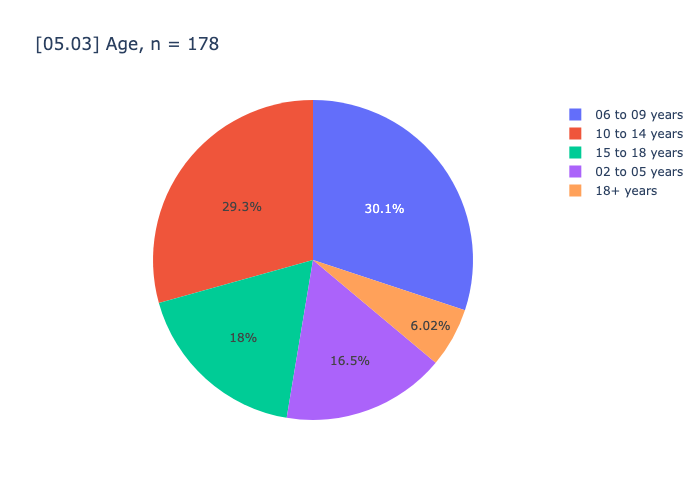
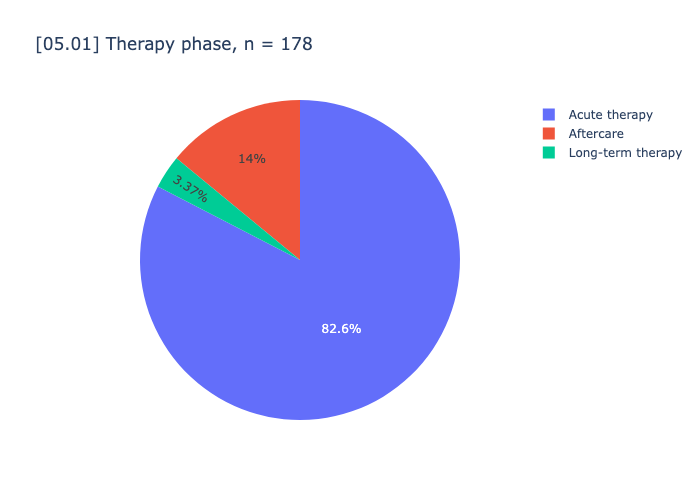
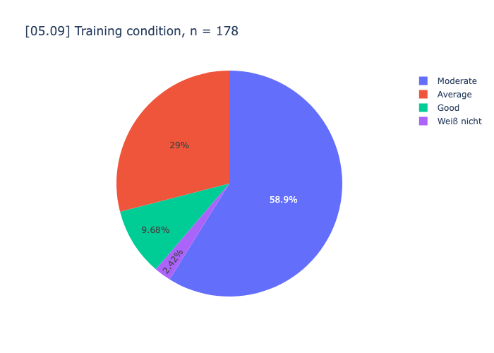
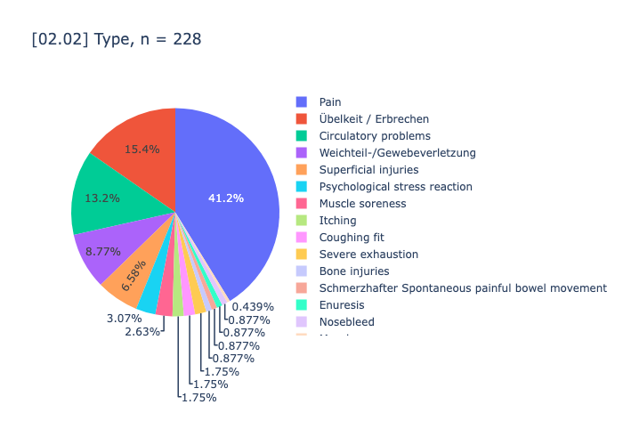
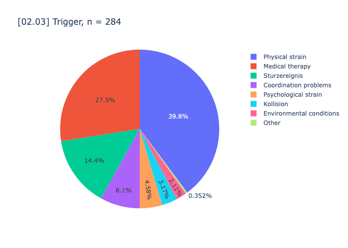
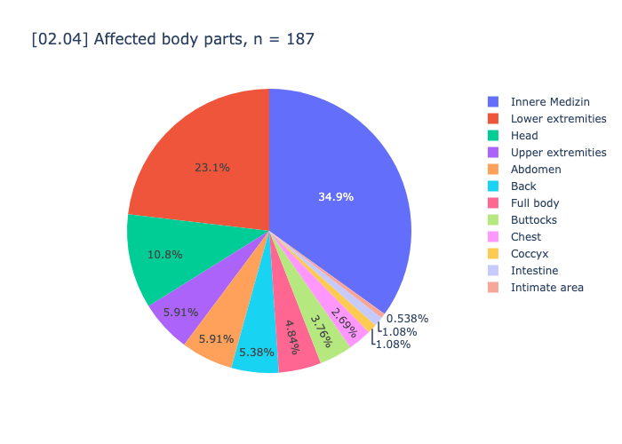
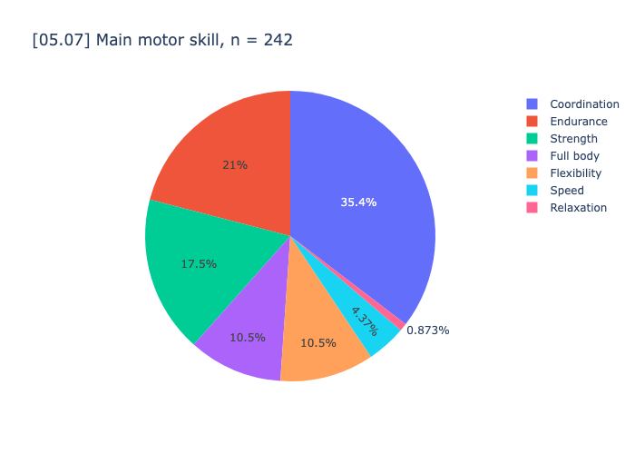
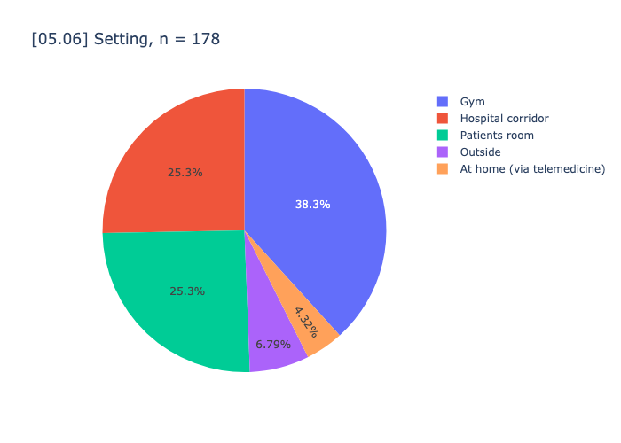
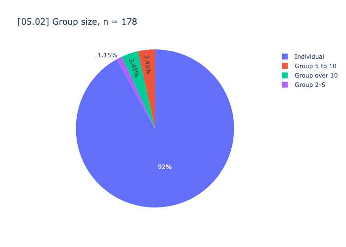

# [descriptive analysis](#toc0_)

**Table of contents**    
- [descriptive analysis](#toc1_)    
  - [import data](#toc1_1_)    
  - [tables](#toc1_2_)    
  - [pie charts](#toc1_3_)    

<!-- vscode-jupyter-toc-config
	numbering=false
	anchor=true
	flat=false
	minLevel=1
	maxLevel=6
	/vscode-jupyter-toc-config -->
<!-- THIS CELL WILL BE REPLACED ON TOC UPDATE. DO NOT WRITE YOUR TEXT IN THIS CELL -->

    🐍 3.12.9 | 📦 pygwalker: 0.4.9.15 | 📦 pandas: 2.3.2 | 📦 numpy: 1.26.4 | 📦 duckdb: 1.3.2 | 📦 pandas-plots: 0.16.0 | 📦 connection-helper: 0.13.0

## [import data](#toc0_)

## [tables](#toc0_)

    ['[01.01] CTCAE', '[01.02] Date', '[01.03] Exercise-related', '[02.02] Type', '[02.03] Trigger']

<table id="T_8ac82">
  <thead>
    <tr>
      <th class="index_name level0" >[01.01] CTCAE</th>
      <th id="T_8ac82_level0_col0" class="col_heading level0 col0" >1</th>
      <th id="T_8ac82_level0_col1" class="col_heading level0 col1" >2</th>
      <th id="T_8ac82_level0_col2" class="col_heading level0 col2" >3</th>
      <th id="T_8ac82_level0_col3" class="col_heading level0 col3" >Total</th>
    </tr>
    <tr>
      <th class="index_name level0" >[01.02] Date</th>
      <th class="blank col0" >&nbsp;</th>
      <th class="blank col1" >&nbsp;</th>
      <th class="blank col2" >&nbsp;</th>
      <th class="blank col3" >&nbsp;</th>
    </tr>
  </thead>
  <tbody>
    <tr>
      <th id="T_8ac82_level0_row0" class="row_heading level0 row0" >Already present</th>
      <td id="T_8ac82_row0_col0" class="data row0 col0" >23 (12.9%) </td>
      <td id="T_8ac82_row0_col1" class="data row0 col1" >8 (4.5%) </td>
      <td id="T_8ac82_row0_col2" class="data row0 col2" >1 (0.6%) </td>
      <td id="T_8ac82_row0_col3" class="data row0 col3" >32 (18.0%) </td>
    </tr>
    <tr>
      <th id="T_8ac82_level0_row1" class="row_heading level0 row1" >First occurrence</th>
      <td id="T_8ac82_row1_col0" class="data row1 col0" >110 (61.8%) </td>
      <td id="T_8ac82_row1_col1" class="data row1 col1" >34 (19.1%) </td>
      <td id="T_8ac82_row1_col2" class="data row1 col2" >2 (1.1%) </td>
      <td id="T_8ac82_row1_col3" class="data row1 col3" >146 (82.0%) </td>
    </tr>
    <tr>
      <th id="T_8ac82_level0_row2" class="row_heading level0 row2" >Total</th>
      <td id="T_8ac82_row2_col0" class="data row2 col0" >133 (74.7%) </td>
      <td id="T_8ac82_row2_col1" class="data row2 col1" >42 (23.6%) </td>
      <td id="T_8ac82_row2_col2" class="data row2 col2" >3 (1.7%) </td>
      <td id="T_8ac82_row2_col3" class="data row2 col3" >178 (100.0%) </td>
    </tr>
  </tbody>
</table>

<table id="T_ab871">
  <thead>
    <tr>
      <th class="index_name level0" >[01.01] CTCAE</th>
      <th id="T_ab871_level0_col0" class="col_heading level0 col0" >1</th>
      <th id="T_ab871_level0_col1" class="col_heading level0 col1" >2</th>
      <th id="T_ab871_level0_col2" class="col_heading level0 col2" >3</th>
      <th id="T_ab871_level0_col3" class="col_heading level0 col3" >Total</th>
    </tr>
    <tr>
      <th class="index_name level0" >[01.03] Exercise-related</th>
      <th class="blank col0" >&nbsp;</th>
      <th class="blank col1" >&nbsp;</th>
      <th class="blank col2" >&nbsp;</th>
      <th class="blank col3" >&nbsp;</th>
    </tr>
  </thead>
  <tbody>
    <tr>
      <th id="T_ab871_level0_row0" class="row_heading level0 row0" >No</th>
      <td id="T_ab871_row0_col0" class="data row0 col0" >19 (10.7%) </td>
      <td id="T_ab871_row0_col1" class="data row0 col1" >7 (4.0%) </td>
      <td id="T_ab871_row0_col2" class="data row0 col2" >1 (0.6%) </td>
      <td id="T_ab871_row0_col3" class="data row0 col3" >27 (15.3%) </td>
    </tr>
    <tr>
      <th id="T_ab871_level0_row1" class="row_heading level0 row1" >Yes</th>
      <td id="T_ab871_row1_col0" class="data row1 col0" >113 (63.8%) </td>
      <td id="T_ab871_row1_col1" class="data row1 col1" >35 (19.8%) </td>
      <td id="T_ab871_row1_col2" class="data row1 col2" >2 (1.1%) </td>
      <td id="T_ab871_row1_col3" class="data row1 col3" >150 (84.7%) </td>
    </tr>
    <tr>
      <th id="T_ab871_level0_row2" class="row_heading level0 row2" >Total</th>
      <td id="T_ab871_row2_col0" class="data row2 col0" >132 (74.6%) </td>
      <td id="T_ab871_row2_col1" class="data row2 col1" >42 (23.7%) </td>
      <td id="T_ab871_row2_col2" class="data row2 col2" >3 (1.7%) </td>
      <td id="T_ab871_row2_col3" class="data row2 col3" >177 (100.0%) </td>
    </tr>
  </tbody>
</table>

<table id="T_91eda">
  <thead>
    <tr>
      <th class="index_name level0" >[01.01] CTCAE</th>
      <th id="T_91eda_level0_col0" class="col_heading level0 col0" >1</th>
      <th id="T_91eda_level0_col1" class="col_heading level0 col1" >2</th>
      <th id="T_91eda_level0_col2" class="col_heading level0 col2" >3</th>
      <th id="T_91eda_level0_col3" class="col_heading level0 col3" >Total</th>
    </tr>
    <tr>
      <th class="index_name level0" >[02.02] Type</th>
      <th class="blank col0" >&nbsp;</th>
      <th class="blank col1" >&nbsp;</th>
      <th class="blank col2" >&nbsp;</th>
      <th class="blank col3" >&nbsp;</th>
    </tr>
  </thead>
  <tbody>
    <tr>
      <th id="T_91eda_level0_row0" class="row_heading level0 row0" >Bone injuries</th>
      <td id="T_91eda_row0_col0" class="data row0 col0" >0 </td>
      <td id="T_91eda_row0_col1" class="data row0 col1" >0 </td>
      <td id="T_91eda_row0_col2" class="data row0 col2" >2 (0.9%) </td>
      <td id="T_91eda_row0_col3" class="data row0 col3" >2 (0.9%) </td>
    </tr>
    <tr>
      <th id="T_91eda_level0_row1" class="row_heading level0 row1" >Circulatory problems</th>
      <td id="T_91eda_row1_col0" class="data row1 col0" >28 (12.3%) </td>
      <td id="T_91eda_row1_col1" class="data row1 col1" >2 (0.9%) </td>
      <td id="T_91eda_row1_col2" class="data row1 col2" >0 </td>
      <td id="T_91eda_row1_col3" class="data row1 col3" >30 (13.2%) </td>
    </tr>
    <tr>
      <th id="T_91eda_level0_row2" class="row_heading level0 row2" >Coughing fit</th>
      <td id="T_91eda_row2_col0" class="data row2 col0" >4 (1.8%) </td>
      <td id="T_91eda_row2_col1" class="data row2 col1" >0 </td>
      <td id="T_91eda_row2_col2" class="data row2 col2" >0 </td>
      <td id="T_91eda_row2_col3" class="data row2 col3" >4 (1.8%) </td>
    </tr>
    <tr>
      <th id="T_91eda_level0_row3" class="row_heading level0 row3" >Enuresis</th>
      <td id="T_91eda_row3_col0" class="data row3 col0" >2 (0.9%) </td>
      <td id="T_91eda_row3_col1" class="data row3 col1" >0 </td>
      <td id="T_91eda_row3_col2" class="data row3 col2" >0 </td>
      <td id="T_91eda_row3_col3" class="data row3 col3" >2 (0.9%) </td>
    </tr>
    <tr>
      <th id="T_91eda_level0_row4" class="row_heading level0 row4" >Itching</th>
      <td id="T_91eda_row4_col0" class="data row4 col0" >3 (1.3%) </td>
      <td id="T_91eda_row4_col1" class="data row4 col1" >1 (0.4%) </td>
      <td id="T_91eda_row4_col2" class="data row4 col2" >0 </td>
      <td id="T_91eda_row4_col3" class="data row4 col3" >4 (1.8%) </td>
    </tr>
    <tr>
      <th id="T_91eda_level0_row5" class="row_heading level0 row5" >Muscle cramps</th>
      <td id="T_91eda_row5_col0" class="data row5 col0" >1 (0.4%) </td>
      <td id="T_91eda_row5_col1" class="data row5 col1" >0 </td>
      <td id="T_91eda_row5_col2" class="data row5 col2" >0 </td>
      <td id="T_91eda_row5_col3" class="data row5 col3" >1 (0.4%) </td>
    </tr>
    <tr>
      <th id="T_91eda_level0_row6" class="row_heading level0 row6" >Muscle soreness</th>
      <td id="T_91eda_row6_col0" class="data row6 col0" >4 (1.8%) </td>
      <td id="T_91eda_row6_col1" class="data row6 col1" >2 (0.9%) </td>
      <td id="T_91eda_row6_col2" class="data row6 col2" >0 </td>
      <td id="T_91eda_row6_col3" class="data row6 col3" >6 (2.6%) </td>
    </tr>
    <tr>
      <th id="T_91eda_level0_row7" class="row_heading level0 row7" >Nosebleed</th>
      <td id="T_91eda_row7_col0" class="data row7 col0" >1 (0.4%) </td>
      <td id="T_91eda_row7_col1" class="data row7 col1" >1 (0.4%) </td>
      <td id="T_91eda_row7_col2" class="data row7 col2" >0 </td>
      <td id="T_91eda_row7_col3" class="data row7 col3" >2 (0.9%) </td>
    </tr>
    <tr>
      <th id="T_91eda_level0_row8" class="row_heading level0 row8" >Pain</th>
      <td id="T_91eda_row8_col0" class="data row8 col0" >62 (27.2%) </td>
      <td id="T_91eda_row8_col1" class="data row8 col1" >30 (13.2%) </td>
      <td id="T_91eda_row8_col2" class="data row8 col2" >2 (0.9%) </td>
      <td id="T_91eda_row8_col3" class="data row8 col3" >94 (41.2%) </td>
    </tr>
    <tr>
      <th id="T_91eda_level0_row9" class="row_heading level0 row9" >Psychological stress reaction</th>
      <td id="T_91eda_row9_col0" class="data row9 col0" >6 (2.6%) </td>
      <td id="T_91eda_row9_col1" class="data row9 col1" >1 (0.4%) </td>
      <td id="T_91eda_row9_col2" class="data row9 col2" >0 </td>
      <td id="T_91eda_row9_col3" class="data row9 col3" >7 (3.1%) </td>
    </tr>
    <tr>
      <th id="T_91eda_level0_row10" class="row_heading level0 row10" >Schmerzhafter Spontaneous painful bowel movement</th>
      <td id="T_91eda_row10_col0" class="data row10 col0" >2 (0.9%) </td>
      <td id="T_91eda_row10_col1" class="data row10 col1" >0 </td>
      <td id="T_91eda_row10_col2" class="data row10 col2" >0 </td>
      <td id="T_91eda_row10_col3" class="data row10 col3" >2 (0.9%) </td>
    </tr>
    <tr>
      <th id="T_91eda_level0_row11" class="row_heading level0 row11" >Severe exhaustion</th>
      <td id="T_91eda_row11_col0" class="data row11 col0" >4 (1.8%) </td>
      <td id="T_91eda_row11_col1" class="data row11 col1" >0 </td>
      <td id="T_91eda_row11_col2" class="data row11 col2" >0 </td>
      <td id="T_91eda_row11_col3" class="data row11 col3" >4 (1.8%) </td>
    </tr>
    <tr>
      <th id="T_91eda_level0_row12" class="row_heading level0 row12" >Superficial injuries</th>
      <td id="T_91eda_row12_col0" class="data row12 col0" >7 (3.1%) </td>
      <td id="T_91eda_row12_col1" class="data row12 col1" >8 (3.5%) </td>
      <td id="T_91eda_row12_col2" class="data row12 col2" >0 </td>
      <td id="T_91eda_row12_col3" class="data row12 col3" >15 (6.6%) </td>
    </tr>
    <tr>
      <th id="T_91eda_level0_row13" class="row_heading level0 row13" >Weichteil-/Gewebeverletzung</th>
      <td id="T_91eda_row13_col0" class="data row13 col0" >7 (3.1%) </td>
      <td id="T_91eda_row13_col1" class="data row13 col1" >13 (5.7%) </td>
      <td id="T_91eda_row13_col2" class="data row13 col2" >0 </td>
      <td id="T_91eda_row13_col3" class="data row13 col3" >20 (8.8%) </td>
    </tr>
    <tr>
      <th id="T_91eda_level0_row14" class="row_heading level0 row14" >Übelkeit / Erbrechen</th>
      <td id="T_91eda_row14_col0" class="data row14 col0" >31 (13.6%) </td>
      <td id="T_91eda_row14_col1" class="data row14 col1" >4 (1.8%) </td>
      <td id="T_91eda_row14_col2" class="data row14 col2" >0 </td>
      <td id="T_91eda_row14_col3" class="data row14 col3" >35 (15.4%) </td>
    </tr>
    <tr>
      <th id="T_91eda_level0_row15" class="row_heading level0 row15" >Total</th>
      <td id="T_91eda_row15_col0" class="data row15 col0" >162 (71.1%) </td>
      <td id="T_91eda_row15_col1" class="data row15 col1" >62 (27.2%) </td>
      <td id="T_91eda_row15_col2" class="data row15 col2" >4 (1.8%) </td>
      <td id="T_91eda_row15_col3" class="data row15 col3" >228 (100.0%) </td>
    </tr>
  </tbody>
</table>

<table id="T_440f4">
  <thead>
    <tr>
      <th class="index_name level0" >[01.01] CTCAE</th>
      <th id="T_440f4_level0_col0" class="col_heading level0 col0" >1</th>
      <th id="T_440f4_level0_col1" class="col_heading level0 col1" >2</th>
      <th id="T_440f4_level0_col2" class="col_heading level0 col2" >3</th>
      <th id="T_440f4_level0_col3" class="col_heading level0 col3" >Total</th>
    </tr>
    <tr>
      <th class="index_name level0" >[02.03] Trigger</th>
      <th class="blank col0" >&nbsp;</th>
      <th class="blank col1" >&nbsp;</th>
      <th class="blank col2" >&nbsp;</th>
      <th class="blank col3" >&nbsp;</th>
    </tr>
  </thead>
  <tbody>
    <tr>
      <th id="T_440f4_level0_row0" class="row_heading level0 row0" >Coordination problems</th>
      <td id="T_440f4_row0_col0" class="data row0 col0" >14 (4.9%) </td>
      <td id="T_440f4_row0_col1" class="data row0 col1" >8 (2.8%) </td>
      <td id="T_440f4_row0_col2" class="data row0 col2" >1 (0.4%) </td>
      <td id="T_440f4_row0_col3" class="data row0 col3" >23 (8.1%) </td>
    </tr>
    <tr>
      <th id="T_440f4_level0_row1" class="row_heading level0 row1" >Environmental conditions</th>
      <td id="T_440f4_row1_col0" class="data row1 col0" >5 (1.8%) </td>
      <td id="T_440f4_row1_col1" class="data row1 col1" >1 (0.4%) </td>
      <td id="T_440f4_row1_col2" class="data row1 col2" >0 </td>
      <td id="T_440f4_row1_col3" class="data row1 col3" >6 (2.1%) </td>
    </tr>
    <tr>
      <th id="T_440f4_level0_row2" class="row_heading level0 row2" >Kollision</th>
      <td id="T_440f4_row2_col0" class="data row2 col0" >7 (2.5%) </td>
      <td id="T_440f4_row2_col1" class="data row2 col1" >2 (0.7%) </td>
      <td id="T_440f4_row2_col2" class="data row2 col2" >0 </td>
      <td id="T_440f4_row2_col3" class="data row2 col3" >9 (3.2%) </td>
    </tr>
    <tr>
      <th id="T_440f4_level0_row3" class="row_heading level0 row3" >Medical therapy</th>
      <td id="T_440f4_row3_col0" class="data row3 col0" >67 (23.6%) </td>
      <td id="T_440f4_row3_col1" class="data row3 col1" >11 (3.9%) </td>
      <td id="T_440f4_row3_col2" class="data row3 col2" >0 </td>
      <td id="T_440f4_row3_col3" class="data row3 col3" >78 (27.5%) </td>
    </tr>
    <tr>
      <th id="T_440f4_level0_row4" class="row_heading level0 row4" >Other</th>
      <td id="T_440f4_row4_col0" class="data row4 col0" >1 (0.4%) </td>
      <td id="T_440f4_row4_col1" class="data row4 col1" >0 </td>
      <td id="T_440f4_row4_col2" class="data row4 col2" >0 </td>
      <td id="T_440f4_row4_col3" class="data row4 col3" >1 (0.4%) </td>
    </tr>
    <tr>
      <th id="T_440f4_level0_row5" class="row_heading level0 row5" >Physical strain</th>
      <td id="T_440f4_row5_col0" class="data row5 col0" >94 (33.1%) </td>
      <td id="T_440f4_row5_col1" class="data row5 col1" >17 (6.0%) </td>
      <td id="T_440f4_row5_col2" class="data row5 col2" >2 (0.7%) </td>
      <td id="T_440f4_row5_col3" class="data row5 col3" >113 (39.8%) </td>
    </tr>
    <tr>
      <th id="T_440f4_level0_row6" class="row_heading level0 row6" >Psychological strain</th>
      <td id="T_440f4_row6_col0" class="data row6 col0" >11 (3.9%) </td>
      <td id="T_440f4_row6_col1" class="data row6 col1" >2 (0.7%) </td>
      <td id="T_440f4_row6_col2" class="data row6 col2" >0 </td>
      <td id="T_440f4_row6_col3" class="data row6 col3" >13 (4.6%) </td>
    </tr>
    <tr>
      <th id="T_440f4_level0_row7" class="row_heading level0 row7" >Sturzereignis</th>
      <td id="T_440f4_row7_col0" class="data row7 col0" >21 (7.4%) </td>
      <td id="T_440f4_row7_col1" class="data row7 col1" >19 (6.7%) </td>
      <td id="T_440f4_row7_col2" class="data row7 col2" >1 (0.4%) </td>
      <td id="T_440f4_row7_col3" class="data row7 col3" >41 (14.4%) </td>
    </tr>
    <tr>
      <th id="T_440f4_level0_row8" class="row_heading level0 row8" >Total</th>
      <td id="T_440f4_row8_col0" class="data row8 col0" >220 (77.5%) </td>
      <td id="T_440f4_row8_col1" class="data row8 col1" >60 (21.1%) </td>
      <td id="T_440f4_row8_col2" class="data row8 col2" >4 (1.4%) </td>
      <td id="T_440f4_row8_col3" class="data row8 col3" >284 (100.0%) </td>
    </tr>
  </tbody>
</table>

<table id="T_386ce">
  <thead>
    <tr>
      <th class="index_name level0" >[01.01] CTCAE</th>
      <th id="T_386ce_level0_col0" class="col_heading level0 col0" >1</th>
      <th id="T_386ce_level0_col1" class="col_heading level0 col1" >2</th>
      <th id="T_386ce_level0_col2" class="col_heading level0 col2" >3</th>
      <th id="T_386ce_level0_col3" class="col_heading level0 col3" >Total</th>
    </tr>
    <tr>
      <th class="index_name level0" >[02.04] Affected body parts</th>
      <th class="blank col0" >&nbsp;</th>
      <th class="blank col1" >&nbsp;</th>
      <th class="blank col2" >&nbsp;</th>
      <th class="blank col3" >&nbsp;</th>
    </tr>
  </thead>
  <tbody>
    <tr>
      <th id="T_386ce_level0_row0" class="row_heading level0 row0" >Abdomen</th>
      <td id="T_386ce_row0_col0" class="data row0 col0" >7 (3.8%) </td>
      <td id="T_386ce_row0_col1" class="data row0 col1" >4 (2.2%) </td>
      <td id="T_386ce_row0_col2" class="data row0 col2" >0 </td>
      <td id="T_386ce_row0_col3" class="data row0 col3" >11 (5.9%) </td>
    </tr>
    <tr>
      <th id="T_386ce_level0_row1" class="row_heading level0 row1" >Back</th>
      <td id="T_386ce_row1_col0" class="data row1 col0" >7 (3.8%) </td>
      <td id="T_386ce_row1_col1" class="data row1 col1" >3 (1.6%) </td>
      <td id="T_386ce_row1_col2" class="data row1 col2" >0 </td>
      <td id="T_386ce_row1_col3" class="data row1 col3" >10 (5.4%) </td>
    </tr>
    <tr>
      <th id="T_386ce_level0_row2" class="row_heading level0 row2" >Buttocks</th>
      <td id="T_386ce_row2_col0" class="data row2 col0" >5 (2.7%) </td>
      <td id="T_386ce_row2_col1" class="data row2 col1" >2 (1.1%) </td>
      <td id="T_386ce_row2_col2" class="data row2 col2" >0 </td>
      <td id="T_386ce_row2_col3" class="data row2 col3" >7 (3.8%) </td>
    </tr>
    <tr>
      <th id="T_386ce_level0_row3" class="row_heading level0 row3" >Chest</th>
      <td id="T_386ce_row3_col0" class="data row3 col0" >4 (2.2%) </td>
      <td id="T_386ce_row3_col1" class="data row3 col1" >1 (0.5%) </td>
      <td id="T_386ce_row3_col2" class="data row3 col2" >0 </td>
      <td id="T_386ce_row3_col3" class="data row3 col3" >5 (2.7%) </td>
    </tr>
    <tr>
      <th id="T_386ce_level0_row4" class="row_heading level0 row4" >Coccyx</th>
      <td id="T_386ce_row4_col0" class="data row4 col0" >2 (1.1%) </td>
      <td id="T_386ce_row4_col1" class="data row4 col1" >0 </td>
      <td id="T_386ce_row4_col2" class="data row4 col2" >0 </td>
      <td id="T_386ce_row4_col3" class="data row4 col3" >2 (1.1%) </td>
    </tr>
    <tr>
      <th id="T_386ce_level0_row5" class="row_heading level0 row5" >Full body</th>
      <td id="T_386ce_row5_col0" class="data row5 col0" >6 (3.2%) </td>
      <td id="T_386ce_row5_col1" class="data row5 col1" >2 (1.1%) </td>
      <td id="T_386ce_row5_col2" class="data row5 col2" >1 (0.5%) </td>
      <td id="T_386ce_row5_col3" class="data row5 col3" >9 (4.8%) </td>
    </tr>
    <tr>
      <th id="T_386ce_level0_row6" class="row_heading level0 row6" >Head</th>
      <td id="T_386ce_row6_col0" class="data row6 col0" >10 (5.4%) </td>
      <td id="T_386ce_row6_col1" class="data row6 col1" >10 (5.4%) </td>
      <td id="T_386ce_row6_col2" class="data row6 col2" >0 </td>
      <td id="T_386ce_row6_col3" class="data row6 col3" >20 (10.8%) </td>
    </tr>
    <tr>
      <th id="T_386ce_level0_row7" class="row_heading level0 row7" >Innere Medizin</th>
      <td id="T_386ce_row7_col0" class="data row7 col0" >59 (31.7%) </td>
      <td id="T_386ce_row7_col1" class="data row7 col1" >6 (3.2%) </td>
      <td id="T_386ce_row7_col2" class="data row7 col2" >0 </td>
      <td id="T_386ce_row7_col3" class="data row7 col3" >65 (34.9%) </td>
    </tr>
    <tr>
      <th id="T_386ce_level0_row8" class="row_heading level0 row8" >Intestine</th>
      <td id="T_386ce_row8_col0" class="data row8 col0" >2 (1.1%) </td>
      <td id="T_386ce_row8_col1" class="data row8 col1" >0 </td>
      <td id="T_386ce_row8_col2" class="data row8 col2" >0 </td>
      <td id="T_386ce_row8_col3" class="data row8 col3" >2 (1.1%) </td>
    </tr>
    <tr>
      <th id="T_386ce_level0_row9" class="row_heading level0 row9" >Intimate area</th>
      <td id="T_386ce_row9_col0" class="data row9 col0" >0 </td>
      <td id="T_386ce_row9_col1" class="data row9 col1" >1 (0.5%) </td>
      <td id="T_386ce_row9_col2" class="data row9 col2" >0 </td>
      <td id="T_386ce_row9_col3" class="data row9 col3" >1 (0.5%) </td>
    </tr>
    <tr>
      <th id="T_386ce_level0_row10" class="row_heading level0 row10" >Lower extremities</th>
      <td id="T_386ce_row10_col0" class="data row10 col0" >30 (16.1%) </td>
      <td id="T_386ce_row10_col1" class="data row10 col1" >11 (5.9%) </td>
      <td id="T_386ce_row10_col2" class="data row10 col2" >2 (1.1%) </td>
      <td id="T_386ce_row10_col3" class="data row10 col3" >43 (23.1%) </td>
    </tr>
    <tr>
      <th id="T_386ce_level0_row11" class="row_heading level0 row11" >Upper extremities</th>
      <td id="T_386ce_row11_col0" class="data row11 col0" >5 (2.7%) </td>
      <td id="T_386ce_row11_col1" class="data row11 col1" >6 (3.2%) </td>
      <td id="T_386ce_row11_col2" class="data row11 col2" >0 </td>
      <td id="T_386ce_row11_col3" class="data row11 col3" >11 (5.9%) </td>
    </tr>
    <tr>
      <th id="T_386ce_level0_row12" class="row_heading level0 row12" >Total</th>
      <td id="T_386ce_row12_col0" class="data row12 col0" >137 (73.7%) </td>
      <td id="T_386ce_row12_col1" class="data row12 col1" >46 (24.7%) </td>
      <td id="T_386ce_row12_col2" class="data row12 col2" >3 (1.6%) </td>
      <td id="T_386ce_row12_col3" class="data row12 col3" >186 (100.0%) </td>
    </tr>
  </tbody>
</table>

<table id="T_c6607">
  <thead>
    <tr>
      <th class="index_name level0" >[01.01] CTCAE</th>
      <th id="T_c6607_level0_col0" class="col_heading level0 col0" >1</th>
      <th id="T_c6607_level0_col1" class="col_heading level0 col1" >2</th>
      <th id="T_c6607_level0_col2" class="col_heading level0 col2" >3</th>
      <th id="T_c6607_level0_col3" class="col_heading level0 col3" >Total</th>
    </tr>
    <tr>
      <th class="index_name level0" >[03.02] With hospitalization</th>
      <th class="blank col0" >&nbsp;</th>
      <th class="blank col1" >&nbsp;</th>
      <th class="blank col2" >&nbsp;</th>
      <th class="blank col3" >&nbsp;</th>
    </tr>
  </thead>
  <tbody>
    <tr>
      <th id="T_c6607_level0_row0" class="row_heading level0 row0" >No</th>
      <td id="T_c6607_row0_col0" class="data row0 col0" >132 (74.2%) </td>
      <td id="T_c6607_row0_col1" class="data row0 col1" >42 (23.6%) </td>
      <td id="T_c6607_row0_col2" class="data row0 col2" >1 (0.6%) </td>
      <td id="T_c6607_row0_col3" class="data row0 col3" >175 (98.3%) </td>
    </tr>
    <tr>
      <th id="T_c6607_level0_row1" class="row_heading level0 row1" >Weiß nicht</th>
      <td id="T_c6607_row1_col0" class="data row1 col0" >0 </td>
      <td id="T_c6607_row1_col1" class="data row1 col1" >0 </td>
      <td id="T_c6607_row1_col2" class="data row1 col2" >1 (0.6%) </td>
      <td id="T_c6607_row1_col3" class="data row1 col3" >1 (0.6%) </td>
    </tr>
    <tr>
      <th id="T_c6607_level0_row2" class="row_heading level0 row2" >Yes</th>
      <td id="T_c6607_row2_col0" class="data row2 col0" >1 (0.6%) </td>
      <td id="T_c6607_row2_col1" class="data row2 col1" >0 </td>
      <td id="T_c6607_row2_col2" class="data row2 col2" >1 (0.6%) </td>
      <td id="T_c6607_row2_col3" class="data row2 col3" >2 (1.1%) </td>
    </tr>
    <tr>
      <th id="T_c6607_level0_row3" class="row_heading level0 row3" >Total</th>
      <td id="T_c6607_row3_col0" class="data row3 col0" >133 (74.7%) </td>
      <td id="T_c6607_row3_col1" class="data row3 col1" >42 (23.6%) </td>
      <td id="T_c6607_row3_col2" class="data row3 col2" >3 (1.7%) </td>
      <td id="T_c6607_row3_col3" class="data row3 col3" >178 (100.0%) </td>
    </tr>
  </tbody>
</table>

<table id="T_0c9cd">
  <thead>
    <tr>
      <th class="index_name level0" >[01.01] CTCAE</th>
      <th id="T_0c9cd_level0_col0" class="col_heading level0 col0" >1</th>
      <th id="T_0c9cd_level0_col1" class="col_heading level0 col1" >2</th>
      <th id="T_0c9cd_level0_col2" class="col_heading level0 col2" >3</th>
      <th id="T_0c9cd_level0_col3" class="col_heading level0 col3" >Total</th>
    </tr>
    <tr>
      <th class="index_name level0" >[03.03] Medical follow-up treatment</th>
      <th class="blank col0" >&nbsp;</th>
      <th class="blank col1" >&nbsp;</th>
      <th class="blank col2" >&nbsp;</th>
      <th class="blank col3" >&nbsp;</th>
    </tr>
  </thead>
  <tbody>
    <tr>
      <th id="T_0c9cd_level0_row0" class="row_heading level0 row0" >No</th>
      <td id="T_0c9cd_row0_col0" class="data row0 col0" >121 (68.0%) </td>
      <td id="T_0c9cd_row0_col1" class="data row0 col1" >8 (4.5%) </td>
      <td id="T_0c9cd_row0_col2" class="data row0 col2" >0 </td>
      <td id="T_0c9cd_row0_col3" class="data row0 col3" >129 (72.5%) </td>
    </tr>
    <tr>
      <th id="T_0c9cd_level0_row1" class="row_heading level0 row1" >Weiß nicht</th>
      <td id="T_0c9cd_row1_col0" class="data row1 col0" >3 (1.7%) </td>
      <td id="T_0c9cd_row1_col1" class="data row1 col1" >0 </td>
      <td id="T_0c9cd_row1_col2" class="data row1 col2" >0 </td>
      <td id="T_0c9cd_row1_col3" class="data row1 col3" >3 (1.7%) </td>
    </tr>
    <tr>
      <th id="T_0c9cd_level0_row2" class="row_heading level0 row2" >Yes</th>
      <td id="T_0c9cd_row2_col0" class="data row2 col0" >9 (5.1%) </td>
      <td id="T_0c9cd_row2_col1" class="data row2 col1" >34 (19.1%) </td>
      <td id="T_0c9cd_row2_col2" class="data row2 col2" >3 (1.7%) </td>
      <td id="T_0c9cd_row2_col3" class="data row2 col3" >46 (25.8%) </td>
    </tr>
    <tr>
      <th id="T_0c9cd_level0_row3" class="row_heading level0 row3" >Total</th>
      <td id="T_0c9cd_row3_col0" class="data row3 col0" >133 (74.7%) </td>
      <td id="T_0c9cd_row3_col1" class="data row3 col1" >42 (23.6%) </td>
      <td id="T_0c9cd_row3_col2" class="data row3 col2" >3 (1.7%) </td>
      <td id="T_0c9cd_row3_col3" class="data row3 col3" >178 (100.0%) </td>
    </tr>
  </tbody>
</table>

<table id="T_867ff">
  <thead>
    <tr>
      <th class="index_name level0" >[01.01] CTCAE</th>
      <th id="T_867ff_level0_col0" class="col_heading level0 col0" >1</th>
      <th id="T_867ff_level0_col1" class="col_heading level0 col1" >2</th>
      <th id="T_867ff_level0_col2" class="col_heading level0 col2" >3</th>
      <th id="T_867ff_level0_col3" class="col_heading level0 col3" >Total</th>
    </tr>
    <tr>
      <th class="index_name level0" >[03.04] With delayed therapy protocol</th>
      <th class="blank col0" >&nbsp;</th>
      <th class="blank col1" >&nbsp;</th>
      <th class="blank col2" >&nbsp;</th>
      <th class="blank col3" >&nbsp;</th>
    </tr>
  </thead>
  <tbody>
    <tr>
      <th id="T_867ff_level0_row0" class="row_heading level0 row0" >No</th>
      <td id="T_867ff_row0_col0" class="data row0 col0" >133 (74.7%) </td>
      <td id="T_867ff_row0_col1" class="data row0 col1" >42 (23.6%) </td>
      <td id="T_867ff_row0_col2" class="data row0 col2" >3 (1.7%) </td>
      <td id="T_867ff_row0_col3" class="data row0 col3" >178 (100.0%) </td>
    </tr>
    <tr>
      <th id="T_867ff_level0_row1" class="row_heading level0 row1" >Total</th>
      <td id="T_867ff_row1_col0" class="data row1 col0" >133 (74.7%) </td>
      <td id="T_867ff_row1_col1" class="data row1 col1" >42 (23.6%) </td>
      <td id="T_867ff_row1_col2" class="data row1 col2" >3 (1.7%) </td>
      <td id="T_867ff_row1_col3" class="data row1 col3" >178 (100.0%) </td>
    </tr>
  </tbody>
</table>

<table id="T_bdde1">
  <thead>
    <tr>
      <th class="index_name level0" >[01.01] CTCAE</th>
      <th id="T_bdde1_level0_col0" class="col_heading level0 col0" >1</th>
      <th id="T_bdde1_level0_col1" class="col_heading level0 col1" >2</th>
      <th id="T_bdde1_level0_col2" class="col_heading level0 col2" >3</th>
      <th id="T_bdde1_level0_col3" class="col_heading level0 col3" >Total</th>
    </tr>
    <tr>
      <th class="index_name level0" >[03.06] Increased care needs</th>
      <th class="blank col0" >&nbsp;</th>
      <th class="blank col1" >&nbsp;</th>
      <th class="blank col2" >&nbsp;</th>
      <th class="blank col3" >&nbsp;</th>
    </tr>
  </thead>
  <tbody>
    <tr>
      <th id="T_bdde1_level0_row0" class="row_heading level0 row0" >No</th>
      <td id="T_bdde1_row0_col0" class="data row0 col0" >132 (74.2%) </td>
      <td id="T_bdde1_row0_col1" class="data row0 col1" >42 (23.6%) </td>
      <td id="T_bdde1_row0_col2" class="data row0 col2" >0 </td>
      <td id="T_bdde1_row0_col3" class="data row0 col3" >174 (97.8%) </td>
    </tr>
    <tr>
      <th id="T_bdde1_level0_row1" class="row_heading level0 row1" >Yes</th>
      <td id="T_bdde1_row1_col0" class="data row1 col0" >1 (0.6%) </td>
      <td id="T_bdde1_row1_col1" class="data row1 col1" >0 </td>
      <td id="T_bdde1_row1_col2" class="data row1 col2" >3 (1.7%) </td>
      <td id="T_bdde1_row1_col3" class="data row1 col3" >4 (2.2%) </td>
    </tr>
    <tr>
      <th id="T_bdde1_level0_row2" class="row_heading level0 row2" >Total</th>
      <td id="T_bdde1_row2_col0" class="data row2 col0" >133 (74.7%) </td>
      <td id="T_bdde1_row2_col1" class="data row2 col1" >42 (23.6%) </td>
      <td id="T_bdde1_row2_col2" class="data row2 col2" >3 (1.7%) </td>
      <td id="T_bdde1_row2_col3" class="data row2 col3" >178 (100.0%) </td>
    </tr>
  </tbody>
</table>

<table id="T_2919f">
  <thead>
    <tr>
      <th class="index_name level0" >[01.01] CTCAE</th>
      <th id="T_2919f_level0_col0" class="col_heading level0 col0" >1</th>
      <th id="T_2919f_level0_col1" class="col_heading level0 col1" >2</th>
      <th id="T_2919f_level0_col2" class="col_heading level0 col2" >3</th>
      <th id="T_2919f_level0_col3" class="col_heading level0 col3" >Total</th>
    </tr>
    <tr>
      <th class="index_name level0" >[03.07] With medication administration</th>
      <th class="blank col0" >&nbsp;</th>
      <th class="blank col1" >&nbsp;</th>
      <th class="blank col2" >&nbsp;</th>
      <th class="blank col3" >&nbsp;</th>
    </tr>
  </thead>
  <tbody>
    <tr>
      <th id="T_2919f_level0_row0" class="row_heading level0 row0" >No</th>
      <td id="T_2919f_row0_col0" class="data row0 col0" >111 (64.2%) </td>
      <td id="T_2919f_row0_col1" class="data row0 col1" >24 (13.9%) </td>
      <td id="T_2919f_row0_col2" class="data row0 col2" >0 </td>
      <td id="T_2919f_row0_col3" class="data row0 col3" >135 (78.0%) </td>
    </tr>
    <tr>
      <th id="T_2919f_level0_row1" class="row_heading level0 row1" >Weiß nicht</th>
      <td id="T_2919f_row1_col0" class="data row1 col0" >21 (12.1%) </td>
      <td id="T_2919f_row1_col1" class="data row1 col1" >12 (6.9%) </td>
      <td id="T_2919f_row1_col2" class="data row1 col2" >0 </td>
      <td id="T_2919f_row1_col3" class="data row1 col3" >33 (19.1%) </td>
    </tr>
    <tr>
      <th id="T_2919f_level0_row2" class="row_heading level0 row2" >Yes</th>
      <td id="T_2919f_row2_col0" class="data row2 col0" >0 </td>
      <td id="T_2919f_row2_col1" class="data row2 col1" >2 (1.2%) </td>
      <td id="T_2919f_row2_col2" class="data row2 col2" >3 (1.7%) </td>
      <td id="T_2919f_row2_col3" class="data row2 col3" >5 (2.9%) </td>
    </tr>
    <tr>
      <th id="T_2919f_level0_row3" class="row_heading level0 row3" >Total</th>
      <td id="T_2919f_row3_col0" class="data row3 col0" >132 (76.3%) </td>
      <td id="T_2919f_row3_col1" class="data row3 col1" >38 (22.0%) </td>
      <td id="T_2919f_row3_col2" class="data row3 col2" >3 (1.7%) </td>
      <td id="T_2919f_row3_col3" class="data row3 col3" >173 (100.0%) </td>
    </tr>
  </tbody>
</table>

<table id="T_e9563">
  <thead>
    <tr>
      <th class="index_name level0" >[01.01] CTCAE</th>
      <th id="T_e9563_level0_col0" class="col_heading level0 col0" >1</th>
      <th id="T_e9563_level0_col1" class="col_heading level0 col1" >2</th>
      <th id="T_e9563_level0_col2" class="col_heading level0 col2" >3</th>
      <th id="T_e9563_level0_col3" class="col_heading level0 col3" >Total</th>
    </tr>
    <tr>
      <th class="index_name level0" >[03.08] Occurrence of fear and uncertainty</th>
      <th class="blank col0" >&nbsp;</th>
      <th class="blank col1" >&nbsp;</th>
      <th class="blank col2" >&nbsp;</th>
      <th class="blank col3" >&nbsp;</th>
    </tr>
  </thead>
  <tbody>
    <tr>
      <th id="T_e9563_level0_row0" class="row_heading level0 row0" >Ja</th>
      <td id="T_e9563_row0_col0" class="data row0 col0" >33 (18.8%) </td>
      <td id="T_e9563_row0_col1" class="data row0 col1" >21 (11.9%) </td>
      <td id="T_e9563_row0_col2" class="data row0 col2" >2 (1.1%) </td>
      <td id="T_e9563_row0_col3" class="data row0 col3" >56 (31.8%) </td>
    </tr>
    <tr>
      <th id="T_e9563_level0_row1" class="row_heading level0 row1" >Nein</th>
      <td id="T_e9563_row1_col0" class="data row1 col0" >99 (56.2%) </td>
      <td id="T_e9563_row1_col1" class="data row1 col1" >21 (11.9%) </td>
      <td id="T_e9563_row1_col2" class="data row1 col2" >0 </td>
      <td id="T_e9563_row1_col3" class="data row1 col3" >120 (68.2%) </td>
    </tr>
    <tr>
      <th id="T_e9563_level0_row2" class="row_heading level0 row2" >Total</th>
      <td id="T_e9563_row2_col0" class="data row2 col0" >132 (75.0%) </td>
      <td id="T_e9563_row2_col1" class="data row2 col1" >42 (23.9%) </td>
      <td id="T_e9563_row2_col2" class="data row2 col2" >2 (1.1%) </td>
      <td id="T_e9563_row2_col3" class="data row2 col3" >176 (100.0%) </td>
    </tr>
  </tbody>
</table>

<table id="T_76e1a">
  <thead>
    <tr>
      <th class="index_name level0" >[01.01] CTCAE</th>
      <th id="T_76e1a_level0_col0" class="col_heading level0 col0" >1</th>
      <th id="T_76e1a_level0_col1" class="col_heading level0 col1" >2</th>
      <th id="T_76e1a_level0_col2" class="col_heading level0 col2" >3</th>
      <th id="T_76e1a_level0_col3" class="col_heading level0 col3" >Total</th>
    </tr>
    <tr>
      <th class="index_name level0" >[03.08.01] Affected person</th>
      <th class="blank col0" >&nbsp;</th>
      <th class="blank col1" >&nbsp;</th>
      <th class="blank col2" >&nbsp;</th>
      <th class="blank col3" >&nbsp;</th>
    </tr>
  </thead>
  <tbody>
    <tr>
      <th id="T_76e1a_level0_row0" class="row_heading level0 row0" >BeIn the treatment team</th>
      <td id="T_76e1a_row0_col0" class="data row0 col0" >9 (10.2%) </td>
      <td id="T_76e1a_row0_col1" class="data row0 col1" >1 (1.1%) </td>
      <td id="T_76e1a_row0_col2" class="data row0 col2" >2 (2.3%) </td>
      <td id="T_76e1a_row0_col3" class="data row0 col3" >12 (13.6%) </td>
    </tr>
    <tr>
      <th id="T_76e1a_level0_row1" class="row_heading level0 row1" >For affected individuals</th>
      <td id="T_76e1a_row1_col0" class="data row1 col0" >33 (37.5%) </td>
      <td id="T_76e1a_row1_col1" class="data row1 col1" >19 (21.6%) </td>
      <td id="T_76e1a_row1_col2" class="data row1 col2" >2 (2.3%) </td>
      <td id="T_76e1a_row1_col3" class="data row1 col3" >54 (61.4%) </td>
    </tr>
    <tr>
      <th id="T_76e1a_level0_row2" class="row_heading level0 row2" >For parents des Betroffenen</th>
      <td id="T_76e1a_row2_col0" class="data row2 col0" >2 (2.3%) </td>
      <td id="T_76e1a_row2_col1" class="data row2 col1" >3 (3.4%) </td>
      <td id="T_76e1a_row2_col2" class="data row2 col2" >1 (1.1%) </td>
      <td id="T_76e1a_row2_col3" class="data row2 col3" >6 (6.8%) </td>
    </tr>
    <tr>
      <th id="T_76e1a_level0_row3" class="row_heading level0 row3" >For the excercise experts</th>
      <td id="T_76e1a_row3_col0" class="data row3 col0" >3 (3.4%) </td>
      <td id="T_76e1a_row3_col1" class="data row3 col1" >4 (4.5%) </td>
      <td id="T_76e1a_row3_col2" class="data row3 col2" >1 (1.1%) </td>
      <td id="T_76e1a_row3_col3" class="data row3 col3" >8 (9.1%) </td>
    </tr>
    <tr>
      <th id="T_76e1a_level0_row4" class="row_heading level0 row4" >Mit der Ablehnung weiterer sporttherapheutischer Angebote</th>
      <td id="T_76e1a_row4_col0" class="data row4 col0" >5 (5.7%) </td>
      <td id="T_76e1a_row4_col1" class="data row4 col1" >3 (3.4%) </td>
      <td id="T_76e1a_row4_col2" class="data row4 col2" >0 </td>
      <td id="T_76e1a_row4_col3" class="data row4 col3" >8 (9.1%) </td>
    </tr>
    <tr>
      <th id="T_76e1a_level0_row5" class="row_heading level0 row5" >Total</th>
      <td id="T_76e1a_row5_col0" class="data row5 col0" >52 (59.1%) </td>
      <td id="T_76e1a_row5_col1" class="data row5 col1" >30 (34.1%) </td>
      <td id="T_76e1a_row5_col2" class="data row5 col2" >6 (6.8%) </td>
      <td id="T_76e1a_row5_col3" class="data row5 col3" >88 (100.0%) </td>
    </tr>
  </tbody>
</table>

<table id="T_90a4f">
  <thead>
    <tr>
      <th class="index_name level0" >[01.01] CTCAE</th>
      <th id="T_90a4f_level0_col0" class="col_heading level0 col0" >1</th>
      <th id="T_90a4f_level0_col1" class="col_heading level0 col1" >2</th>
      <th id="T_90a4f_level0_col2" class="col_heading level0 col2" >3</th>
      <th id="T_90a4f_level0_col3" class="col_heading level0 col3" >Total</th>
    </tr>
    <tr>
      <th class="index_name level0" >[03.09] Structural adjustment</th>
      <th class="blank col0" >&nbsp;</th>
      <th class="blank col1" >&nbsp;</th>
      <th class="blank col2" >&nbsp;</th>
      <th class="blank col3" >&nbsp;</th>
    </tr>
  </thead>
  <tbody>
    <tr>
      <th id="T_90a4f_level0_row0" class="row_heading level0 row0" >Ja</th>
      <td id="T_90a4f_row0_col0" class="data row0 col0" >5 (2.8%) </td>
      <td id="T_90a4f_row0_col1" class="data row0 col1" >4 (2.3%) </td>
      <td id="T_90a4f_row0_col2" class="data row0 col2" >1 (0.6%) </td>
      <td id="T_90a4f_row0_col3" class="data row0 col3" >10 (5.6%) </td>
    </tr>
    <tr>
      <th id="T_90a4f_level0_row1" class="row_heading level0 row1" >Nein</th>
      <td id="T_90a4f_row1_col0" class="data row1 col0" >128 (72.3%) </td>
      <td id="T_90a4f_row1_col1" class="data row1 col1" >37 (20.9%) </td>
      <td id="T_90a4f_row1_col2" class="data row1 col2" >2 (1.1%) </td>
      <td id="T_90a4f_row1_col3" class="data row1 col3" >167 (94.4%) </td>
    </tr>
    <tr>
      <th id="T_90a4f_level0_row2" class="row_heading level0 row2" >Total</th>
      <td id="T_90a4f_row2_col0" class="data row2 col0" >133 (75.1%) </td>
      <td id="T_90a4f_row2_col1" class="data row2 col1" >41 (23.2%) </td>
      <td id="T_90a4f_row2_col2" class="data row2 col2" >3 (1.7%) </td>
      <td id="T_90a4f_row2_col3" class="data row2 col3" >177 (100.0%) </td>
    </tr>
  </tbody>
</table>

<table id="T_c79c2">
  <thead>
    <tr>
      <th class="index_name level0" >[01.01] CTCAE</th>
      <th id="T_c79c2_level0_col0" class="col_heading level0 col0" >1</th>
      <th id="T_c79c2_level0_col1" class="col_heading level0 col1" >2</th>
      <th id="T_c79c2_level0_col2" class="col_heading level0 col2" >3</th>
      <th id="T_c79c2_level0_col3" class="col_heading level0 col3" >Total</th>
    </tr>
    <tr>
      <th class="index_name level0" >[03.10.01] Approver</th>
      <th class="blank col0" >&nbsp;</th>
      <th class="blank col1" >&nbsp;</th>
      <th class="blank col2" >&nbsp;</th>
      <th class="blank col3" >&nbsp;</th>
    </tr>
  </thead>
  <tbody>
    <tr>
      <th id="T_c79c2_level0_row0" class="row_heading level0 row0" >-</th>
      <td id="T_c79c2_row0_col0" class="data row0 col0" >104 (58.4%) </td>
      <td id="T_c79c2_row0_col1" class="data row0 col1" >19 (10.7%) </td>
      <td id="T_c79c2_row0_col2" class="data row0 col2" >0 </td>
      <td id="T_c79c2_row0_col3" class="data row0 col3" >123 (69.1%) </td>
    </tr>
    <tr>
      <th id="T_c79c2_level0_row1" class="row_heading level0 row1" >Eltern</th>
      <td id="T_c79c2_row1_col0" class="data row1 col0" >2 (1.1%) </td>
      <td id="T_c79c2_row1_col1" class="data row1 col1" >0 </td>
      <td id="T_c79c2_row1_col2" class="data row1 col2" >0 </td>
      <td id="T_c79c2_row1_col3" class="data row1 col3" >2 (1.1%) </td>
    </tr>
    <tr>
      <th id="T_c79c2_level0_row2" class="row_heading level0 row2" >Medizin</th>
      <td id="T_c79c2_row2_col0" class="data row2 col0" >10 (5.6%) </td>
      <td id="T_c79c2_row2_col1" class="data row2 col1" >14 (7.9%) </td>
      <td id="T_c79c2_row2_col2" class="data row2 col2" >3 (1.7%) </td>
      <td id="T_c79c2_row2_col3" class="data row2 col3" >27 (15.2%) </td>
    </tr>
    <tr>
      <th id="T_c79c2_level0_row3" class="row_heading level0 row3" >Pflege</th>
      <td id="T_c79c2_row3_col0" class="data row3 col0" >15 (8.4%) </td>
      <td id="T_c79c2_row3_col1" class="data row3 col1" >7 (3.9%) </td>
      <td id="T_c79c2_row3_col2" class="data row3 col2" >0 </td>
      <td id="T_c79c2_row3_col3" class="data row3 col3" >22 (12.4%) </td>
    </tr>
    <tr>
      <th id="T_c79c2_level0_row4" class="row_heading level0 row4" >Physiotherapie</th>
      <td id="T_c79c2_row4_col0" class="data row4 col0" >1 (0.6%) </td>
      <td id="T_c79c2_row4_col1" class="data row4 col1" >2 (1.1%) </td>
      <td id="T_c79c2_row4_col2" class="data row4 col2" >0 </td>
      <td id="T_c79c2_row4_col3" class="data row4 col3" >3 (1.7%) </td>
    </tr>
    <tr>
      <th id="T_c79c2_level0_row5" class="row_heading level0 row5" >Psychosozialer Dienst</th>
      <td id="T_c79c2_row5_col0" class="data row5 col0" >1 (0.6%) </td>
      <td id="T_c79c2_row5_col1" class="data row5 col1" >0 </td>
      <td id="T_c79c2_row5_col2" class="data row5 col2" >0 </td>
      <td id="T_c79c2_row5_col3" class="data row5 col3" >1 (0.6%) </td>
    </tr>
    <tr>
      <th id="T_c79c2_level0_row6" class="row_heading level0 row6" >Total</th>
      <td id="T_c79c2_row6_col0" class="data row6 col0" >133 (74.7%) </td>
      <td id="T_c79c2_row6_col1" class="data row6 col1" >42 (23.6%) </td>
      <td id="T_c79c2_row6_col2" class="data row6 col2" >3 (1.7%) </td>
      <td id="T_c79c2_row6_col3" class="data row6 col3" >178 (100.0%) </td>
    </tr>
  </tbody>
</table>

<table id="T_dc938">
  <thead>
    <tr>
      <th class="index_name level0" >[01.01] CTCAE</th>
      <th id="T_dc938_level0_col0" class="col_heading level0 col0" >1</th>
      <th id="T_dc938_level0_col1" class="col_heading level0 col1" >2</th>
      <th id="T_dc938_level0_col2" class="col_heading level0 col2" >3</th>
      <th id="T_dc938_level0_col3" class="col_heading level0 col3" >Total</th>
    </tr>
    <tr>
      <th class="index_name level0" >[03.11] Application RICE rule (Rest, Ice, Compression, Elevation)</th>
      <th class="blank col0" >&nbsp;</th>
      <th class="blank col1" >&nbsp;</th>
      <th class="blank col2" >&nbsp;</th>
      <th class="blank col3" >&nbsp;</th>
    </tr>
  </thead>
  <tbody>
    <tr>
      <th id="T_dc938_level0_row0" class="row_heading level0 row0" >Ja</th>
      <td id="T_dc938_row0_col0" class="data row0 col0" >2 (1.1%) </td>
      <td id="T_dc938_row0_col1" class="data row0 col1" >14 (7.9%) </td>
      <td id="T_dc938_row0_col2" class="data row0 col2" >2 (1.1%) </td>
      <td id="T_dc938_row0_col3" class="data row0 col3" >18 (10.1%) </td>
    </tr>
    <tr>
      <th id="T_dc938_level0_row1" class="row_heading level0 row1" >Nein</th>
      <td id="T_dc938_row1_col0" class="data row1 col0" >131 (73.6%) </td>
      <td id="T_dc938_row1_col1" class="data row1 col1" >28 (15.7%) </td>
      <td id="T_dc938_row1_col2" class="data row1 col2" >1 (0.6%) </td>
      <td id="T_dc938_row1_col3" class="data row1 col3" >160 (89.9%) </td>
    </tr>
    <tr>
      <th id="T_dc938_level0_row2" class="row_heading level0 row2" >Total</th>
      <td id="T_dc938_row2_col0" class="data row2 col0" >133 (74.7%) </td>
      <td id="T_dc938_row2_col1" class="data row2 col1" >42 (23.6%) </td>
      <td id="T_dc938_row2_col2" class="data row2 col2" >3 (1.7%) </td>
      <td id="T_dc938_row2_col3" class="data row2 col3" >178 (100.0%) </td>
    </tr>
  </tbody>
</table>

<table id="T_1e2d1">
  <thead>
    <tr>
      <th class="index_name level0" >[01.01] CTCAE</th>
      <th id="T_1e2d1_level0_col0" class="col_heading level0 col0" >1</th>
      <th id="T_1e2d1_level0_col1" class="col_heading level0 col1" >2</th>
      <th id="T_1e2d1_level0_col2" class="col_heading level0 col2" >3</th>
      <th id="T_1e2d1_level0_col3" class="col_heading level0 col3" >Total</th>
    </tr>
    <tr>
      <th class="index_name level0" >[03.12] With observation</th>
      <th class="blank col0" >&nbsp;</th>
      <th class="blank col1" >&nbsp;</th>
      <th class="blank col2" >&nbsp;</th>
      <th class="blank col3" >&nbsp;</th>
    </tr>
  </thead>
  <tbody>
    <tr>
      <th id="T_1e2d1_level0_row0" class="row_heading level0 row0" >Ja</th>
      <td id="T_1e2d1_row0_col0" class="data row0 col0" >3 (1.7%) </td>
      <td id="T_1e2d1_row0_col1" class="data row0 col1" >2 (1.1%) </td>
      <td id="T_1e2d1_row0_col2" class="data row0 col2" >1 (0.6%) </td>
      <td id="T_1e2d1_row0_col3" class="data row0 col3" >6 (3.4%) </td>
    </tr>
    <tr>
      <th id="T_1e2d1_level0_row1" class="row_heading level0 row1" >Nein</th>
      <td id="T_1e2d1_row1_col0" class="data row1 col0" >129 (72.5%) </td>
      <td id="T_1e2d1_row1_col1" class="data row1 col1" >40 (22.5%) </td>
      <td id="T_1e2d1_row1_col2" class="data row1 col2" >2 (1.1%) </td>
      <td id="T_1e2d1_row1_col3" class="data row1 col3" >171 (96.1%) </td>
    </tr>
    <tr>
      <th id="T_1e2d1_level0_row2" class="row_heading level0 row2" >U</th>
      <td id="T_1e2d1_row2_col0" class="data row2 col0" >1 (0.6%) </td>
      <td id="T_1e2d1_row2_col1" class="data row2 col1" >0 </td>
      <td id="T_1e2d1_row2_col2" class="data row2 col2" >0 </td>
      <td id="T_1e2d1_row2_col3" class="data row2 col3" >1 (0.6%) </td>
    </tr>
    <tr>
      <th id="T_1e2d1_level0_row3" class="row_heading level0 row3" >Total</th>
      <td id="T_1e2d1_row3_col0" class="data row3 col0" >133 (74.7%) </td>
      <td id="T_1e2d1_row3_col1" class="data row3 col1" >42 (23.6%) </td>
      <td id="T_1e2d1_row3_col2" class="data row3 col2" >3 (1.7%) </td>
      <td id="T_1e2d1_row3_col3" class="data row3 col3" >178 (100.0%) </td>
    </tr>
  </tbody>
</table>

<table id="T_76399">
  <thead>
    <tr>
      <th class="index_name level0" >[01.01] CTCAE</th>
      <th id="T_76399_level0_col0" class="col_heading level0 col0" >1</th>
      <th id="T_76399_level0_col1" class="col_heading level0 col1" >2</th>
      <th id="T_76399_level0_col2" class="col_heading level0 col2" >3</th>
      <th id="T_76399_level0_col3" class="col_heading level0 col3" >Total</th>
    </tr>
    <tr>
      <th class="index_name level0" >[03.13] Stop</th>
      <th class="blank col0" >&nbsp;</th>
      <th class="blank col1" >&nbsp;</th>
      <th class="blank col2" >&nbsp;</th>
      <th class="blank col3" >&nbsp;</th>
    </tr>
  </thead>
  <tbody>
    <tr>
      <th id="T_76399_level0_row0" class="row_heading level0 row0" >No</th>
      <td id="T_76399_row0_col0" class="data row0 col0" >11 (6.2%) </td>
      <td id="T_76399_row0_col1" class="data row0 col1" >5 (2.8%) </td>
      <td id="T_76399_row0_col2" class="data row0 col2" >0 </td>
      <td id="T_76399_row0_col3" class="data row0 col3" >16 (9.0%) </td>
    </tr>
    <tr>
      <th id="T_76399_level0_row1" class="row_heading level0 row1" >Yes</th>
      <td id="T_76399_row1_col0" class="data row1 col0" >122 (68.5%) </td>
      <td id="T_76399_row1_col1" class="data row1 col1" >37 (20.8%) </td>
      <td id="T_76399_row1_col2" class="data row1 col2" >3 (1.7%) </td>
      <td id="T_76399_row1_col3" class="data row1 col3" >162 (91.0%) </td>
    </tr>
    <tr>
      <th id="T_76399_level0_row2" class="row_heading level0 row2" >Total</th>
      <td id="T_76399_row2_col0" class="data row2 col0" >133 (74.7%) </td>
      <td id="T_76399_row2_col1" class="data row2 col1" >42 (23.6%) </td>
      <td id="T_76399_row2_col2" class="data row2 col2" >3 (1.7%) </td>
      <td id="T_76399_row2_col3" class="data row2 col3" >178 (100.0%) </td>
    </tr>
  </tbody>
</table>

<table id="T_00631">
  <thead>
    <tr>
      <th class="index_name level0" >[01.01] CTCAE</th>
      <th id="T_00631_level0_col0" class="col_heading level0 col0" >1</th>
      <th id="T_00631_level0_col1" class="col_heading level0 col1" >2</th>
      <th id="T_00631_level0_col2" class="col_heading level0 col2" >3</th>
      <th id="T_00631_level0_col3" class="col_heading level0 col3" >Total</th>
    </tr>
    <tr>
      <th class="index_name level0" >[03.13.01] Stop or Break</th>
      <th class="blank col0" >&nbsp;</th>
      <th class="blank col1" >&nbsp;</th>
      <th class="blank col2" >&nbsp;</th>
      <th class="blank col3" >&nbsp;</th>
    </tr>
  </thead>
  <tbody>
    <tr>
      <th id="T_00631_level0_row0" class="row_heading level0 row0" >Break</th>
      <td id="T_00631_row0_col0" class="data row0 col0" >54 (33.3%) </td>
      <td id="T_00631_row0_col1" class="data row0 col1" >15 (9.3%) </td>
      <td id="T_00631_row0_col2" class="data row0 col2" >1 (0.6%) </td>
      <td id="T_00631_row0_col3" class="data row0 col3" >70 (43.2%) </td>
    </tr>
    <tr>
      <th id="T_00631_level0_row1" class="row_heading level0 row1" >Cessation</th>
      <td id="T_00631_row1_col0" class="data row1 col0" >68 (42.0%) </td>
      <td id="T_00631_row1_col1" class="data row1 col1" >22 (13.6%) </td>
      <td id="T_00631_row1_col2" class="data row1 col2" >2 (1.2%) </td>
      <td id="T_00631_row1_col3" class="data row1 col3" >92 (56.8%) </td>
    </tr>
    <tr>
      <th id="T_00631_level0_row2" class="row_heading level0 row2" >Total</th>
      <td id="T_00631_row2_col0" class="data row2 col0" >122 (75.3%) </td>
      <td id="T_00631_row2_col1" class="data row2 col1" >37 (22.8%) </td>
      <td id="T_00631_row2_col2" class="data row2 col2" >3 (1.9%) </td>
      <td id="T_00631_row2_col3" class="data row2 col3" >162 (100.0%) </td>
    </tr>
  </tbody>
</table>

<table id="T_43c01">
  <thead>
    <tr>
      <th class="index_name level0" >[01.01] CTCAE</th>
      <th id="T_43c01_level0_col0" class="col_heading level0 col0" >1</th>
      <th id="T_43c01_level0_col1" class="col_heading level0 col1" >2</th>
      <th id="T_43c01_level0_col2" class="col_heading level0 col2" >3</th>
      <th id="T_43c01_level0_col3" class="col_heading level0 col3" >Total</th>
    </tr>
    <tr>
      <th class="index_name level0" >[03.14] Adaptations</th>
      <th class="blank col0" >&nbsp;</th>
      <th class="blank col1" >&nbsp;</th>
      <th class="blank col2" >&nbsp;</th>
      <th class="blank col3" >&nbsp;</th>
    </tr>
  </thead>
  <tbody>
    <tr>
      <th id="T_43c01_level0_row0" class="row_heading level0 row0" >-</th>
      <td id="T_43c01_row0_col0" class="data row0 col0" >133 (74.7%) </td>
      <td id="T_43c01_row0_col1" class="data row0 col1" >42 (23.6%) </td>
      <td id="T_43c01_row0_col2" class="data row0 col2" >3 (1.7%) </td>
      <td id="T_43c01_row0_col3" class="data row0 col3" >178 (100.0%) </td>
    </tr>
    <tr>
      <th id="T_43c01_level0_row1" class="row_heading level0 row1" >Total</th>
      <td id="T_43c01_row1_col0" class="data row1 col0" >133 (74.7%) </td>
      <td id="T_43c01_row1_col1" class="data row1 col1" >42 (23.6%) </td>
      <td id="T_43c01_row1_col2" class="data row1 col2" >3 (1.7%) </td>
      <td id="T_43c01_row1_col3" class="data row1 col3" >178 (100.0%) </td>
    </tr>
  </tbody>
</table>

<table id="T_53d66">
  <thead>
    <tr>
      <th class="index_name level0" >[01.01] CTCAE</th>
      <th id="T_53d66_level0_col0" class="col_heading level0 col0" >1</th>
      <th id="T_53d66_level0_col1" class="col_heading level0 col1" >2</th>
      <th id="T_53d66_level0_col2" class="col_heading level0 col2" >Total</th>
    </tr>
    <tr>
      <th class="index_name level0" >[03.14.01] Adaptations intensity</th>
      <th class="blank col0" >&nbsp;</th>
      <th class="blank col1" >&nbsp;</th>
      <th class="blank col2" >&nbsp;</th>
    </tr>
  </thead>
  <tbody>
    <tr>
      <th id="T_53d66_level0_row0" class="row_heading level0 row0" >Communication strategy</th>
      <td id="T_53d66_row0_col0" class="data row0 col0" >3 (5.3%) </td>
      <td id="T_53d66_row0_col1" class="data row0 col1" >0 </td>
      <td id="T_53d66_row0_col2" class="data row0 col2" >3 (5.3%) </td>
    </tr>
    <tr>
      <th id="T_53d66_level0_row1" class="row_heading level0 row1" >Equipment</th>
      <td id="T_53d66_row1_col0" class="data row1 col0" >2 (3.5%) </td>
      <td id="T_53d66_row1_col1" class="data row1 col1" >1 (1.8%) </td>
      <td id="T_53d66_row1_col2" class="data row1 col2" >3 (5.3%) </td>
    </tr>
    <tr>
      <th id="T_53d66_level0_row2" class="row_heading level0 row2" >Exercise selection</th>
      <td id="T_53d66_row2_col0" class="data row2 col0" >27 (47.4%) </td>
      <td id="T_53d66_row2_col1" class="data row2 col1" >3 (5.3%) </td>
      <td id="T_53d66_row2_col2" class="data row2 col2" >30 (52.6%) </td>
    </tr>
    <tr>
      <th id="T_53d66_level0_row3" class="row_heading level0 row3" >Intensity</th>
      <td id="T_53d66_row3_col0" class="data row3 col0" >18 (31.6%) </td>
      <td id="T_53d66_row3_col1" class="data row3 col1" >1 (1.8%) </td>
      <td id="T_53d66_row3_col2" class="data row3 col2" >19 (33.3%) </td>
    </tr>
    <tr>
      <th id="T_53d66_level0_row4" class="row_heading level0 row4" >Setting</th>
      <td id="T_53d66_row4_col0" class="data row4 col0" >2 (3.5%) </td>
      <td id="T_53d66_row4_col1" class="data row4 col1" >0 </td>
      <td id="T_53d66_row4_col2" class="data row4 col2" >2 (3.5%) </td>
    </tr>
    <tr>
      <th id="T_53d66_level0_row5" class="row_heading level0 row5" >Total</th>
      <td id="T_53d66_row5_col0" class="data row5 col0" >52 (91.2%) </td>
      <td id="T_53d66_row5_col1" class="data row5 col1" >5 (8.8%) </td>
      <td id="T_53d66_row5_col2" class="data row5 col2" >57 (100.0%) </td>
    </tr>
  </tbody>
</table>

<table id="T_324d3">
  <thead>
    <tr>
      <th class="index_name level0" >[01.01] CTCAE</th>
      <th id="T_324d3_level0_col0" class="col_heading level0 col0" >1</th>
      <th id="T_324d3_level0_col1" class="col_heading level0 col1" >2</th>
      <th id="T_324d3_level0_col2" class="col_heading level0 col2" >Total</th>
    </tr>
    <tr>
      <th class="index_name level0" >[03.14.02] Adaptations duration</th>
      <th class="blank col0" >&nbsp;</th>
      <th class="blank col1" >&nbsp;</th>
      <th class="blank col2" >&nbsp;</th>
    </tr>
  </thead>
  <tbody>
    <tr>
      <th id="T_324d3_level0_row0" class="row_heading level0 row0" >Ab jetzt für alle Bewegungseinheiten mit allen Patient*innen</th>
      <td id="T_324d3_row0_col0" class="data row0 col0" >3 (7.3%) </td>
      <td id="T_324d3_row0_col1" class="data row0 col1" >0 </td>
      <td id="T_324d3_row0_col2" class="data row0 col2" >3 (7.3%) </td>
    </tr>
    <tr>
      <th id="T_324d3_level0_row1" class="row_heading level0 row1" >Für die gesamte Therapiephase</th>
      <td id="T_324d3_row1_col0" class="data row1 col0" >8 (19.5%) </td>
      <td id="T_324d3_row1_col1" class="data row1 col1" >0 </td>
      <td id="T_324d3_row1_col2" class="data row1 col2" >8 (19.5%) </td>
    </tr>
    <tr>
      <th id="T_324d3_level0_row2" class="row_heading level0 row2" >Nur für diese Einheit</th>
      <td id="T_324d3_row2_col0" class="data row2 col0" >26 (63.4%) </td>
      <td id="T_324d3_row2_col1" class="data row2 col1" >4 (9.8%) </td>
      <td id="T_324d3_row2_col2" class="data row2 col2" >30 (73.2%) </td>
    </tr>
    <tr>
      <th id="T_324d3_level0_row3" class="row_heading level0 row3" >Total</th>
      <td id="T_324d3_row3_col0" class="data row3 col0" >37 (90.2%) </td>
      <td id="T_324d3_row3_col1" class="data row3 col1" >4 (9.8%) </td>
      <td id="T_324d3_row3_col2" class="data row3 col2" >41 (100.0%) </td>
    </tr>
  </tbody>
</table>

<table id="T_0e608">
  <thead>
    <tr>
      <th class="index_name level0" >[01.01] CTCAE</th>
      <th id="T_0e608_level0_col0" class="col_heading level0 col0" >1</th>
      <th id="T_0e608_level0_col1" class="col_heading level0 col1" >2</th>
      <th id="T_0e608_level0_col2" class="col_heading level0 col2" >3</th>
      <th id="T_0e608_level0_col3" class="col_heading level0 col3" >Total</th>
    </tr>
    <tr>
      <th class="index_name level0" >[05.01] Therapy phase</th>
      <th class="blank col0" >&nbsp;</th>
      <th class="blank col1" >&nbsp;</th>
      <th class="blank col2" >&nbsp;</th>
      <th class="blank col3" >&nbsp;</th>
    </tr>
  </thead>
  <tbody>
    <tr>
      <th id="T_0e608_level0_row0" class="row_heading level0 row0" >Acute therapy</th>
      <td id="T_0e608_row0_col0" class="data row0 col0" >120 (67.4%) </td>
      <td id="T_0e608_row0_col1" class="data row0 col1" >26 (14.6%) </td>
      <td id="T_0e608_row0_col2" class="data row0 col2" >1 (0.6%) </td>
      <td id="T_0e608_row0_col3" class="data row0 col3" >147 (82.6%) </td>
    </tr>
    <tr>
      <th id="T_0e608_level0_row1" class="row_heading level0 row1" >Aftercare</th>
      <td id="T_0e608_row1_col0" class="data row1 col0" >9 (5.1%) </td>
      <td id="T_0e608_row1_col1" class="data row1 col1" >14 (7.9%) </td>
      <td id="T_0e608_row1_col2" class="data row1 col2" >2 (1.1%) </td>
      <td id="T_0e608_row1_col3" class="data row1 col3" >25 (14.0%) </td>
    </tr>
    <tr>
      <th id="T_0e608_level0_row2" class="row_heading level0 row2" >Long-term therapy</th>
      <td id="T_0e608_row2_col0" class="data row2 col0" >4 (2.2%) </td>
      <td id="T_0e608_row2_col1" class="data row2 col1" >2 (1.1%) </td>
      <td id="T_0e608_row2_col2" class="data row2 col2" >0 </td>
      <td id="T_0e608_row2_col3" class="data row2 col3" >6 (3.4%) </td>
    </tr>
    <tr>
      <th id="T_0e608_level0_row3" class="row_heading level0 row3" >Total</th>
      <td id="T_0e608_row3_col0" class="data row3 col0" >133 (74.7%) </td>
      <td id="T_0e608_row3_col1" class="data row3 col1" >42 (23.6%) </td>
      <td id="T_0e608_row3_col2" class="data row3 col2" >3 (1.7%) </td>
      <td id="T_0e608_row3_col3" class="data row3 col3" >178 (100.0%) </td>
    </tr>
  </tbody>
</table>

<table id="T_16ab4">
  <thead>
    <tr>
      <th class="index_name level0" >[01.01] CTCAE</th>
      <th id="T_16ab4_level0_col0" class="col_heading level0 col0" >1</th>
      <th id="T_16ab4_level0_col1" class="col_heading level0 col1" >2</th>
      <th id="T_16ab4_level0_col2" class="col_heading level0 col2" >3</th>
      <th id="T_16ab4_level0_col3" class="col_heading level0 col3" >Total</th>
    </tr>
    <tr>
      <th class="index_name level0" >[05.02] Group size</th>
      <th class="blank col0" >&nbsp;</th>
      <th class="blank col1" >&nbsp;</th>
      <th class="blank col2" >&nbsp;</th>
      <th class="blank col3" >&nbsp;</th>
    </tr>
  </thead>
  <tbody>
    <tr>
      <th id="T_16ab4_level0_row0" class="row_heading level0 row0" >Group 2-5</th>
      <td id="T_16ab4_row0_col0" class="data row0 col0" >1 (0.6%) </td>
      <td id="T_16ab4_row0_col1" class="data row0 col1" >1 (0.6%) </td>
      <td id="T_16ab4_row0_col2" class="data row0 col2" >0 </td>
      <td id="T_16ab4_row0_col3" class="data row0 col3" >2 (1.1%) </td>
    </tr>
    <tr>
      <th id="T_16ab4_level0_row1" class="row_heading level0 row1" >Group 5 to 10</th>
      <td id="T_16ab4_row1_col0" class="data row1 col0" >1 (0.6%) </td>
      <td id="T_16ab4_row1_col1" class="data row1 col1" >4 (2.3%) </td>
      <td id="T_16ab4_row1_col2" class="data row1 col2" >1 (0.6%) </td>
      <td id="T_16ab4_row1_col3" class="data row1 col3" >6 (3.4%) </td>
    </tr>
    <tr>
      <th id="T_16ab4_level0_row2" class="row_heading level0 row2" >Group over 10</th>
      <td id="T_16ab4_row2_col0" class="data row2 col0" >0 </td>
      <td id="T_16ab4_row2_col1" class="data row2 col1" >6 (3.4%) </td>
      <td id="T_16ab4_row2_col2" class="data row2 col2" >0 </td>
      <td id="T_16ab4_row2_col3" class="data row2 col3" >6 (3.4%) </td>
    </tr>
    <tr>
      <th id="T_16ab4_level0_row3" class="row_heading level0 row3" >Individual</th>
      <td id="T_16ab4_row3_col0" class="data row3 col0" >127 (73.0%) </td>
      <td id="T_16ab4_row3_col1" class="data row3 col1" >31 (17.8%) </td>
      <td id="T_16ab4_row3_col2" class="data row3 col2" >2 (1.1%) </td>
      <td id="T_16ab4_row3_col3" class="data row3 col3" >160 (92.0%) </td>
    </tr>
    <tr>
      <th id="T_16ab4_level0_row4" class="row_heading level0 row4" >Total</th>
      <td id="T_16ab4_row4_col0" class="data row4 col0" >129 (74.1%) </td>
      <td id="T_16ab4_row4_col1" class="data row4 col1" >42 (24.1%) </td>
      <td id="T_16ab4_row4_col2" class="data row4 col2" >3 (1.7%) </td>
      <td id="T_16ab4_row4_col3" class="data row4 col3" >174 (100.0%) </td>
    </tr>
  </tbody>
</table>

<table id="T_ecc4d">
  <thead>
    <tr>
      <th class="index_name level0" >[01.01] CTCAE</th>
      <th id="T_ecc4d_level0_col0" class="col_heading level0 col0" >1</th>
      <th id="T_ecc4d_level0_col1" class="col_heading level0 col1" >2</th>
      <th id="T_ecc4d_level0_col2" class="col_heading level0 col2" >3</th>
      <th id="T_ecc4d_level0_col3" class="col_heading level0 col3" >Total</th>
    </tr>
    <tr>
      <th class="index_name level0" >[05.03] Age</th>
      <th class="blank col0" >&nbsp;</th>
      <th class="blank col1" >&nbsp;</th>
      <th class="blank col2" >&nbsp;</th>
      <th class="blank col3" >&nbsp;</th>
    </tr>
  </thead>
  <tbody>
    <tr>
      <th id="T_ecc4d_level0_row0" class="row_heading level0 row0" >02 to 05 years</th>
      <td id="T_ecc4d_row0_col0" class="data row0 col0" >13 (9.8%) </td>
      <td id="T_ecc4d_row0_col1" class="data row0 col1" >9 (6.8%) </td>
      <td id="T_ecc4d_row0_col2" class="data row0 col2" >0 </td>
      <td id="T_ecc4d_row0_col3" class="data row0 col3" >22 (16.5%) </td>
    </tr>
    <tr>
      <th id="T_ecc4d_level0_row1" class="row_heading level0 row1" >06 to 09 years</th>
      <td id="T_ecc4d_row1_col0" class="data row1 col0" >34 (25.6%) </td>
      <td id="T_ecc4d_row1_col1" class="data row1 col1" >6 (4.5%) </td>
      <td id="T_ecc4d_row1_col2" class="data row1 col2" >0 </td>
      <td id="T_ecc4d_row1_col3" class="data row1 col3" >40 (30.1%) </td>
    </tr>
    <tr>
      <th id="T_ecc4d_level0_row2" class="row_heading level0 row2" >10 to 14 years</th>
      <td id="T_ecc4d_row2_col0" class="data row2 col0" >30 (22.6%) </td>
      <td id="T_ecc4d_row2_col1" class="data row2 col1" >9 (6.8%) </td>
      <td id="T_ecc4d_row2_col2" class="data row2 col2" >0 </td>
      <td id="T_ecc4d_row2_col3" class="data row2 col3" >39 (29.3%) </td>
    </tr>
    <tr>
      <th id="T_ecc4d_level0_row3" class="row_heading level0 row3" >15 to 18 years</th>
      <td id="T_ecc4d_row3_col0" class="data row3 col0" >17 (12.8%) </td>
      <td id="T_ecc4d_row3_col1" class="data row3 col1" >6 (4.5%) </td>
      <td id="T_ecc4d_row3_col2" class="data row3 col2" >1 (0.8%) </td>
      <td id="T_ecc4d_row3_col3" class="data row3 col3" >24 (18.0%) </td>
    </tr>
    <tr>
      <th id="T_ecc4d_level0_row4" class="row_heading level0 row4" >18+ years</th>
      <td id="T_ecc4d_row4_col0" class="data row4 col0" >3 (2.3%) </td>
      <td id="T_ecc4d_row4_col1" class="data row4 col1" >3 (2.3%) </td>
      <td id="T_ecc4d_row4_col2" class="data row4 col2" >2 (1.5%) </td>
      <td id="T_ecc4d_row4_col3" class="data row4 col3" >8 (6.0%) </td>
    </tr>
    <tr>
      <th id="T_ecc4d_level0_row5" class="row_heading level0 row5" >Total</th>
      <td id="T_ecc4d_row5_col0" class="data row5 col0" >97 (72.9%) </td>
      <td id="T_ecc4d_row5_col1" class="data row5 col1" >33 (24.8%) </td>
      <td id="T_ecc4d_row5_col2" class="data row5 col2" >3 (2.3%) </td>
      <td id="T_ecc4d_row5_col3" class="data row5 col3" >133 (100.0%) </td>
    </tr>
  </tbody>
</table>

<table id="T_6f2e3">
  <thead>
    <tr>
      <th class="index_name level0" >[01.01] CTCAE</th>
      <th id="T_6f2e3_level0_col0" class="col_heading level0 col0" >1</th>
      <th id="T_6f2e3_level0_col1" class="col_heading level0 col1" >2</th>
      <th id="T_6f2e3_level0_col2" class="col_heading level0 col2" >3</th>
      <th id="T_6f2e3_level0_col3" class="col_heading level0 col3" >Total</th>
    </tr>
    <tr>
      <th class="index_name level0" >[05.04] Online</th>
      <th class="blank col0" >&nbsp;</th>
      <th class="blank col1" >&nbsp;</th>
      <th class="blank col2" >&nbsp;</th>
      <th class="blank col3" >&nbsp;</th>
    </tr>
  </thead>
  <tbody>
    <tr>
      <th id="T_6f2e3_level0_row0" class="row_heading level0 row0" >No</th>
      <td id="T_6f2e3_row0_col0" class="data row0 col0" >127 (71.8%) </td>
      <td id="T_6f2e3_row0_col1" class="data row0 col1" >40 (22.6%) </td>
      <td id="T_6f2e3_row0_col2" class="data row0 col2" >3 (1.7%) </td>
      <td id="T_6f2e3_row0_col3" class="data row0 col3" >170 (96.0%) </td>
    </tr>
    <tr>
      <th id="T_6f2e3_level0_row1" class="row_heading level0 row1" >Yes</th>
      <td id="T_6f2e3_row1_col0" class="data row1 col0" >5 (2.8%) </td>
      <td id="T_6f2e3_row1_col1" class="data row1 col1" >2 (1.1%) </td>
      <td id="T_6f2e3_row1_col2" class="data row1 col2" >0 </td>
      <td id="T_6f2e3_row1_col3" class="data row1 col3" >7 (4.0%) </td>
    </tr>
    <tr>
      <th id="T_6f2e3_level0_row2" class="row_heading level0 row2" >Total</th>
      <td id="T_6f2e3_row2_col0" class="data row2 col0" >132 (74.6%) </td>
      <td id="T_6f2e3_row2_col1" class="data row2 col1" >42 (23.7%) </td>
      <td id="T_6f2e3_row2_col2" class="data row2 col2" >3 (1.7%) </td>
      <td id="T_6f2e3_row2_col3" class="data row2 col3" >177 (100.0%) </td>
    </tr>
  </tbody>
</table>

<table id="T_e2eb0">
  <thead>
    <tr>
      <th class="index_name level0" >[01.01] CTCAE</th>
      <th id="T_e2eb0_level0_col0" class="col_heading level0 col0" >1</th>
      <th id="T_e2eb0_level0_col1" class="col_heading level0 col1" >2</th>
      <th id="T_e2eb0_level0_col2" class="col_heading level0 col2" >3</th>
      <th id="T_e2eb0_level0_col3" class="col_heading level0 col3" >Total</th>
    </tr>
    <tr>
      <th class="index_name level0" >[05.05] As part of testing</th>
      <th class="blank col0" >&nbsp;</th>
      <th class="blank col1" >&nbsp;</th>
      <th class="blank col2" >&nbsp;</th>
      <th class="blank col3" >&nbsp;</th>
    </tr>
  </thead>
  <tbody>
    <tr>
      <th id="T_e2eb0_level0_row0" class="row_heading level0 row0" >No</th>
      <td id="T_e2eb0_row0_col0" class="data row0 col0" >129 (72.9%) </td>
      <td id="T_e2eb0_row0_col1" class="data row0 col1" >41 (23.2%) </td>
      <td id="T_e2eb0_row0_col2" class="data row0 col2" >3 (1.7%) </td>
      <td id="T_e2eb0_row0_col3" class="data row0 col3" >173 (97.7%) </td>
    </tr>
    <tr>
      <th id="T_e2eb0_level0_row1" class="row_heading level0 row1" >Yes</th>
      <td id="T_e2eb0_row1_col0" class="data row1 col0" >4 (2.3%) </td>
      <td id="T_e2eb0_row1_col1" class="data row1 col1" >0 </td>
      <td id="T_e2eb0_row1_col2" class="data row1 col2" >0 </td>
      <td id="T_e2eb0_row1_col3" class="data row1 col3" >4 (2.3%) </td>
    </tr>
    <tr>
      <th id="T_e2eb0_level0_row2" class="row_heading level0 row2" >Total</th>
      <td id="T_e2eb0_row2_col0" class="data row2 col0" >133 (75.1%) </td>
      <td id="T_e2eb0_row2_col1" class="data row2 col1" >41 (23.2%) </td>
      <td id="T_e2eb0_row2_col2" class="data row2 col2" >3 (1.7%) </td>
      <td id="T_e2eb0_row2_col3" class="data row2 col3" >177 (100.0%) </td>
    </tr>
  </tbody>
</table>

<table id="T_96e77">
  <thead>
    <tr>
      <th class="index_name level0" >[01.01] CTCAE</th>
      <th id="T_96e77_level0_col0" class="col_heading level0 col0" >1</th>
      <th id="T_96e77_level0_col1" class="col_heading level0 col1" >2</th>
      <th id="T_96e77_level0_col2" class="col_heading level0 col2" >3</th>
      <th id="T_96e77_level0_col3" class="col_heading level0 col3" >Total</th>
    </tr>
    <tr>
      <th class="index_name level0" >[05.06] Setting</th>
      <th class="blank col0" >&nbsp;</th>
      <th class="blank col1" >&nbsp;</th>
      <th class="blank col2" >&nbsp;</th>
      <th class="blank col3" >&nbsp;</th>
    </tr>
  </thead>
  <tbody>
    <tr>
      <th id="T_96e77_level0_row0" class="row_heading level0 row0" >At home (via telemedicine)</th>
      <td id="T_96e77_row0_col0" class="data row0 col0" >5 (3.1%) </td>
      <td id="T_96e77_row0_col1" class="data row0 col1" >2 (1.2%) </td>
      <td id="T_96e77_row0_col2" class="data row0 col2" >0 </td>
      <td id="T_96e77_row0_col3" class="data row0 col3" >7 (4.3%) </td>
    </tr>
    <tr>
      <th id="T_96e77_level0_row1" class="row_heading level0 row1" >Gym</th>
      <td id="T_96e77_row1_col0" class="data row1 col0" >41 (25.3%) </td>
      <td id="T_96e77_row1_col1" class="data row1 col1" >19 (11.7%) </td>
      <td id="T_96e77_row1_col2" class="data row1 col2" >2 (1.2%) </td>
      <td id="T_96e77_row1_col3" class="data row1 col3" >62 (38.3%) </td>
    </tr>
    <tr>
      <th id="T_96e77_level0_row2" class="row_heading level0 row2" >Hospital corridor</th>
      <td id="T_96e77_row2_col0" class="data row2 col0" >34 (21.0%) </td>
      <td id="T_96e77_row2_col1" class="data row2 col1" >7 (4.3%) </td>
      <td id="T_96e77_row2_col2" class="data row2 col2" >0 </td>
      <td id="T_96e77_row2_col3" class="data row2 col3" >41 (25.3%) </td>
    </tr>
    <tr>
      <th id="T_96e77_level0_row3" class="row_heading level0 row3" >Outside</th>
      <td id="T_96e77_row3_col0" class="data row3 col0" >6 (3.7%) </td>
      <td id="T_96e77_row3_col1" class="data row3 col1" >4 (2.5%) </td>
      <td id="T_96e77_row3_col2" class="data row3 col2" >1 (0.6%) </td>
      <td id="T_96e77_row3_col3" class="data row3 col3" >11 (6.8%) </td>
    </tr>
    <tr>
      <th id="T_96e77_level0_row4" class="row_heading level0 row4" >Patients room</th>
      <td id="T_96e77_row4_col0" class="data row4 col0" >33 (20.4%) </td>
      <td id="T_96e77_row4_col1" class="data row4 col1" >8 (4.9%) </td>
      <td id="T_96e77_row4_col2" class="data row4 col2" >0 </td>
      <td id="T_96e77_row4_col3" class="data row4 col3" >41 (25.3%) </td>
    </tr>
    <tr>
      <th id="T_96e77_level0_row5" class="row_heading level0 row5" >Total</th>
      <td id="T_96e77_row5_col0" class="data row5 col0" >119 (73.5%) </td>
      <td id="T_96e77_row5_col1" class="data row5 col1" >40 (24.7%) </td>
      <td id="T_96e77_row5_col2" class="data row5 col2" >3 (1.9%) </td>
      <td id="T_96e77_row5_col3" class="data row5 col3" >162 (100.0%) </td>
    </tr>
  </tbody>
</table>

<table id="T_8b036">
  <thead>
    <tr>
      <th class="index_name level0" >[01.01] CTCAE</th>
      <th id="T_8b036_level0_col0" class="col_heading level0 col0" >1</th>
      <th id="T_8b036_level0_col1" class="col_heading level0 col1" >2</th>
      <th id="T_8b036_level0_col2" class="col_heading level0 col2" >3</th>
      <th id="T_8b036_level0_col3" class="col_heading level0 col3" >Total</th>
    </tr>
    <tr>
      <th class="index_name level0" >[05.07] Main motor skill</th>
      <th class="blank col0" >&nbsp;</th>
      <th class="blank col1" >&nbsp;</th>
      <th class="blank col2" >&nbsp;</th>
      <th class="blank col3" >&nbsp;</th>
    </tr>
  </thead>
  <tbody>
    <tr>
      <th id="T_8b036_level0_row0" class="row_heading level0 row0" >Coordination</th>
      <td id="T_8b036_row0_col0" class="data row0 col0" >59 (25.8%) </td>
      <td id="T_8b036_row0_col1" class="data row0 col1" >19 (8.3%) </td>
      <td id="T_8b036_row0_col2" class="data row0 col2" >3 (1.3%) </td>
      <td id="T_8b036_row0_col3" class="data row0 col3" >81 (35.4%) </td>
    </tr>
    <tr>
      <th id="T_8b036_level0_row1" class="row_heading level0 row1" >Endurance</th>
      <td id="T_8b036_row1_col0" class="data row1 col0" >37 (16.2%) </td>
      <td id="T_8b036_row1_col1" class="data row1 col1" >11 (4.8%) </td>
      <td id="T_8b036_row1_col2" class="data row1 col2" >0 </td>
      <td id="T_8b036_row1_col3" class="data row1 col3" >48 (21.0%) </td>
    </tr>
    <tr>
      <th id="T_8b036_level0_row2" class="row_heading level0 row2" >Flexibility</th>
      <td id="T_8b036_row2_col0" class="data row2 col0" >21 (9.2%) </td>
      <td id="T_8b036_row2_col1" class="data row2 col1" >3 (1.3%) </td>
      <td id="T_8b036_row2_col2" class="data row2 col2" >0 </td>
      <td id="T_8b036_row2_col3" class="data row2 col3" >24 (10.5%) </td>
    </tr>
    <tr>
      <th id="T_8b036_level0_row3" class="row_heading level0 row3" >Full body</th>
      <td id="T_8b036_row3_col0" class="data row3 col0" >19 (8.3%) </td>
      <td id="T_8b036_row3_col1" class="data row3 col1" >5 (2.2%) </td>
      <td id="T_8b036_row3_col2" class="data row3 col2" >0 </td>
      <td id="T_8b036_row3_col3" class="data row3 col3" >24 (10.5%) </td>
    </tr>
    <tr>
      <th id="T_8b036_level0_row4" class="row_heading level0 row4" >Relaxation</th>
      <td id="T_8b036_row4_col0" class="data row4 col0" >2 (0.9%) </td>
      <td id="T_8b036_row4_col1" class="data row4 col1" >0 </td>
      <td id="T_8b036_row4_col2" class="data row4 col2" >0 </td>
      <td id="T_8b036_row4_col3" class="data row4 col3" >2 (0.9%) </td>
    </tr>
    <tr>
      <th id="T_8b036_level0_row5" class="row_heading level0 row5" >Speed</th>
      <td id="T_8b036_row5_col0" class="data row5 col0" >5 (2.2%) </td>
      <td id="T_8b036_row5_col1" class="data row5 col1" >5 (2.2%) </td>
      <td id="T_8b036_row5_col2" class="data row5 col2" >0 </td>
      <td id="T_8b036_row5_col3" class="data row5 col3" >10 (4.4%) </td>
    </tr>
    <tr>
      <th id="T_8b036_level0_row6" class="row_heading level0 row6" >Strength</th>
      <td id="T_8b036_row6_col0" class="data row6 col0" >27 (11.8%) </td>
      <td id="T_8b036_row6_col1" class="data row6 col1" >12 (5.2%) </td>
      <td id="T_8b036_row6_col2" class="data row6 col2" >1 (0.4%) </td>
      <td id="T_8b036_row6_col3" class="data row6 col3" >40 (17.5%) </td>
    </tr>
    <tr>
      <th id="T_8b036_level0_row7" class="row_heading level0 row7" >Total</th>
      <td id="T_8b036_row7_col0" class="data row7 col0" >170 (74.2%) </td>
      <td id="T_8b036_row7_col1" class="data row7 col1" >55 (24.0%) </td>
      <td id="T_8b036_row7_col2" class="data row7 col2" >4 (1.7%) </td>
      <td id="T_8b036_row7_col3" class="data row7 col3" >229 (100.0%) </td>
    </tr>
  </tbody>
</table>

<table id="T_20fa6">
  <thead>
    <tr>
      <th class="index_name level0" >[01.01] CTCAE</th>
      <th id="T_20fa6_level0_col0" class="col_heading level0 col0" >1</th>
      <th id="T_20fa6_level0_col1" class="col_heading level0 col1" >2</th>
      <th id="T_20fa6_level0_col2" class="col_heading level0 col2" >3</th>
      <th id="T_20fa6_level0_col3" class="col_heading level0 col3" >Total</th>
    </tr>
    <tr>
      <th class="index_name level0" >[05.08] Time point</th>
      <th class="blank col0" >&nbsp;</th>
      <th class="blank col1" >&nbsp;</th>
      <th class="blank col2" >&nbsp;</th>
      <th class="blank col3" >&nbsp;</th>
    </tr>
  </thead>
  <tbody>
    <tr>
      <th id="T_20fa6_level0_row0" class="row_heading level0 row0" >1. Time point</th>
      <td id="T_20fa6_row0_col0" class="data row0 col0" >50 (38.2%) </td>
      <td id="T_20fa6_row0_col1" class="data row0 col1" >6 (4.6%) </td>
      <td id="T_20fa6_row0_col2" class="data row0 col2" >2 (1.5%) </td>
      <td id="T_20fa6_row0_col3" class="data row0 col3" >58 (44.3%) </td>
    </tr>
    <tr>
      <th id="T_20fa6_level0_row1" class="row_heading level0 row1" >2. Time point</th>
      <td id="T_20fa6_row1_col0" class="data row1 col0" >46 (35.1%) </td>
      <td id="T_20fa6_row1_col1" class="data row1 col1" >26 (19.8%) </td>
      <td id="T_20fa6_row1_col2" class="data row1 col2" >1 (0.8%) </td>
      <td id="T_20fa6_row1_col3" class="data row1 col3" >73 (55.7%) </td>
    </tr>
    <tr>
      <th id="T_20fa6_level0_row2" class="row_heading level0 row2" >Total</th>
      <td id="T_20fa6_row2_col0" class="data row2 col0" >96 (73.3%) </td>
      <td id="T_20fa6_row2_col1" class="data row2 col1" >32 (24.4%) </td>
      <td id="T_20fa6_row2_col2" class="data row2 col2" >3 (2.3%) </td>
      <td id="T_20fa6_row2_col3" class="data row2 col3" >131 (100.0%) </td>
    </tr>
  </tbody>
</table>

<table id="T_36041">
  <thead>
    <tr>
      <th class="index_name level0" >[01.01] CTCAE</th>
      <th id="T_36041_level0_col0" class="col_heading level0 col0" >1</th>
      <th id="T_36041_level0_col1" class="col_heading level0 col1" >2</th>
      <th id="T_36041_level0_col2" class="col_heading level0 col2" >3</th>
      <th id="T_36041_level0_col3" class="col_heading level0 col3" >Total</th>
    </tr>
    <tr>
      <th class="index_name level0" >[05.09] Training condition</th>
      <th class="blank col0" >&nbsp;</th>
      <th class="blank col1" >&nbsp;</th>
      <th class="blank col2" >&nbsp;</th>
      <th class="blank col3" >&nbsp;</th>
    </tr>
  </thead>
  <tbody>
    <tr>
      <th id="T_36041_level0_row0" class="row_heading level0 row0" >Average</th>
      <td id="T_36041_row0_col0" class="data row0 col0" >26 (21.0%) </td>
      <td id="T_36041_row0_col1" class="data row0 col1" >10 (8.1%) </td>
      <td id="T_36041_row0_col2" class="data row0 col2" >0 </td>
      <td id="T_36041_row0_col3" class="data row0 col3" >36 (29.0%) </td>
    </tr>
    <tr>
      <th id="T_36041_level0_row1" class="row_heading level0 row1" >Good</th>
      <td id="T_36041_row1_col0" class="data row1 col0" >10 (8.1%) </td>
      <td id="T_36041_row1_col1" class="data row1 col1" >2 (1.6%) </td>
      <td id="T_36041_row1_col2" class="data row1 col2" >0 </td>
      <td id="T_36041_row1_col3" class="data row1 col3" >12 (9.7%) </td>
    </tr>
    <tr>
      <th id="T_36041_level0_row2" class="row_heading level0 row2" >Moderate</th>
      <td id="T_36041_row2_col0" class="data row2 col0" >53 (42.7%) </td>
      <td id="T_36041_row2_col1" class="data row2 col1" >17 (13.7%) </td>
      <td id="T_36041_row2_col2" class="data row2 col2" >3 (2.4%) </td>
      <td id="T_36041_row2_col3" class="data row2 col3" >73 (58.9%) </td>
    </tr>
    <tr>
      <th id="T_36041_level0_row3" class="row_heading level0 row3" >Weiß nicht</th>
      <td id="T_36041_row3_col0" class="data row3 col0" >3 (2.4%) </td>
      <td id="T_36041_row3_col1" class="data row3 col1" >0 </td>
      <td id="T_36041_row3_col2" class="data row3 col2" >0 </td>
      <td id="T_36041_row3_col3" class="data row3 col3" >3 (2.4%) </td>
    </tr>
    <tr>
      <th id="T_36041_level0_row4" class="row_heading level0 row4" >Total</th>
      <td id="T_36041_row4_col0" class="data row4 col0" >92 (74.2%) </td>
      <td id="T_36041_row4_col1" class="data row4 col1" >29 (23.4%) </td>
      <td id="T_36041_row4_col2" class="data row4 col2" >3 (2.4%) </td>
      <td id="T_36041_row4_col3" class="data row4 col3" >124 (100.0%) </td>
    </tr>
  </tbody>
</table>

## [pie charts](#toc0_)

    

    

    

    

    

    

    

    

    

    

    

    

    

    

    

    

    

    

