# [descriptive analysis](#toc0_)

**Table of contents**    
- [descriptive analysis](#toc1_)    
  - [import data](#toc1_1_)    
  - [tables](#toc1_2_)    
  - [pie charts](#toc1_3_)    
  - [bar charts](#toc1_4_)    

<!-- vscode-jupyter-toc-config
	numbering=false
	anchor=true
	flat=false
	minLevel=1
	maxLevel=6
	/vscode-jupyter-toc-config -->
<!-- THIS CELL WILL BE REPLACED ON TOC UPDATE. DO NOT WRITE YOUR TEXT IN THIS CELL -->

## [import data](#toc0_)

    🐍 3.12.9 | 📦 pygwalker: 0.4.9.15 | 📦 pandas: 2.3.3 | 📦 numpy: 1.26.4 | 📦 duckdb: 1.4.2 | 📦 pandas-plots: 0.22.4 | 📦 connection-helper: 0.13.2

## [tables](#toc0_)

    

    

    

    

    

    

    

    

    

    

    

    

    

    

    

    

    

    

    

    

    

    

    

    

    

    

    

    

    

    

    

    

    

    

    

    

    

    

    

    

    

    

    

    

    

    

    

    

    

    

    

    

    

    

    

    

    

    

## [pie charts](#toc0_)

    
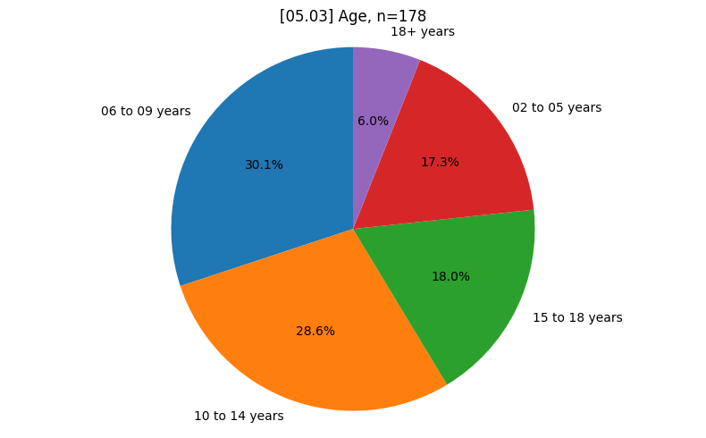
    

    
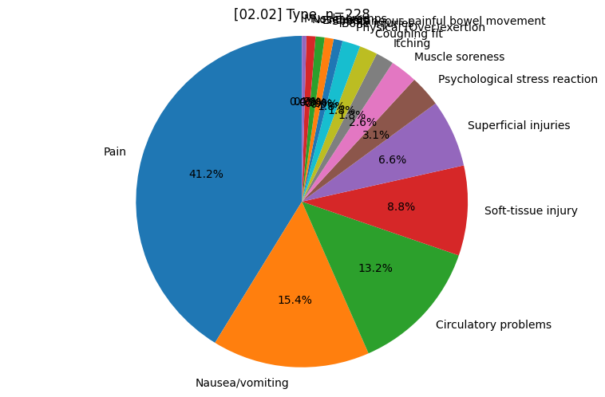
    

    
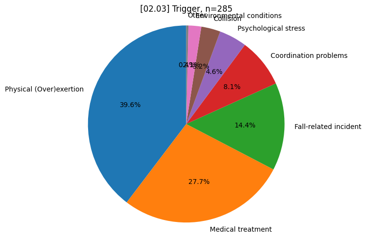
    

    
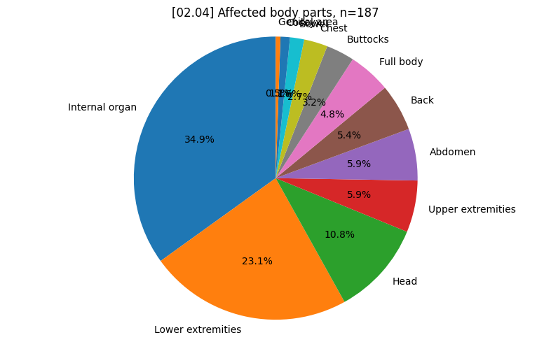
    

    
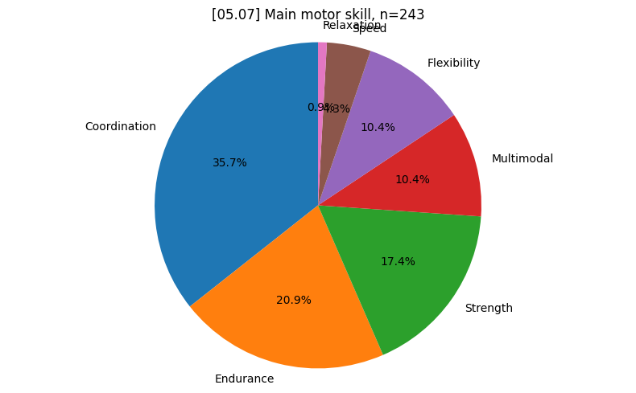
    

    
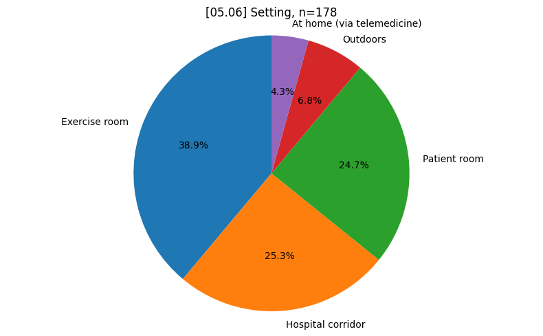
    

    
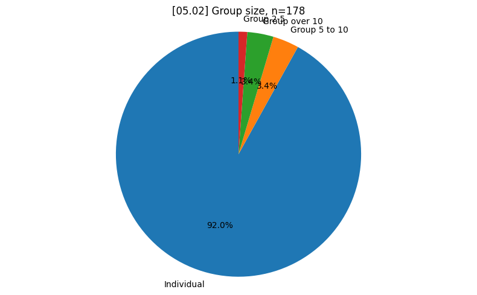
    

## [bar charts](#toc0_)

    
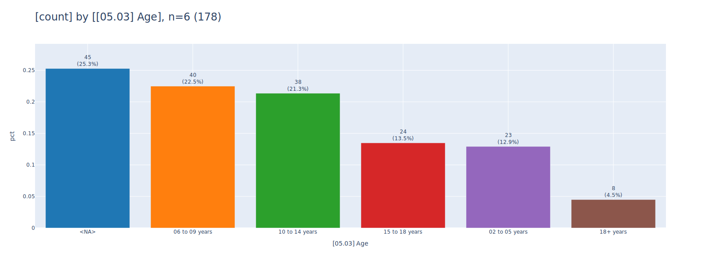
    

    

    

    
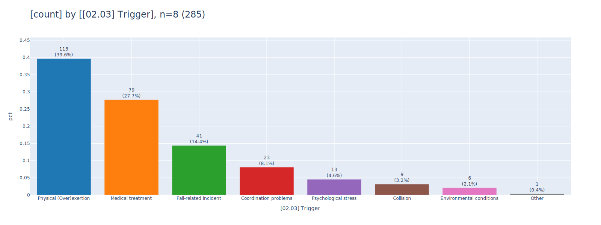
    

    
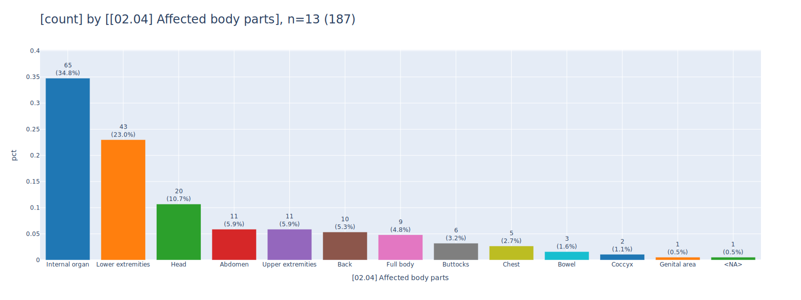
    

    

    

    
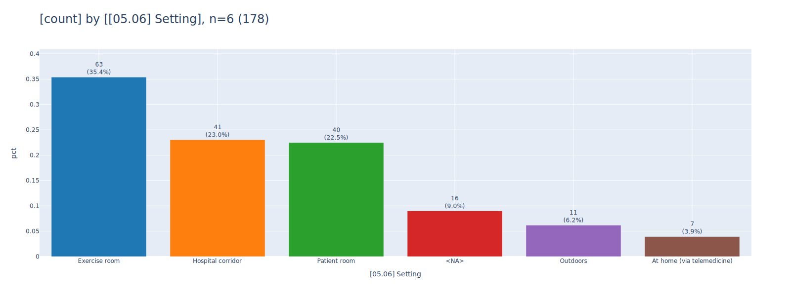
    

    
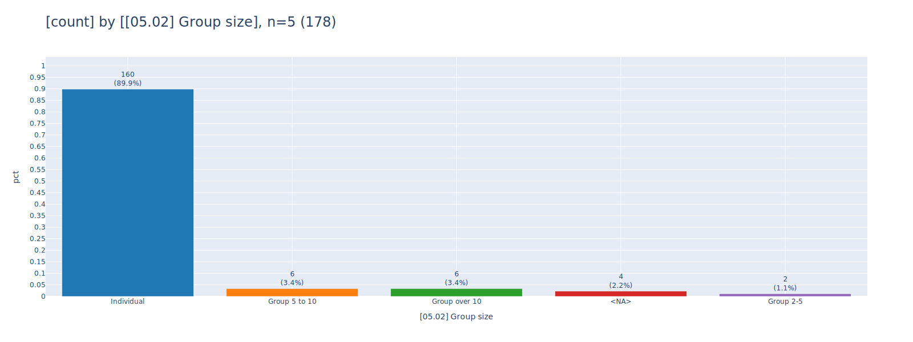
    

