# [descriptive analysis](#toc0_)

**Table of contents**    
- [descriptive analysis](#toc1_)    
  - [import data](#toc1_1_)    
  - [tables](#toc1_2_)    
  - [bar charts](#toc1_3_)    
  - [dataset](#toc1_4_)    

<!-- vscode-jupyter-toc-config
	numbering=false
	anchor=true
	flat=false
	minLevel=1
	maxLevel=6
	/vscode-jupyter-toc-config -->
<!-- THIS CELL WILL BE REPLACED ON TOC UPDATE. DO NOT WRITE YOUR TEXT IN THIS CELL -->

## [import data](#toc0_)

    🐍 3.12.9 | 📦 pygwalker: 0.4.9.15 | 📦 pandas: 2.3.3 | 📦 numpy: 1.26.4 | 📦 duckdb: 1.4.2 | 📦 pandas-plots: 0.22.4 | 📦 connection-helper: 0.13.2

## [tables](#toc0_)

    
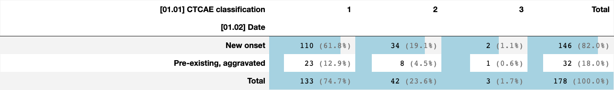
    

    
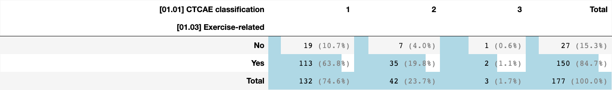
    

    
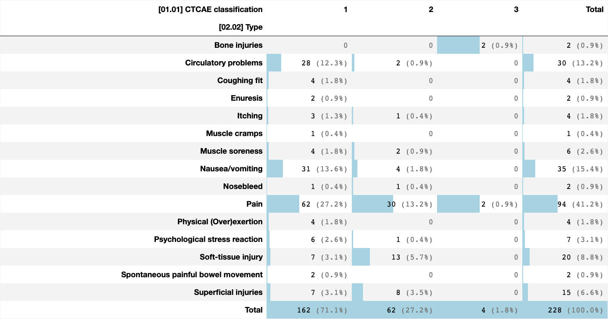
    

    
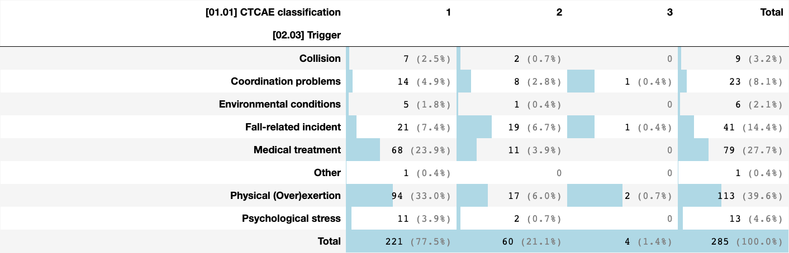
    

    
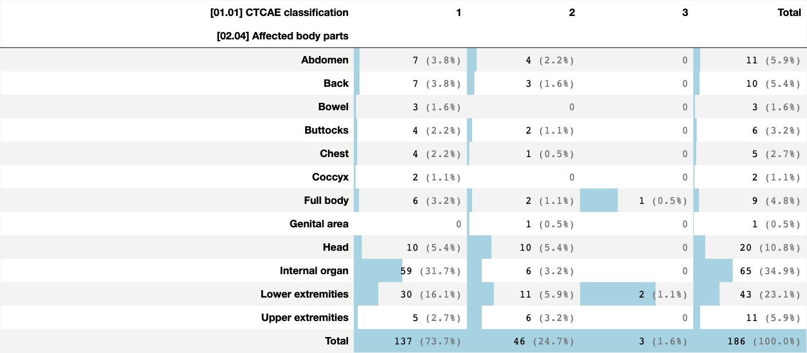
    

    
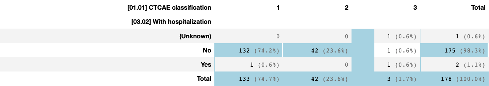
    

    
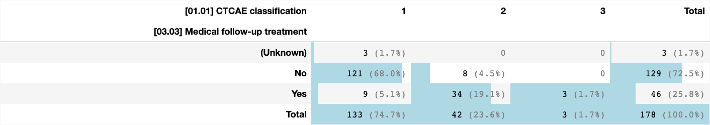
    

    
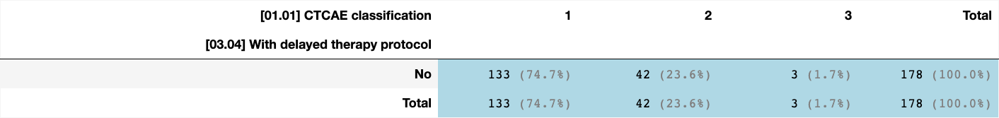
    

    
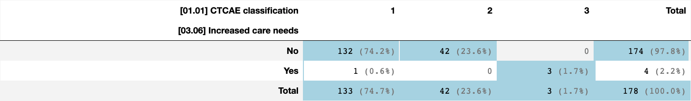
    

    
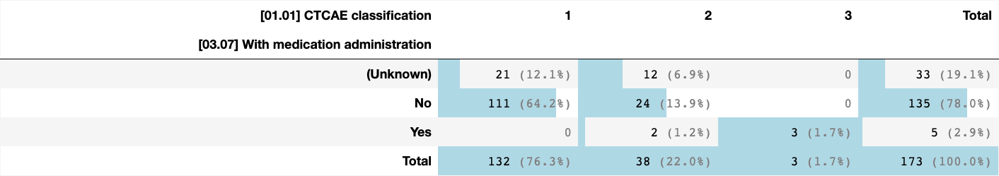
    

    
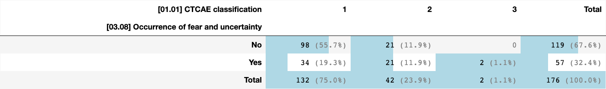
    

    
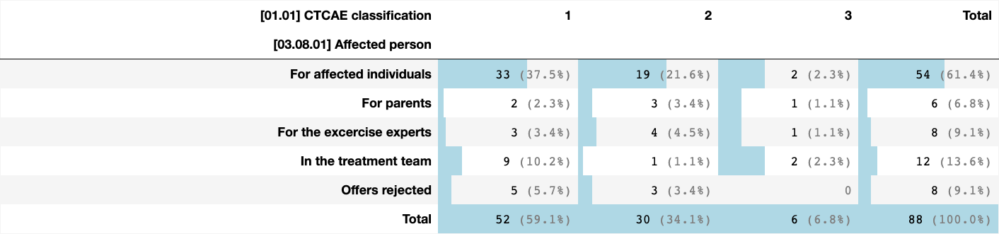
    

    
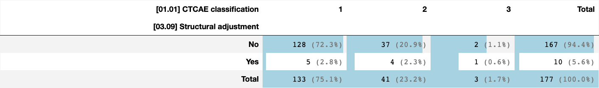
    

    
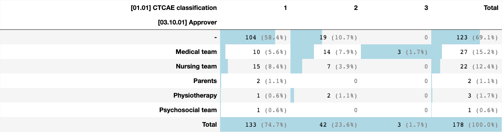
    

    
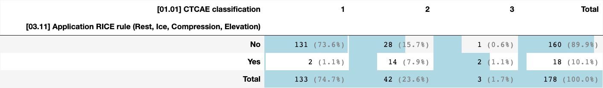
    

    
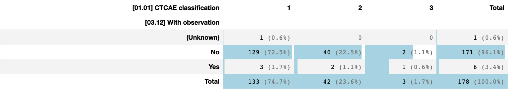
    

    

    

    
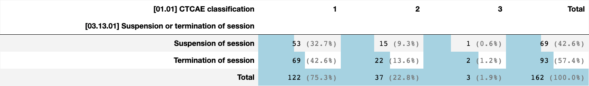
    

    
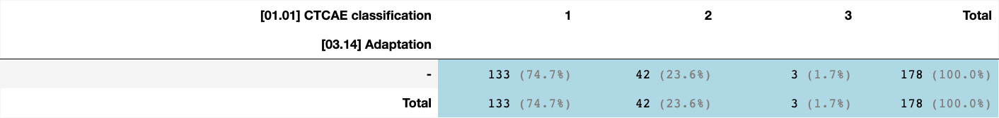
    

    
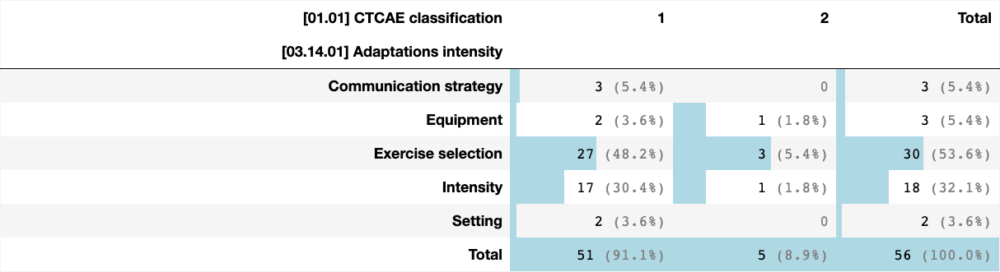
    

    
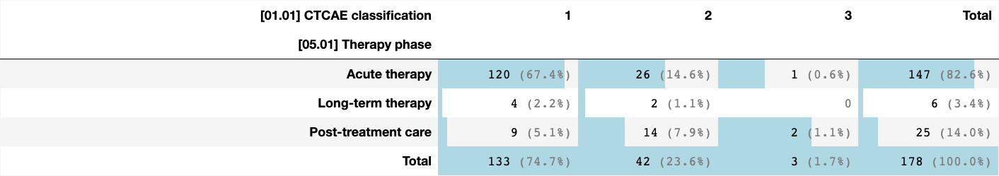
    

    
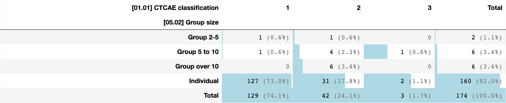
    

    
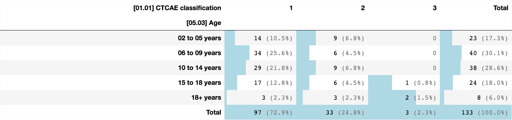
    

    
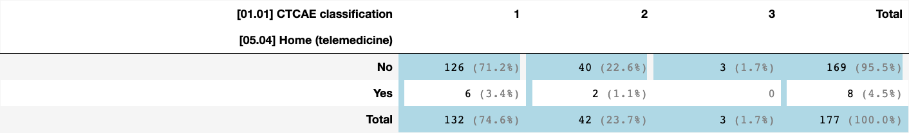
    

    

    

    
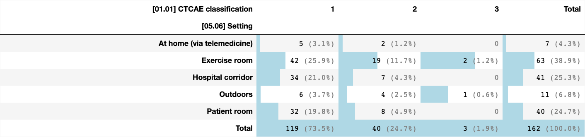
    

    
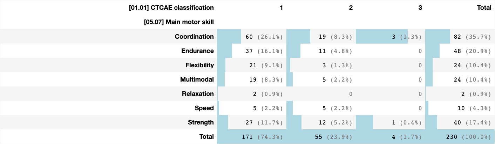
    

    
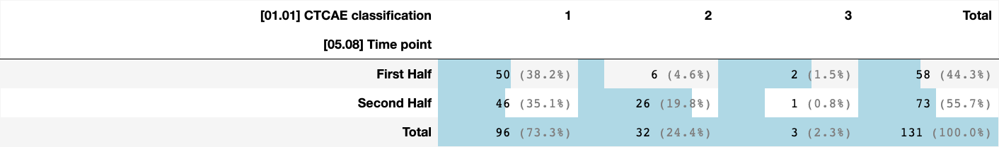
    

    
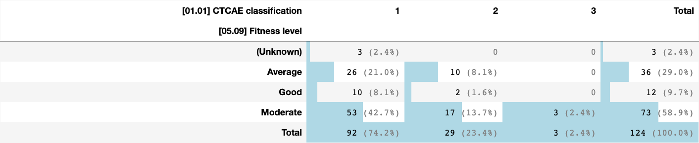
    

## [bar charts](#toc0_)

    
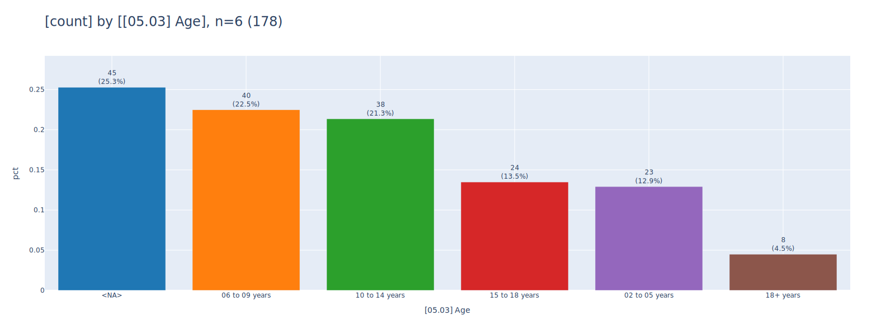
    

    
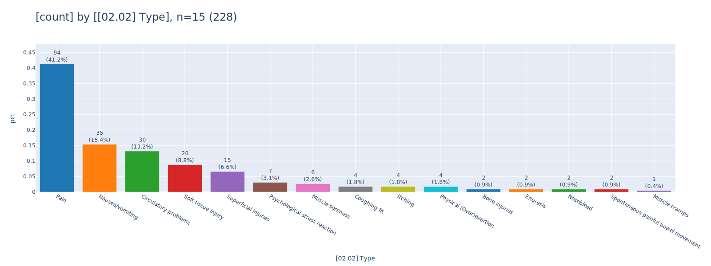
    

    

    

    
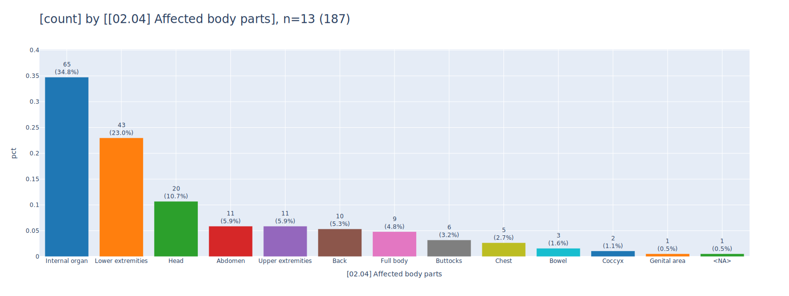
    

    
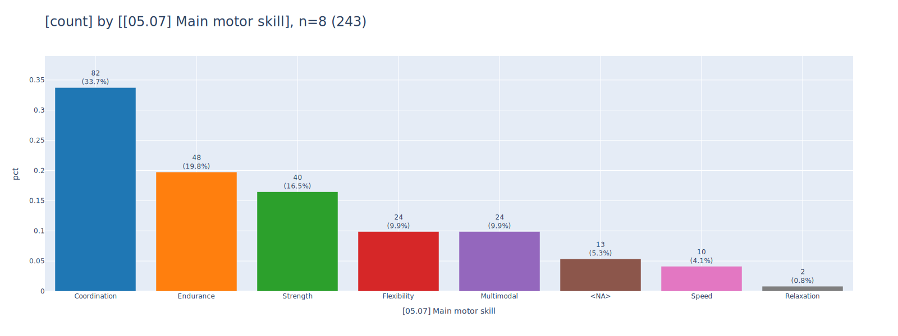
    

    
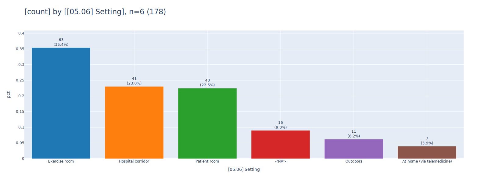
    

    
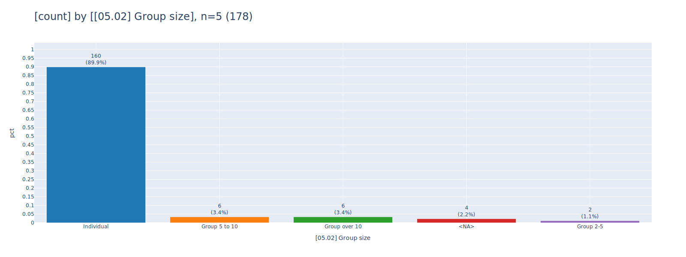
    

## [dataset](#toc0_)

    🔵 *** df: df_csv_condensed ***  
    🟣 shape: (178, 37)
    🟣 duplicates: 0  
    🟠 column stats all (dtype | uniques | missings) [values]  
    - index [0, 1, 2, 3, 4,]  
    - [00.00] ParticipantID (int64 | 178 | 0 (0%)) [3, 4, 5, 6, 7,]  
    - [01.01] CTCAE classification (object | 3 | 0 (0%)) ['1', '2', '3',]  
    - [01.02] Date (object | 2 | 0 (0%)) ['New onset', 'Pre-existing, aggravated',]  
    - [01.03] Exercise-related (object | 3 | 1 (1%)) ['<NA>', 'No', 'Yes',]  
    - [02.01] CreatedOn (object | 127 | 0 (0%)) ['2021-01-11', '2021-01-12', '2021-01-18', '2021-02-01', '2021-02-19',]  
    - [02.02] Type (object | 32 | 0 (0%)) ['Bone injuries', 'Circulatory problems', 'Circulatory problems|Muscle cramps',  
    'Circulatory problems|Physical (Over)exertion', 'Circulatory problems|Psychological stress reaction',]  
    - [02.03] Trigger (object | 24 | 0 (0%)) ['Collision', 'Coordination problems', 'Environmental conditions|Collision',  
    'Fall-related incident', 'Fall-related incident|Coordination problems',]  
    - [02.04] Affected body parts (object | 21 | 1 (1%)) ['<NA>', 'Abdomen', 'Abdomen|Bowel', 'Abdomen|Coccyx', 'Back',]  
    - [03.01] Pain (object | 2 | 0 (0%)) ['Ja', 'Nein',]  
    - [03.02] With hospitalization (object | 3 | 0 (0%)) ['(Unknown)', 'No', 'Yes',]  
    - [03.03] Medical follow-up treatment (object | 3 | 0 (0%)) ['(Unknown)', 'No', 'Yes',]  
    - [03.04] With delayed therapy protocol (object | 1 | 0 (0%)) ['No',]  
    - [03.05] Life-saving intervention (object | 1 | 0 (0%)) ['No',]  
    - [03.06] Increased care needs (object | 2 | 0 (0%)) ['No', 'Yes',]  
    - [03.07] With medication administration (object | 4 | 5 (3%)) ['(Unknown)', '<NA>', 'No', 'Yes',]  
    - [03.08.01] Affected person (object | 10 | 122 (69%)) ['<NA>', 'For affected individuals', 'For affected individuals|For parents',  
    'For affected individuals|For parents|In the treatment team', 'For affected individuals|For the excercise experts',]  
    - [03.08] Occurrence of fear and uncertainty (object | 3 | 2 (1%)) ['<NA>', 'No', 'Yes',]  
    - [03.09] Structural adjustment (object | 3 | 1 (1%)) ['<NA>', 'No', 'Yes',]  
    - [03.10.01] Approver (object | 6 | 0 (0%)) ['-', 'Medical team', 'Nursing team', 'Parents', 'Physiotherapy',]  
    - [03.10.02] OK to proceed (object | 1 | 0 (0%)) ['-',]  
    - [03.10] Assessment of the situation by expertise (float64 | 1 | 178 (100%)) [nan,]  
    - [03.11] Application RICE rule (Rest, Ice, Compression, Elevation) (object | 2 | 0 (0%)) ['No', 'Yes',]  
    - [03.12] With observation (object | 3 | 0 (0%)) ['(Unknown)', 'No', 'Yes',]  
    - [03.13.01] Suspension or termination of session (object | 3 | 16 (9%)) ['<NA>', 'Suspension of session', 'Termination of session',]  
    - [03.13] Suspension and termination of session (object | 2 | 0 (0%)) ['No', 'Yes',]  
    - [03.14.01] Adaptations intensity (object | 9 | 138 (78%)) ['<NA>', 'Communication strategy', 'Equipment', 'Exercise selection', 'Exercise selection|Equipment',]  
    - [03.14] Adaptation (object | 1 | 0 (0%)) ['-',]  
    - [03.16] Death (object | 1 | 0 (0%)) ['No',]  
    - [05.01] Therapy phase (object | 3 | 0 (0%)) ['Acute therapy', 'Long-term therapy', 'Post-treatment care',]  
    - [05.02] Group size (object | 5 | 4 (2%)) ['<NA>', 'Group 2-5', 'Group 5 to 10', 'Group over 10', 'Individual',]  
    - [05.03] Age (object | 6 | 45 (25%)) ['02 to 05 years', '06 to 09 years', '10 to 14 years', '15 to 18 years', '18+ years',]  
    - [05.04] Home (telemedicine) (object | 3 | 1 (1%)) ['<NA>', 'No', 'Yes',]  
    - [05.05] As part of testing (object | 3 | 1 (1%)) ['<NA>', 'No', 'Yes',]  
    - [05.06] Setting (object | 6 | 16 (9%)) ['<NA>', 'At home (via telemedicine)', 'Exercise room', 'Hospital corridor',  
    'Outdoors',]  
    - [05.07] Main motor skill (object | 16 | 13 (7%)) ['<NA>', 'Coordination', 'Coordination|Speed', 'Coordination|Strength', 'Endurance',]  
    - [05.08] Time point (object | 3 | 47 (26%)) ['<NA>', 'First Half', 'Second Half',]  
    - [05.09] Fitness level (object | 5 | 54 (30%)) ['(Unknown)', '<NA>', 'Average', 'Good', 'Moderate',]  
    🟠 column stats numeric  
    
    column (n = 178)                                 |  present   | min | lower |  q25   | median  |  mean   |   q75   | upper | max |  std   |  cv  
    -------------------------------------------------+------------+-----+-------+--------+---------+---------+---------+-------+-----+--------+------
    [00.00] ParticipantID                            | 178 (100%) |   3 |     3 | 51.250 | 111.500 | 105.500 | 156.750 |   213 | 213 | 60.527 | 0.574
    [03.10] Assessment of the situation by expertise |     0 (0%) | N/A |   N/A |    N/A |     N/A |     N/A |     N/A |   N/A | N/A |    N/A |   N/A
    

    

    

    
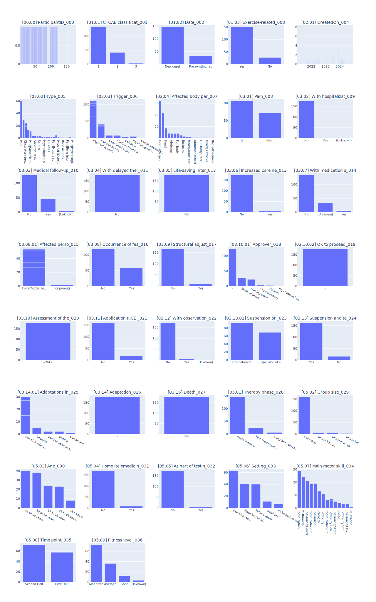
    

